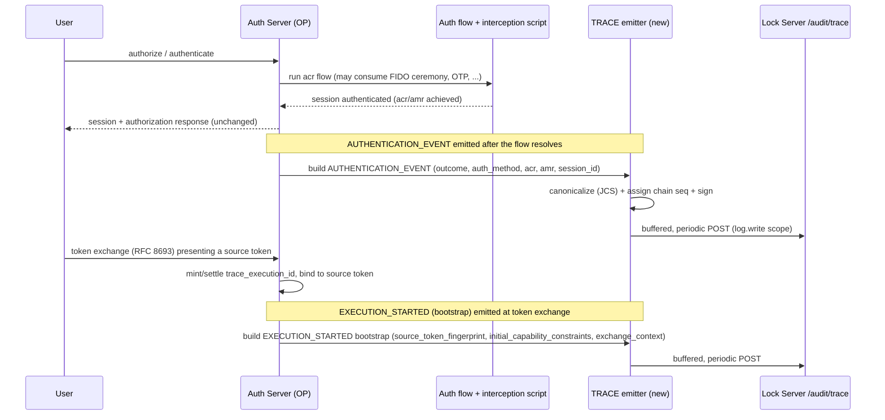

# Jans Auth Server TRACE Support Design

## Purpose

This document specifies how the **Janssen Auth Server** (the OpenID Provider) participates as a **TRACE producer** for the Lock Server TRACE evidence system defined in the Lock Server TRACE design (`design.md`). It is the companion to `cedarling-trace-design.md` and `fido-trace-design.md` and follows the same structure: what the component produces today, where that falls short of a signed TRACE record, the additions required, and a phased adoption path.

In the TRACE architecture the Auth Server is the second **Human Authentication Producer** and, uniquely, the **owner of the human authentication session** — the target design labels it "Jans Auth Server / OP / session_id owner." Its primary TRACE contribution is the **`AUTHENTICATION_EVENT`** record: signed evidence that a human authentication resolved, by what method, at what assurance. Because it also mints tokens and can perform token exchange, the Auth Server is additionally the natural producer of the **token-exchange bootstrap** form of `EXECUTION_STARTED`, which anchors a governed execution to the exact credential that originated it.

Scope of this document:

- What the Auth Server produces today (audit events, standard logs, ACR/AMR, sessions, tokens) and why none of it is a TRACE record.
- The producer responsibilities the Auth Server must add: signing with a registered producer key, producer-chain sequencing, session/execution correlation, and the authentication-specific event payload — plus its distinctive role in *originating* `trace_execution_id` and bootstrapping executions at token exchange.
- A phased path that leaves the authentication and token hot paths untouched and adds TRACE emission as an additive, opt-in step.

Non-goals: this document does not redefine the TRACE record model, the Lock ingestion/verification/settlement pipeline, or the evidence graph — those are owned by `design.md`. It maps the Auth Server onto that model, exactly as the Cedarling and FIDO documents map their components.

## Background: what the Auth Server is, in TRACE terms

The Jans Auth Server (see `research/jans-auth-server-docs.txt`) is the OP: it runs authentication flows (driven by interception scripts and `acr`/`acr_values`), owns the `session_id` and its cookie, issues access/ID/userinfo/transaction tokens, and supports token exchange (RFC 8693). It already emits observational data:

- **Audit log** (`jans-auth_audit.log`, enabled via `enabledOAuthAuditLogging`, optionally to JMS): discrete events including `SESSION_AUTHENTICATED`, `SESSION_UNAUTHENTICATED`, `SESSION_DESTROYED`, `USER_AUTHORIZATION`, `TOKEN_REQUEST`, `TOKEN_VALIDATE`, `TOKEN_REVOCATION`, `BACKCHANNEL_AUTHENTICATION`, and client-lifecycle events.
- **Standard logs** (`jans-auth.log`, etc.) — operational diagnostics with correlation ids.

This is **operational audit data about authentication and token activity** — designed for compliance logging and troubleshooting, written to a file (or JMS) and read by operators or a SIEM. It is not a signed, sequenced, correlatable evidence record. A TRACE `AUTHENTICATION_EVENT` is a different artifact: attributable, tamper-evident proof — verifiable by someone outside the Auth Server's trust boundary — that a specific human authentication resolved a specific way in a specific session, carrying the `acr`/`amr` assurance actually achieved.

The Auth Server already terminates HTTPS, owns OAuth client registration and SSA issuance, and lives at the center of the Jans deployment. The target design adds it "as new, first-class audit/TRACE producers alongside Cedarling, using the same OAuth client-credential pattern that Cedarling clients already use against Lock Server's `lock.write`-style scopes."

## Gap analysis: audit event vs. TRACE `AUTHENTICATION_EVENT`

The Auth Server's existing `SESSION_AUTHENTICATED` / `USER_AUTHORIZATION` audit events and a TRACE `AUTHENTICATION_EVENT` describe the same authentications but serve opposite purposes. The audit event answers "what happened, for compliance/troubleshooting?"; the TRACE record answers "can an auditor prove this authentication happened, attributably and untampered, as the root of this session's and this execution's evidence?"

| Concern | Auth Server audit event today | TRACE `AUTHENTICATION_EVENT` requires |
|---|---|---|
| **Signature** | None. Written to `jans-auth_audit.log` (and optionally JMS) as log records. | A producer signature over RFC 8785 (JCS) canonical bytes of the whole assertion, using the Auth Server's **registered producer key**. |
| **Record identity** | A log line; no globally attributable record id. | `record_id` plus `producer_id`; `(evidence_domain_id, producer_id, record_id)` is the storage primary key. |
| **Producer chain** | None. Events are independent. | `producer_chain` with `producer_chain_id`, monotonic `sequence_number`, `prev_record_hash` — so Lock detects gaps/equivocation across the Auth Server's own record stream. |
| **Session correlation** | The Auth Server owns `session_id`, but the audit event does not bind it as a first-class, cross-system evidence key. | `trace.session_id` is **required, non-null** for `AUTHENTICATION_EVENT` (the Auth Server is the authoritative owner of this value), plus `session_issuer`. |
| **Assurance** | ACR is a configuration/flow concept (`acr_values`, `defaultAcrValues`); not asserted as signed evidence of what was achieved. | `auth_method` (required, e.g. `password`/`otp`/`passkey`/`social`), plus optional `acr` (achieved ACR) and `amr[]` (methods actually satisfied). |
| **Outcome** | Implied by the event type (`SESSION_AUTHENTICATED` vs `SESSION_UNAUTHENTICATED`). | `outcome` (required, `SUCCESS`/`FAILURE`) as an explicit signed field. |
| **Immutability** | Log files roll and are retained by operational policy; no immutability contract. | The signed `assertion` is byte-immutable; Lock never rewrites it. |
| **Event kind** | Implicit in the audit event name. | Explicit `trace.event_kind: "AUTHENTICATION_EVENT"` acting as the schema discriminator. |
| **Not-applicable fields** | N/A. | `decisions[]`/`invocations[]` and `trace.policy` MUST NOT be populated — an authentication event authorizes no capability and evaluates no policy; and no `capability_id` is ever producer-signed (it is Lock-derived). |

A defining difference from the FIDO Server: where a `FIDO_CEREMONY` records a single cryptographic ceremony, an `AUTHENTICATION_EVENT` records the **resolution of a whole authentication flow** — which may itself have consumed one or more FIDO ceremonies, a password step, an OTP, etc. The `amr[]` on the `AUTHENTICATION_EVENT` is where those satisfied methods are named, and the FIDO Server's own `FIDO_CEREMONY` records are the lower-level, separately-signed evidence that a passkey step in that `amr[]` actually occurred. The two producers' records correlate on the shared `session_id`; neither substitutes for the other.

## Where TRACE emission fits in the Auth Server flow

TRACE emission is a **post-resolution, off-hot-path** step. The authentication flow, the session establishment, and the token/authorization response returned to the client are unchanged; the TRACE record is assembled once a flow resolves and handed to an async emitter — alongside, not instead of, the existing audit event.

The Auth Server has two distinct emission points, matching two distinct record kinds:

The interception-script model the Auth Server already exposes (start/finish hooks around authentication and token issuance) is the natural place to trigger emission, exactly as the FIDO passkey interception script is the natural hook there. Emission must never block the authentication or token response.

## Field-by-field: building the `AUTHENTICATION_EVENT` record

This maps each part of the TRACE `AUTHENTICATION_EVENT` envelope (as defined in `design.md`) to the Auth Server data that populates it.

### Envelope identity

- **`producer`** / **`producer_chain.producer_id`** — a **stable logical identifier** for this Auth Server, e.g. `jans-auth` — not a `name/semver` string. Per the design's producer-identity rule, software version/build/runtime travel as **separate signed metadata** (e.g. `producer_version`) inside the assertion, never folded into `producer_id`, so an Auth Server upgrade does not force a new producer identity, key, or chain. The target design registers "one for the Jans Auth Server" in the Producer Key Registry, and allows multiple keys per producer type (e.g. one per AS node).
- **`record_id`** — a fresh UUID per emitted record.
- **`producer_chain.producer_instance_id`** — the AS node identity.
- **`event_kind`** — `AUTHENTICATION_EVENT`.

### Producer chain (new state the Auth Server must keep)

Like the other producers, the Auth Server must maintain, per node, an append-only **producer chain**: `producer_chain_id`, a monotonic `sequence_number` advanced for every emitted TRACE record (authentication events and any bootstrap `EXECUTION_STARTED` records share the chain), and `prev_record_hash` linking to the predecessor. The Auth Server is typically clustered, so the recommended model — matching the design's "no single global event order across independent producers" principle — is **one chain per node** (`producer_chain_id` scoped to node), each advancing independently, correlated by Lock via `session_id`/`trace_execution_id` rather than a cross-node sequence.

### Genesis and history-completeness

`history_complete: true` requires a `pre_registered_genesis` (or a `linked_restart_genesis` rooted in one). A node emitting without a pre-registered chain genesis is `first_observed` — Lock anchors what it saw but cannot claim the chain is complete from its origin. Deployments needing full lineage assurance for authentication evidence pre-register each node's chain genesis with Lock before its first record.

### Correlation

- **`trace.session_id`** — **required, non-null**, and here the Auth Server is the *authoritative source*, not a best-effort reader. It owns the session and its identifier; every `AUTHENTICATION_EVENT` binds to it directly. This is the anchor the FIDO Server's `FIDO_CEREMONY` records and downstream records correlate against.
- **`trace.session_issuer`** — the Auth Server's own issuer URI, so Lock disambiguates `(evidence_domain_id, session_issuer, session_id)`.
- **`subject.human_sponsor`** — the authenticated human.
- **`trace_execution_id`** — an `AUTHENTICATION_EVENT` typically has none at authentication time (the human authenticates before any specific governed execution exists), so it is emitted as **unattributed evidence** and correlated later, exactly as for FIDO ceremonies. The Auth Server must not fabricate one. Its execution-origination role happens separately, at token exchange (below).

### Event payload (`trace.event`)

- **`outcome`** — `SUCCESS`/`FAILURE`, from the flow's resolution (mirrors `SESSION_AUTHENTICATED` vs. a failed authentication).
- **`auth_method`** — required, the method/mechanism used (`password`, `otp`, `passkey`, `social`, …), derivable from the `acr` flow that ran.
- **`acr`** — optional, the *achieved* Authentication Context Class Reference. The Auth Server already resolves an effective `acr` per flow (`acr_values` request param, client `defaultAcrValues`, or the configured default); the TRACE record carries the one actually achieved, not merely requested.
- **`amr[]`** — optional, the Authentication Methods References actually satisfied. This is where a multi-step flow names each method (and where a `passkey` entry cross-references the FIDO Server's separately-signed `FIDO_CEREMONY` evidence for the same session).
- **`decisions[]`/`invocations[]` and `trace.policy`** — MUST NOT be populated for this event kind (and no `capability_id` is producer-signed anywhere — it is Lock-derived; see `design.md`: Capability Resolution).

### Signature

Identical mechanics to the other producers: assemble minus `signature`, canonicalize with RFC 8785 (JCS), sign with the AS node's registered Ed25519 producer key. That key is distinct from the Auth Server's OP signing keys (its JWKS token-signing keys) and from Lock's settlement/ledger keys — a dedicated TRACE producer key, so a TRACE record is attributable specifically as Auth-Server-as-producer evidence.

The producer key is **provisioned administratively**, never implicitly from a submitted record: Lock registers it through configuration or the `trace.producers.manage` administrative path (distinct from the `trace.write` ingestion scope), scoped with `authorized_event_kinds: ["AUTHENTICATION_EVENT", "EXECUTION_STARTED"]` — the only kinds the Auth Server produces — so a record of any other `event_kind` under this key is rejected (`producer_authorized_for_claim`). Authorization rests on that independently provisioned registration, expressed as the design's administratively-signed **Producer-Key Authorization Statement** (binding the key by `public_key_thumbprint`, not the non-unique `kid`), not on the mere fact a key was found at the `(evidence_domain_id, producer_id, kid)` lookup index. The statement is what travels inside an Evidence Packet so an offline verifier can confirm the Auth Server key's authority without reaching Lock.

## The Auth Server's distinctive role: originating executions

The Auth Server is not only an authentication producer; it is where governed executions are frequently *born*. Two related responsibilities set it apart from the FIDO Server:

### Propagating `trace_execution_id` into tokens

The target design lists "OAuth/OIDC token claims (so a token minted for an execution carries its `trace_execution_id`)" as the first propagation channel for the correlation id. The Auth Server is the component that mints those tokens. When an execution context is known at token-issuance time, the Auth Server should stamp the `trace_execution_id` into the issued token's claims, so every downstream Cedarling `AUTHORIZATION_DECISION` and enforcement-point record made under that token can carry the same correlation id. This is a token-shaping change, not a TRACE-record change, and it is what makes cross-producer correlation work without every producer having to independently discover the execution id.

### Bootstrapping executions at token exchange

Per `design.md`'s **Execution Continuity Bootstrap at Token Exchange**, when a token enters governance via RFC 8693 token exchange, the exchange service originates the execution by emitting the **bootstrap form of `EXECUTION_STARTED`**. The Auth Server, as the token-exchange service, is the natural producer of this record. Its `trace.event.bootstrap` object requires:

- **`source_token_fingerprint`** — the SHA-256 fingerprint (and `(issuer, jti)` when available) of the source token presented to the exchange, binding the new `trace_execution_id` to the concrete credential that originated it. The Auth Server has both the source token and its own token-exchange machinery (which already propagates `email`/`auth_time`/`acr`/`amr` from the subject token), so it can compute this directly.
- **`initial_capability_constraints`** — the root authority granted at bootstrap (`capabilities[]`/`resources[]`/`audiences[]`/`constraints`/`expiration`), establishing the ceiling all later `DELEGATION_CREATED` non-expansion checks are rooted against.
- **`exchange_context`** — the RFC 8693 `grant_type` / `requested_token_type` and the exchange service's own identity, so the bootstrap is attributable to the exchange that performed it.

This bootstrap record is an ordinary producer-signed record: Lock verifies the Auth Server's signature, assigns `trust_tier` from that key class, links it as the execution's first record, and never rewrites its signed `assertion`. It is the point at which an execution's evidence chain acquires a concrete origin instead of appearing out of nowhere — a materially important, Auth-Server-specific contribution the other producers cannot make. Bounded per the claim-boundary table: the bootstrap **establishes** that the exchange service signed that it originated this `trace_execution_id`, bound to the stated `source_token_fingerprint` under the stated `initial_capability_constraints`; it does not, by itself, establish that any later record's authority stayed within those constraints (that is the separate, Lock-derived delegation non-expansion result rooted against them).

## Trust tier: why a signed authentication record earns high assurance

The TRACE spec assigns `trust_tier` from the producer key class and collection path — Lock-assigned, never self-declared, and (per the design) a **lossy filtering convenience over an authoritative per-dimension verification vector**, never a substitute for the underlying results. An `AUTHENTICATION_EVENT` signed by a genuine Auth Server producer key, declaring `evidence_origin: "directly_observed"` (the Auth Server observed and resolved the authentication flow itself), earns a high tier: the OP is the authoritative first party for the session and the achieved `acr`/`amr` — there is no more authoritative source for "this human authenticated this way in this session." As with the other producers, the assurance derives from the event being **signed and sequenced** by the authority that resolved it, not merely from the event having occurred.

**Bounded claim (per the claim-boundary table).** A high `trust_tier` raises the *weight* Lock places on the record; it never *widens what the record claims*. Consistent with the design's normative per-record claim boundaries, an `AUTHENTICATION_EVENT` **establishes** that the Auth Server resolved an authentication with the stated `outcome`, `auth_method`, and achieved `acr`/`amr` in the stated `session_id`; it does **not** establish that any later governed action was taken by that subject, nor that a credential later minted under the session was used within policy — those are separate, separately-evidenced questions (a downstream `AUTHORIZATION_DECISION`/`CAPABILITY_INVOKED`, correlated by `trace_execution_id`). The record is the Auth Server's attributable, signed assertion about one authentication, and `trust_tier` is read alongside the per-dimension verification results (signature, producer authorization, instance binding where applicable), never collapsed into a single grade that would obscure which relationships were actually verified.

## Auth Server changes summary

| Area | Change | Hot path? |
|---|---|---|
| Producer key | Provision/register an Ed25519 producer key per node **through Lock's administrative path** (configuration or the `trace.producers.manage` API — never implicitly from a submitted record), distinct from the OP's JWKS token-signing keys and any Lock key, scoped `authorized_event_kinds: ["AUTHENTICATION_EVENT", "EXECUTION_STARTED"]` and expressed as a signed Producer-Key Authorization Statement. | No (startup) |
| Chain state | Maintain per-node `producer_chain_id`, monotonic `sequence_number`, `prev_record_hash`; advance atomically with signing. | Emitter only |
| Genesis registration | Optional pre-registration of each node's chain genesis with Lock for `history_complete` assurance. | No (deploy) |
| `AUTHENTICATION_EVENT` assembly | Build the envelope from a resolved flow (outcome, auth_method, achieved acr, amr, session_id). | Off hot path |
| Token `trace_execution_id` stamping | When an execution context is known, stamp `trace_execution_id` into issued token claims for downstream propagation. | Token issuance |
| `EXECUTION_STARTED` bootstrap | On RFC 8693 token exchange, emit the bootstrap record (source_token_fingerprint, initial_capability_constraints, exchange_context). | Off hot path |
| Canonicalize + sign | RFC 8785 JCS + Ed25519 over the assertion. | Off hot path |
| Transport | Reuse the SSA→DCR + `log.write`-scope audit channel; POST TRACE records (buffered, periodic, retry with backoff). | Off hot path |

The authentication flow, session establishment, token issuance response, and the existing audit-log pipeline are unchanged. TRACE emission runs alongside the audit log, not instead of it.

## Bootstrap / configuration properties (proposed)

Following the Auth Server's existing configuration-property convention (e.g. `enabledOAuthAuditLogging`), TRACE emission is gated by new opt-in properties, disabled by default so existing deployments are unaffected:

| Property | Meaning | Default |
|---|---|---|
| `enabledTraceEmission` | Master switch for `AUTHENTICATION_EVENT` (and bootstrap `EXECUTION_STARTED`) TRACE emission. | `false` |
| `traceProducerId` | The `producer` / `producer_id` string for this Auth Server (fleet or per-node). | derived from issuer + version |
| `traceSigningKey` | Reference to the Ed25519 producer signing key (key store handle; never inline). | — |
| `traceChainGenesis` | `pre_registered` / `first_observed` — whether each node's chain genesis is pre-registered with Lock. | `first_observed` |
| `traceStampExecutionIdInTokens` | Whether to stamp a known `trace_execution_id` into issued token claims. | `false` |
| `traceEmitTokenExchangeBootstrap` | Whether token exchange emits the bootstrap `EXECUTION_STARTED` record. | `false` |
| `traceEndpoint` | Lock TRACE ingestion endpoint (`/api/v1/audit/trace`); may default to the discovered Lock audit endpoint. | discovered |

TRACE transport reuses the SSA→DCR client-credentials flow, a `log.write`-style scope, a buffered channel, and retry with backoff — the same machinery the design assigns to all producers. These are separate from `enabledOAuthAuditLogging`; TRACE and the existing audit log coexist.

## Phased adoption

1. **Phase 0 — today.** The Auth Server resolves authentications and writes audit events. No TRACE records, no signing, no chain.
2. **Phase 1 — signed, sequenced authentications.** Add the producer key, per-node chain state, `AUTHENTICATION_EVENT` assembly, JCS canonicalization, and signing. Emit records with `first_observed` genesis over the audit channel. This alone gives attributable, tamper-evident, session-anchored authentication evidence with achieved `acr`/`amr`.
3. **Phase 2 — execution origination.** Stamp `trace_execution_id` into issued token claims (enabling downstream cross-producer correlation), and emit the token-exchange bootstrap `EXECUTION_STARTED`, anchoring executions to their originating credential.
4. **Phase 3 — high assurance.** Pre-register each node's chain genesis (`history_complete`-capable lineage) and integrate with lineage checkpoints, so authentication evidence can contribute to collusion-resistant assurance for the identity segment of an execution.

Each phase is additive over the same signed-record foundation and none changes the authentication or token core — matching the TRACE design's incremental philosophy and the two companion documents' structure.

## Open questions

- **Failed-authentication volume.** Unlike a decision or a ceremony, failed authentications can be high-volume and adversarial (credential stuffing). Whether every `outcome: "FAILURE"` becomes an `AUTHENTICATION_EVENT` (valuable for threat detection but a potential flood and a new equivocation/chain-load consideration) or only session-establishing successes and material failures are emitted is an open policy question. This document assumes successes and material failures by default, with volume controls to be defined.
- **`session_id` before session establishment.** Some flows (e.g. authorization-challenge with `authorizationChallengeShouldGenerateSession=false`) may resolve authentication steps before a durable `session_id` exists. As with the FIDO Server's session-less ceremony question, either defer emission until the session exists, or raise a schema relaxation with `design.md`. Default: emit once the session exists.
- **Relationship to FIDO `amr` entries.** When an `amr[]` entry (`passkey`) corresponds to a FIDO Server `FIDO_CEREMONY`, should the `AUTHENTICATION_EVENT` carry an explicit cross-reference to that ceremony record, or is correlation-by-`session_id` sufficient? The design correlates by session today; an explicit link is a possible enhancement, not a requirement.
- **Producer key vs. OP signing keys.** The Auth Server already manages a rich key lifecycle (JWKS, rotation). Whether the TRACE producer key is a dedicated key or a designated member of the existing key set — and how its rotation interacts with the Producer Key Registry's never-retroactively-invalidate rule — needs pinning.
- **Token-exchange bootstrap ownership.** Not every deployment routes token exchange through the Auth Server. Where a separate exchange service exists, the bootstrap `EXECUTION_STARTED` belongs to that service, not the Auth Server; this document assumes the Auth-Server-as-exchange-service case and flags the split.

## References

- Target spec: `design.md` (TRACE record model, `AUTHENTICATION_EVENT` schema, token-exchange bootstrap `EXECUTION_STARTED`, Human Authentication Producers, `trace_execution_id` propagation, unattributed evidence, settlement).
- Companions: `cedarling-trace-design.md` (the `AUTHORIZATION_DECISION` producer) and `fido-trace-design.md` (the `FIDO_CEREMONY` producer) this document parallels.
- `research/jans-auth-server-docs.txt` — Auth Server audit events (`SESSION_AUTHENTICATED`, `USER_AUTHORIZATION`, `TOKEN_REQUEST`, …), ACR/AMR handling, sessions, interception scripts, token exchange (RFC 8693), DPoP.
- `research/lock-docs.txt` — Lock Server audit endpoints, OAuth scopes.
- `research/trace-standard.txt` — TRACE registry, anchor format, signed-record/checkpoint model.
