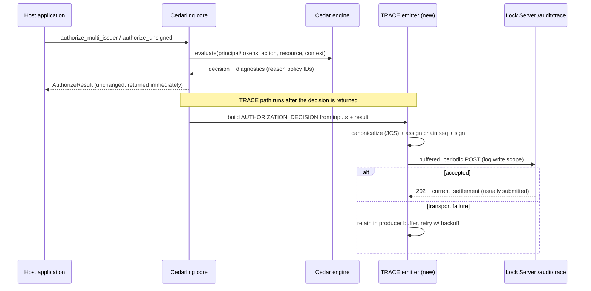

# Cedarling TRACE Support Design

## Purpose

This document specifies how the **Cedarling** — the embeddable, Rust-based Cedar Policy Decision Point (PDP) — participates as a **TRACE producer** for the Lock Server TRACE evidence system defined in `the Lock Server TRACE design (`design.md`) at `.

The TRACE design (`design.md`) treats Cedarling as the canonical source of `AUTHORIZATION_DECISION` records: "Cedarling records authorization decisions." Today Cedarling already emits a `Decision` log for every `authorize_*` call and can ship those logs to the Lock Server `/audit` endpoint. That existing decision log is **operational telemetry** — it is not a signed, sequenced, correlatable TRACE record. This document describes the gap between what Cedarling emits now and what the TRACE spec requires, and specifies the additions needed to close it.

Scope of this document:

- What Cedarling produces today (decision logs, Lock Server integration) and where it falls short of a TRACE `AUTHORIZATION_DECISION`.
- The additional producer responsibilities Cedarling must take on: signing, producer-chain sequencing, execution correlation, token-context capture, and operation-binding digests.
- A phased adoption path that keeps the existing Cedar evaluation hot path unchanged and adds TRACE emission as an additive, opt-in capability.

Non-goals: this document does not redefine the TRACE record model, the Lock ingestion/verification/settlement pipeline, or the evidence graph — those are owned by `design.md`. It maps Cedarling onto that model.

## Background: two systems, one boundary

**Cedarling** (see `research/cedarling_docs.txt`) answers one question per call: *given this action, on this resource, in this context, for these tokens/principal — allow or deny?* It is designed for sub-millisecond, embedded evaluation and "never fetches data to make a decision." Its outputs are:

- an `AuthorizeResult` (`decision`, `request_id`, Cedar `diagnostics` with the `reason` policy IDs), and
- a `Decision` log entry (see `cedarling-logs.md`) carrying `pdp_id`, `policystore_id`, `policystore_version`, `principal`, `action`, `resource`, `decision`, `tokens` (jti only), and `decision_time_micro_sec`.

**Lock Server** (see `research/lock-docs.txt`) is the Policy Retrieval Point and audit collector. Cedarling already registers with it via SSA→DCR, obtains the `https://jans.io/oauth/lock/log.write` scope, and periodically POSTs decision logs to `/audit`. That path is governed by the `CEDARLING_LOCK_*` bootstrap properties (`cedarling-lock-server.md`, `cedarling-properties.md`).

The TRACE spec sits **on top of** that audit relationship. It reuses the same OAuth-protected transport and the same `pdp_id`/`policy_store` vocabulary, but it demands that the payload be a **signed, immutable, sequenced TRACE record** — not a best-effort log line. The TRACE `AUTHORIZATION_DECISION` example in `design.md` (the `"producer": "cedarling-fleet-1"` record) is precisely the target artifact this document tells Cedarling how to produce.

## Gap analysis: decision log vs. TRACE `AUTHORIZATION_DECISION`

The existing Cedarling `Decision` log and a TRACE `AUTHORIZATION_DECISION` record overlap on identity fields but differ on every property that makes TRACE evidence defensible. The TRACE design's own framing — "A valid signature is necessary, but it is not the same as complete or trustworthy evidence" — sets the bar.

| Concern | Cedarling `Decision` log today | TRACE `AUTHORIZATION_DECISION` requires |
|---|---|---|
| **Signature** | None. The log is plaintext JSON emitted by the PDP. | A producer signature over RFC 8785 (JCS) canonical bytes of the whole assertion, using a **registered producer key**. |
| **Record identity** | `id` / `request_id` (UUIDv7), unique per call but not a globally attributable record id. | `record_id` plus `producer_id`; `(evidence_domain_id, producer_id, record_id)` is the storage primary key. |
| **Producer chain** | None. Logs are independent. | `producer_chain` with `producer_chain_id`, monotonic `sequence_number`, and `prev_record_hash` linking to the predecessor — so Lock can detect gaps and equivocation. |
| **Execution correlation** | None. | `trace_execution_id` (plus `operation_ids`, `parent_execution_id`, `session_id`) so Lock can attach the decision to a governed execution's evidence graph. |
| **Token context** | `tokens.{type}.jti` only. | `tokens[]` with `issuer`, `token_type`, `jti`/`fingerprint`, and the producer's own `validation_at_decision` (signature/contents/status checks + `revocation_freshness`), plus a sibling `token_claims[]` carrying `claims_at_decision`. |
| **Policy context** | `policystore_id`, `policystore_version`. | `trace.policy`: `policy_store_id`, `policy_store_version`, `policy_language`, `policy_language_version`, `bundle_hash`. |
| **Operation binding** | None. | Optional `request_digest` / `input_digest` / `tool_call_digest` so a downstream enforcement-point `CAPABILITY_INVOKED` can be provably bound to this decision. |
| **Immutability** | Log lines are transient in-memory or streamed; no immutability contract. | The signed `assertion` is byte-immutable; Lock never rewrites it, and all Lock-derived assessments live outside it. |
| **Event kind** | Implicitly a decision. | Explicit `trace.event_kind: "AUTHORIZATION_DECISION"` acting as the schema discriminator. |

The through-line: Cedarling's decision log records **that a decision happened**; a TRACE record makes the decision **attributable, tamper-evident, sequenced, and correlatable** by someone outside Cedarling's trust boundary. Everything below is about supplying the fields in the right-hand column without disturbing Cedar's evaluation.

## Where TRACE emission fits in the Cedarling call flow

TRACE emission is a **post-decision, off-hot-path** step. Cedar evaluation and the returned `AuthorizeResult` are unchanged; the TRACE record is assembled from the same inputs and the decision result, then handed to an async emitter.

The decision returned to the caller must never wait on signing or transmission. This mirrors the existing decision-log model, which is already buffered and shipped on `CEDARLING_LOCK_LOG_INTERVAL`.

## Field-by-field: building the record from a Cedarling call

This section maps each part of the TRACE `AUTHORIZATION_DECISION` envelope (as defined in `design.md`) to the Cedarling data that populates it.

### Envelope identity

- **`producer`** / **`producer_chain.producer_id`** — a **stable logical** Cedarling identifier (e.g. `cedarling-fleet-1`), derived from `CEDARLING_APPLICATION_NAME` — **not** a `name/semver` string. Per the design's producer-identity rule, the Cedarling build version/runtime travels as **separate signed metadata** (e.g. `producer_version`) inside the assertion, never folded into `producer_id`, so a Cedarling upgrade does not force a new producer identity, key, or chain. This is the identity whose key Lock's Producer Key Registry must hold.
- **`record_id`** — a fresh UUID per emitted record. Cedarling already mints a UUIDv7 `request_id` per authorize call; the TRACE `record_id` can reuse it (one decision → one record) so the TRACE record and the operational decision log correlate trivially.
- **`producer_chain.producer_instance_id`** — the per-instance `pdp_id` Cedarling already generates at startup (present in every decision log). One PDP instance = one producer instance.
- **`trace.runtime.pdp_id`** — the same `pdp_id`. Required by the `AUTHORIZATION_DECISION` schema.

### Producer chain (new state Cedarling must keep)

Cedarling must maintain, per instance, an append-only **producer chain**:

- **`producer_chain_id`** — a stable, Cedarling-minted identifier for one chain, immutable for the life of that chain. A single Cedarling instance (`producer_instance_id` = `pdp_id`) MAY own **more than one chain concurrently** — the design's model is `producer_id → producer_instance_id → one or more producer_chain_id values`. This is the answer to sequence-counter contention: rather than forcing every concurrent `authorize_*` decision through one serialized sequence allocator, a busy instance MAY allocate chains **by worker, partition, thread, or execution lane**, each advancing its own `sequence_number` independently. Each record belongs to exactly one chain and each chain stays strictly linear; TRACE claims no total order within an instance, and cross-chain ordering is recovered through `trace_execution_id` and causal links, not a per-instance global counter.
- **`sequence_number`** — a monotonic counter incremented for every emitted TRACE record, not just decisions (any future `EXECUTION_CHECKPOINT` or `CORRELATION_ASSERTED` records Cedarling emits share the chain).
- **`prev_record_hash`** — the hash of the immediately preceding record in this chain, so Lock's predecessor-linkage settlement check passes and any gap/equivocation is detectable.

This is the single most significant new piece of producer state. It must survive within an instance's lifetime and be advanced atomically with signing so two records never claim the same `sequence_number` (which Lock treats as equivocation). Chain persistence across instance restarts is a **producer durability concern explicitly out of scope in the TRACE spec** (see its "Durable producer outboxes" / "Crash-gap disclosure" future profiles); a restarted Cedarling that cannot resume its prior chain starts a new `producer_chain_id`, and the resulting boundary surfaces to Lock as an ordinary coverage gap, not a silent rewrite.

### Genesis and history-completeness

The TRACE spec's `history_complete: true` claim requires a `pre_registered_genesis` (or a `linked_restart_genesis` rooted in one) — a `first_observed_genesis` never yields it. A Cedarling instance that begins emitting without a pre-registered genesis will have its chain treated as first-observed: Lock anchors what it saw but cannot assert the chain is complete from its true beginning. Deployments that need full producer-lineage assurance for Cedarling decisions MAY **pre-register each chain's genesis** with Lock before the first record. This is a deployment/registration step, not a code path in the hot loop.

**For ephemeral, horizontally-scaled Cedarling, first-observed genesis is the right default** (see Deployment: ephemeral pods and fleet keys). Pods come and go and each start opens a new chain, so their chain ids cannot be known to static configuration in advance; requiring every pod to pre-register its genesis before emitting would be impractical. The design explicitly accommodates this: Lock anchors a `first_observed_genesis` chain **at first sight from an already-administratively-registered key**, so the chain's beginning is fixed in Lock's tamper-evident order even though it was never pre-declared. First-observed anchoring concerns the *chain's* genesis only; it never implies the signing *key* was accepted implicitly (the key is still administratively provisioned — see Signature and Deployment below). The trade is bounded and honest: a first-observed chain is a valid, Lock-observed chain, but does not by itself establish complete producer history or satisfy a high-assurance lineage requirement.

### Deployment: ephemeral pods and fleet keys

Cedarling is embedded and horizontally scaled: each pod registers its own OAuth client at startup via **SSA → DCR**, so client ids are not known in advance; pods scale up and down; and each start opens a new chain. Three things must be true before Lock accepts a pod's first record, and the design resolves each **without** requiring static per-pod configuration or a new MVP registration endpoint:

1. **The submitting OAuth client is bound to an evidence domain.** Lock derives `evidence_domain_id` from the authenticated submitting client (never from the record body), and rejects a client with no configured binding. For the DCR case, Lock derives the domain and the **`key_class`** from the **SSA behind the client** (`org_id` / `software_id`) — the SSA an administrator issued **once for the whole fleet**. So every pod that registers under that fleet SSA inherits the same domain binding and key class; the per-pod `client_id` need not be known ahead of time.
2. **The producer key is registered for `(evidence_domain_id, producer_id, kid)`.** This stays administratively provisioned (see Signature) — a pod never self-authorizes its key or claim scope. The practical, scale-friendly form is a **fleet key**: one admin-provisioned Ed25519 producer key shared across the fleet's pods, scoped `authorized_event_kinds: ["AUTHORIZATION_DECISION"]`. The two halves travel on different paths. The **public key and its Producer-Key Authorization Statement** are registered **to Lock** through admin configuration, distributed exactly like `trusted-issuers/` config (Component 3) — this is what gives Lock the authority to verify the fleet's records. The **private signing key** reaches each pod separately, as the handle in `CEDARLING_TRACE_SIGNING_KEY` (MVP §6), and is never carried in the Lock-facing config. So "config distributes the key" means it distributes the *public* key and authorization to Lock; the private key is a per-pod secret. Either path only needs to carry the *key*, never the *chain ids* of pods that do not yet exist.
3. **Each chain's genesis is anchored.** Because config cannot know a not-yet-existing pod's `producer_chain_id`, the default is **`first_observed_genesis`**: the pod opens a new chain and Lock anchors its genesis at first sight (from the already-registered fleet key). Pre-registration remains available for deployments that want `history_complete` lineage, but it is not required for the fleet to function.

**Optional startup self-registration.** A deployment that wants stronger-than-first-observed assurance without static per-pod config MAY have each pod, at startup, generate its key material and `producer_chain_id` and make **one call to Lock** to register them, authenticated with the access token it already obtained via DCR. Lock still derives the evidence domain and key class from the SSA behind that client — the pod supplies candidate key/chain material, but the **authority** (domain, class, permitted claim scope) comes from the admin-issued SSA, not from the pod's say-so. This upgrades the chain from `first_observed_genesis` to `pre_registered_genesis` while preserving the rule that a producer never self-authorizes. (The MVP API has no such endpoint today — MVP §11 — so under the MVP a fleet relies on first-observed genesis; the self-registration endpoint is a post-MVP addition for lineage-sensitive deployments.)

**Restart does not force a brand-new identity.** A pod restart opens a new `producer_chain_id` only when it cannot durably resume prior chain state; where it can continue, it does (the design no longer equates every restart with a new chain). Either way the **`producer_id` is stable** (see Envelope identity): it is a logical fleet identifier (`cedarling-fleet-1`), not a `name/semver` string, so a scale event — or a software upgrade — does **not** mint a new producer identity or require a new key registration. A new key registration is needed only when the signing *key* changes; a new chain only when chain state cannot be continued.

### Correlation

- **`trace.trace_execution_id`** — Cedarling does not invent this; it **propagates** an execution id supplied to it. Per `design.md`, `trace_execution_id` flows through OAuth/OIDC token claims, Cedarling's evaluation context, OpenTelemetry baggage, workload-local context, and child delegation. Concretely, Cedarling reads it from the **normalized values supplied through its authorization API** — it does not itself parse HTTP headers, token wire formats, or OTel baggage; the host, sidecar, PEP, or gateway translates whichever carrier is in use (`Audit-Trace-ID` header, `https://jans.io/trace/execution_id` token claim, or `audit.trace_id` baggage — see `design.md`: Audit Context Propagation Profile) into Cedarling's input model. `trace_execution_id` and `execution_authority` are supplied together. **Carrier conflicts are resolved before Cedarling sees them:** because Cedarling receives only normalized values, it cannot observe a disagreement among carriers (header vs. token claim vs. baggage) and the `AUTHORIZATION_DECISION` schema has no field for one. Per the Audit Context Propagation Profile the trusted ingress/host that normalizes the carriers is what detects a conflict, applies the precedence rule, and records the conflict on its own side; Cedarling signs only the resolved value it was given. If a deployment wants the conflict reflected in signed evidence, the host emits that as its own producer evidence — it is never Cedarling's to flag, since Cedarling never sees it. When neither is present, **missing TRACE context must not change the authorization decision, but it must not fail silently either**: Cedarling emits the record **without** `trace_execution_id` (Lock stores it as unattributed evidence, to be correlated later — Cedarling must not fabricate a correlation id) **and** returns/emits a diagnostic `trace_record_status: "not_emitted_missing_context"` and increments an operational metric. Cedarling itself remains the PDP: it does not turn evidence collection into an authorization decision. A deployment that requires TRACE evidence can have the **host or PEP** treat that diagnostic as a governance failure (e.g. refuse the operation), but that enforcement lives outside Cedarling's decision path. **Note the MVP difference:** the full design (above) stores a context-less record as *unattributed evidence* and correlates it later, but the Lock Server MVP has **no unattributed-evidence path** and requires `trace_execution_id` at ingestion — so under the MVP Cedarling does **not** submit a record at all when the pair is absent; it still returns the same `not_emitted_missing_context` diagnostic and increments the metric (see `cedarling-trace-design-MVP.md` §3). The diagnostic/metric behavior is identical; only *whether a record is submitted* differs between the full design and the MVP.
- **`operation_ids`**, **`parent_execution_id`**, **`session_id`**, **`session_issuer`** — likewise read from the request context / token claims when present, else null. The fully-agentic example in `design.md` shows these as null with a SPIFFE `workload_id` carrying the identity instead.
- **`subject.workload_id` / `workload_instance_id`** — the attested workload identity of the agent the decision was made for, supplied by the host (e.g. a SPIFFE id and an instance id). These are inputs to Cedarling, not values it derives.

### One decision, one record; and causal parents

A few granularity and correlation questions that the `AUTHORIZATION_DECISION` schema raises for Cedarling specifically:

- **One `authorize_*` call → one `AUTHORIZATION_DECISION` record.** A call that evaluates a single `(action, resource_type)` — combining per-principal (workload, user) results into the one `ALLOW`/`DENY` returned to the caller — emits the **singular `decision`** `{action, resource_type, outcome}` with that combined outcome on the decision itself (no separate record-level `outcome`). A call that genuinely evaluates **several distinct `(action, resource_type)` pairs together** uses the batch form instead: `decisions[]` with one `{decision_id, action, resource_type, outcome}` entry per concrete pair and its own per-pair `outcome`, and **no** record-level `outcome` (a mixed `ALLOW`/`DENY` batch has none). `authorize_unsigned` produces a record with `tokens[]` omitted; `authorize_multi_issuer` produces one record whose `tokens[]` has one entry per validated token. For separate **batch-API** calls that are not one atomic evaluation, each decision becomes its own record advancing the chain (see Open questions: Batch authorization).
- **Every call emits a record, including `DENY`.** A denial is first-class evidence — "Cedarling refused this" is exactly what an auditor needs — so a `DENY` call emits an `AUTHORIZATION_DECISION` with the attempted `{action, resource_type}` carried at `outcome: "DENY"`. (The one case that does *not* emit is missing correlation context under the MVP — see Correlation above — which is about *correlatability*, not about the decision's outcome.)
- **`subject.workload_id` is the subject the decision was made for**, i.e. the workload principal the host supplies / Cedarling builds from the presented token — not the Cedarling PDP instance. The PDP instance is `producer_chain.producer_instance_id` (= `pdp_id`); `subject.workload_instance_id` is the *subject* workload's instance, never the PDP's (see `design.md`: Token Modeling — the two are modeled separately even when a fully-embedded deployment makes them coincide). Cedarling populates `subject.workload_id`/`workload_instance_id` from its host-supplied, attested inputs; they are inputs, not values Cedarling derives.
- **Causal parents from *other* producers are not Cedarling-derivable in the MVP.** The design's §7 example links the Cedarling record to an Auth Server `issued_token` record by that record's `{producer_id, record_id}`. Cedarling cannot know another producer's `record_id` on its own — a token claim carries at most the token's own identity, not the Auth Server's TRACE `record_id`. So in the MVP Cedarling emits **no cross-producer `parent_record_ids` edge** (its `parent_record_ids` may be empty); the decision↔token relationship is still recoverable through the shared `trace_execution_id` and the token's `(issuer, jti)`. A cross-producer `parent_record_ids` edge is populated only when the **host explicitly supplies** the parent's `{producer_id, record_id}` to Cedarling (a later-phase capability), never fabricated by Cedarling. The one edge that is always the enforcement point's to make — `CAPABILITY_INVOKED` → this decision via `relationship_type: "authorized"` — is created by the PEP, not Cedarling (see Operation binding).

### Event payload (`trace.event`)

- **`outcome`** — `ALLOW`/`DENY`, taken directly from the Cedar decision (`AuthorizeResult.decision`).
- **`decision` / `decisions[]`** — the **signed facts** Cedarling evaluated. A single-pair call signs a singular `decision` `{action, resource_type, outcome}`; an atomic multi-pair evaluation signs `decisions[]` with one `{decision_id, action, resource_type, outcome}` per pair and no record-level `outcome`. Either way the entry carries the Cedar **action** and **resource type** (never a resource id, so nothing sensitive is signed) plus its own `ALLOW`/`DENY`. A `DENY` still lists the attempted `{action, resource_type}` with `outcome: "DENY"`. Cedarling does **not** compute, return, or sign a `capability_id`: the governance label is **Lock-derived** — Lock resolves it from the signed `(action, resource_type)` plus `policy_store_id`/`policy_store_version` against the versioned capability mapping that lives in the policy store Lock distributes, and records it as `capability_resolution` outside the signed assertion (see `design.md`: Capability Resolution). This is the "producers sign facts, Lock derives interpretations" split applied to capabilities, exactly as it already applies to `trust_tier`; Cedarling's `authorize` API and the capability vocabulary stay entirely out of each other's way, and a mapping change needs no Cedarling redeploy.
- **`tokens[]`** — for `authorize_multi_issuer`, one entry per validated token. Cedarling already validates each token (signature, status, `exp`/`nbf`), so it can populate `validation_at_decision` (`signature_check`, `contents_check`, `status_check`) from its own JWT-validation results, and `revocation_freshness` from its status-list check (`revocation_source: token_status_list`, the status list `source_version`, `checked_at`, and the configured freshness limit). This is genuinely valuable: it is the producer's own, signed attestation of *what it checked and how fresh its revocation view was at decision time* — something Lock's later re-check cannot reconstruct. For `authorize_unsigned`, `tokens[]` is omitted (no tokens were involved).
- **`token_claims[]`** — the sibling array carrying `claims_at_decision`. Cedarling maps each token's evaluated claims here, each with a `claims_hash` and (optionally) the `claims` themselves. A deployment that does not want raw claims in the signed body emits `claims_hash` only. Each `tokens[].claims_ref` points at its matching `token_claims[]` entry within the same signed record.
- **`trace.policy`** — `policy_store_id` and `policy_store_version` come straight from the loaded policy store metadata (already in the decision log as `policystore_id`/`policystore_version`); `policy_language` is `cedar` and `policy_language_version` is the Cedar language version Cedarling reports at startup (`cedar_lang_version` in the startup log). `bundle_hash` is a Cedarling-computed hash of the loaded policy bundle — a new value Cedarling must compute once per loaded store and cache.

### Operation binding (optional, high-assurance)

`request_digest` / `input_digest` / `tool_call_digest` bind the decision to the exact request and (when the decision authorizes a specific tool call) the tool call, so a downstream enforcement-point `CAPABILITY_INVOKED` carrying the same digest is provably the authorized operation. Cedarling can compute these from the authorize request inputs it already receives (the request/context, and any tool-call descriptor the host passes). They are optional: a deployment that does not need cross-record binding omits them. When present, they use the comparable-commitment construction the TRACE spec defines (matching `scheme`/`algorithm`/`canonicalization`/`media_type`/`digest_scope`), and may be salted commitments so no sensitive plaintext is stored.

Cedarling produces the **decision** half of the GovOps pairing; it never produces the `CAPABILITY_INVOKED`. The TRACE spec is emphatic that the enforcement-point record must be signed by the enforcement point's own key, not the agent's or the PDP's. Cedarling's role ends at the signed `AUTHORIZATION_DECISION`; the enforcement point links back to it via `parent_record_ids` (`relationship_type: "authorized"`).

### Embedded enforcement: who signs `CAPABILITY_INVOKED`

The rule above is unambiguous when the PEP and Cedarling are separate processes (an API gateway enforces; a Cedarling sidecar decides). The **common Cedarling deployment is embedded**: an application links Cedarling as a library and enforces the decision itself, so the PDP and the PEP live in one process. That does not change the rule — it just means **two logically distinct TRACE producers share an OS process**:

- the **PDP** (Cedarling) signs `AUTHORIZATION_DECISION` with Cedarling's producer key, under Cedarling's `producer_id`/chain, scoped `authorized_event_kinds: ["AUTHORIZATION_DECISION"]`; and
- the **PEP** (the embedding application) signs `CAPABILITY_INVOKED` with the **application's own** producer key, under the application's own `producer_id`/chain, scoped `authorized_event_kinds: ["CAPABILITY_INVOKED"]`.

Co-location in one process is permitted; **key separation is mandatory**. "Signed by the enforcement point's own key, not the PDP's" means *not Cedarling's key* even when Cedarling is in the same binary — the two records are signed by two different registered producer keys. This is the whole reason **Cedarling exposes no "sign my invocation" API**: such an API would put the PDP's and the PEP's signing in one component (and tempt a single shared key), collapsing the two-producer separation into a self-attestation and **weakening the evidence** — a reader could no longer distinguish "the decider decided" from "the enforcer enforced." Instead the embedding application builds and signs its own `CAPABILITY_INVOKED` using **`jans-trace-core` directly** (the shared signing/chain library every producer uses — it is not a Cedarling subsystem), as a second producer alongside Cedarling.

**The `authorized` edge is derivable here (the one exception).** Because the embedding application made the `authorize_*` call in-process, it already holds the decision's `{producer_id, record_id}` (Cedarling returns them alongside the `AuthorizeResult`). So the embedded PEP *can* populate the cross-producer `parent_record_ids` edge (`relationship_type: "authorized"`) from the decision to its invocation without any host-supplied reference — the exception to the general rule (see One decision, one record) that Cedarling cannot learn another producer's `record_id`. Here the PEP and PDP share the process, so the reference is simply in hand.

**Assurance of the co-located case.** Co-located PEP and PDP are the same party operationally, so this posture is adjacent to the recorder/actor-co-location the design's trust-tier rules already treat as lower-assurance (see `design.md`: Evidence Origin and Trust Tier). It is allowed and is still materially stronger than an agent self-report — two distinct registered keys, two attributable records, a provable `authorized` edge — but a deployment that wants the strongest enforcement assurance separates the PEP (gateway/sidecar) from the PDP. Lock classifies on key custody and collection path as usual; embedded enforcement is a legitimate but not-maximal posture, not silently equal to a separated PEP.

**No enforcement point ⇒ no `CAPABILITY_INVOKED`.** If an embedding application calls `authorize` but does **not** mediate the action through an enforcement step, there is no PEP and therefore no `CAPABILITY_INVOKED` — only the `AUTHORIZATION_DECISION` exists, and Lock's completeness profiles surface the absent invocation as `expected_evidence_missing` (see `design.md`: Evidence Completeness Expectations). "Embedded" never means "the decision implies enforcement"; an invocation record exists only when something actually mediated the action and signed for it.

**Lock itself is such an application.** Lock protects its own endpoints with an embedded Cedarling, so Lock-as-PEP is this same embedded case with Lock as the application. Whether Lock emits TRACE records for access to its *own* endpoints is treated separately (it carries extra hazards — self-reference and key hygiene) and is out of scope for the MVP; see `design.md`: Lock as a TRACE producer for its own endpoints.

### Signature

The signature is `base64url(Ed25519 over RFC 8785 JCS bytes of all fields except signature)`. Cedarling must:

1. Assemble the full record minus `signature`.
2. Canonicalize with RFC 8785 (JCS) — the same canonicalization TRACE mandates, so Lock re-derives identical bytes.
3. Sign with the instance's registered producer key.

The signing key is **distinct from Lock's settlement key**: producers sign assertions, Lock signs its own derived assessments. Cedarling holds a producer key; it never holds Lock's key.

The producer key is **provisioned administratively**, never implicitly from a submitted record: Lock registers it through configuration or the `trace.producers.manage` administrative path (distinct from the `trace.write`/`log.write` ingestion scope), scoped `authorized_event_kinds: ["AUTHORIZATION_DECISION"]` — the only kind Cedarling produces — so a record of any other `event_kind` under this key is rejected (`producer_authorized_for_claim`). Authorization rests on that independently provisioned registration, expressed as the design's administratively-signed **Producer-Key Authorization Statement** that binds the key by `public_key_thumbprint` (not the non-unique `kid`) and names the `producer_id`, domain, permitted event kinds, validity interval, and revocation status — not on the mere fact a key was found at the `(evidence_domain_id, producer_id, kid)` lookup index. That statement is the artifact an Evidence Packet carries so an offline verifier can confirm the Cedarling key's authority — not merely that *a* key signed — without reaching Lock.

## Volume: which decisions become records, and how they ship

Cedarling can make **thousands of decisions per second**, so two throughput questions must be answered: *which* decisions become TRACE records, and *how* those records reach Lock.

**How they ship: the bulk endpoint.** TRACE emission already runs off the hot path on a buffered, periodic channel (above). Rather than one HTTP request per decision — which does not scale to thousands/sec against Lock's single-record endpoint — Cedarling ships records to Lock's **bulk ingestion endpoint** `POST /api/v1/audit/trace/bulk` (now part of the Lock Server MVP), one producer per batch, flushing on the existing `CEDARLING_LOCK_LOG_INTERVAL`/channel-capacity triggers. The batch is **per-record, not all-or-nothing**: Lock verifies, correlates, and settles each record independently and returns a per-record result, so one bad record never rejects the rest, and settlement stays per-record. Records in a batch MAY span several `producer_chain_id` lanes (see Producer chain), so bulk never forces one serialized sequence allocator.

**Which decisions: emit all, or only configured capabilities.** Signing and chaining every one of thousands of decisions per second is a real cost, and not every decision is governance-relevant. Cedarling therefore supports a configurable **emission policy** (`CEDARLING_TRACE_EMISSION`): emit a TRACE record for **every** decision, or only for an operator-configured **allow-list of capabilities** (the `(action, resource_type)` pairs that matter for governance — matched the same way Lock resolves `capability_id`, see `design.md`: Capability Resolution), optionally with sampling for the rest. The default for a high-throughput deployment is **configured-capabilities-only**; a deployment that needs complete decision evidence sets emit-all and accepts the cost.

The honesty rule that governs this is the design's own: **a decision Cedarling does not emit is simply absent evidence, reported as "not captured," never as "no decision occurred."** Selective emission is a volume control, not a correctness claim — Lock's completeness profiles still mark an expected-but-absent capability record as `expected_evidence_missing` (see `design.md`: Evidence Completeness Expectations), so a deployment that must prove a given capability was evidenced configures that capability into the emit set and lets completeness enforce it. Emission policy never changes the decision returned to the caller, and (as under Correlation) a decision missing correlation context is still not emitted regardless of the capability policy.

## Trust tier: why a signed Cedarling record earns high assurance

The TRACE spec assigns `trust_tier` from the producer key class and collection path — it is Lock-assigned, never self-declared, and (per the design) a **lossy filtering convenience over an authoritative per-dimension verification vector**, never a substitute for the underlying results (signature, producer authorization, execution binding, operation binding, and — where present — instance binding). A Cedarling `AUTHORIZATION_DECISION` declaring `evidence_origin: "directly_observed"` and `measurement_point: "cedarling-pdp-in-process"` is exactly the case that earns a high tier: the decision is observed at the point it is made, by the component that made it, signed with a registered key. This is the contrast the spec draws against an agent's self-reported activity log, which is `self_reported` at best. Cedarling is a legitimate first-party observer of its own decisions — but only once those decisions are **signed and sequenced**, which is the entire point of the additions above.

**Bounded claim (per the claim-boundary table).** A high `trust_tier` raises the *weight* Lock places on the record; it never *widens what the record claims*. Consistent with the design's normative per-record claim boundaries, an `AUTHORIZATION_DECISION` **establishes** that the PDP signed that it returned this decision under the referenced policy; it does **not** establish that the authorized action actually occurred, was mediated by a control, or was appropriate — those are separate, separately-evidenced questions (a downstream `CAPABILITY_INVOKED` from the enforcement point, and a `RUNTIME_EFFECT` from the target/observer, each correlated by `trace_execution_id` and, where present, bound by operation-binding digests). The decision record and the enforcement-point record never substitute for one another, and neither is produced by the acting agent.

## Cedarling changes summary

| Area | Change | Hot path? |
|---|---|---|
| Registration (ephemeral pods) | Inherit evidence-domain + key class from the fleet SSA behind the DCR client; use a shared fleet key; anchor each pod's chain as `first_observed_genesis` (or optionally self-register key+chain at startup for `pre_registered_genesis`). | Startup |
| Producer key | Provision/register an Ed25519 producer key per instance (or fleet) **through Lock's administrative path** (configuration or the `trace.producers.manage` API — never implicitly from a submitted record), distinct from any Lock key, scoped `authorized_event_kinds: ["AUTHORIZATION_DECISION"]` and expressed as a signed Producer-Key Authorization Statement. | No (startup) |
| Chain state | Maintain one or more `producer_chain_id` per instance (by worker/lane to avoid sequence-counter contention), each with its own monotonic `sequence_number` and `prev_record_hash`; advance atomically with signing. | Emitter only |
| Genesis registration | Optional pre-registration of chain genesis with Lock for `history_complete` assurance. | No (deploy) |
| Bundle hash | Compute `bundle_hash` once per loaded policy store; cache it. | No (on load) |
| Record assembly | Build the `AUTHORIZATION_DECISION` envelope from existing authorize inputs + decision result + token-validation results. | Off hot path |
| Canonicalize + sign | RFC 8785 JCS + Ed25519 signature over the assertion. | Off hot path |
| Transport | Reuse the existing Lock `log.write` audit channel; POST TRACE records to the **bulk endpoint** `/api/v1/audit/trace/bulk` (buffered, periodic, per-record results, retry with backoff). | Off hot path |
| Correlation propagation | Read `trace_execution_id` / `operation_ids` / session fields from context, token claims, or OTel baggage; never fabricate. | Read at call |

Cedar evaluation, the `AuthorizeResult` contract, and the decision returned to the caller are unchanged.

## Bootstrap properties (proposed)

Following the existing `CEDARLING_*` naming (`cedarling-properties.md`), TRACE emission is gated by new opt-in properties, disabled by default so existing deployments are unaffected:

| Property | Meaning | Default |
|---|---|---|
| `CEDARLING_TRACE` | `enabled` / `disabled` — master switch for TRACE `AUTHORIZATION_DECISION` emission. | `disabled` |
| `CEDARLING_TRACE_PRODUCER_ID` | The `producer` / `producer_id` string for this fleet+version. | derived from app name + version |
| `CEDARLING_TRACE_SIGNING_KEY` | Reference to the Ed25519 producer signing key (path or key store handle; never the raw key inline in logs). | — |
| `CEDARLING_TRACE_CHAIN_GENESIS` | `pre_registered` / `first_observed` — whether the instance's chain genesis is pre-registered with Lock. | `first_observed` |
| `CEDARLING_TRACE_INCLUDE_CLAIMS` | Whether `token_claims[].claims` carries raw claims or `claims_hash` only. | `hash_only` |
| `CEDARLING_TRACE_OPERATION_BINDING` | `enabled` / `disabled` — compute `request_digest` / `tool_call_digest`. | `disabled` |
| `CEDARLING_TRACE_EMISSION` | `all` / `configured_capabilities` (optionally with a sampling rate for the rest) — which decisions become TRACE records. | `configured_capabilities` |
| `CEDARLING_TRACE_ENDPOINT` | Lock TRACE ingestion endpoint; bulk `/api/v1/audit/trace/bulk` by default, may default to the discovered Lock audit endpoint. | discovered |

TRACE transport reuses the Lock integration machinery (`CEDARLING_LOCK_*`): the SSA→DCR flow, the `log.write` scope, the buffered channel (`CEDARLING_LOCK_LOG_CHANNEL_CAPACITY`), and retry (`CEDARLING_LOCK_LOG_MAX_RETRIES`). TRACE does not need a new transport, only a new payload and a distinct emission path.

## Phased adoption

The TRACE spec is explicitly incremental, and so is Cedarling's adoption of it.

1. **Phase 0 — today.** Cedarling emits operational `Decision` logs to Lock `/audit`. No TRACE records, no signing, no chain. Fully functional; simply not TRACE evidence.
2. **Phase 1 — signed, sequenced decisions.** Add the producer key, chain state, record assembly, JCS canonicalization, and signing. Emit `AUTHORIZATION_DECISION` records with `first_observed` genesis over the existing audit channel. This alone gives attributable, tamper-evident, sequenced decision evidence.
3. **Phase 2 — full token and policy context.** Populate `validation_at_decision` (with `revocation_freshness`) and `token_claims[]` from Cedarling's own JWT-validation results, and compute `bundle_hash`. This makes the decision's token/policy basis part of the signed body.
4. **Phase 3 — high assurance.** Pre-register chain genesis (`history_complete`-capable lineage), enable operation-binding digests so decisions can be provably paired with downstream enforcement-point `CAPABILITY_INVOKED` records, and integrate with lineage checkpoints for collusion-resistant assurance.

Each phase is additive over the same signed-record foundation and none requires changing the Cedar evaluation core — matching the TRACE design's own "begin with signed ingestion, add higher-assurance capabilities through profiles" philosophy.

## Open questions

- **Chain persistence across restarts (resolved; durability still deployment-specific).** Previously open; the design now settles the model (see Deployment: ephemeral pods and fleet keys and Producer chain): a restart continues the prior `producer_chain_id` when durable chain state is available, and otherwise opens a new chain whose boundary surfaces as an ordinary coverage gap — the `producer_id` stays stable across either path. For embeddable/ephemeral Cedarling the practical default remains a fresh chain with `first_observed_genesis`. What is still deployment-specific (and left out of scope by the TRACE spec's durable-outbox deferral) is *whether* a given deployment invests in persisting chain state to continue across restarts; this document does not mandate it.
- **WASM signing.** WASM Cedarling builds cannot use native key stores or the pre-issued `CEDARLING_LOCK_ACCESS_TOKEN_JWT` shortcut. TRACE signing in WASM needs a browser/host-provided key mechanism; this may restrict Phase 1+ to native builds initially.
- **Batch authorization.** `authorize_*_batch` runs one setup phase then N decisions sharing a `batch_id`. Each decision becomes its own `AUTHORIZATION_DECISION` record, each advancing the chain, correlated by the shared `batch_id` (see One decision, one record). What remains open is only whether the *batch itself* warrants a separate correlating record, or whether the shared `batch_id` on the per-decision records suffices.
- **`bundle_hash` definition.** The exact bytes hashed for `bundle_hash` (policies + schema + trusted issuers, in what canonical form) must be pinned so Lock and Cedarling agree; this document defers the precise definition.

## References

- Target spec: `design.md` (TRACE record model, `AUTHORIZATION_DECISION` schema, settlement, evidence graph).
- `research/cedarling_docs.txt` — Cedarling authorization interfaces, decision logs, Lock Server integration, bootstrap properties, JWT validation.
- `research/lock-docs.txt` — Lock Server audit endpoints, OAuth scopes, decision-log schema.
- `research/trace-spec.txt` — the TRACE standard (tracked at **v0.2**): Trust Record schema, registry/anchor format (`registry-anchor-v1`), RFC 8785/Ed25519 signing, SCITT anchoring, RATS appraisal. Lock emits a distinct Jans profile that extends v0.2 — see `design.md`: Alignment with TRACE v0.2.
