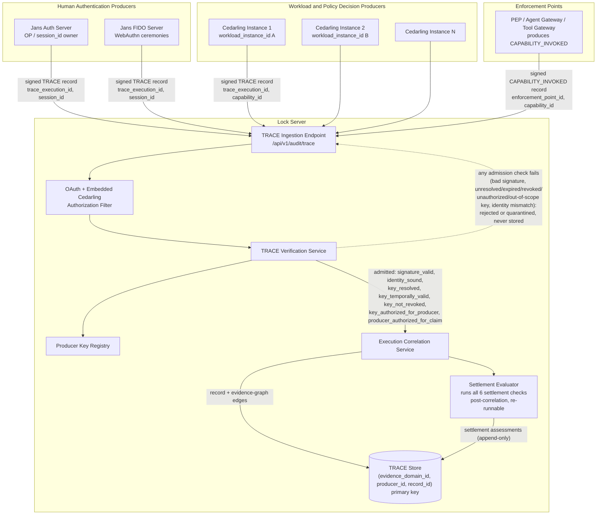
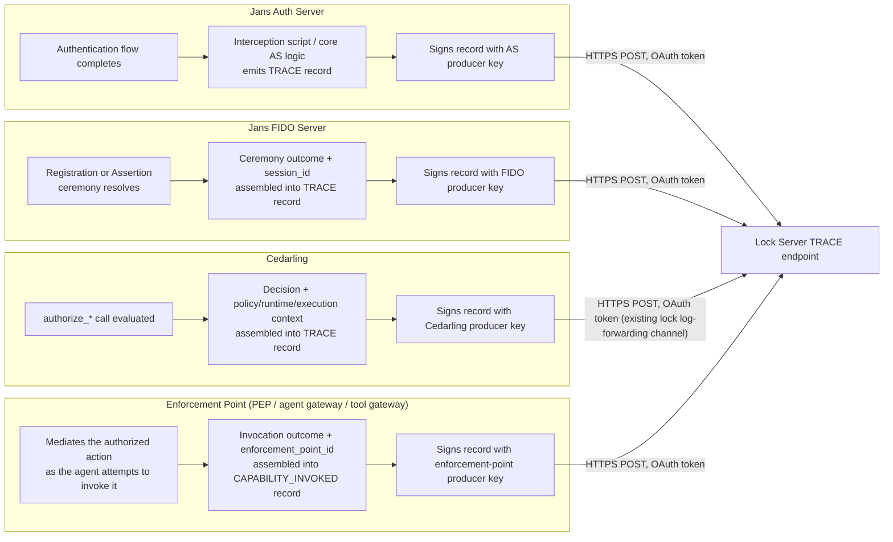
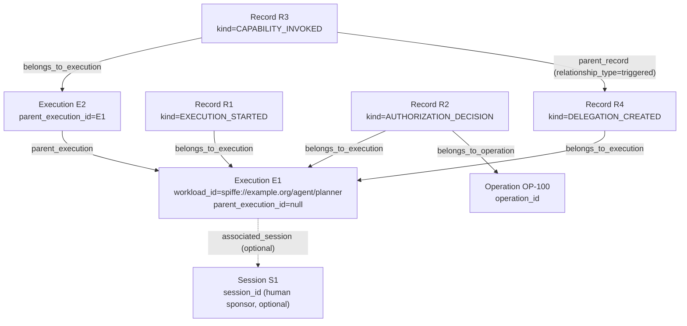
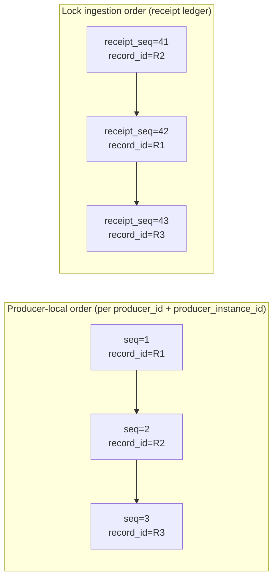

# Design Document: lock-server-trace-records

## Executive Summary

When an agent exercises a governed capability, the organization must be able to determine what was authorized, what control was applied, what action occurred, and whether the resulting effect matched the authorization. This evidence enables the accountability required by GovOps.

This specification enables Lock Server to collect signed TRACE records from policy decision points, enforcement points, identity systems, and target systems, then correlate them into a verifiable execution history. Each capability can be traced from the originating authority through policy evaluation and invocation to the observed runtime effect. Identity, workload, token, delegation, and policy information provide supporting context for that evaluation.

This is especially important when agents access highly confidential data or perform high-impact actions. Before execution, an enforcement point can require evidence of sufficient authority, policy compliance, delegation integrity, workload assurance, and lineage. After execution, an auditor can evaluate whether the evidence establishes accountability and identify anything missing or contradictory.

TRACE enables organizations to govern agent capabilities using verifiable evidence rather than relying on authorization decisions, credentials, or agent-generated logs alone.

## Overview

This design adds **TRACE evidence collection and verification** to the Janssen Lock Server. TRACE records are signed, immutable statements about security-relevant events such as authentication, authorization decisions, capability invocations, delegation, trust-boundary crossings, and observed runtime effects. Lock verifies these records, preserves their original assertions, and correlates them into an evidence graph organized around a `trace_execution_id`.

The principal architectural goal is to create evidence that can be evaluated by someone outside the producer’s trust boundary. An agent’s memory or application log is useful operational data, but it is still a self-report. TRACE separates the party acting from the parties observing, enforcing, signing, verifying, and storing evidence. Cedarling records authorization decisions; Auth Server and FIDO Server record authentication events; enforcement points such as PEPs, agent gateways, and tool gateways record capability invocations; other trusted producers may record resulting runtime effects.

### Minimal deployment

A minimal deployment requires:

* Producers that generate and sign TRACE records.
* A registered signing key and stable identity for each producer.
* A unique `record_id` and a `trace_execution_id` when one is available.
* Producer-local sequencing and predecessor hashes.
* Lock endpoints that authenticate submissions and verify signatures.
* Immutable storage of the signed assertion.
* Correlation and retrieval by execution, record, producer, capability, workload, session, transaction, and token.
* A separate Lock receipt ledger showing when records were accepted.

This minimum provides attributable, tamper-evident evidence. It can show what a producer asserted, verify that the assertion has not changed, identify where it belongs in that producer’s sequence, and correlate evidence from multiple producers around the same governed execution.

A valid signature is necessary, but it is not the same as complete or trustworthy evidence. It proves that a registered producer signed specific bytes. It does not prove that the producer observed the event independently, that every expected record was produced, that a delegated agent stayed within its authority, or that the recorded action caused the claimed runtime effect.

### Submitted, settled, and complete

Lock therefore distinguishes three questions:

1. **Was the record submitted and signed by the claimed producer?**
2. **Did the individual record pass Lock’s settlement checks?**
3. **Is the execution’s overall evidence complete under the applicable profile?**

A record becomes **settled** only after its own signature, identity, predecessor linkage, revocation state, and execution binding pass validation. Lock issues an immutable, signed settlement assessment for that record. Execution completeness is evaluated separately. A settled authorization record does not become unsettled merely because an expected capability-invocation or runtime-effect record is missing.

Completeness is always relative to a versioned expectation profile and a point in time. Lock may report an execution as `complete`, `expected_evidence_missing`, or `not_evaluated`. Late evidence can improve a later completeness assessment, but it never causes Lock to rewrite an earlier assessment or modify the original producer assertions.

### A common four-state result model

Lock evaluates many conditions — signature, key authorization, predecessor linkage, execution binding, instance binding, operation binding, delegation non-expansion, completeness — and historically each used its own result vocabulary (booleans, flags, kind-specific words). To keep negative-conformance results consistent and composable, **every per-check and per-dimension result normalizes to one four-state model**:

| State | Meaning |
|---|---|
| `valid` | The check was evaluated and the relationship holds. |
| `invalid` | The check was evaluated and the relationship is contradicted — a positive negative finding (a bad signature, an unauthorized key, a link mismatch). |
| `indeterminate` | The check **could not be evaluated** to a yes/no — the inputs needed are absent, unknown, or outside the configured comparison. This is **not** a pass. In particular, **when a verifier cannot confirm key authorization it reports `indeterminate`, never silently `valid`** — it says so rather than assuming authority. (Context matters: `indeterminate` for key authorization arises during *evaluation over already-admitted or exported evidence* — most importantly offline Evidence Packet verification where the authorization statement may be absent. At **live ingestion** an unauthorized or unresolved key is not recorded as `indeterminate`; it is **rejected/quarantined and never stored** — see Component 2 and the three-context note under the negative vectors.) |
| `not_evaluated` | The check **was not run** — no applicable profile, the dimension does not apply to this `event_kind`, or evaluation was deliberately deferred. Distinct from `indeterminate` (tried-but-couldn't) and from `valid` (ran-and-passed). |

**Both `invalid` and `indeterminate` block a stronger result wherever that check is *required*.** A `settled` settlement, a `complete` completeness report, a `satisfied` assurance-requirement check, or any "conformant" composite is reached only when every required check is `valid`; any required check sitting at `invalid` or `indeterminate` holds the composite below that stronger state (as `submitted`, `expected_evidence_missing`, `unsatisfied`, etc.), with the specific blocking check named. (The checks that can legitimately sit at a blocking value *on a stored record* are the ones evaluated after admission — e.g. `predecessor_linked` pending, `execution_bound` unattributed, or an execution-level completeness gap. The admission-gated key-state checks are **not** among them: an unauthorized/unresolved key is rejected at ingestion and never produces a stored record for a composite to block — see Component 2 and the three-context note under Negative Conformance Test Vectors. A key-authorization `indeterminate` arises only during offline packet verification, where it blocks a `conformant` *verdict*, not a settlement.) The existing kind-specific words remain as presentation labels where they aid a reader (e.g. completeness's `expected_evidence_missing`, delegation's `non_expansion_result`), but each maps onto this four-state core — `expected_evidence_missing` is an `indeterminate`/`invalid` completeness state, never a `valid` one — so a consumer can reason about negative results uniformly across flags, errors, and assessments. This is the model the per-dimension verification vector (see `trust_tier` is a filtering convenience) and every Lock-derived assessment use.

### Full-assurance deployment

Deployments may add stronger features according to their risk and assurance requirements:

* Enforcement-point evidence: a signed `CAPABILITY_INVOKED` in which an **authorized enforcement-point producer asserts it mediated** the operation (per the claim-boundary table, this establishes the producer's attributable assertion of mediation — it does not, by itself, prove the operation passed through a control). Strengthening that assertion toward proof depends on the further, separately-recorded signals below: operation binding (same request/decision/invocation/result), instance binding and deployment integrity (the record came from the attested runtime it claims), and key custody.
* Operation-binding commitments connecting the exact request, decision, invocation, and result without storing sensitive payloads.
* User-intent and approval evidence via `INTENT_RECORDED`/`APPROVAL_GRANTED`/`APPROVAL_DENIED`/`STEP_UP_REQUESTED`/`USER_CONFIRMATION_RECORDED` — with sensitive prompts committed by digest or detached reference rather than stored inline, and with **human confirmation bound to actual authorization**: an `APPROVAL_GRANTED` must reference the resulting OAuth grant / access token / CIBA transaction / AS decision, while a bare local UI confirmation is only a `USER_CONFIRMATION_RECORDED` (confirmation is not authorization, per AIMS §10.7) — so Lock can answer whether the resulting action matched what the user requested and was genuinely authorized (see Data Models: User Intent and Approval).
* Token claims, validation results, and revocation freshness captured at decision time.
* Lock-managed token enrichment showing the token’s later or current state.
* Evidence-origin classification and Lock-assigned trust assessments, with an optional structured **RATS** (RFC 9334) `attestation_ref` that lets Lock *explain* the runtime-attestation evidence behind a trust tier without letting a producer assign the tier (see Attestation Binding (RATS)).
* Expected-evidence profiles for important capabilities.
* A pre-defined **AIMS evidence-completeness profile** expecting the AIMS §§11–13 audit minimum — authenticated agent identifier, delegated subject (when present), capability, concrete tool/resource and action, decision, correlation identifier, posture/risk inputs, credential lineage, and subsequent remediation — with `capability_id` remaining the primary governance unit but required to resolve to the action and resource (see Data Models: Evidence Completeness Expectations).
* Delegation validation proving that child authority did not expand beyond parent authority.
* Authorization modeled as evolving state via `AUTHORIZATION_TRANSITION` events (step-up, scope reduction, delegation, revocation, expiry, policy change), so Lock can reconstruct the authority in force at the moment any action occurred (see Data Models: Authorization Transitions).
* Security signals and remediation recorded as a causal pair (`SECURITY_SIGNAL_RECEIVED` + `REMEDIATION_APPLIED`): SSF/CAEP/RISC issuer, event type, affected subject/token, receipt time, enforcement time, resulting restriction, and the causal link between them — so Lock can prove whether a revocation or elevated-risk signal actually caused access to be reduced (and surface signals that were not), per AIMS §11 (see Data Models: Security Signals and Remediation).
* An optional **Audit Context Propagation Profile** specifying how the execution id, causal parent, actor, on-behalf-of identity, delegation reference, and authorization-state reference cross HTTP, MCP, A2A, messaging, and token boundaries — aligned with the draft's `Audit-Trace-ID`/`Audit-Parent-ID` and interoperable with W3C Trace Context/OpenTelemetry, with unsigned headers treated as hints and reliance bound into a signed token (see Data Models: Audit Context Propagation Profile).
* Explicit trust-boundary crossing records with accepted checkpoints and assurance boundaries, including an optional **privacy-preserving boundary profile** that binds pairwise/opaque per-domain execution identifiers inside `TRUST_BOUNDARY_CROSSED` instead of propagating one global `trace_execution_id` across domains (see Trust Boundary Crossings: Privacy-Preserving Cross-Domain Correlation).
* Producer lineage checkpoints and full-history validation for collusion-resistant assurance.
* An optional **WIMSE Agent Identifier profile** requiring an agent's stable `workload_id` to be a WIMSE URI (a SPIFFE ID is one valid implementation), kept separate from the rotating `workload_instance_id` and credentials, per the IETF AIMS model (see Data Models: WIMSE Agent Identifier profile).
* Credential-aware token references: `tokens[]` describes any AIMS-recognized agent credential (WIT, WIC/X.509, SPIFFE SVIDs, WPT, OAuth and transaction tokens) by `credential_type`, issuer, identifier/fingerprint, audience, expiration, and confirmation-key thumbprint — recording the credential's metadata and binding, never the credential itself (see Token Modeling).
* A record of **how the workload authenticated** (`workload_authentication`): the `authentication_layer` (transport vs. application), `authentication_method` (`mtls`/`wpt`/`http_message_signature`), the `authenticated_workload_id`, and a `proof_ref` — distinguishing mTLS transport identity from application-layer proof that survives proxies and TLS termination, per AIMS §9 (see Token Modeling).
* Proof-of-possession binding (`pop_binding`) extending operation binding to the authentication proof — WPT `wth`/hashes, HTTP Message Signature covered components, audience, nonce, expiration, and the request the proof was computed over — so TRACE can show the authenticated workload held the correct key and the proof applied to *this* request, not merely that a token appeared in the execution (see Operation Binding Digests, per AIMS §9.2).
* Credential-provisioning evidence via `CREDENTIAL_PROVISIONED` (initial issuance, renewal, or rotation): the workload identifier, credential fingerprint, validity period, provisioning authority, posture-assessment reference, assessment policy/version, and resulting credential attributes — recording the point where workload posture is evaluated, per AIMS §8 (see Data Models: Credential Provisioning Evidence).
* Token-exchange and transaction-token lineage on `token_enrichment` (source/derived token references, grant type, issuer, audience, transaction id, and whether authority was downscoped) — letting Lock surface the AIMS anti-pattern where a Tool forwards an agent's access token instead of obtaining a transaction-specific or exchanged token, per AIMS §§10.5–10.8 (see Data Models: Token-Exchange and Transaction-Token Lineage).
* Signed Lock receipt checkpoints and optional external anchoring — including an optional **TRACE transparency profile** that publishes checkpoint hashes to one or more independent transparency services — supporting TRACE Registry anchors, CLL/MMR checkpoint chains, and compatible COSE/SCITT-style receipts (following evolving drafts, not a final-RFC conformance claim; see Lock Receipt Ledger: TRACE transparency profile) — without replacing the native ledger.
* Disconnected candidate evidence and late-arrival handling, so evidence produced while Lock was unreachable is ingested, disclosed, and settled without rewriting the signed assertion.

Used together, these features allow an investigator to trace a runtime effect backward through the capability invocation, authorization decision, tokens, authentication context, delegation history, and originating execution. They also expose what is missing, which trust assumptions remain, how much lineage was validated, and where responsibility moved between trust domains.

### Independent evidence, not global truth

Lock preserves several different forms of ordering and assurance without conflating them. Producer chains describe each producer’s local sequence. The Lock receipt ledger describes ingestion order. Causal edges describe asserted relationships between records. None establishes a single global event order across independent systems.

Likewise, a Lock receipt checkpoint proves what Lock received; it does not prove that a producer supplied its complete history. Producer-lineage completeness requires full history or a separately authenticated lineage checkpoint. Trust and completeness are explicit properties of the applicable validation profile, not conclusions inferred from the presence of one valid record.

TRACE also does not guarantee that every real-world action was observed or that every producer told the truth. Its purpose is narrower and more defensible: make assertions attributable, tampering detectable, omissions visible where expectations exist, correlations inspectable, and assurance claims independently verifiable.

#### Claim boundaries per record kind (normative)

Each record kind establishes a **narrow, specific claim** and nothing stronger. This boundary is normative: Lock, and any system consuming Lock's evidence, MUST NOT promote a record into a claim it does not make — a lower-level piece of evidence (an attestation, a receipt, an observed effect) is never silently elevated into proof of authorization, correctness, or occurrence it does not carry. This is what makes Lock safe to integrate with higher-level systems (e.g. SOVP): the consumer composes stronger conclusions explicitly from the dimensions (see `trust_tier` is a filtering convenience), rather than inheriting an overstated claim from any single record.

| Record | Establishes | Does **not** establish |
|---|---|---|
| `AUTHORIZATION_DECISION` | The PDP signed that it returned this decision under the referenced policy. | That the action occurred or was appropriate. |
| `CAPABILITY_INVOKED` | The PEP asserts it mediated the invocation. | That the target produced the claimed effect. |
| `RUNTIME_EFFECT` | The observer asserts that it observed the effect. | That the effect was authorized. |
| Attestation evidence (`attestation_ref`) | A verifier appraised stated runtime measurements. | That the runtime performed a particular action. |
| Lock receipt | Lock accepted these bytes at this position. | That the producer's assertion is true or complete. |

The same discipline extends to the other record kinds this design defines, each bounded the same way: an `AUTHENTICATION_EVENT` establishes that the identity provider resolved an authentication with the stated outcome, not that any later action was taken by that subject; a `DELEGATION_CREATED` establishes that a party signed a grant of authority to a child, not that the child stayed within it (that is the separate, Lock-derived delegation non-expansion result); an `APPROVAL_GRANTED` establishes that an approval was translated into the referenced authorization-server grant, while a `USER_CONFIRMATION_RECORDED` establishes only that a local UI confirmation occurred and explicitly does **not** establish authorization (AIMS §10.7); a `SECURITY_SIGNAL_RECEIVED` establishes that a signal was received, not that any access actually changed (that requires the paired `REMEDIATION_APPLIED` and its causal link). In every case the record is the producer's attributable, signed *assertion* about one event; whether the asserted thing is true, authorized, complete, or caused what followed is a separate question answered — when it can be answered at all — by correlation, settlement, completeness, and the per-dimension verification results, never by the single record's existence.

### Scope and adoption

The architecture is intentionally incremental. An implementation can begin with signed ingestion, immutable storage, execution correlation, and basic retrieval. Higher-assurance capabilities can be introduced through profiles without changing the core signed-record model.

This design extends Lock Server’s existing audit subsystem; it does not require every deployment to implement every advanced feature immediately. The common foundation is the immutable producer assertion, the separation of producer evidence from Lock-derived assessments, and the ability to explain exactly what was verified, what was not verified, and what evidence may be missing.

### Out of Scope / Future Profiles

The following capabilities are **named here for direction but are not specified by this design** — they have no data model, component responsibility, requirement, or task in this specification, and a deployment cannot rely on them until a future revision defines them. They are recorded explicitly so this section does not imply the spec delivers more than it does:

- **Durable producer outboxes.** A producer-side durability mechanism (a persistent local queue that guarantees a signed record survives producer restarts until Lock acknowledges it) is a *producer* concern outside Lock Server's boundary. This design specifies how Lock ingests a backlog once it arrives (see Candidate Evidence During Disconnection), but not how a producer buffers one; the outbox is left to producer implementations and a possible future producer-side profile.
- **Crash-gap disclosure.** Lock already discloses coverage gaps in a producer chain (see Error Handling: Coverage gap) and its own ledger-integrity state on failover (see Lock Receipt Ledger: Recovery after failover). A distinct, first-class *producer crash-gap* artifact — a producer explicitly attesting "I crashed and may have lost records between sequence X and Y" — is not specified here; today such a gap surfaces only as an ordinary coverage gap, without the producer's own signed account of it. A future revision could add a signed crash-gap declaration.
- **Evidence Packet wire format and reference offline verifier.** The Evidence Packet **conceptual model** is specified normatively in this design (see Data Models: Evidence Packets — what a packet is, what it must contain to be trustworthy, its evidence-domain binding, disclosure modes, redaction rule, and the not-a-record rule). What remains a **future profile** is only the concrete realization: the export/manifest **byte format**, the embedded key/checkpoint/proof layout, and a **reference offline verifier**. A deployment cannot rely on a specific packet encoding until that profile is defined; it can rely on the conceptual contract today.

- **Lock as a TRACE producer for its own endpoints.** Lock protects its own API with an embedded Cedarling, which makes Lock an embedded-enforcement application like any other (see Event-Kind-Specific Schemas: co-location is permitted, key separation is mandatory). Lock *could* therefore act as a PEP producer, signing `CAPABILITY_INVOKED` for governed access to its own protected endpoints while its embedded Cedarling signs the matching `AUTHORIZATION_DECISION`. This is **not specified for the MVP** and carries two Lock-specific hazards a future profile must resolve before enabling it: (1) **self-reference / recursion** — Lock ingesting evidence *about* its own ingestion endpoint can feed itself (a `CAPABILITY_INVOKED` for the very `POST /audit/trace` that submits it), so the TRACE ingestion path must be excluded or carefully bounded, and self-emission likely restricted to Lock's administrative/retrieval endpoints, so emission does not generate more emission; and (2) **key hygiene** — a Lock-as-producer key MUST be a **distinct producer key**, never Lock's settlement/ledger signing key, so Lock's self-produced *assertions* and its own Lock-derived *assessments* never share key custody (the design's producers-sign-assertions/Lock-signs-assessments separation applied to Lock itself). Until a profile settles those, Lock is an evidence collector, not its own producer.

Adding any of these later fits the incremental model above: each is an additive profile over the same immutable signed-record foundation and none requires changing the core model.

## Architecture

### System Context



Lock Server already plays the Policy Retrieval Point (PRP) role and already terminates OAuth-protected audit submissions from Cedarling. This design keeps that role and adds the Auth Server and FIDO Server as new, first-class audit/TRACE producers alongside Cedarling, using the same OAuth client-credential pattern that Cedarling clients already use against Lock Server's `lock.write`-style scopes.

### Producer Roles



Each producer signs independently with its own Ed25519 key, registered ahead of time with Lock Server (mirroring the TRACE standard's producer-key registration model). No producer needs to trust another producer's key; Lock Server is the single party that verifies them all. The **enforcement point** is deliberately a separate producer from both Cedarling (which decides) and the agent (which acts): Cedarling produces the `AUTHORIZATION_DECISION` recording what was permitted, and the enforcement point that mediates the action produces the `CAPABILITY_INVOKED` record in which that **authorized enforcement-point producer asserts it mediated** the permitted action. Per the claim-boundary table, that record *establishes the producer's attributable, tamper-evident assertion of mediation* — it does **not** by itself *prove* the operation passed through a control; stronger proof depends on operation binding, deployment integrity, instance binding, and key custody, each recorded and assessed separately. The acting agent produces neither — its self-report that it took an action is not evidence the action was mediated by enforcement, and Lock's trust-tier assignment (see Evidence Origin and Trust Tier) keeps an agent's self-reported invocation below the tier of an enforcement-point-observed one.

### Correlation Model: Executions, Not Sessions

The primary organizing concept for evidence is the **governed execution** (`trace_execution_id`), not the human session. An execution can spawn child executions (delegation to a subagent, a fan-out to another workload), and any execution or operation within it may — but need not — have a human `session_id` attached.



`E1` is a root execution with no parent — for example, a scheduled agent run or a machine-to-machine workflow that never involves a human. `E2` is a child execution spawned by a delegation event (`DELEGATION_CREATED`, record `R4`) inside `E1`. A human `session_id`, when one exists, attaches to `E1` (or to any operation within it) as an optional edge — it does not have to be defined for the graph to be valid, and its absence does not demote any record to second-class status.

### Producer Chains vs. Lock's Receipt Ledger

Lock Server does **not** assert a single global event order across independent producers — the Auth Server, the FIDO Server, and multiple concurrent Cedarling instances have no shared clock or shared sequence counter, and cannot agree on one global sequence number. Instead, Lock preserves two independent, separately-verifiable orderings:



`R2` was emitted after `R1` by its producer (producer-local order), but arrived at Lock before `R1` (Lock's receipt order) — network delay, retry, or a disconnected-agent upload gap can all produce this. Both orderings are legitimate and both are retained; neither is "corrected" to match the other. See Data Models below for the exact fields each ordering uses.

A hash chain that only Lock computes and only Lock checks is not independently verifiable by a party who does not already trust Lock's live API — it proves nothing beyond "Lock's own runtime says this is consistent." Lock therefore periodically signs the receipt ledger's own state with a dedicated ledger-signing key (distinct from any producer key) into checkpoints that a verifier can validate offline against exported ledger entries, optionally anchored to an external medium outside Lock's control (see Lock Receipt Ledger: Signing, Checkpoints, and Recovery below).

## Components and Interfaces

### Component 1: TRACE Ingestion Endpoint

**Purpose**: Accepts TRACE records over HTTPS, following the same shape as the existing `AuditRestWebService` endpoints (`/api/v1/audit/health`, `/log`, `/telemetry`, each with a `/bulk` variant).

**New REST surface** (added to `lock-server.yaml` / `AuditRestWebService`):

| Endpoint | Purpose | OAuth Scope |
|---|---|---|
| `POST /api/v1/audit/trace` | Submit a single signed TRACE record | `https://jans.io/oauth/lock/trace.write` |
| `POST /api/v1/audit/trace/bulk` | Submit a batch of signed TRACE records (one producer per batch) | `https://jans.io/oauth/lock/trace.write` |
| `GET /api/v1/audit/trace/executions/{trace_execution_id}?execution_authority={execution_authority}` | Retrieve the evidence graph (records, child executions, operations) for a governed execution, disambiguated by its composite identity `(evidence_domain_id, execution_authority, trace_execution_id)` — **primary retrieval endpoint** | `https://jans.io/oauth/lock/trace.readonly` |
| `GET /api/v1/audit/trace/records/{record_id}?producer_id={producer_id}` | Retrieve a single TRACE record by its immutable identity, disambiguated by its composite identity `(evidence_domain_id, producer_id, record_id)` — the same physical storage key used by the TRACE Store (see Component 5 and Record Identity) | `https://jans.io/oauth/lock/trace.readonly` |
| `GET /api/v1/audit/trace/sessions/{session_id}?session_issuer={session_issuer}` | Retrieve the executions and records associated with a human authentication session, disambiguated by its composite identity `(evidence_domain_id, session_issuer, session_id)` | `https://jans.io/oauth/lock/trace.readonly` |
| `GET /api/v1/audit/trace/workloads/{workload_id}` | Retrieve the executions attributed to a stable agent/workload identity | `https://jans.io/oauth/lock/trace.readonly` |
| `GET /api/v1/audit/trace/transactions/{transaction_id}` | Retrieve the records/operations sharing a business transaction identifier | `https://jans.io/oauth/lock/trace.readonly` |
| `GET /api/v1/audit/trace/capabilities/{capability_id}` | Retrieve the executions that exercised a given GovOps capability. `capability_id` is the **Lock-derived** value (see Data Models: Capability Resolution), resolved from each record's signed `(action, resource_type)`; the lookup matches records by their resolved capability, not by a signed id. | `https://jans.io/oauth/lock/trace.readonly` |
| `GET /api/v1/audit/trace/tokens/{token_ref}` | Retrieve the executions/records referencing a given token, and (subject to separate authorization) its enrichment record. `token_ref` is a Lock-local identifier (see Token Enrichment) — no encoding of an external issuer URI is required. | `https://jans.io/oauth/lock/trace.readonly` for the base lookup — the `token_enrichment` record itself requires the separate enrichment-read scope described under Component 6, not `trace.readonly` alone. |
| `GET /api/v1/audit/trace/tokens?issuer={issuer}&jti={jti}` (or `&fingerprint={fingerprint}` when `jti` is absent) | Resolve a token by its externally-asserted `(issuer, jti)`/`fingerprint` composite key and return the same result as the equivalent `GET .../tokens/{token_ref}` lookup, for callers who don't already have Lock's `token_ref`. | Same as `GET .../tokens/{token_ref}`. |
| `GET /api/v1/audit/trace/executions/{trace_execution_id}/completeness?execution_authority={execution_authority}` | Retrieve the **evidence completeness report**, **assurance profile**, and **lineage coverage** for a governed execution: which expected producers/record types are present, which are missing (`expected_evidence_missing`), the validation modes that were applied and the residual trust assumptions they leave, and, per producer chain, how much of the earlier chain Lock actually received and contiguously validated (`lineage_start`/`lineage_end`/`validated_through_record`/`checkpoint_ref`/`history_complete`), plus any Lock-signed `delegation_validation` results for delegations the execution created (the three-valued `non_expansion_result` of `valid`/`invalid`/`indeterminate`, the per-dimension constraints compared, and the policy/profile used), and any **assurance-requirement checks** for high-risk capabilities the execution exercised (`satisfied`/`unsatisfied` against the applicable assurance-requirement profile), all stamped `evaluated_at` — Lock-derived assessments against the applicable evidence-expectation, delegation-validation, and assurance-requirement profiles (see Component 7 and Data Models: Evidence Completeness Expectations, Execution Assurance Profile, Lineage Coverage, Delegation Non-Expansion Validation, Consecutive Collusion and High-Risk Assurance Requirements), never producer claims. | `https://jans.io/oauth/lock/trace.readonly` |

`GET /api/v1/audit/trace/executions/{trace_execution_id}` is the primary investigative entry point: it returns the execution's own metadata, its records, its child executions (via `parent_execution_id`), and pointers into the other correlation dimensions (session, workload, capability) that apply. The session/workload/transaction/capability endpoints exist because an investigator does not always start from an execution — e.g., "show me everything this human session touched" or "show me every execution that exercised this capability" are equally valid entry points into the same underlying evidence graph.

The token retrieval endpoints follow the same **Lock-local-reference-first** pattern used elsewhere: `{token_ref}` is a path segment because it is a single opaque Lock-generated identifier requiring no escaping, whereas `(issuer, jti)` is a composite, externally-asserted key whose `issuer` component is itself a URI — putting a URI inside a path segment forces the caller to get URL-encoding exactly right and makes the path awkward to construct and read. Query parameters carry that composite key instead: `GET .../tokens?issuer=...&jti=...` resolves internally to the same `token_ref` and returns an identical result to `GET .../tokens/{token_ref}`, so a caller who only knows the externally-asserted `(issuer, jti)` pair never needs to look up `token_ref` first.

**Composite-identity scoping on the `executions`, `sessions`, and `records` endpoints:** the data model scopes an execution by `(evidence_domain_id, execution_authority, trace_execution_id)`, a session by `(evidence_domain_id, session_issuer, session_id)` (see Composite Identities), and a record by `(evidence_domain_id, producer_id, record_id)` (see Record Identity) precisely because `execution_authority`, `session_issuer`, and `producer_id` are the scoping authorities that prevent two different parties from colliding on the same bare `trace_execution_id`/`session_id`/`record_id` value — so the retrieval endpoints cannot accept only the bare ID without reintroducing exactly the collision risk the data model was designed to avoid. This matters as much for `records` as for `executions`/`sessions`: `record_id` is explicitly documented under Record Identity as unique only within its producer's own namespace, yet `GET /records/{record_id}` alone offers no way to disambiguate two different producers who (accidentally or maliciously) generated the same UUID. `execution_authority`, `session_issuer`, and `producer_id` are therefore all carried as **optional query parameters**, not additional path segments, since (like `issuer` on the token endpoints) an authority/issuer identifier is frequently a URI (e.g. a SPIFFE URI or an OAuth issuer URL) and belongs in a query parameter rather than a second path segment requiring its own encoding:

- `GET /api/v1/audit/trace/executions/{trace_execution_id}?execution_authority={execution_authority}` — when `execution_authority` is supplied, Lock resolves the exact composite match.
- `GET /api/v1/audit/trace/sessions/{session_id}?session_issuer={session_issuer}` — same pattern, scoped by `session_issuer`.
- `GET /api/v1/audit/trace/records/{record_id}?producer_id={producer_id}` — same pattern, scoped by `producer_id`, matching the TRACE Store's own physical primary key.

`execution_authority`/`session_issuer`/`producer_id` may each be omitted when a caller does not have it on hand (e.g. an investigator starting from a bare ID found in a log line). Omitting the scoping parameter is safe and unambiguous whenever the bare ID happens to resolve to exactly one composite identity in the evidence domain; see Error Handling ("Ambiguous unscoped execution/session/record lookup") for the case where it does not.

**Responsibilities**:
- Accept the raw signed TRACE record body (JSON) without altering bytes on receipt, and **preserve the exact received serialization**. Two distinct reasons require the raw bytes, and the endpoint must not conflate them: (a) signature verification canonicalizes the assertion with RFC 8785 (JCS) and checks the Ed25519 signature over *that* canonical form — the signature input is the JCS-canonicalized content, **not** necessarily the received serialization — so the endpoint hands the body to the `TRACE Verification Service` unaltered only so that service can canonicalize it correctly; and (b) if the record is later anchored into a Registry entry whose `canonicalization_id` is `as-transmitted`, the leaf is computed over the exact received bytes, which JCS cannot reconstruct (see Two Canonicalization Layers). Preserving the raw bytes serves (b) and keeps (a) faithful; it does **not** mean the received bytes are themselves the signature input.
- Delegate producer authentication to the existing OAuth + embedded-Cedarling `AuthorizationProcessingFilter` / `CedarlingAuthorizationProcessingFilter` (transport-level identity of the *submitting client*), which is separate from and in addition to the TRACE record's own producer signature (content-level identity of the *record's producer*).
- **Derive the request's `evidence_domain_id`** from the authenticated submitting client and that client's configured evidence-domain binding in Lock configuration (see Data Models: Evidence Domain and Isolation) — never from the TRACE assertion. Ignore and flag any `evidence_domain_id` (or equivalent partition field) present in the producer's signed body, exactly as a producer-supplied `trust_tier` is ignored and flagged. The derived `evidence_domain_id` scopes everything the record touches downstream (verification, correlation, storage, enrichment, settlement), and a request whose authenticated client has no configured evidence-domain binding is rejected rather than defaulted.
- Return `202 Accepted` for records that pass verification and correlation (including idempotent replays, equivocation-flagged records, coverage-gap-flagged records, and late-flagged records — see Error Handling), `400 Bad Request` with a `LockApiError` for malformed or unverifiable records, `401`/`403` for OAuth failures per existing convention. The `202` body carries the record's initial derived `current_settlement` — the **initial settlement evaluation is synchronous, in-request**: verification → correlation → the Settlement Evaluator's first pass (Component 4a) all complete before the `202` is returned, so the body reflects the settlement status as of acceptance alongside the equivocation/coverage-gap/late flags. For most records that status is `submitted` (a not-yet-arrived positional predecessor or an unattributed record leaves `predecessor_linked`/`execution_bound` pending), and it is `settled` in the body only when all six checks already pass at acceptance time. **Subsequent** re-settlement (a later predecessor arriving, a `CORRELATION_ASSERTED` backfill or operator attribution binding an execution) is asynchronous — it appends a new settlement assessment out of band and does not retroactively change any earlier `202` response; a caller observes the updated status by re-reading the record's derived `current_settlement`, never from the original acceptance body.

### Component 2: TRACE Verification Service

**Purpose**: Cryptographically verifies each inbound TRACE record before it is trusted or stored, following the TRACE standard's signing scheme.

**Responsibilities**:
- Resolve the record's `producer_id` (from the signed body, never from an out-of-band header — the standard's rule that "a producer id supplied out of band is an unsigned assertion about who signed" applies here unchanged).
- Look up the producer's registered Ed25519 public key in the **Producer Key Registry** by the signed `kid` carried in the record (see Component 3) — not by inferring which key was active from `signed_at`/`active_since` alone, since that is ambiguous during rotation-overlap or emergency-revocation windows. A record predating `kid`-based selection (if any exist in a given deployment) falls back to `active_since`-based selection as a migration path only.
- Recompute the canonical body bytes (RFC 8785 / JCS over all fields except `signature`) and verify the Ed25519 signature.
- Reject a record whose `assertion` body has no `record_id` — `record_id` is always producer-supplied (see Record Identity); Lock never computes it.
- Compute `content_digest` (see Record Identity) — a Lock-computed hash over the producer-signed `assertion` only (never the `verification`/`ingestion` parts added later), used purely for tamper/collision detection, never as a substitute for `record_id`.
- Populate the `verification` part of the stored envelope (see Data Models: Stored Record Envelope): `signature_valid`, `key_id`/`kid` used, `verified_at`, `algorithm`, and `trust_tier`.
- Assign the record's `trust_tier` (see Data Models: Evidence Origin and Trust Tier) from the producer's key class in the Producer Key Registry, the collection path Lock observed (submitting OAuth client, endpoint, normal-vs-bulk-import path), and the producer-declared `evidence_origin`/`measurement_point` — treating the producer's declaration only as an input that can lower, never raise, the tier. Never accept a `trust_tier` from the producer's signed body; if one is present there, ignore it and flag the attempt.
- Resolve and authorize the signing key through **separately-named checks**, so the proof relationship is never left implicit and three concerns that used to be fused — *existence*, *temporal validity*, and *non-revocation* — are evaluated and recorded distinctly, each at a well-defined instant. Verifying a signature against a key found by `(evidence_domain_id, producer_id, kid)` only establishes that *some registered key signed*; it does not by itself establish that the key existed as a distinct registration, was within its validity interval, was not revoked, was authorized for this producer, or that the producer was authorized to make *this* claim. **Timebase.** Lock treats the producer-claimed `signed_at` as an untrusted claim and `verified_at` (Lock's own verification instant) as the authoritative evaluation time; `received_at` is Lock's ingestion-ordering time and is not used for key evaluation. Each check below names the instant it is evaluated at. The checks are:
  1. **`key_resolved`** — *(existence at an index; evaluated at `verified_at`)* a key entry exists at the registry index `(evidence_domain_id, producer_id, kid)`. This is **existence only** — a lookup succeeded; it is deliberately **not** an authorization statement. The index is mutable Lock-internal bookkeeping used to *find* a candidate key, so "a row exists under this `producer_id`" must not be read as "this key is authorized for this `producer_id`" (that would be circular — see `key_authorized_for_producer` below, where authority comes from the signed statement's content, matched by thumbprint). It also no longer folds in validity-interval or revocation state, which are now their own checks. Resolution is always within the request's Lock-derived `evidence_domain_id`, never across domains.
  2. **`key_temporally_valid`** — *(validity interval; evaluated at `verified_at`, cross-checked against the claimed `signed_at`)* the resolved key's `valid_from`/`valid_until` interval covers `verified_at`. Because `signed_at` is an untrusted producer claim, `verified_at` is the authoritative instant; Lock additionally records whether the claimed `signed_at` also falls within the interval, and a divergence (e.g. `verified_at` is inside the window but the claimed `signed_at` predates `valid_from`, or vice versa) is a **surfaced finding**, not a silent pass. This check is distinct from revocation: a key can be within its interval yet revoked, or past `valid_until` yet never revoked.
  3. **`signature_valid`** — *(evaluated at `verified_at`)* the Ed25519 signature verifies over the RFC 8785 JCS canonical bytes against that resolved key.
  4. **`key_not_revoked`** — *(evaluated at `verified_at`)* the resolved key was not revoked (`revoked_at`) as of Lock's verification time. A revocation recorded in the registry *after* `verified_at` never retroactively flips this result for an already-verified record (see Property 8); this is the same `key_not_revoked` the Settlement Evaluator records, evaluated once here at admission and persisted.
  5. **`key_authorized_for_producer`** — *(evaluated at `verified_at`)* authorization is established by an **independently provisioned, administratively-signed Producer-Key Authorization Statement** (see Producer-Key Authorization Statement), **not** by the database coordinate under which the public key happened to be found. This distinction is deliberate and non-circular: `key_resolved` only establishes that *a row exists at the index* `(evidence_domain_id, producer_id, kid)` — on its own that is near-tautological ("the key filed under this producer is filed under this producer") and a lookup index is mutable Lock-internal bookkeeping, not a grant of authority. `key_authorized_for_producer` instead requires that the **statement's own signed content** names this `producer_id` **and** that its signed `public_key_thumbprint` equals the thumbprint of the key that actually verified the record — so the authority comes from what a trusted administrative issuer *signed about this key*, matched by thumbprint (not by the non-unique `kid` selector or the row's filing coordinate). A key authorized for one producer therefore never validates a record claiming a different producer, because the issuer-signed statement would not name that producer or bind that thumbprint. (Possession of a signing key must not let the holder define or assume another producer identity, and being filed in the registry under a `producer_id` is not, by itself, authorization — the signed statement is.)
  6. **`producer_authorized_for_claim`** — *(evaluated at `verified_at`)* the record's `trace.event_kind` is in the key entry's `authorized_event_kinds`, and (where the entry constrains it) the declared `measurement_point` is in `authorized_measurement_points`. A registered Cedarling key authorized for `AUTHORIZATION_DECISION` cannot thereby produce `RUNTIME_EFFECT` or hardware-attestation evidence.
  A record failing **any** of these is **rejected** (or quarantined per configuration) and never stored — an unresolved, temporally-invalid, revoked, wrong-producer, or out-of-scope key is treated like an unknown key, not accepted-and-flagged. The authorization that backs these checks (which `producer_id`, which `kid`, which `authorized_event_kinds`/`authorized_measurement_points`) comes **only** from the administratively-provisioned Producer Key Registry (see Component 3), never from the record itself: a record cannot register its own key, define its own producer identity, or widen its own claim scope.
- Reject (do not store, or quarantine per configuration) any record whose producer is unknown or whose signature fails. (`producer_id` is a stable logical identifier — see Record Identity and Producer Key Record — not a `name/semver` string; software version lives in separate signed `producer_version` metadata and is never required to match a version pattern.)
- Enforce, as **admission gates**, the conditions that later become the record-only settlement checks `signature_valid`, `identity_sound`, and `key_authorized` — `signature_valid` = the Ed25519 signature verifies against the `kid`-resolved key; `identity_sound` = the assertion carries its own producer-supplied `record_id` and its top-level `producer` is byte-equal to `producer_chain.producer_id`; `key_authorized` = the key-authorization checks above (`key_resolved` + `key_temporally_valid` + `key_authorized_for_producer` + `producer_authorized_for_claim`) all held, so the key existed, was within its validity interval, and was authorized for this producer and claim — not merely a registered key that signed. (`key_not_revoked` is tracked as its own distinct check — see below — rather than folded into `key_authorized`, so revocation is never conflated with authorization or temporal validity.) A record failing any is rejected/quarantined and never stored (a missing `record_id`, a `producer`/`producer_chain.producer_id` mismatch, or an unresolved / temporally-invalid / revoked / wrong-producer / out-of-scope key are all rejected here). These are enforced as gates, and the two kinds of condition are stored differently. `signature_valid` and `identity_sound` depend only on the immutable `assertion`, so they are **not stashed as settlement results**: the `verification` part records `signature_valid` (there is no stored `identity_sound` field), and the Settlement Evaluator (Component 4a) cheaply **re-derives** both from the stored bytes (a `content_digest`/signature re-check and a `record_id`-presence-plus-byte-equality comparison) because that re-derivation is deterministic and always reproduces the admission result. **The key-state checks are different and MUST be persisted:** `key_resolved`/`key_temporally_valid`/`key_not_revoked`/`key_authorized_for_producer`/`producer_authorized_for_claim` depend on the **mutable Producer Key Registry**, which can later be re-scoped, reclassified, have its validity interval changed, or be revoked — so their results, the `key_thumbprint`, the `key_authorization_ref` (the `(statement_id, statement_version)` of the exact Producer-Key Authorization Statement plus its `public_key_thumbprint` — see Producer-Key Authorization Statement), and the `verified_at` evaluation time are all written into the `verification` part at admission and never recomputed from current registry state (see Stored Record Envelope). The Settlement Evaluator's `key_authorized` check therefore reads the **persisted admission result**, not the live registry, and copies it into the signed settlement receipt — so a verifier relying on the receipt alone confirms the key's authority against the ruleset that actually applied, and the guarantee no longer lives only in the admission-time `verification` record while still reproducing the original decision reliably. The Verification Service does **not** run the chain-linkage or execution-binding checks and does **not** issue settlement assessments or receipts: `predecessor_linked` needs Component 4's producer-chain graph and `execution_bound` needs correlation to have resolved, both of which exist only after this component has handed the verified record to the Execution Correlation Service. Settlement is owned end-to-end by the **Settlement Evaluator** (see Component 4a), which runs after correlation and is re-runnable as later evidence arrives.
- For a batch submitted via `/trace/bulk`, verify each record independently and report a per-record accept/reject result — a signature failure on one record in the batch does not reject the other, independently-valid records in the same batch (see Property 3; this differs deliberately from the TRACE standard's own registry *anchoring* pipeline, which is a separate system with its own all-or-nothing batch behavior).

### Component 3: Producer Key Registry

**Purpose**: Holds the set of Ed25519 public keys Lock Server trusts as TRACE producers — one entry per Cedarling instance/fleet, one for the Jans Auth Server, and one for the Jans FIDO Server (a given deployment may register multiple keys per producer type, e.g. one per Cedarling fleet or per Auth Server node).

**Responsibilities**:
- Store `producer_id` (a **stable logical producer identifier** — e.g. `cedarling-fleet-1` — that identifies the logical producer, *not* a software release), `key_type` (`Ed25519`), `public_key_jwk` (including a `kid`), `authorized_event_kinds` (the `event_kind` values this key may sign — e.g. `["AUTHORIZATION_DECISION"]`), `authorized_measurement_points` (the `measurement_point` values this key may claim — e.g. `["pdp"]`), `active_since`, `valid_from`, `valid_until`, `revoked_at`, `revocation_reason`, `contact`, and a `key_class` (the producer key's assurance level, e.g. `attested`/`registered`/`flagged`) that feeds the `trust_tier` Lock assigns during verification (see Data Models: Evidence Origin and Trust Tier), mirroring the TRACE standard's `producer-key.schema.json` plus this trust-classification and claim-scope extension. `authorized_event_kinds`/`authorized_measurement_points` back the `producer_authorized_for_claim` check (see Component 2): a key authorized for one event kind cannot sign another.
- **Register keys per evidence domain**, keyed `(evidence_domain_id, producer_id, kid)` (see Data Models: Evidence Domain and Isolation). A key registered in one evidence domain grants nothing in another — key possession alone never confers cross-domain access — so a producer that legitimately serves several domains is registered explicitly in each, and its `key_class`/`trust_tier` are per-domain. Verification resolves the signing key only within the request's Lock-derived `evidence_domain_id` (Component 1), never across domains.
- **Provision keys through an independently-trusted administrative path, never implicitly at ingestion.** Keys are registered through Lock configuration or an **administrative API protected by a separate scope** (e.g. `trace.producers.manage`, distinct from the `trace.write` ingestion scope). Lock **MUST NOT** accept a public key merely because it accompanied a record — that would make the signature self-authenticating (whoever holds a key could assert any producer identity and any claim scope). Separating key/identity/claim-scope provisioning from the ingestion path is what makes the four admission checks (Component 2) meaningful: the authorization they test is established out of band by an administrator, not by the submitter. The MVP therefore either documents configuration-based key provisioning or exposes an administrative registration endpoint; leaving this implicit was a specification gap. Each registration also has a **portable, issuer-signed expression** — the **Producer-Key Authorization Statement** (see Data Models: Producer-Key Authorization Statement) — signed by the administrative issuer (never the producer), binding the key's `public_key_thumbprint`, domain, producer, permitted event kinds/measurement points, validity interval, and revocation status, so the authorization can travel inside an Evidence Packet and be verified offline independently of Lock's live registry.
- Support key rotation: multiple active keys per logical producer, selected by the signed `kid` the record declares — not by inferring which key should have been in effect from `signed_at`/`active_since` alone. Time-based (`active_since`) selection is ambiguous during a rotation-overlap window, a staged rotation, or an emergency revocation, since more than one key can be "active" for overlapping periods; requiring the record to declare which key it used, and looking that key up directly by `kid`, removes the ambiguity. Rotation is itself recorded as an `IDENTITY_ROTATED` lifecycle event (see Data Models) so the evidence graph shows exactly when a producer's signing identity changed.
- Preserve, for historical re-verification, the exact key (or key thumbprint/`kid`) that was valid at ingestion time, independent of the registry's current state — a key revoked or expired later must not retroactively invalidate a verification result already recorded before the revocation.
- Record each verifying key's **`key_provenance`** (see Key Provenance) alongside the verification result — for a producer key, whether it was `locally_pinned`, obtained from the `configured_source` Producer Key Registry, or (where a deployment permits it) `https_discovered` — so a stored `signature_valid` is never read as a claim about key control. A key that validated a signature but was `https_discovered` establishes only that whoever served that endpoint signed, not who controls the producer identity; the trust-tier derivation weighs provenance accordingly (a weaker provenance can only lower the tier).
- Note the identity-duplication between the assertion body's top-level `producer` field and its `producer_chain.producer_id`: these assert the same producer identity twice. `producer_chain.producer_id` is authoritative for producer-chain purposes; the top-level `producer` field, if retained, must be **byte-equal** to it. This is **enforced**, not merely descriptive: it is the `identity_sound` condition — an admission gate in Component 2, re-derived by the Settlement Evaluator (Component 4a), defined in the settlement-check table under Settlement and the Submitted/Settled Lifecycle, and required for `settled` by **Property 27** (a record whose top-level `producer` is not byte-equal to `producer_chain.producer_id` fails `identity_sound` and is rejected/quarantined at admission, never stored or settled).
- Anchor **chain genesis** so a chain's beginning is authenticated, not merely asserted, and assign each accepted genesis a **`genesis_kind`** recording how strongly it is authenticated (see Data Models: Authenticated Chain Genesis). Support two mechanisms: (a) **pre-registration** (yielding `pre_registered_genesis`) — a producer declares the `producer_chain_id`(s) it will open (and optionally the expected genesis `record_id`/first sequence), stored alongside its key entry *before* Lock sees records on the chain; and (b) **anchoring at first sight** (yielding `first_observed_genesis`) — when a signed genesis record for a not-yet-known `producer_chain_id` arrives **from an already-administratively-registered key**, Lock records a countersigned genesis acknowledgement into its own receipt ledger, fixing that genesis in Lock's tamper-evident order so it cannot later be back-dated, swapped, or re-minted. First-observed anchoring concerns the **chain's** genesis only; it never implies the signing *key* was accepted implicitly — an unregistered key is rejected at admission regardless of its genesis claim (see Component 2). Do **not** overstate first-sight anchoring: it prevents that genesis from being changed after Lock first observed it, but it does **not** prove the producer had no earlier unreported chain, so a `first_observed_genesis` starts a valid Lock-observed chain yet does not by itself establish complete producer history or satisfy a high-assurance lineage requirement (see Lineage Coverage). A record claiming chain-start status (genesis sentinel) for a `producer_chain_id` that is neither pre-registered nor anchored is flagged and does not confer chain-start status. On a producer **restart**, the producer registers/anchors a **new** `producer_chain_id`; where it continues a prior chain, the new genesis's signed `chain_link` (naming the prior `producer_chain_id`, its head record, that head's `content_digest`, and final sequence) is validated against the prior chain Lock already holds, so a legitimate linked restart is distinguishable from a producer attempting to reset its sequence and pass a mid-life restart off as a pristine origin chain.
- Reuse Lock Server's existing policy-store-adjacent trust configuration pattern (`trusted-issuers/`) as the deployment mechanism — producer keys are distributed the same way trusted OAuth issuers are today, so no new distribution channel is required.

### Component 4: Execution Correlation Service

**Purpose**: Correlates verified TRACE records into **governed executions**, using `trace_execution_id` as the primary correlation key. Human authentication sessions, workload identities, business transactions, tokens, and capabilities are additional, independently-indexed correlation dimensions layered onto the same records — none of them is required for a record to be correlated, and none of them is the sole organizing structure.

This component replaces the session-centric "Session Binding Service" from the earlier draft of this design. The distinction matters: a session-binding service treats `session_id` as mandatory for two of the three producer types and treats records without one as second-class ("stored but not attached to any chain"). An execution-correlation service treats `trace_execution_id` as the thing every governed execution has, and `session_id` as one optional attribute an execution may or may not carry — a scheduled agent execution with no human sponsor is exactly as first-class as one with a human sponsor.

**Responsibilities**:
- Extract `trace_execution_id` from each verified record and attach the record to that execution node in the evidence graph (creating the execution node on first reference if it does not yet exist, e.g. from an `EXECUTION_STARTED` record). A verified record MAY lack `trace_execution_id` entirely at ingestion time — for example, an early-stage authentication or FIDO ceremony event that occurs before any execution context has been established. Such records are accepted and stored as **unattributed evidence** (flagged `unattributed_flag` in the envelope's `ingestion` part — see Data Models: Stored Record Envelope), not rejected, and are correlated into an execution later, once the execution context becomes known. Because a producer cannot modify an already-signed assertion, a producer that later learns the `trace_execution_id` a previously-submitted record belongs to asserts that correlation as a **new**, separately-signed `CORRELATION_ASSERTED` record (see Lifecycle and Checkpoint Event Kinds and Data Models: Correlation Assertion Record) referencing the original by its full composite identity, `record_id`/`producer_id` — never by editing the original record in place. An operator may instead supply the missing `trace_execution_id` directly through an administrative action, in which case the resulting edge is tagged `operator_added` rather than any producer-provenance tag. Either path — a `CORRELATION_ASSERTED` record or an operator action — is recorded with provenance distinguishing it from a `trace_execution_id` the original record carried directly at ingestion: `producer_asserted` (via a `CORRELATION_ASSERTED` record — the producer's own later signed claim, distinct from `lock_resolved`, which this design reserves for correlation Lock itself derives deterministically from a record's own directly-carried `trace_execution_id`) or `operator_added` (via an operator action), respectively (see Evidence Graph Relationships).
- Extract and index, when present, `parent_execution_id` (linking a child execution to its parent), `operation_id`/`transaction_id` (linking a record to a business operation within the execution), `session_id` (linking the execution or operation to a human authentication session), `workload_id`/`workload_instance_id` (attributing the execution to a stable agent/workload identity and its attested runtime instance), `capability_id` (attributing the record to a GovOps action-resource capability), and `jti` (attributing a decision to the token that authorized it).
- Record causal edges (`parent_record_ids`, each entry identifying its target by the composite identity `{producer_id, record_id}` and typed by `relationship_type`) between records that are causally related across producers — e.g., a Cedarling `AUTHORIZATION_DECISION` caused by an Auth Server token issuance, or a `CAPABILITY_INVOKED` record caused by a `DELEGATION_CREATED` record from a parent execution. `producer_id` is required on every entry since `record_id` alone is not globally unique (see Record Identity).
- Recognize a **token-exchange bootstrap** `EXECUTION_STARTED` record (see Data Models: Execution Continuity Bootstrap at Token Exchange) as the origin of an execution: it either mints a fresh `trace_execution_id` or settles one the source token already carried, binds it to the `source_token_fingerprint`, and records the `initial_capability_constraints` as the execution's root authority (the ceiling later `DELEGATION_CREATED` non-expansion checks are ultimately rooted against). The bootstrap is an ordinary producer-signed record — Lock verifies the exchange service's signature and assigns its `trust_tier` from that key class, links it as the execution's first record with `lock_resolved` provenance, and never rewrites its signed `assertion`.
- On a `DELEGATION_CREATED` edge, and only when a **delegation-validation profile** is configured, perform **delegation non-expansion validation** (see Data Models: Delegation Non-Expansion Validation): compare the child's signed `delegated_authority` against the parent execution's own authority across `capabilities`/`resources`/`audiences`/`constraints`/`expiration` (an omitted child dimension inherits the parent's, never unbounded), under the profile's **defined partial-order comparison for each constraint type**, and emit a **Lock-signed `delegation_validation` result** carrying a three-valued `non_expansion_result` (`valid`/`invalid`/`indeterminate`), the per-dimension `constraints_compared` (each `valid`/`invalid`/`indeterminate`), and the `policy_profile` used. A dimension or constraint type the profile defines no comparison for is `indeterminate`, never an assumed `valid`; the overall result is `valid` only if every dimension is `valid`, `invalid` if any dimension is `invalid`, else `indeterminate`. The result is Lock-derived and signed with Lock's own key (never producer-supplied), attaches to the delegation edge, is additive (an `invalid`/`indeterminate` result is surfaced but never mutates or removes the `DELEGATION_CREATED` record), and is point-in-time and versioned.
- Maintain the **producer-chain graph** for each `(producer_id, producer_instance_id, producer_chain_id)` chain: hash-linked predecessor edges positioned by that chain's own `sequence_number`, independent of any other producer's chain, and rooted at the chain's **authenticated genesis** (a signed genesis record whose `producer_chain_id` is registered or Lock-anchored — see Authenticated Chain Genesis). This is a graph, not a guaranteed-continuous linear chain, because the design accepts gaps and equivocations (see Property 13): each record's `prev_record_hash` links to the record at `sequence_number - 1` **by position, not by Lock's arrival order** — so out-of-order arrival is expected and the graph is reconstructed by sequence, not by receipt sequence. **Position and status each edge** in that graph (this is graph maintenance — the authoritative producer-chain state — which the Settlement Evaluator later reads to decide the `predecessor_linked` settlement check; the linkage logic is defined once, here, and consumed there, not re-derived): an authenticated genesis (registered/anchored `producer_chain_id`, first sequence, sentinel `prev_record_hash`) links to the genesis sentinel, while a record presenting the sentinel that is *not* its chain's registered/anchored genesis is a forged origin (a genuine break, never chain-start); a not-yet-arrived `sequence_number - 1` leaves the edge pending as an explicit gap (coverage-gap-flagged, not a mismatch); a present non-matching predecessor is a genuine break; and two differing records claiming the same `sequence_number - 1` are an equivocation/fork at that position (see Error Handling: Equivocation). On a producer restart the producer opens a **new `producer_chain_id`** with its own signed genesis, explicitly linked to the prior chain via a signed `chain_link` where it continues one (recorded with `chain_continues` provenance) — so a restart is never mistaken for, nor allowed to masquerade as, a pristine origin chain. Only Lock's own receipt ledger (below) is guaranteed to be one continuous linear chain.
- Maintain Lock's own **receipt ledger**: an append-only, hash-linked sequence ordered by `receipt_sequence` (assigned by Lock at ingestion time), independent of producer-reported ordering. Durably persist `receipt_sequence` and the current `prev_receipt_hash` tail as part of the same atomic write as the record itself (see Property 14), so a restart or failover resumes the ledger from its exact last-persisted state rather than from an in-memory counter that a crash could lose or duplicate.
- Periodically emit a **signed receipt checkpoint** (`receipt_checkpoint`; see Lock Receipt Ledger: Signing, Checkpoints, and Recovery below) over the receipt ledger, using a Lock-owned ledger-signing key distinct from any TRACE producer key, so the ledger's own integrity is independently verifiable without trusting Lock's live API — a hash chain Lock alone maintains and never externally attests to is not verifiable by a party who does not already trust Lock. A receipt checkpoint commits only to what Lock *received* and when; it is never evidence that a producer supplied its complete history (see Lineage Coverage for the separate `lineage_checkpoint` that makes a producer-lineage claim).
- Apply the idempotency, equivocation, coverage-gap, and lateness rules described in Error Handling — none of which is a session-chain concept, since they apply equally to sessionless executions. Mark records ingested from a producer's disconnection backlog with `candidate_flag` (see Data Models: Candidate Evidence During Disconnection), ingesting them through the ordinary verify → correlate → settle path (Components 2, 4, and 4a) without ever rewriting their signed `assertion`.
- Roll executions over into a new `execution_epoch_id` under the **same** `trace_execution_id` (via `previous_epoch_id`) at configurable epoch boundaries: a time window, a runtime restart, or an explicit business boundary. A policy-version change or an identity rotation occurring mid-execution must **not** trigger epoch rollover and must **not** mint a new `trace_execution_id` — doing so would fragment one real business execution across two identities. Policy changes and identity rotations are instead recorded as their own lifecycle events (`POLICY_CHANGED`, `IDENTITY_ROTATED`) attached to the execution's current epoch. A long-running agent may never have a clean "session end" the way a human OP session does, which is why epoch rollover exists independent of any session concept.

### Component 4a: Settlement Evaluator

**Purpose**: Owns the per-record **settlement lifecycle** end to end — runs all six settlement checks, appends immutable settlement assessments, and issues Lock-signed settlement receipts. It runs **after** the Execution Correlation Service, because two of the six checks require correlation state that does not exist during verification: `predecessor_linked` reads the producer-chain graph and edge statuses that Component 4 maintains, and `execution_bound` requires the record to have been resolved to an execution. Placing settlement here — not in Component 2 — is also what makes **re-settlement** natural rather than a special case: a `submitted` record settles later when its missing positional predecessor finally arrives (advancing the chain graph) or when a `CORRELATION_ASSERTED` record or operator attribution binds a previously-unattributed record, and both are ordinary re-invocations of this evaluator against updated correlation state, appending a superseding assessment.

**Timing: the first pass is synchronous, re-evaluations are asynchronous.** The evaluator's **initial** pass runs in-request, after correlation and before the ingestion endpoint returns `202` (see Component 1) — so the acceptance body carries the record's initial derived `current_settlement`, usually `submitted` (a pending predecessor or an unattributed record) and `settled` only when all six checks already pass at acceptance. Every **later** re-evaluation is asynchronous and event-driven, triggered by the state change that could satisfy an outstanding check (a positional predecessor arriving, a binding supplied); it appends a new, superseding settlement assessment out of band and never alters the original `202` response — a caller sees the updated status by re-reading the record's derived `current_settlement`. The initial in-request pass must not block acceptance on anything beyond correlation state already resolved for the record: it never waits on companion evidence (that is execution-level completeness, not settlement) or on external calls (token enrichment is separately asynchronous — see Component 6).

**Responsibilities**:
- On first evaluation of an accepted record, append an initial **immutable settlement assessment** with a derived `current_settlement.status` of `submitted` (never a mutable `status` field on the stored envelope; see Data Models: Settlement and the Submitted/Settled Lifecycle, Stored Record Envelope, and Versioned, Append-Only Assessments).
- Evaluate the six **per-record** settlement checks — all **about this record alone**: (1) `signature_valid` — mirrors the stored `verification.signature_valid` recorded at admission (this evaluator does not re-verify the signature); (2) `identity_sound` — **re-derived from the stored `assertion`** (confirm the producer-supplied `record_id` is present and the top-level `producer` is byte-equal to `producer_chain.producer_id`); it has no stored `verification` field of its own and needs none, since both conditions were admission gates (Component 2) so the re-derivation always passes on a stored record and is a cheap presence-plus-byte-equality check, not a signature re-verification; (3) `key_authorized` — **read from the persisted admission results in the `verification` envelope** (`key_resolved` + `key_temporally_valid` + `key_authorized_for_producer` + `producer_authorized_for_claim`, together with the `key_thumbprint` and the `key_authorization_ref` naming the exact Producer-Key Authorization Statement (`statement_id`/`statement_version` + `public_key_thumbprint`) used at verification time — see Stored Record Envelope and Producer-Key Authorization Statement), **never recomputed from current registry state**, since the authorization statement is mutable (it can be superseded, re-scoped, or revoked) and a later change must not alter what was decided at admission; this collapses Component 2's existence, temporal-validity, and authorization checks into one settlement check (revocation is *not* folded in — it is check (5) `key_not_revoked` below), and because they were admission gates it always passes on a stored record — it is recorded (and covered by the receipt signature) as the explicit attestation that Lock checked key authorization against the ruleset that actually applied, so a settlement receipt independently attests the key was authorized for the producer and claim, not merely that *some* registered key signed; (4) `predecessor_linked` is read from the producer-chain graph and edge status maintained by the Execution Correlation Service (Component 4) — an authenticated-genesis edge passes on the sentinel, a not-yet-arrived positional predecessor leaves the check *pending* (record stays `submitted`, coverage-gap-flagged; *pending* is a settlement-lifecycle state corresponding to `indeterminate` in the common four-state model — the check could not yet be evaluated, not a pass), a present-but-non-matching predecessor fails as a genuine break, a sentinel presented by a non-genesis record fails as a forged origin, and an equivocating position passes only if exactly one predecessor matches; (5) `key_not_revoked` (the verifying key was not revoked as of the record's verification time `verified_at`, read from the persisted admission result — a *later* revocation never retroactively fails it, per Property 8; kept distinct from `key_temporally_valid`, since a key can be inside its validity interval yet revoked, or revoked while still within `valid_until`); and (6) `execution_bound` passes only once correlation has resolved the record to an execution — via a `trace_execution_id` carried at ingestion, or a later `CORRELATION_ASSERTED` record or operator attribution — so an unattributed record is accepted and stored but stays `submitted` until such a binding exists.
- When and only when all six checks pass, append a `settled` settlement assessment that supersedes the prior one (the derived `current_settlement` then resolves to the new head; no prior assessment or envelope field is mutated), carrying a **Lock-signed settlement receipt**. Sign the receipt with Lock's own signing key (the same Lock-owned key family used for receipt-ledger checkpoints — distinct from any producer key; see Lock Receipt Ledger: Signing, Checkpoints, and Recovery), and cover the **complete assessment** (or a digest of it), not just the record identity, digest, and time: the signed scope includes the assessment-version fields (`assessment_id`, `assessment_kind`, `supersedes`), the `evidence_domain_id`, the record binding (`producer_id`/`record_id`/`content_digest`), the settlement `status`, **each individual settlement-check result**, and the Lock-assigned `trust_tier` — so none of those details can be changed after issuance without breaking the receipt signature, and the receipt cannot be replayed into a different evidence domain (its `evidence_domain_id` is inside the signature).
- Record a record failing any check in a non-`settled` state naming the outstanding check, never silently treating it as settled; settlement is a strictly stronger statement than `signature_valid` alone, and the two are recorded distinctly.
- **Never** couple settlement to whether other expected companion records for the execution are present — that is an execution-level completeness question owned by the Evidence Completeness Evaluator (Component 7), reported separately, so an absent runtime-effect (or other companion) record never prevents an otherwise-sound record from settling.
- Be **re-runnable and monotonic**: re-evaluate a `submitted` record when correlation state that could satisfy an outstanding check changes (a positional predecessor arrives, a binding is supplied), appending a superseding assessment on transition to `settled`; a later key revocation never reverts an already-`settled` record (it is recorded as a separate, later superseding re-assessment — see Versioned, Append-Only Assessments), and settlement never runs in reverse.

### Component 5: TRACE Store

**Purpose**: Persists verified TRACE records and the evidence-graph relationships derived from them.

**Responsibilities**:
- Reuse Lock Server's existing pluggable audit storage abstraction (file-based and RDBMS options already exist for `AuditService`); TRACE records are a new record kind within that same abstraction rather than a new storage engine.
- Persist each accepted record as the **three-part stored envelope** described in Data Models (Stored Record Envelope) — the producer-signed `assertion`, Lock's `verification` metadata, and Lock's `ingestion` bookkeeping — rather than as one flat signed blob plus loosely attached metadata. Persist **settlement assessments separately** as immutable, append-only, versioned assessments (never as a mutable `settlement` section on the envelope), and expose settlement on a retrieved envelope only as a **derived `current_settlement`** view/reference resolving to the head of that record's settlement-assessment chain (see Versioned, Append-Only Assessments). The envelope is keyed physically by `(evidence_domain_id, producer_id, record_id)` — **not** by `session_id` or `trace_execution_id`. `record_id` (scoped by `producer_id`) is the only field that uniquely and immutably identifies one signed record; `trace_execution_id`, `session_id`, `workload_id`, `capability_id`, `jti`, and the various timestamps are indexed correlation fields used for lookup, not primary keys, because many records legitimately share the same value for each of them.
- Persist the derived evidence-graph edges (`belongs_to_execution`, `belongs_to_operation`, `parent_record` (via `parent_record_ids`, each typed by `relationship_type`), `parent_execution`, `previous_epoch`, `used_identity`, `exercised_capability`, `associated_session`), each tagged with its provenance (`producer_asserted`, `lock_resolved`, `lock_inferred`, or `operator_added`), alongside the record.
- Support retrieval by `record_id`, by `trace_execution_id` (with child-execution traversal via `parent_execution_id`, optionally disambiguated by `execution_authority`), by `session_id` (optionally disambiguated by `session_issuer`), by `workload_id`, by `transaction_id`/`operation_id`, by `capability_id`, by `token_ref` (with `(issuer, jti)`/`fingerprint` resolved to `token_ref` for callers who query by the composite key instead), and by `producer_id`. When an unscoped `trace_execution_id`/`session_id` lookup resolves to more than one composite identity within the evidence domain, report the ambiguity to the caller (see Error Handling) rather than resolving it silently to one candidate.

### Component 6: Token Enrichment Resolver

**Purpose**: Resolves and maintains Lock-side claims/metadata about tokens referenced by verified TRACE records, kept strictly separate from the immutable signed assertion.

**Responsibilities**:
- Resolve and maintain `token_enrichment` records keyed by `(evidence_domain_id, issuer, jti)` (falling back to `fingerprint` when `jti` is absent), per the Token Enrichment data model, including assigning each token's Lock-generated `token_ref` and resolving `parent_token_ref`/`derived_from[]` lineage between tokens once ingested.
- Apply the claims-retention allowlist governing which claims Lock persists, and encrypt any retained sensitive claims at rest.
- Copy `claims_at_decision` and `validation_at_decision` verbatim from the signed assertion (`token_claims[]` matched via `tokens[].claims_ref`, and `tokens[].validation_at_decision` respectively, looked up alongside `(issuer, jti)`/`fingerprint`) into the `token_enrichment` record for co-location — never resolving or altering either, since both are fixed by the producer's signature (this includes the `validation_at_decision.revocation_freshness` sub-object recording the decision-time `revocation_source`/`source_version`/`checked_at`/`freshness_limit_seconds`, copied verbatim like the rest) — and maintain them strictly separately from `current_token_state`, Lock's own independently-resolved and potentially time-varying view (status, revocation state, Lock's own later validation, further enrichment). These views may legitimately diverge over time, neither is a "correction" to the other, and Lock's later `current_token_state` never overwrites or stands in for the producer's decision-time `revocation_freshness` — it cannot reconstruct what revocation information was available at execution time.
- Enforce that read access to a `token_enrichment` record uses a separate scope/access path from `trace.readonly`, since resolving a token's enrichment is a materially more sensitive operation than reading the TRACE evidence graph itself.
- Never write resolved or enriched data back into a record's signed `assertion` — enrichment always lives in its own Lock-managed section/record linked back to the originating record(s) by `(issuer, jti)`/`fingerprint`, since appending anything to the signed body after the fact would invalidate the producer's signature.

### Component 7: Evidence Completeness Evaluator

**Purpose**: Evaluates whether the evidence Lock actually holds for an execution matches what was *expected* to be produced, so that Lock can report **expected evidence missing** rather than letting the absence of a record be misread as proof that nothing happened. The absence of a `CAPABILITY_INVOKED` record, on its own, means only that Lock never received one — not that no capability was invoked; distinguishing "we have evidence it did not happen" from "we have no evidence either way" is the whole point of this component. This component also derives the execution's **assurance profile** — the set of validation modes that were actually applied to the execution's evidence and the residual trust assumptions they leave — and its **lineage coverage** — how much of each earlier producer chain Lock actually received and contiguously validated — so an investigator knows not just whether evidence is present but *how thoroughly it was validated* and *how much of the earlier chain is actually accounted for*, rather than mistaking one valid current record for a complete history (see Data Models: Execution Assurance Profile, Lineage Coverage).

**Responsibilities**:
- Evaluate each governed execution (and, where configured, each exercised `capability_id`) against the applicable **evidence-expectation profile** (see Data Models: Evidence Completeness Expectations), which declares, for an important capability, which producers and `event_kind`s are expected to have produced evidence — e.g. an `AUTHORIZATION_DECISION` from a PDP, a `CAPABILITY_INVOKED` from an enforcement point, and a downstream runtime-effect record.
- Compute a **completeness status** per evaluated unit — `complete` (all expected evidence present), `expected_evidence_missing` (at least one expected producer/record type absent, with the specific gaps named), or `not_evaluated` (no expectation profile applies) — as Lock-derived metadata, never written into any producer's signed `assertion`.
- Treat a missing expected record as an explicit, first-class finding: name *which* producer and *which* `event_kind` is missing, so an investigator sees "expected a `CAPABILITY_INVOKED` from an enforcement point for `capability_id=invoke:payment-authorization`, none received" rather than a silently short evidence chain. In particular, an execution with an `AUTHORIZATION_DECISION` permitting a capability but no enforcement-point `CAPABILITY_INVOKED` is reported as `expected_evidence_missing`, not as evidence the capability was never invoked (see Component 1's enforcement-point provenance rules).
- Re-evaluate completeness as new records arrive: a status of `expected_evidence_missing` can legitimately transition to `complete` when a late-arriving or backfilled record supplies the missing evidence (see Late arrival and Coverage gap in Error Handling), and the evaluation is always a point-in-time statement ("as of `evaluated_at`, this evidence was/was not present"), never a permanent verdict — an investigator who queries again later may see a different, more complete picture.
- Never fabricate, infer, or synthesize the missing record itself, and never downgrade or delete the evidence that *is* present because other evidence is missing — completeness is reported alongside the evidence graph, additively, not by mutating it. Completeness findings are Lock-derived and carry Lock-derived provenance, distinct from the `producer_asserted` records they are evaluating.
- Derive the execution's **assurance profile** (see Data Models: Execution Assurance Profile) from how the execution's evidence was actually validated: record `centralized_validation` for records verified on the normal ingestion path, `authenticated_checkpoints` where validation relied on a *validated, independence-satisfied `lineage_checkpoint`* (never a mere `receipt_checkpoint`, which commits only to Lock's ingestion, and never a lineage checkpoint self-signed by the producer under scrutiny) rather than re-deriving each covered record, `full_history_validation` where the full producer chain was replayed end-to-end, and `local_incremental_validation` where a producer/edge component's incremental chain check was corroborated by Lock's own re-verification. The modes are recorded as a set (an execution can qualify for more than one), never as a single label.
- For each recorded validation mode, spell out the **residual trust assumptions** it leaves (what a verifier is still trusting rather than having independently re-derived), so the assurance profile is an honest disclosure of what was *not* checked. Derive these modes only from validation Lock actually performed or can attest to — a producer can never self-assert a validation mode (mirroring the `trust_tier` rule), and the assurance profile, like the completeness report, is point-in-time (`evaluated_at`) and additive metadata that never mutates the evidence graph.
- Derive the execution's **lineage coverage** (see Data Models: Lineage Coverage) per producer chain: track `lineage_start` (earliest `sequence_number` Lock holds), `lineage_end` (latest held), `validated_through_record` (the highest `sequence_number` reached by an unbroken, gap-free predecessor-link chain from `lineage_start`, never advanced past a mid-range coverage gap), an optional `checkpoint_ref` to a validated, independence-satisfied `lineage_checkpoint` (never a `receipt_checkpoint`, and never a lineage checkpoint self-signed by the producer under scrutiny) that attests coverage when it rests on `authenticated_checkpoints` rather than a full replay, and `history_complete` (`true` only when the chain is held and contiguously validated from its genesis through `lineage_end`, **and** that genesis is authenticated at a strength that establishes it is the producer's true beginning — a `pre_registered_genesis`, or a `linked_restart_genesis` rooted in one; see Authenticated Chain Genesis). A single valid current record never sets `history_complete: true` on its own, and neither does a chain rooted only at a `first_observed_genesis`: first-sight anchoring fixes that genesis in Lock's ledger but cannot prove the producer had no earlier unreported chain, so such a chain reports `history_complete: false` (with the `genesis_kind` recorded) rather than claiming complete history. The absence of earlier records is reported as a visible fact, never treated as proof the earlier chain does not exist. Lineage coverage is Lock-derived, point-in-time (`evaluated_at`), strengthening-only as missing predecessors arrive, never producer-supplied, and additive — it never mutates the evidence graph.
- For each high-risk capability an execution exercised, and only when an **assurance-requirement profile** applies to it, evaluate the execution's assurance profile and lineage coverage against that profile's `minimum_assurance` and record a Lock-derived **assurance-requirement check** of `satisfied` (an acceptable collusion-resistant basis — `full_history_validation`, a validated **and independence-satisfied** `lineage_checkpoint`, or another named independently-anchored commitment — was present) or `unsatisfied` (only `local_incremental_validation`, a bare `receipt_checkpoint`, a lineage checkpoint that is merely self-signed by the producer under scrutiny and consistent with records Lock holds, or nothing, backed the capability; a receipt checkpoint never counts, since it commits to Lock's ingestion, not producer-lineage completeness, and a self-attested lineage checkpoint never counts, since colluding hops can mint one over a fabricated segment — see Data Models: Lineage Coverage, Validation and collusion resistance). Because incremental validation cannot detect consecutive colluding hops (see Data Models: Consecutive Collusion and High-Risk Assurance Requirements), an `unsatisfied` result on a high-risk capability is a first-class, surfaced finding; the check is Lock-derived, point-in-time, additive (never mutating the graph), and never producer-supplied. Actual pre-execution gating is enforced at the enforcement point, not by Lock, which documents and reports whether the requirement was met.

## Data Models

### Identifier Reference

| Identifier | Cardinality | Purpose |
|---|---|---|
| `evidence_domain_id` | One per evidence domain; the leading component of the physical storage key and of every composite identity | The opaque, immutable, **Lock-assigned** partition key that scopes all storage, authorization, and cryptographic isolation — derived from the authenticated submitting client and Lock configuration, **never** read from the signed assertion (a producer-supplied value is ignored and flagged). Every identifier below is unique or collision-resistant only *within* one `evidence_domain_id`. See Evidence Domain and Isolation below. |
| `record_id` | One per signed TRACE record, unique within a producer's namespace | Producer-supplied UUID/ULID identity of a single record, generated by the producer and included inside the signed assertion body (so the signature covers it). Unique only within `producer_id`'s own namespace — see Record Identity below. |
| `content_digest` | One per signed TRACE record | Lock-computed hash over the producer-signed `assertion` only — never the Lock-computed `verification`/`ingestion` parts of the stored envelope — used to detect conflicting content or producer-id reuse. Not a redefinition of `record_id`. |
| `producer_chain_id` | One per producer chain; a producer may open several over its lifetime | Stable, producer-minted, signed identifier of a specific producer chain, immutable for that chain's life and part of chain identity `(producer_id, producer_instance_id, producer_chain_id)` and of the equivocation position tuple. It — not the low-entropy `sequence_number` — is what makes a chain identifiable and its genesis authenticatable; a restart mints a new one, explicitly linked to the prior chain. See Producer Chain and Authenticated Chain Genesis below. |
| `trace_execution_id` | Many records per execution | **Primary correlation key.** Identifies one bounded governed execution — the unit of work a human, agent, service account, scheduled workload, device, or delegated B2B agent is performing. Scoped by `execution_authority` — see Composite Identities below. |
| `execution_authority` | One per execution | The party/origin asserting a given `trace_execution_id` (e.g. the workload's issuing platform or the producer that minted the execution). Prevents two different parties from colliding on the same bare `trace_execution_id` value. |
| `execution_epoch_id` | Many per execution | A subordinate identifier beneath a stable `trace_execution_id`, marking the current epoch of a long-running execution. Used to bound checkpoint/log growth without fragmenting the business execution's identity. |
| `previous_epoch_id` | Optional, one per epoch (except the first) | Points to the `execution_epoch_id` this epoch rolled over from. Represents epoch rollover of the *same* logical execution — distinct from `parent_execution_id`, which represents delegation to a genuinely different, spawned child execution. |
| `parent_execution_id` | Optional, one per child execution | Connects a delegated or spawned child execution to the execution that created it. |
| `operation_ids` | Optional, many per record, many records per operation | Identifies the business operation(s)/transaction(s) within an execution that a record belongs to (an execution — and a single record — may span many operations). |
| `session_id` | Optional, many records per session | Connects records to a human authentication session, when one is present. Scoped by `session_issuer` — see Composite Identities below. One of several optional correlation dimensions — never required. |
| `session_issuer` | Optional, one per session | The issuer (e.g. the Auth Server) that minted a given `session_id`, disambiguating `session_id` values across issuers/organizations. |
| `workload_id` | Many executions per workload | Stable identity of the agent/service performing the work (e.g. a SPIFFE URI), independent of any single execution or runtime instance. Scoped by `trust_domain` — see Composite Identities below. Under the optional WIMSE Agent Identifier profile (see Identity Fields) an agent's `workload_id` MUST be a WIMSE URI and stay stable for the agent's lifetime while `workload_instance_id` rotates. |
| `workload_instance_id` | Many executions per instance | Identifies the particular attested runtime instance (a specific process/container/TEE instance) that carried out the execution. |
| `capability_id` | Optional, many per record, many records per capability | The GovOps action-resource capability/capabilities being exercised (e.g. `read:customer-pii`, `invoke:payment-authorization`) — a single decision may authorize several at once (batch/`authorize_multi_*`). TRACE's **primary governance unit** for indexing, retrieval, and completeness/assurance profiles — but a **Lock-derived** value: Lock resolves it from the record's *signed* `(action, resource_type)` plus `(policy_store_id, policy_store_version)` against a versioned capability mapping, and stores it in `capability_resolution` (see Data Models: Capability Resolution), never in the signed body. Because the signed record carries the concrete `(action, resource_type)` directly, the AIMS requirement that a capability be resolvable to its action and resource holds **by construction**, and `capability_id` lands on that concrete pair rather than competing with it. |
| `issuer` | One per token | The canonical issuer URI (matching the token's `iss`, e.g. `https://accounts.google.com`) that minted a given token — never a bare domain. Disambiguates `jti` across issuers — see Composite Identities and Token Modeling below. |
| `jti` | Optional, many records per token | Identifies the token used to authorize a decision, when the producer's token format carries one. Optional per token — see Token Modeling below. |

The **physical storage primary key** is `(evidence_domain_id, producer_id, record_id)` — `record_id` alone is only unique within a producer's namespace, not globally, so `producer_id` is part of the key (see Record Identity below). `trace_execution_id`, `session_id`, `workload_id`, the Lock-derived `capability_id` (see Capability Resolution), `issuer`/`jti`, and the record's timestamps (`event_time`, `signed_at`, `received_at`) are indexed correlation fields, not primary keys — each of them legitimately maps to many records, and none of them is guaranteed unique the way the `(evidence_domain_id, producer_id, record_id)` key is. The leading component of that key — and of every composite identity below — is the `evidence_domain_id`, defined next.

### Terminology (Related Terms)

The identifier table above lists *fields*. This short glossary disambiguates a few *concept* terms that recur throughout the document and could be mistaken for one another — some are genuinely distinct, and some are the same thing named at different levels of specificity. It is a reading aid, not a source of new normative rules; each term's authoritative definition is the section named.

| Term | What it is | Distinct from / same as |
|---|---|---|
| **receipt ledger** | Lock's own append-only, hash-linked sequence of ingestion entries ordered by `receipt_sequence` (see Lock Receipt Ledger). | The *structure*. A **receipt checkpoint** is a signed commitment *over* it; a **chain anchor** is a *role* a particular checkpoint plays. |
| **receipt checkpoint** (`receipt_checkpoint`) | A periodic Lock-signed commitment to the receipt ledger's state as of a given `receipt_sequence` (see Signing and Checkpoints). | **Same family, different role from a "chain anchor" (below).** Distinct from a **lineage checkpoint**, which commits to a *producer's* chain coverage, not Lock's ingestion. |
| **chain anchor** | **Not a new artifact** — it is the specific **receipt checkpoint** at a retained-prefix boundary that is kept *permanently* and serves as the ledger's trusted starting value after retention pruning (see Retention, Verification, and Recovery). | A **role** a receipt checkpoint takes on, not a different object. Every chain anchor *is* a receipt checkpoint; not every receipt checkpoint is the chain anchor. |
| **lineage checkpoint** (`lineage_checkpoint`) | A signed commitment to a *producer chain's* head/range/gaps, used for collusion-resistant lineage assurance (see Lineage Coverage). | Distinct from a **receipt checkpoint**: a receipt checkpoint proves Lock's ingestion order; a lineage checkpoint proves producer-lineage coverage. The two are never interchangeable. |
| **external anchoring** | The general act of publishing a checkpoint commitment to a medium outside Lock's control (see External Anchoring and Transparency). | The umbrella concept. A **transparency profile** is one optional, structured *way* to do it. |
| **TRACE transparency profile** | The optional profile defining *how* Lock anchors externally — its three mechanisms are TRACE Registry anchors, CLL/MMR checkpoint chains, and compatible COSE/SCITT-style receipts (see External Anchoring and Transparency). | A **specific profile within** external anchoring, not a synonym for it. |
| **anchoring pipeline** | The **TRACE Registry's own** batching + Merkle-tree + publication system (a separate, external system — see Two Canonicalization Layers and Component 2). | **Not Lock's**, and **not the same as** Lock's receipt ledger. It is one thing the transparency profile can anchor *to*; the receipt ledger is Lock-internal. |
| **witness receipt** | An independent party's signed proof over an anchor/checkpoint (see External-anchor assessment: `witness_receipts[]`). | **Superset term.** A **COSE/SCITT-style receipt** is the *specific wire shape* many witness receipts take; every COSE/SCITT-style receipt is a witness receipt, but the design does not assume every witness receipt uses that exact encoding. |
| **settlement receipt** | The Lock-signed assessment issued when a record's six settlement checks pass (see Settlement and the Submitted/Settled Lifecycle). | **Unrelated to witness/receipt-ledger "receipts"** despite the shared word: this is a per-record settlement attestation signed by Lock's settlement key, not an external or ingestion artifact. |
| **Evidence Packet** | A self-contained export container bundling records, assessments, keys, checkpoints, proofs, and a manifest (see Data Models: Evidence Packets). | **Never a TRACE record** — a transport/verification container, not a signed producer assertion. |

### Evidence Packets

An **Evidence Packet** is a self-contained export of a slice of the evidence graph, packaged so an authorized third party can verify it **offline, without any access to the running Lock Server**. Matching the TRACE Registry's demonstrated usage, a packet contains: the **selected TRACE records** (their immutable signed assertions); the **Lock-derived assessments** over them (settlement receipts, completeness/assurance/lineage results, delegation validations); the **producer public keys** (by `kid`) needed to verify the record signatures **together with independently verifiable evidence that each such key was *authorized* for its `producer_id` and for the record's `event_kind`/`measurement_point`** — the **Producer-Key Authorization Statement** for each such key (see Data Models: Producer-Key Authorization Statement) — an administratively-signed artifact binding the `public_key_thumbprint` (not merely the non-unique `kid`), `evidence_domain_id`, `producer_id`, permitted `authorized_event_kinds`/`authorized_measurement_points`, validity interval, revocation status, issuer, and version — so an offline verifier can establish not merely that *a key signed the record* but that *the key had authority to make this claim*; without it the verifier can confirm the signature yet not the `key_authorized_for_producer`/`producer_authorized_for_claim` relationship, leaving those dimensions `indeterminate`. The packet also carries the **Lock signing keys** needed to verify the assessments; the **capability mapping** at each resolved `mapping_version` needed to reproduce any `capability_resolution` the packet relies on (because `capability_id` is Lock-derived, not signed — see Data Models: Capability Resolution; absent the mapping an offline verifier reports the capability label as unresolved rather than guessing); the relevant **receipt/lineage checkpoints**; any **inclusion proofs** tying records to those checkpoints; any external **witness receipts** (e.g. SCITT Receipts / transparency-service inclusion proofs anchoring a checkpoint — see Lock Receipt Ledger: TRACE transparency profile); a **manifest** enumerating and hashing every item in the packet (and carrying the `evidence_domain_id` binding — see Data Models: Evidence Domain and Isolation), with each enclosed key tagged by its **`key_provenance`** — whether it was `embedded`, `locally_pinned`, `configured_source`, or `https_discovered` (see Key Provenance) — so an offline verifier can weigh not just whether a signature validates but how the validating key was obtained; and a documented **offline verifier** procedure that re-checks every signature, hash-link, inclusion proof, and witness receipt in the packet against the enclosed keys and anchors alone. The point of a packet is portability of *trust*: everything required to independently re-establish that the enclosed evidence is authentic, correctly assessed, and anchored travels inside the packet, so verification never depends on trusting (or reaching) the Lock instance that produced it.

**A packet carries a `disclosure_mode`, and is not necessarily private.** An Evidence Packet is a container, and its confidentiality is a property of the packet, not an assumption — the TRACE Registry's own demonstrated evidence packet, for instance, is composed of **public** artifacts. Each packet therefore declares a `disclosure_mode`:

- **`public`** — the packet contains only artifacts intended to be public (e.g. checkpoint commitments, anchors, inclusion proofs, witness receipts, public keys). No confidentiality control is needed or implied; it may be published like any anchor.
- **`directed`** — the packet is intended for a specific auditor and may contain confidential material; the recipient is expected to handle it accordingly, but the container itself is not encrypted (suitable when the delivery channel is already trusted).
- **`encrypted`** — the packet, or its sensitive portions, is encrypted to the intended auditor's key, so only that recipient can open the private material even if the packet transits an untrusted channel or store. The verifiable commitments remain checkable; the plaintext is readable only by the addressee.

**Redaction is only verifiable when the producer originally signed a commitment or detached-payload reference.** Lock **cannot** redact an arbitrary field from an already-signed producer `assertion` and still have it verify — removing or blanking a field changes the signed bytes and breaks the signature. So a sensitive value can be withheld while the packet still verifies **only** when the producer *originally signed* a structured commitment (`salted_commitment`/`selective_disclosure`; see Operation Binding Digests and User Intent and Approval) or a detached-payload reference (an `intent_ref`-style locator; see User Intent and Approval) *in place of* the raw value — in that case the commitment/reference was always inside the signed body, so disclosing only it verifies exactly as the full record would. Where the producer signed the **raw value inline**, there is no verifiable way to redact just that field: the packet must either include the **complete assertion** (normally under `disclosure_mode: encrypted`, so the recipient sees it but a channel observer does not) or **omit that record entirely** — never a hand-edited assertion with the field stripped, which would neither verify nor be honest about what was removed.

All of these are packet-layer transport/disclosure controls over the *container*; they never alter, re-sign, or re-serialize the enclosed records or assessments (see the not-a-record rule above). A packet carries the original signed assertions and Lock-signed assessments byte-for-byte for everything it does disclose, and each verifies exactly as it would if retrieved from Lock.

**An Evidence Packet is not a TRACE record, and must never become one.** A TRACE record is exactly *one signed producer assertion* — a single producer's tamper-evident claim about one event, identified by `(evidence_domain_id, producer_id, record_id)` and settled/assessed by Lock. An Evidence Packet is a **transport and verification container** that bundles *many* artifacts (records, assessments, keys, checkpoints, proofs, witness receipts, a manifest) for export. The two are different kinds of thing and must stay that way:

- A packet has **no `event_kind`, no TRACE record identity (`record_id`), no TRACE *producer* signature of its own over the enclosed evidence, and no place in any producer chain or the receipt ledger** — it is never ingested, verified, correlated, or settled as a record, and the `event_kind` catalog is never extended with an "Evidence Packet" kind. (This does **not** mean the packet is unsigned: its manifest MAY carry a *container* signature binding the packet's contents together for integrity-in-transit — see the next point — which is distinct from a TRACE producer signature and never confers record status.)
- A packet **carries records; it does not restate or wrap them into a new signed body.** The records inside a packet are the original signed assertions, byte-for-byte — packaging them for export **never alters, re-signs, re-serializes, summarizes, or supersedes** any included record or assessment. Each enclosed artifact verifies exactly as it would if retrieved directly from Lock; the packet only collects and transports them, plus the keys/anchors needed to check them offline.
- Any signature the packaging itself may carry (e.g. a manifest signature binding the packet's contents together for integrity-in-transit) is a property of the *container*, over the manifest — it is never mistaken for, and never substitutes for, the producer signatures on the enclosed records or Lock's signatures on the enclosed assessments, which remain the sole authority for the evidence's authenticity.

**Normative status.** This section is a **normative conceptual model**: the packet's required contents, its evidence-domain binding, its disclosure modes, the redaction rule, and the not-a-record rule above are binding on any conforming Evidence Packet and on the other parts of this design that rely on them (the offline-verifier key-authorization behavior in Negative Conformance Test Vectors, and the Producer-Key Authorization Statement). What is **deferred to a future profile** is strictly the *concrete realization* — the export/manifest **byte format**, the embedded key/checkpoint/proof layout, and a **reference offline verifier** — additive over the same immutable signed-record foundation and never changing the bytes, digests, or receipt hashes already produced. In particular, a conforming Evidence Packet's **manifest MUST carry the `evidence_domain_id` binding** (consistent with Evidence Domain and Isolation: Lock-signed artifacts carry their domain binding); this requirement is stated here, normatively, rather than merely forward-referenced.

### Evidence Domain and Isolation

`evidence_domain_id` is the leading component of the physical storage key and of every composite identity in this design (`(evidence_domain_id, producer_id, record_id)`, `(evidence_domain_id, execution_authority, trace_execution_id)`, `(evidence_domain_id, session_issuer, session_id)`, `(evidence_domain_id, issuer, jti)`). It is the **isolation boundary** for local authorization, storage, and cryptographic scope — the partition within which record identity, correlation, and settlement are meaningful. Because everything keys off it, *where it comes from* is a security property, not a storage detail, and this design pins it down with the same producer-vs-Lock discipline it applies to `trust_tier`, `validation_modes`, and `history_complete`.

**`evidence_domain_id` is Lock-derived, never producer-supplied.** Lock derives it from the **authenticated submitting client** (the OAuth client behind the transport-level `AuthorizationProcessingFilter` — see Component 1) and that client's configured evidence-domain binding in Lock configuration. It is **never** read from the TRACE assertion: a producer signs *content*, not the partition its content lands in. An `evidence_domain_id` (or any equivalent partition field) present in a producer's signed body is **ignored and flagged**, exactly as a producer-supplied `trust_tier` is — otherwise a producer could write into, or read across, another domain's namespace simply by asserting its identifier. This is the crux: record identity, chain identity, and every composite key are only collision-resistant *within* a domain, so a forgeable domain field would let a producer manufacture cross-domain collisions or overwrites.

**It is an opaque, immutable Lock-local identifier**, deliberately kept distinct from the portable, externally-meaningful identifiers it must not be confused with:

| Identifier | Purpose |
|---|---|
| `evidence_domain_id` | The Lock-local partition key for authorization, storage, and cryptographic isolation. Opaque, Lock-assigned, immutable. |
| `administrative_domain` | A portable organization/governance identity (e.g. `https://example.com`) bound to the evidence domain in Lock configuration, used when a signed artifact must name the domain in a form meaningful outside this Lock instance. |
| `trust_domain` | A workload-identity / execution-trust boundary (e.g. `spiffe://production.example.com`), used to scope `workload_id` and in `TRUST_BOUNDARY_CROSSED` (see Composite Identities, Trust Boundary Crossings) — an execution property, not a storage partition. |
| `issuer` | The namespace authority for tokens and sessions (`(issuer, jti)`, `(session_issuer, session_id)`) — an externally-asserted scoping authority, not the storage partition. |

An evidence domain's configuration therefore carries its opaque key plus its portable bindings, e.g.:

```json
{
  "evidence_domain_id": "01JANS8YQ...",
  "administrative_domain": "https://example.com",
  "trust_domains": ["spiffe://production.example.com"]
}
```

**Isolation rules.** Every operation is constrained to the authenticated evidence domain resolved for the request:

- **Every write, lookup, graph traversal, enrichment request, and assessment is scoped to the authenticated `evidence_domain_id`.** A retrieval never returns a record, execution, session, token, edge, or assessment from a different domain, regardless of how the bare ID was supplied; the composite-identity ambiguity handling (see Error Handling) resolves *within* a domain, never across domains.
- **Cross-domain causal edges and correlation are prohibited.** A `parent_record_ids` edge, an execution correlation, or a token-lineage link never spans two `evidence_domain_id`s. Evidence produced in one domain enters another only through an **explicit federation/import process** that re-ingests or references it under the importing domain's key and provenance (recorded as such — not silently stitched across the partition). Absent that explicit step, the domains are disjoint graphs.
- **Producer keys are registered per domain: `(evidence_domain_id, producer_id, kid)`.** A key registered in one domain grants nothing in another; **key possession alone never grants cross-domain access**. A producer that legitimately serves several domains is registered explicitly in each — the Producer Key Registry entry, and therefore the `trust_tier`/`key_class` it feeds, is per-domain.
- **Lock-signed artifacts carry their domain binding.** Settlement receipts and assessments, receipt/lineage checkpoints, and `pruned_prefix` markers (and an Evidence Packet's manifest — see Data Models: Evidence Packets) include the `evidence_domain_id` (or its portable `administrative_domain` binding) within the signed scope, so a valid Lock-signed artifact cannot be replayed into a different domain's context and read as if it belonged there — the signature commits to *which domain* Lock attested within, not just what it attested.

**Single-domain deployments.** A strictly single-domain Lock MAY treat `evidence_domain_id` as an implicit, configured `deployment_id` rather than requiring it on every request — but the partition concept is retained rather than removed, because dropping it would weaken isolation and complicate any later multi-domain or federated deployment. Even in a single-domain deployment the Lock-derived-never-producer-supplied rule still holds: a producer-asserted domain field is still ignored and flagged.

### Record Identity

`record_id` is **producer-supplied**, not Lock-derived: the producer generates a UUID or ULID and places it inside the signed assertion body before signing, so the signature itself covers `record_id`. Lock does not compute `record_id` — computing it as a hash of the record (e.g. `sha256(JCS(signed_record))`) would be circular, since the record's own bytes would have to already contain the hash of themselves. Instead, Lock separately computes a `content_digest` purely for tamper/collision detection — `content_digest` is not an identity field, is never used for signature verification, and does not replace `record_id`.

**`content_digest` definition (exact and single):** `content_digest` = SHA-256 of the RFC 8785 JCS canonical bytes of the producer-signed `assertion` **only** — the `producer`, `trace`, `producer_chain`, `parent_record_ids`, and `signature` fields exactly as the producer submitted them — **including** the `signature` field within that scope. `content_digest` never covers the `verification` or `ingestion` parts of the Stored Record Envelope (see Stored Record Envelope), since those are Lock-computed *after* ingestion and do not exist at the moment a producer signs a record; including them would make `content_digest` depend on when or how many times it was computed rather than being a fixed property of the signed content itself. This is deliberately a different canonicalization scope than the one used for signature verification: signature verification canonicalizes and hashes every field of the `assertion` *except* `signature` (since the signature cannot cover itself); `content_digest` canonicalizes and hashes the `assertion`'s fields *including* `signature`, because its purpose is to fingerprint the assertion exactly as accepted (signature and all), not to validate the signature. Canonical JCS bytes are used rather than the raw received bytes so that two submissions of the same semantic record that merely differ in insignificant JSON formatting (key order, whitespace) produce the same `content_digest` — a raw-byte hash would flag that harmless difference as a content collision. `content_digest` is computed once, at ingestion, over the assertion as verified, and is never recomputed against different bytes or a different scope later.

Because `record_id` is producer-generated, it is only guaranteed unique within that producer's own namespace — two different producers could (accidentally or maliciously) generate the same UUID. The identifying key is therefore `(evidence_domain_id, producer_id, record_id)`, not bare `(evidence_domain_id, record_id)`. `content_digest` is what detects the case where a `(producer_id, record_id)` pair is reused with different content (either a genuine collision or an attempted producer-id spoof), since two records with the same key but different `content_digest` values indicate one of them is not what it claims to be. Such a **content conflict** is handled explicitly (see Error Handling: Content conflict): the first-accepted record is authoritative and never overwritten, and the conflicting later arrival is rejected or quarantined and flagged — never silently dropped, and never resolved by preferring the newer or larger record.

An alternative construction — deriving `record_id` deterministically from the canonical assertion bytes *before* `record_id` and `signature` are added to the envelope (i.e., hashing a `record_id`-shaped hole rather than the finished record) — is a viable implementation strategy and avoids relying on producer-side UUID generation quality. This design specifies the producer-supplied-UUID model as primary, since it matches the TRACE standard's reference producer behavior and keeps record identity assignment entirely on the producer side, independent of Lock's own hashing choices.

### Two Canonicalization Layers

Canonicalization appears in this design in **two distinct layers that serve different purposes and MUST NOT be conflated**. Collapsing them — in particular, reusing Lock's JCS `content_digest` as a Registry anchoring leaf — would silently corrupt anchoring interoperability, so the distinction is stated explicitly.

**Layer 1 — TRACE signature / `content_digest` canonicalization (RFC 8785 JCS).** Everything internal to Lock's own verification and fingerprinting uses **RFC 8785 (JCS)**: signature verification canonicalizes the `assertion`'s fields *except* `signature` and checks the Ed25519 signature; `content_digest` canonicalizes the `assertion`'s fields *including* `signature` and SHA-256-hashes them (see Record Identity above). This layer is fixed by this design and by the TRACE standard's reference signing scheme — it is not negotiable per record, and both scopes are JCS.

**Layer 2 — Registry leaf canonicalization (the registry entry's `canonicalization_id`).** The TRACE Registry's *anchoring* pipeline (the separate system that builds an RFC 6962 Merkle tree over batches of records and publishes anchors — distinct from Lock's own receipt ledger and checkpoints) computes each **leaf** over the canonical bytes named by **`canonicalization_id`**, which — per the Registry entry schema — is a property of the **batch / registry entry**, *not* of the individual TRACE record. Every leaf in a given entry is constructed under that entry's single declared `canonicalization_id`; the record does not carry its own. **`sorted-key`** is the **normative construction** defined by TRACE Anchor Format v1 (leaves over sorted-key canonical JSON), and it is what an entry declares by default. **`as-transmitted`** (leaves over the exact bytes as transmitted) is a **Registry implementation extension** to v1, available only when the entry explicitly declares `canonicalization_id: as-transmitted`. An **absent** `canonicalization_id` on a legacy entry means **`sorted-key`** — it is the schema default, not an error, and specifically not an error on any record. Neither construction is assumed to be JCS, and the leaf canonicalization is the *entry's* to declare, not Lock's to pick.

**The rule: Lock must preserve the distinction and never substitute Layer 1 for Layer 2.** Concretely:

- Lock's JCS `content_digest` is a **Layer-1** value for tamper/collision detection and internal identity. Lock **MUST NOT** use `content_digest` (or any JCS re-canonicalization) **as a Registry leaf** automatically. An entry declaring `canonicalization_id: as-transmitted` has each leaf computed over the bytes as transmitted; an entry declaring (or defaulting to) `sorted-key` has each leaf computed under sorted-key canonicalization — and neither is guaranteed to equal the JCS bytes `content_digest` hashes. Silently feeding `content_digest` into a Merkle leaf would produce an anchor that no Registry-conformant verifier could reproduce from the entry's declared canonicalization, breaking inclusion-proof verification.
- Because an `as-transmitted` entry's leaves are computed over the exact received bytes, a record destined for anchoring into such an entry requires Lock to **retain those original transmitted bytes** (not only the JCS-canonicalized form), since JCS canonicalization is lossy with respect to formatting and cannot be inverted back to the transmitted bytes. Lock already preserves the raw signed body on receipt (see Component 1); that preserved form is what an `as-transmitted` leaf is computed over. (Preserving raw bytes is for reconstructing `as-transmitted` leaves — not because those bytes are the signature input; TRACE signatures verify over JCS-canonicalized content, see Component 1 and Layer 1.)
- When Lock participates in Registry anchoring (or emits inclusion proofs / witness receipts into an Evidence Packet — see Data Models: Evidence Packets), it computes each leaf strictly under the **entry's** `canonicalization_id`, carries that `canonicalization_id` alongside the proof, and never rewrites or normalizes it to JCS. An **absent** `canonicalization_id` on an entry means `sorted-key` (the v1 default), never JCS; an entry declaring a value Lock does not recognize is what Lock surfaces as an error, since it cannot reconstruct the leaves — but a bare absent value is the well-defined `sorted-key` default, not an error.

This mirrors the boundary this design already draws elsewhere between Lock's own receipt ledger (Lock's continuous, JCS-fingerprinted hash chain) and the TRACE standard's separate anchoring pipeline (its own batched, `canonicalization_id`-declared Merkle construction and all-or-nothing batch behavior; see Component 2). The two canonicalization layers are the cryptographic-detail expression of that same separation: Lock owns Layer 1; the Registry *entry's* declared `canonicalization_id` owns Layer 2 (`sorted-key` normative under Anchor Format v1, `as-transmitted` a Registry extension, absent meaning `sorted-key`); and Layer 1's `content_digest` is never quietly promoted into a Layer-2 leaf.

### Composite Identities

Several identifiers that read as globally unique are, in practice, only unique within a scope — a bare value collision across issuers, organizations, or producers is possible and must not be treated as the same real-world entity. This design's default model uses **composite identities**, pairing each bare identifier with its scoping authority:

| Entity | Composite identity |
|---|---|
| Execution | `(evidence_domain_id, execution_authority, trace_execution_id)` |
| Session | `(evidence_domain_id, session_issuer, session_id)` |
| Token | `(evidence_domain_id, issuer, jti)` |
| Workload | `(trust_domain, workload_id)` |

Without the scoping component, a `session_id` minted by one Auth Server issuer could collide with an unrelated `session_id` minted by a different issuer, and a `trace_execution_id` asserted by one producer's workload-local context could collide with an unrelated execution asserted by a different producer. The same reasoning applies to `operation_id`/`transaction_id` values, which are only meaningful scoped to the execution (or business system) that defined them.

An alternative implementation strategy — minting Lock-local internal IDs at first reference and storing the external identifier (`trace_execution_id`, `session_id`, etc.) as an attribute on that Lock-local record rather than as part of the key — is also viable, and may simplify storage/indexing in some backends. This design specifies the composite-key model as the default, since it keeps the externally-asserted identifiers directly queryable without an extra indirection lookup.

### Token Modeling

**TRACE Record (as received from any producer)**

Shape follows the TRACE standard's Trust Record structure, generalized across producer types and across human/agent/workload principals:

```json
{
  "producer": "cedarling-fleet-1/1.0.0",
  "record_id": "9f3e9e2a-6b0e-4b2c-9f6e-3a2f7b0c9d41",
  "trace": {
    "eat_profile": "tag:jans.io,2026:trace-v1",
    "event_kind": "AUTHORIZATION_DECISION",
    "signed_at": 1781138542,
    "trace_execution_id": "exec-01JABCXYZQK8P5N9F2C7R3T4V6",
    "execution_authority": "spiffe://example.org/agent/planner",
    "execution_epoch_id": "epoch-0001",
    "previous_epoch_id": null,
    "parent_execution_id": null,
    "operation_ids": ["op-payment-authorization-8842"],
    "session_id": null,
    "session_issuer": null,
    "subject": {
      "workload_id": "spiffe://example.org/agent/planner",
      "workload_instance_id": "04bbe9ef-a853-417c-a2b8-5328b62936e2",
      "delegating_org": null,
      "human_sponsor": null
    },
    "event": {
      "outcome": "ALLOW",
      "decisions": [
        { "action": "Acme::Action::\"Pay\"", "resource_type": "Acme::Payment", "outcome": "ALLOW" }
      ],
      "tokens": [
        {
          "issuer": "https://accounts.example.org",
          "token_type": "access_token",
          "jti": "9c9f2e77-9a3e-4b62-9a2a-2f6e6e2a9f3e",
          "claims_ref": "claims-ref-8842-1",
          "fingerprint": null,
          "act": null,
          "may_act": null,
          "validation_at_decision": {
            "signature_check": "valid",
            "contents_check": "valid",
            "status_check": "valid",
            "revocation_freshness": {
              "revocation_source": "token_status_list",
              "source_version": "sl-2026-06-11T00:39Z#4471",
              "checked_at": "2026-06-11T00:39:58Z",
              "freshness_limit_seconds": 300
            }
          }
        }
      ],
      "token_claims": [
        {
          "claims_ref": "claims-ref-8842-1",
          "claims_hash": "sha256:...",
          "claims": { "sub": "user-4471", "scope": "payments:write" }
        }
      ]
    },
    "policy": {
      "bundle_hash": "sha256:...",
      "policy_store_id": "http://acme.com/apps/analytics/policystore/",
      "policy_store_version": "1.2.3",
      "policy_language": "cedar",
      "policy_language_version": "4.4.0"
    },
    "runtime": {
      "pdp_id": "cedarling-001"
    },
    "evidence_origin": "directly_observed",
    "measurement_point": "cedarling-pdp-in-process"
  },
  "producer_chain": {
    "producer_id": "cedarling-fleet-1/1.0.0",
    "producer_instance_id": "cedarling-001",
    "producer_chain_id": "chain-01JABC9Z0K...",
    "sequence_number": 4821,
    "prev_record_hash": "sha256:..."
  },
  "parent_record_ids": [],
  "signature": "base64url(Ed25519 signature over RFC 8785 JCS bytes of all fields above except 'signature')"
}
```

This is a fully agentic, sessionless example: `session_id`/`session_issuer` are explicitly `null`, `workload_id` is a SPIFFE URI, `workload_instance_id` identifies the attested instance of the **subject** workload the decision is about (distinct from the Cedarling/PDP instance that *made* the decision, which is `producer_chain.producer_instance_id`/`pdp_id`; in this fully-embedded example they happen to coincide, but the fields are distinct), and `trace_execution_id`/`operation_ids` carry the correlation instead. The record's `policy_store_id`, `policy_store_version`, `policy_language`, and `policy_language_version` fields correspond directly to the `policy_store.id`, `policy_store.version`, `policy_language`, and `policy_language_version` fields defined in the AuthZEN Policy Store `metadata.json` format (per `draft-schwartz-authzen-policy-store`), so a TRACE record's policy-context fields can be correlated directly against the policy store metadata a PDP loaded at decision time; `bundle_hash` remains a Lock/Cedarling-specific tamper-evidence hash of the loaded bundle, outside that spec. `trace_execution_id` is defined without any human-specific semantics — it is created by the **execution initiator**: whichever component creates the governed unit of work. There is no single Jans component that always plays this role. The initiator may be an agent runtime or workflow engine, an agent/API/tool gateway, a PEP receiving the first governed request, an application host embedding Cedarling, or a scheduler starting an autonomous job. That component generates `trace_execution_id` and supplies its configured `execution_authority` (the two always travel together). **Cedarling and Lock do not generate these identifiers** — Cedarling consumes the normalized context, and Lock correlates the resulting evidence. The pair is then propagated forward through:

- OAuth/OIDC token claims (so a token minted for an execution carries its `trace_execution_id`; claim `https://jans.io/trace/execution_id`, with `execution_authority` as `https://jans.io/trace/execution_authority`),
- Cedarling's evaluation context (so every `authorize_*` call within the execution can stamp records with the same id; Cedarling receives normalized values through its authorization API — it does not parse headers, tokens, or OTel baggage itself),
- OpenTelemetry baggage (so distributed tracing and TRACE evidence share one correlation id across service hops; baggage keys `audit.trace_id` / `audit.execution_authority`),
- HTTP headers at a request boundary (`Audit-Trace-ID` / `Audit-Execution-Authority`),
- workload-local execution context (in-process propagation for a single long-running agent), and
- child-agent delegation (a `DELEGATION_CREATED` record carries both the parent's `trace_execution_id` and the new child's `trace_execution_id`, becoming that child's `parent_execution_id`).

A host, sidecar, PEP, or gateway is what translates the applicable carrier into Cedarling's input model; unsigned headers and baggage are correlation hints, not authoritative claims (see Audit Context Propagation Profile for the trust rule and the canonical carrier mapping).

**Privacy of a globally-propagated correlation id.** Propagating one `trace_execution_id` across every hop is what makes end-to-end correlation possible, but a single identifier that travels through independent domains is itself a privacy risk: it can expose the *structure* of a workflow (how many hops, which services participated, the delegation fan-out) to every service that sees it, and it lets otherwise-unrelated services **link activity back to the same agent or user** simply by observing the shared id — exactly the trace-identifier and delegation-chain linkability the IETF privacy considerations for such correlation identifiers call out. Within a single trust/evidence domain this is acceptable and intended. **Across** a trust boundary it may not be, so a deployment MAY enable the optional **privacy-preserving boundary profile** (see Trust Boundary Crossings: Privacy-Preserving Cross-Domain Correlation) in which a domain does *not* hand its raw `trace_execution_id` across the boundary at all — the receiving domain runs its own domain-local execution identifier, and the two are bound only inside the `TRUST_BOUNDARY_CROSSED` record. When that profile is not enabled, the id propagates as described above. *How* each of these fields crosses HTTP, MCP, A2A, messaging, and token boundaries — and, critically, which carriers Lock may trust — is specified by the optional **Audit Context Propagation Profile** (see Data Models: Audit Context Propagation Profile).

A human-session example — the same record shape, populated for an Auth Server authentication event — carries a non-null `session_id`/`session_issuer` and a `human_sponsor` under `subject`, but is otherwise the same schema; there is no separate wire format for the human-present case.

**`tokens[]` field shape:**

| Field | Description |
|---|---|
| `issuer` | The canonical issuer URI matching the token's `iss` claim (e.g. `https://accounts.google.com`) — never a bare domain. Required. |
| `token_type` | `access_token`, `id_token`, `userinfo_token`, `transaction_token`, or another producer-defined type. |
| `credential_type` | Optional. The **kind of credential** this entry references, so `tokens[]` can carry the full range of agent credentials the IETF WIMSE AIMS model recognizes (§§7–9), not only OAuth JWTs. One of `wit` (WIMSE Workload Identity Token), `wic_x509` (WIMSE X.509 Workload Identity Certificate), `x509_svid`, `wit_svid`, `jwt_svid` (the three SPIFFE SVID formats), `wpt` (WIMSE Proof Token), `oauth_access_token`, `oauth_transaction_token`, or another producer-defined type. Recorded so an investigator can tell a transport-layer X.509 workload certificate from a bearer JWT-SVID from an exchanged transaction token — materially different credentials with different assurance and lifetime properties. `token_type` (OAuth token role) and `credential_type` (credential format) are complementary; a plain OAuth JWT may set only `token_type`. |
| `jti` | Optional. The token's own JWT ID, when the token format carries one. |
| `claims_ref` | Optional. When present, identifies the matching entry in this same record's signed `token_claims[]` array (see below) by its own `claims_ref` value — i.e. a same-record, same-signature cross-reference, not a pointer to anything outside the signed body. |
| `fingerprint` | Optional SHA-256 digest of the compact token/credential or its signed payload, used as the credential's identity when it carries no `jti` (e.g. an X.509 workload certificate identified by a certificate fingerprint rather than a JWT ID). |
| `credential_id` | Optional. A format-appropriate stable identifier for a non-JWT credential when it has one that is not a `jti` — e.g. an X.509 certificate serial number or Subject Key Identifier for `wic_x509`/`x509_svid`. A generalization of `jti` for credential formats that do not carry a JWT ID; `(evidence_domain_id, issuer, jti-or-fingerprint-or-credential_id)` remains the lookup key. |
| `audience` | Optional. The credential's intended audience (`aud`) — who it was minted to be presented to. Recorded because a credential valid for one audience being presented to another is an auditable misuse a bare identifier would hide. |
| `expiration` | Optional. The credential's own expiration (`exp`, NumericDate). AIMS requires agent credentials to carry an explicit expiration and to be short-lived; recording it lets an investigator see whether the credential was within its validity window when the recorded action occurred — distinct from `validation_at_decision.status_check`, which is the producer's own check result, and from any later Lock re-resolution. |
| `cnf_key_thumbprint` | Optional. The thumbprint of the credential's **confirmation / proof-of-possession key** (e.g. an RFC 7800 `cnf`/`jkt` JWK thumbprint, or the SPKI thumbprint of an mTLS/X.509 workload credential's key) — the key the credential is cryptographically bound to. Recorded so a verifier can confirm the credential was a **key-bound (holder-of-key)** credential rather than a bearer artifact, and correlate it to the key that proved possession, **without** the confirmation key material or the credential itself being stored. A credential entry that carries no `cnf_key_thumbprint` is, as far as this record attests, a bearer credential. |
| `act` | Optional RFC 8693 actor claim, when the token represents delegated/on-behalf-of authority. Producer-signed, since it is a claim the producer itself asserts about the token. |
| `may_act` | Optional RFC 8693 claim describing who is authorized to act on behalf of the subject. Producer-signed, for the same reason as `act`. |
| `validation_at_decision` | Optional. The result of the *producer's own* token checks performed at decision time — `signature_check`, `contents_check`, `status_check`, each `valid`/`invalid`/`not_checked` — as reported by the producer (e.g. Cedarling) that evaluated the token, plus an optional `revocation_freshness` sub-object recording *how fresh the revocation information behind `status_check` actually was* at decision time: `revocation_source` (e.g. `token_status_list`, `oauth_introspection`, `crl`, `ocsp`, `cached_status_list`, `none`), `source_version` (the status-list or introspection-response version/identifier the producer consulted), `checked_at` (when the producer obtained that revocation information), and `freshness_limit_seconds` (the maximum staleness the producer was willing to accept when it exercised authority). Producer-signed, since it is the producer's own claim about what it checked and how current its revocation view was at the moment it made the decision; distinct from `token_enrichment.current_token_state` (see Token Enrichment), which is Lock's own, later, independently-resolved re-check of the same token and — crucially — cannot prove what revocation information was available *at execution time*, only what Lock sees now. |

A record's `tokens[]` array may contain multiple entries: the same execution or decision can legitimately involve more than one token (e.g. an access token and a transaction token presented together), and multiple tokens may share the same `issuer` with different `token_type` values. `(evidence_domain_id, issuer, jti)` is the token lookup key, not bare `jti`, because `jti` is unique only within an issuer's own namespace — two different issuers can mint tokens with colliding `jti` values. `jti` is optional per token entry; when a producer's token format does not carry one (or the producer chooses not to expose it), `fingerprint` serves as the fallback identity for that token.

**Credential metadata only — never the credential itself.** These fields let a `tokens[]` entry describe *any* AIMS-recognized agent credential — a WIT or WIC/X.509 workload certificate, a SPIFFE X.509-SVID / WIT-SVID / JWT-SVID, a WIMSE Proof Token, an OAuth access token, or an exchanged transaction token — by its **identity, type, audience, expiration, and confirmation-key thumbprint**, so the evidence records *what credential authorized the action and how it was bound*. It records that metadata and nothing more: the **credential itself is never stored** — no raw bearer token, no private key, no certificate bytes, no proof-token body. This is the same discipline TRACE already applies to bearer tokens (see Security Considerations: never store raw tokens) and that AIMS requires (the credential must not be exposed, e.g. never reachable by the LLM); the credential fingerprint/thumbprint is a commitment *to* the credential, not a copy *of* it. A verifier who needs the credential itself obtains it from the issuing/authenticating system out of band and checks it against the recorded `fingerprint`/`cnf_key_thumbprint`, exactly as with any other detached commitment in this design.

**`workload_authentication` — how the workload authenticated itself.** Which credential a record cites in `tokens[]` is distinct from **how the workload proved control of its identity on the wire**, and AIMS §9 draws a sharp line here that TRACE records explicitly: transport-layer authentication (mTLS with an X.509 workload credential) establishes identity for a TLS channel but **does not survive an intermediary that terminates and re-establishes TLS** — a proxy, API gateway, service mesh, or load balancer breaks that end-to-end continuity — whereas application-layer authentication (a WIMSE Proof Token, or an HTTP Message Signature) binds proof of possession to the *message* and therefore survives proxies and TLS termination. An investigator needs to know which one backed a given record, because "authenticated by mTLS at a hop that was later re-terminated" and "authenticated by an application-layer signature that traveled end to end" are materially different assurances. A producer that authenticated the workload records this in an optional producer-signed `workload_authentication` object in `trace.event`:

| Field | Description |
|---|---|
| `authentication_layer` | Required within the object. `transport` (identity established during TLS establishment, e.g. mTLS) or `application` (identity proven at the application layer, independent of and surviving the transport). This is the field that says whether the authentication survives a TLS-terminating intermediary. |
| `authentication_method` | Required. The concrete mechanism — e.g. `mtls` (transport), `wpt` (WIMSE Proof Token) or `http_message_signature` (application), or another producer-defined method. Consistent with `authentication_layer` (a `transport` layer with `mtls`; an `application` layer with `wpt`/`http_message_signature`). |
| `authenticated_workload_id` | Required. The `workload_id` (see Identity Fields; a WIMSE URI under the WIMSE Agent Identifier profile) that this authentication actually proved control of — the identity the presented credential/key was bound to. It SHOULD equal the record's `subject.workload_id`; a divergence (the authenticated identity is not the subject the record attributes the action to) is an auditable finding, not silently reconciled. |
| `proof_ref` | Optional. A reference/commitment to the specific proof artifact that authenticated this request — e.g. the `jti` (and, for a WPT, the `wth` WIT-hash) of the presented WPT, or a digest of the HTTP Message Signature's signature base / covered components, or the `cnf_key_thumbprint` of the mTLS client certificate's key. It ties the record to the exact authentication event **without storing the proof itself** (the WPT body, the raw signature, and the private key are never stored — same rule as credentials above); a verifier re-obtains the proof out of band and checks it against `proof_ref`. |

`workload_authentication` is the producer's own signed claim about how *it* authenticated the workload it observed, so it lives in the signed `assertion` and is covered by the producer signature — distinct from Lock's `trust_tier` (Lock-assigned) and from the credential metadata in `tokens[]` (what authorized the action, versus how identity was proven on the wire). It is optional and additive: a producer that does not capture the authentication mechanism simply omits the object, and its absence is reported as "not captured," never as "authenticated."

A `tokens[]` entry never carries a `token_ref`, `parent_token_ref`, or `derived_from[]`, because none of those values can exist at the moment the producer signs the record: `token_ref` is a compact foreign key Lock assigns only after it receives and ingests the record, so it cannot appear inside the body the producer signs, and `parent_token_ref`/`derived_from[]` both point at `token_ref` values, so they inherit the same problem. Instead, OBO/delegation lineage across tokens is tracked entirely on the Lock side, in `token_enrichment` (see below), keyed by `(evidence_domain_id, issuer, jti)` or `fingerprint` rather than by `token_ref`. `act`/`may_act` remain in the signed `tokens[]` entry because they are RFC 8693 claims the producer itself asserts about a token it presents — they do not depend on any Lock-generated identifier.

Whether two tokens sharing the same `(issuer, token_type)` on a single decision constitute an ambiguous duplicate is **Cedarling's own evaluation rule, not Lock's schema concern** — Lock's schema permits multiple same-`(issuer, token_type)` entries because Lock records what Cedarling asserted about the tokens it evaluated, and does not itself adjudicate whether that combination was ambiguous.

**`token_claims[]` field shape:**

`claims_at_decision` — what the producer actually evaluated at decision time — must itself be part of the producer-signed body, or it is not evidence of anything: a claims snapshot Lock only receives unsigned, or resolves itself after the fact, cannot prove what the producer saw when it made the decision. TRACE records this directly, as a sibling array to `tokens[]` inside the same signed `trace.event`:

| Field | Description |
|---|---|
| `claims_ref` | The identifier a `tokens[].claims_ref` entry uses to point at this `token_claims[]` entry. Unique within the record. |
| `claims_hash` | A hash of `claims`, included even when `claims` itself is also present, so a hash-only producer (one that omits full claims for size/sensitivity reasons) still lets Lock prove a later-resolved claims set matches or diverges from what was evaluated. |
| `claims` | Optional. The actual claims the producer evaluated, when the producer chooses to include them in the signed body. May be omitted (leaving only `claims_hash`) when a producer does not want raw claims traveling in the signed record itself. |

`token_claims[]` is part of `trace.event`, covered by the same producer signature as `tokens[]`, the signed capability facts `decisions[]`/`invocations[]`, and everything else in the assertion — it is never populated or altered by Lock. This is what makes `claims_at_decision` a fixed, immutable view: it is fixed by the producer's signature, not merely by Lock's convention of not touching it. `token_enrichment.claims_at_decision` (see below) is Lock's stored *copy* of this same signed data, carried into the enrichment record purely for convenient co-location with `current_token_state` — the signed `token_claims[]` entry inside the `assertion` remains the authoritative source, and Lock's copy is verified to match it, never the reverse.

A producer that presents a token without wanting to assert its claims (e.g. it only wants to prove which token was used, not disclose its contents) simply omits `claims_ref` from that `tokens[]` entry and the corresponding `token_claims[]` entry entirely; `claims_at_decision` is then absent for that token, and `token_enrichment` for it may still be populated later from Lock's own independent resolution as `current_token_state`, without ever having a `claims_at_decision` to compare against. `validation_at_decision` is independently optional in the same way: a producer that did not perform (or does not want to report) its own signature/contents/status checks on a token simply omits `validation_at_decision` from that `tokens[]` entry, leaving `current_token_state` as the only validation view Lock ever populates for it. The `revocation_freshness` sub-object is likewise optional within `validation_at_decision`: a producer that checked status but does not report its freshness omits it (leaving only `status_check`), and a producer that records `revocation_source: "none"` is explicitly attesting that it exercised authority *without* consulting revocation state — a materially different, and auditable, claim from simply omitting the field.

### Token Enrichment

Lock separately resolves and stores claims/metadata about tokens it has seen, keyed by `(evidence_domain_id, issuer, jti)` (falling back to `fingerprint` when `jti` is absent). `current_token_state` is resolved by Lock, **after ingestion**, and is explicitly **not part of the producer-signed body** — appending anything Lock itself resolves into a TRACE record's signed body after ingestion would invalidate the producer's signature, so it always lives in a separate, Lock-managed section/record linked back to the originating record(s) by `(issuer, jti)`/`fingerprint`, never inlined into the signed envelope after the fact. `claims_at_decision` and `validation_at_decision`, by contrast, are not Lock-resolved at all: both are copied from the producer's own signed body (`token_claims[]` and `tokens[].validation_at_decision` respectively — see Token Modeling above), verified to match that signed source, and stored here purely for convenient co-location alongside `current_token_state` — never as Lock's own assessment of anything.

`token_ref` — unlike the fields in the signed `tokens[]` entry — is legitimately Lock-generated here: Lock assigns it once it has ingested a token and needs a compact key for its own storage and API responses. Because `token_ref` only exists from this point forward, this is also where OBO/delegation lineage across tokens belongs: `parent_token_ref` and `derived_from[]` are Lock-side fields on `token_enrichment`, populated by Lock resolving the lineage relationship between tokens it has independently ingested and enriched — not carried inside any producer-signed body.

```json
{
  "token_ref": "tok-ref-0001",
  "issuer": "https://accounts.example.org",
  "jti": "9c9f2e77-9a3e-4b62-9a2a-2f6e6e2a9f3e",
  "fingerprint": null,
  "parent_token_ref": null,
  "derived_from": [],
  "claims_at_decision": {
    "claims_hash": "sha256:...",
    "claims": { "sub": "user-4471", "scope": "payments:write" }
  },
  "validation_at_decision": {
    "signature_check": "valid",
    "contents_check": "valid",
    "status_check": "valid",
    "revocation_freshness": {
      "revocation_source": "token_status_list",
      "source_version": "sl-2026-06-11T00:39Z#4471",
      "checked_at": "2026-06-11T00:39:58Z",
      "freshness_limit_seconds": 300
    }
  },
  "current_token_state": {
    "resolved_at": "2026-06-11T02:15:00Z",
    "status": "revoked",
    "revocation_source": "oauth_introspection",
    "enriched_claims": { "sub": "user-4471", "org": "acme-corp" }
  }
}
```

Three distinct views are kept separate here and must never be conflated:

- **`claims_at_decision`** — what Cedarling actually evaluated at decision time. This is copied verbatim from the signed assertion's `token_claims[]` entry (matched via `tokens[].claims_ref`, looked up alongside `(issuer, jti)`/`fingerprint` for the owning token) and does not change after the fact — it is fixed by the producer's signature, not by Lock choosing not to edit it.
- **`validation_at_decision`** — Cedarling's own **signature**, **contents**, and **status** checks on the token, as Cedarling reported them at decision time, together with the optional **`revocation_freshness`** sub-object recording the `revocation_source`, `source_version`, `checked_at`, and `freshness_limit_seconds` that stood behind its `status_check` when it exercised authority. Like `claims_at_decision`, this is copied verbatim from the signed assertion's `tokens[].validation_at_decision` (see Token Modeling) — it is a producer claim about what the producer itself checked and how fresh its revocation view was, not anything Lock resolves, and does not change after the fact.
- **`current_token_state`** — status, revocation state, and any further enrichment Lock resolves independently, potentially long after the decision, using Lock's own later checks rather than the producer's decision-time checks. This view can legitimately diverge from `claims_at_decision`/`validation_at_decision` over time (e.g. a token later revoked, a claim later corrected upstream, a signature check that would now come back differently against a rotated key) and represents Lock's own point-in-time re-resolution, not a correction to the historical record. In particular, Lock's `current_token_state.status: "revoked"` resolved at some later `resolved_at` **cannot prove what revocation information was available at execution time** — a token can be perfectly non-revoked according to every source the producer could reach at decision time and revoked minutes later. This is exactly why `revocation_freshness` lives in the producer-signed `validation_at_decision`: only a decision-time, producer-signed record of the revocation source, version, `checked_at`, and freshness limit can establish what the producer actually knew, and Lock's later state can never reconstruct it retroactively.

`claims_hash` — a hash of the claims Cedarling evaluated — is retained inside `claims_at_decision` even when the full claims payload is also stored, so that Lock can prove the claims used at decision time match (or diverge from) an independently re-resolved token record, without depending on the full-claims copy being retained or trusted on its own.

Because full claims may carry PII, entitlements, or other regulated data, an **allowlist governs which claims Lock retains** in `token_enrichment` — not every claim a token carries is persisted by default. Retained sensitive claims are stored encrypted. Read authorization for `token_enrichment` is a **separate scope/access path from `trace.readonly`**, since the ability to read a token's enrichment record is a materially more sensitive operation than reading the TRACE evidence graph itself.

#### Token-Exchange and Transaction-Token Lineage

Beyond `parent_token_ref`/`derived_from[]`, `token_enrichment` records **how one token was derived from another**, so Lock can reason about token-exchange and transaction-token lineage — and, critically, detect the AIMS anti-pattern (§§10.5–10.8) where a Tool **forwards the access token it received from an Agent** to a downstream Service or Resource instead of obtaining a **downscoped, transaction-specific, or exchanged** token. Forwarding a broad, multi-use access token down an internal call chain is exactly the risk transaction tokens (§10.5) and OAuth Token Exchange (§10.8) exist to eliminate; AIMS names it an anti-pattern that increases credential-theft and lateral-movement risk. TRACE cannot prevent it, but it can make it **visible**, which is the whole point of the evidence system.

Each `token_enrichment` entry carries a Lock-resolved `derivation` sub-object describing the token's provenance relative to the token(s) it came from:

| Sub-field | Description |
|---|---|
| `source_token_refs[]` | The `token_ref`(s) of the token(s) this one was derived from (an exchange typically has one source; a chained/cross-domain grant may reference several). Together with `derived_from[]` this forms the exchange lineage. Resolved by Lock from the surrounding evidence — e.g. a `token-exchange bootstrap` `EXECUTION_STARTED`, a producer's `parent_record_ids`, or matching `(issuer, jti)`/`fingerprint` across records — never asserted by a producer as a `token_ref`. |
| `grant_type` | The mechanism that produced this token from its source — `oauth_token_exchange` (RFC 8693), `transaction_token` (a downscoped transaction token per the Transaction Tokens spec), `jwt_authorization_grant` / `identity_assertion_grant` / `txn_token_authorization_grant` (the cross-domain identity/authorization-chaining grants of §10.6), or `forwarded` (**no exchange occurred — the same token was re-presented downstream**, the anti-pattern marker). |
| `issuer` | The issuer that minted *this* token (which, for a genuine exchange, is the token-exchange/transaction-token issuer — distinct from the source token's issuer). |
| `audience` | This token's audience (`aud`) — who it was minted for. A genuine exchange narrows or retargets the audience; a `forwarded` token carries the *source's* audience unchanged. |
| `transaction_id` | The unique transaction identifier a transaction token is bound to (per §10.5, the transaction-token issuer stamps a unique transaction id, binding the token to one transaction so it cannot be reused for another or with modified details). Present for `transaction_token` grants; absent for a plain forwarded access token. |
| `downscoped` | Lock's derived assessment of whether authority actually *narrowed* from source to derived — `true` (the derived token's scope/audience/transaction binding is provably narrower than the source), `false` (no narrowing — e.g. a `forwarded` token, or an exchange that preserved full scope), or `indeterminate` (Lock cannot compare the scopes under the available evidence, reported honestly rather than assumed either way, mirroring the three-valued outcomes used elsewhere). |

**Detecting the forwarding anti-pattern.** With this lineage, Lock records a Lock-derived finding on a downstream token's enrichment: when a Tool's `CAPABILITY_INVOKED` (or a downstream service call) presents a token whose `derivation` is `grant_type: "forwarded"` — or, absent a producer-supplied derivation, when Lock observes the **same** `(issuer, jti)`/`fingerprint` the Agent presented to the Tool being re-presented by the Tool to a further Service — Lock surfaces a **`forwarded_access_token`** finding: the broad access token was passed along rather than exchanged for a transaction-specific or downscoped token. Conversely, a token whose `derivation.grant_type` is `oauth_token_exchange`/`transaction_token` with `downscoped: true` and a distinct issuer/audience is the *expected*, lower-risk pattern. Like every Lock finding this is **additive, point-in-time metadata** — it never rewrites the records or the tokens, and it does not by itself reject anything (Lock records evidence; enforcing "always exchange, never forward" is a policy decision for the enforcement points, not Lock). It is honest about uncertainty: where Lock cannot tell forwarding from exchange (no derivation asserted and no matching re-presentation observed), it reports `indeterminate`, never a false clean bill. The finding is Lock-derived, so — as with `trust_tier` and `current_token_state` — it is kept separate from the producer-signed body and may be re-assessed later as more of the call chain's evidence arrives.


### Execution Hierarchy Example

A long-running agent execution that spawns a subagent produces two execution nodes, not one flat chain — this is **delegation**, linked via `parent_execution_id`:

```json
{
  "trace_execution_id": "exec-01JABCXYZQK8P5N9F2C7R3T4V6",
  "execution_authority": "spiffe://example.org/agent/planner",
  "parent_execution_id": null,
  "workload_id": "spiffe://example.org/agent/planner",
  "started_at": "2026-06-11T00:40:00Z",
  "operation_ids": ["op-payment-authorization-8842", "op-refund-lookup-1190"]
}
```

```json
{
  "trace_execution_id": "exec-01JABDAAAQK8P5N9F2C7R3T4V7",
  "execution_authority": "spiffe://example.org/agent/refund-worker",
  "parent_execution_id": "exec-01JABCXYZQK8P5N9F2C7R3T4V6",
  "workload_id": "spiffe://example.org/agent/refund-worker",
  "started_at": "2026-06-11T00:41:10Z",
  "operation_ids": ["op-refund-lookup-1190"]
}
```

The child execution (`refund-worker`) shares `operation_ids` entry `op-refund-lookup-1190` with its parent (the same business operation spans both executions) but has its own `trace_execution_id`, its own `workload_id`, and its own record stream. A long-running agent handling many unrelated business transactions therefore produces a forest of executions rooted at the top-level agent run, each scoped to one or more transactions/operations, rather than one ever-growing flat chain.

Separately, the **same** logical execution can roll over into a new epoch without becoming a different execution — this is **epoch rollover**, linked via `execution_epoch_id`/`previous_epoch_id`, and must not be represented with `parent_execution_id`:

```json
{
  "trace_execution_id": "exec-01JABCXYZQK8P5N9F2C7R3T4V6",
  "execution_authority": "spiffe://example.org/agent/planner",
  "execution_epoch_id": "epoch-0002",
  "previous_epoch_id": "epoch-0001",
  "parent_execution_id": null,
  "workload_id": "spiffe://example.org/agent/planner",
  "started_at": "2026-06-12T00:00:00Z",
  "operation_ids": ["op-payment-authorization-8842"]
}
```

`epoch-0002` is the *same* governed execution (`exec-01JABCXYZQK8P5N9F2C7R3T4V6`, same `execution_authority`) continuing under a new epoch boundary — its `previous_epoch_id` points back to `epoch-0001`, and its `parent_execution_id` remains `null` because no delegation occurred; a different, spawned execution would instead get its own `trace_execution_id` and set `parent_execution_id`. A human `session_id`, when present, can be attached to any node in either graph — the root execution, a child execution, an epoch, or a single operation — without requiring the whole graph to be defined in advance or to share one session.

### Identity Fields (modeled separately from execution)

Identity is recorded on the record/execution, not folded into `trace_execution_id` itself, because the same execution can involve multiple identity facets simultaneously:

| Field | Description |
|---|---|
| `workload_id` | Stable agent/workload identity (e.g. a SPIFFE URI), independent of any one runtime instance. Scoped by `trust_domain` — see Composite Identities. **Requiredness is event-specific:** `workload_id` is **required** on `AUTHORIZATION_DECISION` and `CAPABILITY_INVOKED` (these records identify the workload requesting or exercising the capability), and is **not** required for event kinds where no workload is known or relevant. Note that `workload_id` and `execution_authority` are **different concepts**: `execution_authority` scopes the execution identifier, while `workload_id` is the subject participating in the execution — they may be identical in a given example but do not have to be. Under the optional **WIMSE Agent Identifier profile** (below) this MUST be a WIMSE URI, exactly one per agent, stable for the agent's lifetime. |
| `workload_instance_id` | The attested runtime instance (specific process/container/TEE) of the **subject** workload — the agent the record is *about*, not the producer that signed it. **Do not conflate it with the producer/PDP instance:** which Cedarling (or other producer) *made and signed* the record is `producer_chain.producer_instance_id` (= `pdp_id`), a separate field; `subject.workload_instance_id` is the acting workload's instance. In a fully-embedded case the two may coincide (Cedarling deciding about the very workload it runs within), but they are modeled separately because in general the deciding PDP and the subject workload are different runtimes. **Optional even where `workload_id` is required** — some deployments cannot reliably identify a particular process, pod, or runtime instance. |
| `producer_id` (signing-key identity) | Which registered key signed this specific record — may rotate independently of `workload_id`. |
| `delegating_org` | The organization on whose behalf a B2B-delegated agent is acting, when applicable. |
| `tokens[]` | The credential(s)/token(s) that authorized the action recorded — see Token Modeling above. |
| `human_sponsor` | The human owner/sponsor of the execution, when a human is accountable for a non-human workload's actions (distinct from `session_id`, which identifies a live authentication session rather than an accountable owner). |

This generalizes beyond a human-OP-session-centric identity model to support hardware-attested workload identity (per `beacon-strategy.txt`'s workload-identity and B2B-delegation use cases) without losing the ability to answer purely human-session questions when a session is present.

#### WIMSE Agent Identifier profile (optional)

For agentic deployments, a deployment MAY enable the **WIMSE Agent Identifier profile**, aligning `workload_id` with the IETF WIMSE **Agent Identity Management System (AIMS)** model (draft-ietf-wimse-aims, §§4–6), which treats an AI agent as a workload that must be uniquely and stably identified for authentication, authorization, auditing, and delegation. When this profile is enabled:

- **`workload_id` MUST be a WIMSE identifier** — a URI that uniquely identifies the workload within a **trust domain** (`[WIMSE-ID]`). A **SPIFFE ID** (`spiffe://<trust-domain>/<path>`) is one operationally-mature, valid implementation of that model, but the profile requires the *WIMSE URI form*, not SPIFFE specifically; any conforming WIMSE identifier is acceptable. This turns the existing "e.g. a SPIFFE URI" guidance for `workload_id` into a **requirement** for agents under this profile.
- **Exactly one WIMSE identifier per agent.** An agent participating in this profile is assigned exactly one `workload_id`, and it MUST remain **stable for the lifetime of the agent identity** — authorization decisions, delegation semantics (`DELEGATION_CREATED`, non-expansion validation), and audit/correlation all rely on that stability, so `workload_id` is not re-minted as the agent runs.
- **`workload_instance_id` stays separate and is expected to rotate.** The attested runtime instance, the signing key (`producer_id`/`kid`), and the agent's credentials may all rotate — a new process/container/TEE, a key rotation (`IDENTITY_ROTATED`), a re-provisioned credential — **while the stable `workload_id` is unchanged**. This is exactly why the two are modeled as distinct fields (see the table above): conflating them would make an ordinary instance restart or credential rotation look like a new agent, or make a stable agent id falsely imply a fixed runtime. Under the profile, Lock indexes and correlates the agent by the stable `workload_id`, and records the rotating `workload_instance_id` alongside it, never substituting one for the other.
- **Trust-domain scoping is the WIMSE trust domain.** `workload_id`'s existing `trust_domain` scoping (see Composite Identities) is, under this profile, the WIMSE identifier's trust domain — so a bare agent path collision across two trust domains is not treated as the same agent, consistent with the WIMSE identifier model.

Enabling the profile does not change how Lock stores or correlates identity — `workload_id`/`workload_instance_id` are the same fields with the same separation described above; the profile only **constrains the form and stability of `workload_id`** and makes the agent-identifier requirement explicit and checkable. It is Lock-observed like any producer-supplied field: Lock records the declared `workload_id` and MAY validate it against the WIMSE URI form when the profile is enabled (flagging a non-conforming value), but the agent identifier is the producer's signed claim, not a value Lock mints. A deployment that does not enable the profile continues to accept any stable `workload_id` as today.

#### Credential Provisioning Evidence

AIMS §8 makes credential provisioning — the runtime issuance, renewal, and rotation of a workload's credentials — the **point at which the workload's posture is evaluated**: signals about the workload, its software, deployment context, runtime, and operational state gate whether a credential is issued, which identifier it binds, what type it is, what attributes it carries, and how long it lives. That evaluation is a security-relevant event in its own right, distinct from any later use of the resulting credential — an investigator asking "was this agent's credential issued under an acceptable posture, and by whom?" cannot answer it from the credential's later appearances in `tokens[]` alone. The **`CREDENTIAL_PROVISIONED`** event records the provisioning event itself.

It is produced by the **provisioning authority** (the SPIFFE server, WIMSE issuer, or credential-provisioning service), signed with that authority's registered producer key — a workload never self-provisions its own credential evidence, so the record is attributable to the issuer, not the subject, exactly as a `CAPABILITY_INVOKED` is attributable to the enforcement point and not the agent. Its `trace.event` carries the workload identifier, the credential fingerprint (never the credential itself), the validity period, the provisioning authority, a posture-assessment reference, the assessment policy/version, and the resulting credential attributes (full field shape under Event-Kind-Specific Schemas).

Three properties keep it consistent with the rest of the design:

- **Posture is referenced, not re-adjudicated by Lock.** `posture_assessment_ref` and `assessment_policy` record *that* a posture assessment was performed and *against what policy version* — the assessment itself is the provisioning authority's (or a Verifier's, via a RATS `attestation_ref`) work, which Lock records and can weigh into `trust_tier`, never re-runs. An explicit `none` posture is an auditable fact (a credential issued without posture evaluation), never a silent omission.
- **Credential metadata only.** As everywhere in this design, the record binds the credential by fingerprint/thumbprint and describes its attributes; the credential bytes, private key, and any posture-evidence payload are not stored — a verifier re-obtains them out of band and checks them against the recorded commitments.
- **Rotation is a lineage, not a rewrite.** `supersedes_credential_fingerprint` links a renewal/rotation to the credential it replaces, so a workload's credential history forms a followable chain **while its stable `workload_id` is unchanged** (see WIMSE Agent Identifier profile) — the credential rotates, the agent identity does not. This is additive evidence: a new `CREDENTIAL_PROVISIONED` record never alters an earlier one.

`CREDENTIAL_PROVISIONED` is optional and additive: a deployment that does not emit provisioning evidence simply has none, and its absence is "not captured," never "provisioned under acceptable posture." Where an evidence-expectation profile requires it for a sensitive workload, a credential used with no recorded provisioning surfaces as `expected_evidence_missing` (see Evidence Completeness Expectations), rather than passing unnoticed.


### Lifecycle and Checkpoint Event Kinds

`event_kind` on a TRACE record distinguishes structural lifecycle/checkpoint events from the decision/ceremony records already described:

| `event_kind` | Meaning |
|---|---|
| `EXECUTION_STARTED` | A new governed execution began. |
| `EXECUTION_CHECKPOINT` | A periodic checkpoint within a long-running execution (used for epoch rollover; see below). |
| `AUTHORIZATION_DECISION` | A Cedarling policy decision (the existing decision-log case). |
| `CAPABILITY_INVOKED` | A GovOps-tracked capability was actually exercised, as observed and signed by the enforcement point (PEP / agent gateway / tool gateway) that mediated it — never self-reported by the acting agent (see Event-Kind-Specific Schemas). |
| `RUNTIME_EFFECT` | A downstream, observable effect of an invoked capability (e.g. a payment system's confirmation), produced by the system that observed the effect and typically linked back to the `CAPABILITY_INVOKED` record via `parent_record_ids` (`relationship_type: "produced_effect"`). One of the record types an evidence-expectation profile may require for an important capability (see Evidence Completeness Expectations). |
| `CORRELATION_ASSERTED` | A producer's own signed assertion, submitted as a new record, that a previously-submitted record of theirs (identified by its `record_id`) belongs to a given `trace_execution_id` — used when the execution context becomes known only after the original record was already signed, since the producer cannot modify an already-signed assertion (see Component 4 and Error Handling: Unattributed evidence). |
| `AUTHENTICATION_EVENT` | A human authentication event resolved by the Jans Auth Server. |
| `INTENT_RECORDED` | The user/principal expressed an intent — a prompt, request, or instruction — that initiated or shaped the work, captured (per Data Models: User Intent and Approval) as a confidentiality-preserving `intent_digest` and/or a detached `intent_ref`, not normally inline, so a later action can be checked against what was actually requested. |
| `APPROVAL_GRANTED` | A human (or delegated approver) approval that was **translated into a verifiable authorization event at the authorization server** — referencing the resulting OAuth grant, access token, CIBA transaction, or AS decision. Per AIMS §10.7, a local UI confirmation alone is *not* authorization and is recorded as `USER_CONFIRMATION_RECORDED` instead. |
| `USER_CONFIRMATION_RECORDED` | A **local agent-UI confirmation** (e.g. a tool-invocation approval, parameter confirmation, or MCP user-solicitation prompt). Explicitly **not** authorization on its own (AIMS §10.7); it is evidence a user was asked and responded locally, and must be translated into an `APPROVAL_GRANTED`/AS grant before it authorizes anything (see Data Models: User Intent and Approval). |
| `APPROVAL_DENIED` | An approval gate was declined — the negative counterpart of `APPROVAL_GRANTED`, recorded so a blocked action is visible evidence rather than a silent absence. |
| `STEP_UP_REQUESTED` | Additional verification or approval was demanded before proceeding (the request for a step-up), gating a decision or execution until satisfied — typically satisfied by a later `AUTHENTICATION_EVENT`/`APPROVAL_GRANTED` and recorded as an `AUTHORIZATION_TRANSITION` of kind `step_up`. |
| `FIDO_CEREMONY` | A WebAuthn registration or assertion ceremony resolved by the Jans FIDO Server. |
| `DELEGATION_CREATED` | An execution spawned a child execution (carries both `trace_execution_id` and the child's new id). |
| `TRUST_BOUNDARY_CROSSED` | An execution moved between trust domains — a different organization, service mesh, or assurance domain — identifying the sending and receiving trust domains, the checkpoint the receiver accepted, the validation profile applied, and the point from which the receiver's own assurance begins (see Event-Kind-Specific Schemas and Trust Boundary Crossings). |
| `IDENTITY_ROTATED` | A producer's signing key, or a workload's attested identity, rotated mid-execution. |
| `CREDENTIAL_PROVISIONED` | A workload credential was **issued, renewed, or rotated** by a provisioning authority — the point at which, per the IETF AIMS model (§8), the workload's posture is evaluated before a credential is bound to its identifier. Records the workload identifier, the credential's fingerprint and validity period, the provisioning authority, a reference to the posture assessment performed and the assessment policy/version applied, and the resulting credential attributes (see Event-Kind-Specific Schemas and Data Models: Credential Provisioning Evidence). |
| `POLICY_CHANGED` | The policy bundle/version governing the execution changed. |
| `SECURITY_SIGNAL_RECEIVED` | A security/authorization-relevant signal was **received** from an external issuer via the OpenID Shared Signals Framework (SSF) with CAEP or RISC — e.g. session revoked, risk elevated, subject disabled, token replay suspected. Records the issuer, event type, affected subject/token, and receipt time (see Event-Kind-Specific Schemas and Data Models: Security Signals and Remediation). The receipt half of the signal→remediation causal pair. |
| `REMEDIATION_APPLIED` | An **enforcement action taken in response** to a security signal — terminating sessions, discarding cached tokens, reducing privileges, re-evaluating policy. Records the enforcement time, the resulting restriction, and a **causal link** to the `SECURITY_SIGNAL_RECEIVED` that prompted it, so TRACE can prove a revocation/risk signal actually caused access to be reduced (see Data Models: Security Signals and Remediation). The enforcement half of the pair; a remediation that narrows authority also produces an `AUTHORIZATION_TRANSITION`. |
| `AUTHORIZATION_TRANSITION` | The **authority in force** for the execution changed state — e.g. a step-up approval was granted, a scope was reduced, authority was delegated, revoked, or expired, or the governing policy changed. Records the prior authorization state, the new state, what triggered the change, the responsible actor, the effective time, and the token/policy references involved, so Lock can reconstruct the authority that was in force at any point (see Event-Kind-Specific Schemas and Data Models: Authorization Transitions). |
| `EXECUTION_SUSPENDED` | The execution paused (e.g. awaiting human approval) without completing. |
| `EXECUTION_COMPLETED` | The execution reached a normal end. |
| `EXECUTION_ABANDONED` | The execution ended without completing normally (crash, timeout, operator termination). |

Executions roll over into a new `execution_epoch_id` under the same `trace_execution_id` at a configurable **epoch boundary** — a time window, a runtime restart, or an explicit business boundary — rather than growing without bound. A policy-version change or an identity rotation mid-execution does **not** trigger epoch rollover and does **not** mint a new `trace_execution_id` or a new epoch on its own; it is instead recorded as its own lifecycle event (`POLICY_CHANGED` or `IDENTITY_ROTATED`) attached to the execution's current epoch, so that one real business execution is never fragmented across identities just because its policy or signing identity changed mid-flight. This matters because a long-running agent may never produce a clean "session end" analogous to a human logout; epoch rollover gives operators a way to bound the size of any one execution's evidence graph regardless of principal type.

### Correlation Assertion Record

A producer cannot append a `trace_execution_id` to a record it already signed — doing so would either invalidate the original signature (if the bytes are changed) or silently misrepresent what was actually signed (if the change is made only in storage). When a producer genuinely does not know a record's `trace_execution_id` until after that record was signed and submitted (see Unattributed evidence in Error Handling), backfilling the correlation is itself a new claim, and this design requires it to be made the only way any TRACE claim is made: as its own separately-signed record, `event_kind: "CORRELATION_ASSERTED"`, referencing the original record it backfills by `record_id` rather than editing that original in any way.

```json
{
  "producer": "cedarling-fleet-1/1.0.0",
  "record_id": "3b8e0f5b-6d2a-4c39-9c1e-2a8f0a6f1e02",
  "trace": {
    "eat_profile": "tag:jans.io,2026:trace-v1",
    "event_kind": "CORRELATION_ASSERTED",
    "signed_at": 1781140012,
    "trace_execution_id": "exec-01JABCXYZQK8P5N9F2C7R3T4V6",
    "execution_authority": "spiffe://example.org/agent/planner",
    "event": {
      "correlates_record_id": "9f3e9e2a-6b0e-4b2c-9f6e-3a2f7b0c9d41",
      "correlates_producer_id": "cedarling-fleet-1/1.0.0",
      "confidence": "certain",
      "reason": "execution_id_recovered_from_downstream_token_claim",
      "supporting_evidence_record_ids": [
        { "producer_id": "cedarling-fleet-1/1.0.0", "record_id": "R-authz-decision-002" }
      ]
    }
  },
  "producer_chain": {
    "producer_id": "cedarling-fleet-1/1.0.0",
    "producer_instance_id": "cedarling-001",
    "producer_chain_id": "chain-01JABC9Z0K...",
    "sequence_number": 4830,
    "prev_record_hash": "sha256:..."
  },
  "parent_record_ids": [
    { "producer_id": "cedarling-fleet-1/1.0.0", "record_id": "9f3e9e2a-6b0e-4b2c-9f6e-3a2f7b0c9d41", "relationship_type": "correlates_with" }
  ],
  "signature": "base64url(Ed25519 signature over RFC 8785 JCS bytes of all fields above except 'signature')"
}
```

**`event` field shape for `CORRELATION_ASSERTED`:**

| Field | Description |
|---|---|
| `correlates_record_id` | Required. The `record_id` of the previously-submitted, unattributed record this assertion backfills a `trace_execution_id` for. |
| `correlates_producer_id` | Required. The `producer_id` of the record being correlated — together with `correlates_record_id`, uniquely identifies the target record via its `(evidence_domain_id, producer_id, record_id)` key. |
| `confidence` | Required. `certain` or `probable` — the asserting party's own stated confidence in the correlation, since a backfilled correlation reconstructed after the fact is not always as certain as a correlation the producer had at signing time. |
| `reason` | Required. A short, producer-defined machine-readable code or free-text explanation of how the correlation was determined (e.g. `execution_id_recovered_from_downstream_token_claim`). |
| `supporting_evidence_record_ids` | Optional array of `{producer_id, record_id}` objects identifying other records that support the correlation (e.g. a later record in the same execution that cross-references the originally-unattributed one). Each entry carries `producer_id` for the same reason `parent_record_ids` does — the supporting records may come from a producer other than the one asserting this `CORRELATION_ASSERTED` record, and a bare `record_id` would be ambiguous across producers. |

`record → belongs_to_execution` edges created from a `CORRELATION_ASSERTED` record carry `producer_asserted` provenance (it is a genuine signed producer claim) but are always distinguishable from an edge derived from a record's own directly-carried `trace_execution_id`, by virtue of pointing at a separate, differently-`signed_at` `CORRELATION_ASSERTED` record rather than being intrinsic to the original record itself (see Evidence Graph Relationships). The `parent_record_ids` entry with `relationship_type: "correlates_with"` links the two records explicitly, so the evidence graph shows both the original unattributed record and the later assertion that attributed it, rather than silently merging them into one fact. `correlates_with` extends the `relationship_type` enum defined under Data Models (Producer Chain vs. Lock Receipt Ledger) alongside `issued_token`/`delegated_to`/`triggered`/`authorized`/`produced_effect`.

An operator may instead supply the missing `trace_execution_id` directly through an administrative action (e.g. when no producer is available to assert a `CORRELATION_ASSERTED` record, or the producer cannot be reached). That path produces an `operator_added` edge instead of a `producer_asserted` one — never a `CORRELATION_ASSERTED` record, since an operator did not sign anything as the original producer — and records the operator's identity, the time of the action, and a reason, mirroring the same who/when/why/confidence/evidence shape `CORRELATION_ASSERTED` uses for the producer-side path, but without a producer signature backing it.

### Event-Kind-Specific Schemas

The TRACE Record example under Token Modeling shows the common envelope every `event_kind` shares (`producer`, `record_id`, the `trace` block's identity/correlation fields, `producer_chain`, `parent_record_ids`, `signature`). The `trace.event` object's own required shape, however, is not the same across every `event_kind` — a Cedarling policy decision and a FIDO ceremony resolution are evidencing fundamentally different things, and a schema that accepts either shape for every `event_kind` cannot catch a producer that, say, submits an `AUTHORIZATION_DECISION` with no policy context, or a `FIDO_CEREMONY` with no authenticator outcome. `event_kind` therefore acts as a discriminator selecting which `trace.event` shape is required, mirroring a discriminated-union/`oneOf` pattern in the OpenAPI schema (keyed on `trace.event_kind`) rather than one large shape with every field optional.

**`AUTHORIZATION_DECISION`** (Cedarling policy decision) — `trace.event` requires:

| Field | Requirement |
|---|---|
| `outcome` | Required. `ALLOW` or `DENY`. |
| `decisions[]` | Required, at least one entry, each `{action, resource_type, outcome}` — the **signed facts** the PDP evaluated: the Cedar action and the resource *type* (never a resource id, so nothing sensitive), plus that pair's own `ALLOW`/`DENY`. A decision that authorizes nothing still carries the attempted `{action, resource_type}` with `outcome: "DENY"`. The governance label `capability_id` is **not** signed here — it is resolved by Lock from `(policy_store_id, policy_store_version, action, resource_type)` and stored as the Lock-derived `capability_resolution` (see Data Models: Capability Resolution). |
| `tokens[]` | Optional (per Token Modeling) — a decision may or may not involve tokens. |
| `trace.policy` | Required (`policy_store_id`, `policy_store_version`, `policy_language`, `policy_language_version`, `bundle_hash`) — an authorization decision without policy context cannot be attributed to the policy version that produced it. |
| `trace.runtime` | Required (`pdp_id`) — identifies which PDP instance evaluated the decision. |
| `request_digest`, `input_digest`, `tool_call_digest` | Optional (see Operation Binding Digests). When present, they bind the decision to the exact request/inputs (and, when the decision authorizes a specific tool call, the tool call) it was made over, so a downstream `CAPABILITY_INVOKED` carrying the same digest is provably the authorized operation. |

**`CAPABILITY_INVOKED`** (a GovOps-tracked capability was actually exercised at an enforcement point, distinct from the authorization decision that permitted it) — `trace.event` requires:

| Field | Requirement |
|---|---|
| `invocations[]` | Required, at least one entry, each `{action, resource_type}` — the **same signed facts** for what the enforcement point actually mediated (Cedar action + resource type, no resource id). As with the decision, the `capability_id` is not signed; Lock resolves it into `capability_resolution` (see Data Models: Capability Resolution), and because both records carry the signed `(action, resource_type)` Lock can compare them across the `authorized` edge (see Capability Resolution: cross-record check). |
| `outcome` | Required. The invocation's own outcome (`SUCCESS`/`FAILURE`), distinct from the `AUTHORIZATION_DECISION`'s `ALLOW`/`DENY` — a capability can be authorized (`ALLOW`) and still fail at invocation time. |
| `enforcement_point_id` | Required. Identifies the PEP / agent gateway / tool gateway that actually mediated the invocation — the enforcement point through which the action passed, not the agent that requested it. |
| `trace.policy` | Optional — a `CAPABILITY_INVOKED` record may reference the authorizing decision via `parent_record_ids` (`relationship_type: "authorized"`) rather than repeating policy context. |
| `request_digest`, `tool_call_digest`, `result_digest` | Optional (see Operation Binding Digests). When present, `request_digest`/`tool_call_digest` matching the authorizing `AUTHORIZATION_DECISION`'s prove the mediated call is the authorized one; `result_digest` binds the invocation's result so a downstream `RUNTIME_EFFECT` carrying the same value is provably this invocation's effect. |

A `CAPABILITY_INVOKED` record must be **produced at the enforcement point** — the PEP, agent gateway, or tool gateway that actually mediates the action — not by the agent or workload whose action is being enforced. This matters because the evidentiary value of a `CAPABILITY_INVOKED` record is that an **authorized enforcement-point producer attributably asserts it mediated** the action (per the claim-boundary table — the record establishes that assertion, not on its own proof the action passed through a control; proof is strengthened by operation binding, deployment/instance integrity, and key custody). Even bounded that way it is materially stronger than an agent's own activity log asserting "I invoked capability X", which is a self-report of intent carrying no enforcement-point assertion at all — not evidence the invocation was mediated by a control that could have stopped it. Concretely:

- The enforcement point is a **distinct producer** from the agent: it signs the `CAPABILITY_INVOKED` record with its own registered producer key, so the record is attributable to the enforcement point, not to the agent it was enforcing against. An agent cannot mint a `CAPABILITY_INVOKED` record on its own behalf, because it does not hold the enforcement point's key. The enforcement point is also distinct from the **PDP**: `CAPABILITY_INVOKED` is signed by the enforcement point's key, never the PDP's (Cedarling's). **Co-location is permitted; key separation is mandatory.** When an application embeds the PDP as a library and enforces in-process (the common Cedarling deployment — and how Lock protects its own endpoints), the PDP and PEP are two logically distinct producers sharing one process: the PDP signs `AUTHORIZATION_DECISION` with its key, and the application-as-PEP signs `CAPABILITY_INVOKED` with its **own** registered producer key (own `producer_id`/chain, `authorized_event_kinds: ["CAPABILITY_INVOKED"]`), using the shared signing library directly — never a PDP API that would sign the invocation with the PDP's key. A single component signing both records with one key is a self-attestation that collapses the decider/enforcer separation and is not accepted as enforcement evidence. Co-located PEP/PDP is a legitimate posture, but — like actor/recorder co-location (see Evidence Origin and Trust Tier) — it is **lower-assurance than a separated PEP**: Lock classifies on key custody and collection path, so an embedded enforcement point does not reach the tier a gateway/sidecar PEP, independent of the decider, earns. It remains materially stronger than an agent self-report (two distinct keys, two attributable records). Where the application makes the `authorize_*` call itself, it holds the decision's `{producer_id, record_id}` in-process and can populate the `authorized` `parent_record_ids` edge directly; absent any enforcement step there is simply no `CAPABILITY_INVOKED`, and completeness surfaces it as `expected_evidence_missing`.
- Because trust classification is Lock-assigned (see Evidence Origin and Trust Tier), a `CAPABILITY_INVOKED` record from a genuine enforcement-point producer, declaring `evidence_origin: "directly_observed"`, earns the enforcement point's key class and the `attested`/`verified` tier its collection path justifies. A record of the same `capability_id` submitted by (or self-reported from) the agent itself is `self_reported` at best, and Lock classifies it accordingly — never letting an agent's self-report reach the trust tier of an enforcement-point-observed invocation. This is exactly the case the trust-tier rules exist to prevent: an agent cannot self-grade its own activity log up to enforcement-grade evidence.
- The pairing that constitutes real GovOps evidence is therefore a Cedarling-signed `AUTHORIZATION_DECISION` (what was permitted, at the PDP) linked via `parent_record_ids` (`relationship_type: "authorized"`) to an enforcement-point-signed `CAPABILITY_INVOKED` (what was actually mediated, at the PEP). The decision alone establishes that a permission was granted (the PDP's signed decision); only the enforcement-point record carries an authorized producer's attributable **assertion that the granted action was mediated** — which, per the claim-boundary table, establishes that assertion rather than, on its own, proving the action passed through a control (operation binding, deployment/instance integrity, and key custody strengthen it toward proof). Neither record substitutes for the other, and neither is produced by the acting agent.

**`RUNTIME_EFFECT`** (a downstream, observable effect of an invoked capability, produced by the system that observed the effect) — `trace.event` requires:

| Field | Requirement |
|---|---|
| `outcome` | Required. The observed effect's outcome (e.g. `SUCCESS`/`FAILURE`). |
| `result_digest` | Optional but strongly recommended (see Operation Binding Digests) — binds the observed effect to the invocation that produced it; a `RUNTIME_EFFECT` whose `result_digest` matches the `result_digest` of the `CAPABILITY_INVOKED` it links to (via a `parent_record_ids` `produced_effect` edge) is provably the effect of that invocation rather than an unrelated effect that merely shares an execution. |
| `parent_record_ids` | Expected to carry a `produced_effect` edge to the originating `CAPABILITY_INVOKED`; the binding assessment (see Operation Binding Digests) is computed over that edge. |
| `capability_ids[]`, `trace.policy` | Not applicable to this `event_kind`; a schema instance MUST NOT populate them. |

**`AUTHENTICATION_EVENT`** (Jans Auth Server human authentication) — `trace.event` requires:

| Field | Requirement |
|---|---|
| `outcome` | Required. `SUCCESS` or `FAILURE`. |
| `auth_method` | Required. The authentication method/mechanism used (e.g. `password`, `otp`, `passkey`, `social`). |
| `acr` | Optional. The achieved Authentication Context Class Reference, when the Auth Server's flow produces one. |
| `amr[]` | Optional. The Authentication Methods References actually satisfied. |
| `trace.session_id` | Required (non-null) — an `AUTHENTICATION_EVENT` is definitionally about a human authentication session; unlike the general schema where `session_id` is optional, it is mandatory specifically for this `event_kind`. |
| `capability_ids[]`, `trace.policy` | Not applicable to this `event_kind`; a schema instance MUST NOT populate them (see Property 23). |

**`INTENT_RECORDED`** (the user/principal expressed an intent that initiated or shaped the work — see Data Models: User Intent and Approval) — `trace.event` requires:

| Field | Requirement |
|---|---|
| `intent_digest` | Required unless `intent_ref` is present (at least one of the two must be). A **structured commitment** over the canonicalized user request/prompt, using the exact `scheme`/`algorithm`/`value` shape defined for Operation Binding Digests. A sensitive or low-entropy prompt MUST use a scheme other than `plain_digest` (`salted_commitment` or `selective_disclosure`), for exactly the guess-checking reason stated there — a bare hash of a short prompt leaks it. This is what lets Lock later check whether the invoked operation matches the request without storing the prompt. |
| `intent_ref` | Optional (and the preferred carrier for sensitive content). A **detached reference** to where the full prompt/request lives outside the signed body — and normally outside Lock — so the sensitive content need not travel in the record at all. When present without `intent_digest`, it SHOULD itself commit to the content (e.g. a content-addressed reference) so the reference is tamper-evident. |
| `intent_parameters` | Optional. Structured parameters of the request — the requested `capability_ids[]`/`resources[]`/`constraints` (reusing the authority shape) — included when the deployment wants intent compared to the decision/invocation at the parameter level, not only by commitment equality. Non-sensitive by construction (it is the *shape* of the request, not its raw content). |
| `subject` / `human_sponsor` | Required to identify whose intent this is — the principal expressing it. |
| `capability_ids[]`, `trace.policy`, `tokens[]` | Not applicable to this `event_kind`; MUST NOT be populated — the request is captured by `intent_digest`/`intent_ref`/`intent_parameters`, not by presenting a decision context. |

**`APPROVAL_GRANTED`** / **`APPROVAL_DENIED`** (an approval gate was decided **at the authorization server**, and the decision is backed by a verifiable authorization artifact — see Data Models: User Intent and Approval) — `trace.event` requires:

| Field | Requirement |
|---|---|
| `outcome` | Required. `GRANTED` for `APPROVAL_GRANTED`, `DENIED` for `APPROVAL_DENIED` (the two kinds differ in `event_kind`; `outcome` is carried explicitly so a consumer need not infer it from the kind alone). |
| `approves` | Required. What was approved/denied, by composite identity `{producer_id, record_id}` — typically the `INTENT_RECORDED` and/or the `AUTHORIZATION_DECISION` the approval gates, and the `capability_ids[]` in question — so the approval is anchored to the specific thing it decides rather than floating free. |
| `authorization_grant_ref` | **Required for `APPROVAL_GRANTED`.** A reference to the **verifiable authorization artifact the authorization server actually produced** as a result of the approval — one of: an OAuth grant / authorization-code reference, the resulting **access token** (by `(issuer, jti)`/`fingerprint`, as in `tokens[]`, never the token itself), a **CIBA** `auth_req_id` / transaction reference, or the authorization server's decision identifier. This is the load-bearing field (per AIMS §10.7): an `APPROVAL_GRANTED` asserts that a human confirmation was **translated into a real authorization event at the AS**, not merely that a person clicked "yes." An `APPROVAL_GRANTED` that cannot cite an authorization artifact is malformed for this `event_kind` — a bare human confirmation with no resulting grant is a `USER_CONFIRMATION_RECORDED` (below), not an `APPROVAL_GRANTED`. (For `APPROVAL_DENIED`, this references the AS's denial/decision where one exists, and MAY be absent when the gate was declined before any AS interaction.) |
| `responsible_actor` | Required. The approver accountable for the decision — the human (`human_sponsor`) or delegated-approver identity, never the acting agent approving its own request. |
| `approval_method` | Required. How the AS-backed approval was obtained — e.g. `ciba` (OpenID CIBA step-up), `oauth_step_up` (an interactive OAuth authorization/step-up), or `delegated_policy_approver` (an automated approver acting under an authorization-server-issued grant). **Not** a bare local UI click — a local agent-UI confirmation is `USER_CONFIRMATION_RECORDED`, not an `approval_method` here. |
| `effective_at` | Required. When the approval decision took effect (distinct from `signed_at`). |
| `capability_ids[]`, `trace.policy`, `tokens[]` | Not applicable; MUST NOT be populated (the approved capability is named inside `approves`, and the resulting token — if any — is referenced by `authorization_grant_ref`, not presented as a `tokens[]` decision context). |

**`USER_CONFIRMATION_RECORDED`** (a local agent-UI confirmation was captured — which is **not**, by itself, authorization — see Data Models: User Intent and Approval) — `trace.event` requires:

| Field | Requirement |
|---|---|
| `confirmation_outcome` | Required. `confirmed` or `declined` — what the user indicated in the local interaction (e.g. a tool-invocation approval or parameter confirmation prompt, including the MCP user-solicitation pattern). |
| `confirms` | Required. What the confirmation was about, by composite identity `{producer_id, record_id}` (e.g. the `INTENT_RECORDED` or the tool call being confirmed), so the local confirmation is anchored to the specific action. |
| `subject` / `human_sponsor` | Required to identify **who** confirmed. |
| `confirmation_surface` | Required. Where the confirmation was captured (e.g. `agent_ui`, `mcp_user_solicitation`, `tool_invocation_prompt`) — so an investigator can see it was a local interaction, not an authorization-server event. |
| `resulting_authorization_ref` | Optional. When the local confirmation was subsequently translated into a real authorization event, a reference to that follow-on `APPROVAL_GRANTED` (or directly to the AS grant/CIBA transaction) — so the "confirmation → authorization" translation AIMS §10.7 requires is followable. Its **absence means the confirmation was never translated into authorization**, which is exactly the state a verifier must be able to see. |
| `capability_ids[]`, `trace.policy`, `tokens[]` | Not applicable; MUST NOT be populated. A `USER_CONFIRMATION_RECORDED` records a local UI signal only — it never carries a decision context or a token, precisely because it is **not** an authorization. |

**`STEP_UP_REQUESTED`** (additional verification/approval was demanded before proceeding) — `trace.event` requires:

| Field | Requirement |
|---|---|
| `gates` | Required. The decision or execution this step-up gates, by composite identity `{producer_id, record_id}` (e.g. the `AUTHORIZATION_DECISION` or `INTENT_RECORDED` held pending), so the demand is tied to what it blocks. |
| `required_assurance` | Required. What the step-up demands — e.g. a target `acr`/`amr`, an approval from a named approver, or a re-authentication — so a later `AUTHENTICATION_EVENT`/`APPROVAL_GRANTED` can be checked against what was actually required. |
| `trigger` | Required. What caused the step-up demand (a risk signal, a policy rule, a high-value capability), referencing the triggering fact where it is itself a record. |
| `effective_at` | Required. When the demand was raised. |
| `capability_ids[]`, `trace.policy`, `tokens[]` | Not applicable; MUST NOT be populated. A `STEP_UP_REQUESTED` records only the *demand*; its satisfaction is a later `AUTHENTICATION_EVENT`/`APPROVAL_GRANTED` plus the `AUTHORIZATION_TRANSITION` of kind `step_up` whose `trigger` references it (see Authorization Transitions), not a field on this record. |

**`FIDO_CEREMONY`** (Jans FIDO Server WebAuthn ceremony) — `trace.event` requires:

| Field | Requirement |
|---|---|
| `ceremony_type` | Required. `REGISTRATION` or `ASSERTION`. |
| `ceremony_outcome` | Required. `SUCCESS`, `FAILURE`, or `ABANDONED` — distinct from the generic `outcome` field used by other event kinds, since a FIDO ceremony has a third terminal state (`ABANDONED`, e.g. the user closed the browser mid-ceremony) that a binary `outcome` cannot represent. |
| `authenticator_attachment` | Optional. `platform` or `cross-platform`, when the ceremony reports it. |
| `credential_id_hash` | Optional. A hash of the WebAuthn credential ID involved, when the producer chooses to include it (raw credential IDs are not required and may be sensitive). |
| `trace.session_id` | Required (non-null), for the same reason as `AUTHENTICATION_EVENT`. |
| `capability_ids[]`, `trace.policy` | Not applicable; MUST NOT be populated. |

**`CORRELATION_ASSERTED`** (a producer's later, separately-signed backfill of a previously-unattributed record's `trace_execution_id` — see Correlation Assertion Record) — `trace.event` requires:

| Field | Requirement |
|---|---|
| `correlates_record_id`, `correlates_producer_id` | Required — identify the target record being correlated. |
| `confidence` | Required. `certain` or `probable`. |
| `reason` | Required. |
| `capability_ids[]`, `trace.policy`, `tokens[]` | Not applicable; MUST NOT be populated — a `CORRELATION_ASSERTED` record asserts a correlation fact only, not a new decision, token presentation, or capability outcome. |

**`DELEGATION_CREATED`** (an execution spawned a child execution — see Execution Hierarchy Example and Delegation Non-Expansion Validation) — `trace.event` requires:

| Field | Requirement |
|---|---|
| `child_trace_execution_id`, `child_execution_authority` | Required — identify the spawned child execution being delegated to (its composite identity). |
| `delegated_authority` | Required. The authority the parent is granting the child, as the parent producer signs it, so Lock can validate non-expansion against the parent's own authority. Carries the delegated `capabilities[]` (capability ids/classes), `resources[]` (resource scopes), `audiences[]`, `constraints` (e.g. rate/amount ceilings, allowed operations), and `expiration` the child is permitted. A field the parent omits means "not narrowed by this delegation," which — for non-expansion purposes — is treated as *inheriting the parent's* value for that dimension, never as granting unbounded authority. |
| `capability_ids[]`, `trace.policy`, `tokens[]` | Not applicable to this `event_kind`; MUST NOT be populated (the granted authority lives in `delegated_authority`, not in `capability_ids[]`). |

**`TRUST_BOUNDARY_CROSSED`** (an execution moved between trust domains — a different organization, service mesh, or assurance domain — see Trust Boundary Crossings) — `trace.event` requires:

| Field | Requirement |
|---|---|
| `sending_trust_domain`, `receiving_trust_domain` | Required — the composite-identity `trust_domain` the execution is leaving and the one it is entering (e.g. two SPIFFE trust domains, two organizations, two service meshes). The two MUST differ; a handoff within one trust domain is not a boundary crossing and is recorded, if at all, as an ordinary delegation or checkpoint. |
| `boundary_kind` | Required. What kind of boundary was crossed — `organization`, `service_mesh`, or `assurance_domain` — so an investigator can tell an inter-org handoff from an intra-org mesh hop. |
| `accepted_checkpoint` | Required. The signed checkpoint the receiving domain accepted as the basis for taking over the execution. To serve as a genuine basis for the receiver's assurance, this should be a **validated `lineage_checkpoint`** (see Lineage Coverage) committing to the sender's producer-chain head/range/gaps — not a bare `receipt_checkpoint`, which attests only to what Lock received and says nothing about whether the sender handed over its complete lineage. A crossing that cites only a receipt checkpoint gives the receiver no lineage-completeness assurance for the pre-crossing segment. |
| `validation_profile` | Required. The policy/profile identifier the receiver applied when it accepted the crossing (the rule set governing what the receiver required of the sender's evidence before taking over), so the crossing is reproducible against a known profile. |
| `receiver_assurance_from` | Required. The point from which the **receiving** domain's own assurance begins — the producer-chain `sequence_number` (and/or `execution_epoch_id`) at which the receiver starts vouching. Records before this point were produced under the sending domain's assurance, not the receiver's; the receiver does not retroactively vouch for them (see Trust Boundary Crossings and Lineage Coverage). |
| `boundary_correlation` | Optional (present only under the privacy-preserving boundary profile — see Trust Boundary Crossings: Privacy-Preserving Cross-Domain Correlation). Cryptographically binds the sending domain's execution identifier to the receiving domain's *without* exposing either side's raw `trace_execution_id` across the boundary. Carries `sending_execution_ref` and `receiving_execution_ref` (opaque per-domain handoff references or a pairwise/blinded execution identifier — never a domain's raw `trace_execution_id`), a `binding` commitment (structured-commitment shape: `scheme`/`algorithm`/`value`) that ties the two refs together so the linkage is verifiable by a party the domains authorize but opaque to an observer who sees only one side, and an optional `correlation_disclosure` naming the profile/policy under which the raw mapping may be revealed and to whom. |
| `capability_ids[]`, `trace.policy`, `tokens[]` | Not applicable to this `event_kind`; MUST NOT be populated. |

**`SECURITY_SIGNAL_RECEIVED`** (a security/authorization-relevant signal was received from an external issuer — see Data Models: Security Signals and Remediation) — `trace.event` requires:

| Field | Requirement |
|---|---|
| `signal_framework` | Required. The eventing framework the signal arrived over — `ssf_caep` (Shared Signals Framework, Continuous Access Evaluation Profile) or `ssf_risc` (SSF, Risk Incident Sharing and Coordination), or another producer-defined framework. |
| `signal_issuer` | Required. The issuer that emitted the signal (the SSF transmitter's `iss`) — who is asserting the security event. |
| `event_type` | Required. The signal's event type — e.g. `session-revoked`, `token-claims-change`, `credential-change`, `assurance-level-change` (CAEP), or `account-disabled`, `identifier-recycled`, `credential-compromise` (RISC), or the raw SET event URI. This is *what happened* per the issuer. |
| `affected_subject` | Required. The subject the signal concerns, in the SSF subject-identifier form the issuer used (e.g. an `iss_sub`, `email`, `opaque`, or `workload_id` subject) — so Lock can resolve which principal/agent the signal targets. |
| `affected_token` | Optional. The specific token the signal concerns, when the event names one, by `(issuer, jti)`/`fingerprint` (never the token itself) — e.g. the token a `token-revoked`/replay signal targets. |
| `received_at` | Required. When Lock (or the receiving producer) **received** the signal — distinct from any `event_timestamp` the issuer stamped inside the SET, both of which are recorded so an investigator can see receipt latency. |
| `event_timestamp` | Optional. The issuer's own timestamp for when the event occurred, as carried in the signal. |
| `capability_ids[]`, `trace.policy`, `tokens[]` | Not applicable to this `event_kind`; MUST NOT be populated — this records an inbound signal, not a decision or a token-authorized action (the token a signal *concerns* is named by `affected_token`, not presented as a decision context). |

**`REMEDIATION_APPLIED`** (an enforcement action taken in response to a security signal — see Data Models: Security Signals and Remediation) — `trace.event` requires:

| Field | Requirement |
|---|---|
| `in_response_to` | Required. The **causal link** — the `SECURITY_SIGNAL_RECEIVED` record(s) this remediation was taken in response to, by composite identity `{producer_id, record_id}`. This is the field that makes the signal→remediation pair a provable cause-and-effect rather than two unrelated events that happened to occur near each other. A remediation with no identifiable prompting signal (e.g. an operator-initiated one) references its own trigger instead and is marked as such. |
| `remediation_action` | Required. What enforcement was actually applied — e.g. `session_terminated`, `cached_tokens_discarded`, `token_reacquired_downscoped`, `privileges_reduced`, `policy_re_evaluated`, or `access_blocked` — the concrete attenuation, from the AIMS §11 remediation set. |
| `resulting_restriction` | Required. The **restriction that now holds** as a result — a structured description of the reduced authority (the `capabilities[]`/`resources[]`/`constraints`/`expiration` shape used elsewhere), or an explicit `access_terminated`. This is *what access was actually reduced to*, so a verifier can confirm the remediation had teeth rather than merely being logged. |
| `enforced_at` | Required. When the remediation **took effect** (enforcement time) — distinct from the signal's `received_at`; the interval between the two is the enforcement latency AIMS §11 requires be "without undue delay," which this pair makes measurable. |
| `enforcement_point_id` | Required. The component that applied the remediation (the PEP/gateway/session manager/token cache that enforced it) — attributable to the enforcer, signed with its key, not self-reported by the agent being restricted. |
| `authorization_transition_ref` | Optional. When the remediation reduced the execution's authority-in-force, a reference to the resulting `AUTHORIZATION_TRANSITION` (kind `revocation`/`scope_reduction`) — so the authority-state view and the remediation record are linked rather than duplicated. |
| `capability_ids[]`, `trace.policy`, `tokens[]` | Not applicable to this `event_kind`; MUST NOT be populated — the restriction lives in `resulting_restriction`, and any token discarded/reacquired is named there or via the referenced signal/transition. |

**`AUTHORIZATION_TRANSITION`** (the authority in force for the execution changed state — see Data Models: Authorization Transitions) — `trace.event` requires:

| Field | Requirement |
|---|---|
| `transition_kind` | Required. What kind of authority change this is — `step_up` (additional verification/approval raised the authority, e.g. a completed step-up MFA or human approval), `scope_reduction` (authority was narrowed — fewer capabilities/resources, a lower ceiling), `delegation` (authority was delegated to another party/child — the state-transition companion to the structural `DELEGATION_CREATED` record), `revocation` (authority was withdrawn, e.g. a token or grant revoked), `expiry` (authority lapsed at a time boundary), or `policy_change` (the governing policy/version changed the authority in force — the authority-state companion to `POLICY_CHANGED`). |
| `previous_state` | Required. The authorization state in force *before* this transition, as a structured authority description using the same `capabilities[]`/`resources[]`/`audiences[]`/`constraints`/`expiration` shape used by `delegated_authority` and `initial_capability_constraints` (see Delegation Non-Expansion Validation). For the first transition of an execution, `previous_state` is the execution's root authority (the bootstrap `initial_capability_constraints`) or an explicit `none`/genesis marker — never omitted, so no transition has an undefined starting point. |
| `new_state` | Required. The authorization state in force *after* this transition, in the same shape as `previous_state`. A `revocation`/`expiry` to no authority carries an explicit empty/`none` `new_state`, not an omitted one. |
| `trigger` | Required. What caused the transition — a structured reference to the triggering fact: an approval event, a satisfied step-up, an operator action, a token revocation notice, a clock/expiry boundary, or a policy-version change. Where the trigger is itself another TRACE record (e.g. the `DELEGATION_CREATED` that effected a `delegation` transition, or an `AUTHENTICATION_EVENT` that satisfied a `step_up`), `trigger` references it by composite identity `{producer_id, record_id}` so the transition is anchored to the evidence that caused it. |
| `responsible_actor` | Required. Who is accountable for the change — the identity that granted the step-up, requested the reduction, performed the delegation, issued the revocation, or owns the policy change (a `workload_id`/`human_sponsor`/operator identity, or the authority that mints authority for this execution). For an `expiry` with no human/operator actor, the responsible actor is the authority whose time bound lapsed (e.g. the token issuer), never an omitted field. |
| `effective_at` | Required. The time from which `new_state` is in force — distinct from the record's `signed_at`, since an authority change may take effect at a boundary (an expiry instant, a scheduled policy cutover) different from when the record was signed. Ordering is by `effective_at` within the execution's transition sequence (see Data Models: Authorization Transitions), with the producer chain's `sequence_number` breaking ties and detecting gaps. |
| `token_refs[]`, `policy_ref` | Optional but expected where relevant. `token_refs[]` names the token(s) whose grant/scope/revocation this transition concerns (by `(issuer, jti)`/`fingerprint`, resolved to `token_ref` on the Lock side as elsewhere); `policy_ref` names the policy store/version (`policy_store_id`/`policy_store_version`/`bundle_hash`) for a `policy_change` transition. A `revocation` transition SHOULD carry the `token_refs[]` it revokes; a `policy_change` SHOULD carry the `policy_ref` it moves to. |
| `capability_ids[]`, `trace.policy`, `tokens[]` | Not applicable to this `event_kind`; MUST NOT be populated — the authority state lives in `previous_state`/`new_state`, and any token/policy involvement is named by `token_refs[]`/`policy_ref`, not by presenting a `tokens[]` decision context. |

**`CREDENTIAL_PROVISIONED`** (a workload credential was issued, renewed, or rotated — see Data Models: Credential Provisioning Evidence) — `trace.event` requires:

| Field | Requirement |
|---|---|
| `provisioning_kind` | Required. `initial_issuance` (the workload first acquires a credential bound to its identity), `renewal` (a short-lived credential is refreshed before expiry, same identity and typically same key), or `rotation` (the credential and/or its key is replaced) — the three lifecycle events AIMS §8 distinguishes. |
| `workload_id` | Required. The workload identifier the credential was bound to (a WIMSE URI under the WIMSE Agent Identifier profile). This is *what identity* was provisioned; it SHOULD match the `subject.workload_id` where the record carries a subject. |
| `credential_fingerprint` | Required. The fingerprint of the credential that was provisioned (and, where applicable, its `credential_type` and the `cnf_key_thumbprint` of the bound key — the same identity fields used in `tokens[]`), so the provisioning event is tied to the specific credential later records present. The **credential itself is never stored** — only its fingerprint/thumbprint — exactly as in `tokens[]`. |
| `validity_period` | Required. The credential's `valid_from`/`valid_until` (and, for a rotation/renewal, optionally the prior credential's period), so an investigator can place any later use of the credential inside or outside its provisioned validity window. AIMS requires agent credentials to carry an explicit expiration and be short-lived; this records that window. |
| `provisioning_authority` | Required. Identifies the authority that issued/renewed/rotated the credential (e.g. the SPIFFE server / WIMSE issuer / credential-provisioning service). This is the producer of this record and is attributable by its signature; a workload does not self-provision. |
| `posture_assessment_ref` | Required (or an explicit `none` with a reason). A reference to the **posture assessment** performed at provisioning — the evaluation of signals about the workload, its software, deployment context, runtime, and operational state that AIMS §8 makes the gating condition for issuance. Where the posture rests on attested evidence, this SHOULD reference (or carry) a RATS `attestation_ref` (see Attestation Binding (RATS)); where it rests on other signals (orchestration metadata, operator assertions), it references the assessment artifact by identifier/digest. A provisioning event with **no** posture assessment carries an explicit `none` (an auditable fact — a credential issued without posture evaluation), never an omitted field. |
| `assessment_policy` | Required when `posture_assessment_ref` is present. The **policy identifier and version** (and optionally a policy hash) the posture assessment was evaluated against, so a change of outcome caused by a policy revision is distinguishable from one caused by changed workload signals — mirroring the `profile_id`/`profile_version`/`profile_hash` discipline used for Lock's own assessments. |
| `credential_attributes` | Required. The resulting **attributes bound into the credential** — the trust domain, audiences, and any workload metadata or attestation-derived attributes the authority included — recorded as metadata (never the credential bytes), so a verifier sees *what the credential asserts* about the workload without holding the credential. |
| `supersedes_credential_fingerprint` | Optional. For a `renewal`/`rotation`, the fingerprint of the credential this one replaces, linking the provisioning history into a chain so an investigator can follow a workload's credential lineage across rotations without the stable `workload_id` changing. |
| `capability_ids[]`, `trace.policy`, `tokens[]` | Not applicable to this `event_kind`; MUST NOT be populated — a provisioning event records credential lifecycle and posture, not a decision, policy evaluation, or token-authorized action. |

**`EXECUTION_STARTED` (token-exchange bootstrap form)** (an OAuth token entered a governed execution via token exchange, and the exchange service originated the execution — see Execution Continuity Bootstrap at Token Exchange) — when an `EXECUTION_STARTED` record is produced by a token-exchange service bootstrapping a new execution, its `trace.event` carries a `bootstrap` object requiring:

| Field | Requirement |
|---|---|
| `source_token_fingerprint` | Required. The SHA-256 `fingerprint` (and, when available, `(issuer, jti)`) of the **source token** presented to the token exchange — the external credential that entered governance. This binds the new `trace_execution_id` to the exact token that originated it, so the beginning of the evidence chain is anchored to a concrete credential rather than appearing out of nowhere. |
| `initial_capability_constraints` | Required. The root authority granted to the execution at bootstrap — the `capabilities[]`/`resources[]`/`audiences[]`/`constraints`/`expiration` shape used by `delegated_authority` (see Delegation Non-Expansion Validation), here establishing the ceiling that all later delegations within the execution must not exceed. |
| `exchange_context` | Required. Identifies the token-exchange event — the RFC 8693 `grant_type` / `requested_token_type`, and the exchange service's own identity — so the bootstrap is attributable to the exchange that performed it. |
| `capability_ids[]`, `trace.policy` | Not applicable; MUST NOT be populated (the granted authority lives in `bootstrap.initial_capability_constraints`, not in `capability_ids[]`). A plain `EXECUTION_STARTED` that is not a token-exchange bootstrap simply omits the `bootstrap` object. |

**Lifecycle/checkpoint event kinds** (`EXECUTION_STARTED` in its plain form, `EXECUTION_CHECKPOINT`, `IDENTITY_ROTATED`, `POLICY_CHANGED`, `EXECUTION_SUSPENDED`, `EXECUTION_COMPLETED`, `EXECUTION_ABANDONED`) carry structural metadata rather than a decision/ceremony outcome, and do not require `outcome`, `capability_ids[]`, `tokens[]`, or `trace.policy`; each instead requires the fields already described for it under Lifecycle and Checkpoint Event Kinds and the Execution Hierarchy Example above (e.g. `IDENTITY_ROTATED` requires identifying which identity rotated). `DELEGATION_CREATED`, `TRUST_BOUNDARY_CROSSED`, `AUTHORIZATION_TRANSITION`, `INTENT_RECORDED`, `APPROVAL_GRANTED`/`APPROVAL_DENIED`, `USER_CONFIRMATION_RECORDED`, `STEP_UP_REQUESTED`, `CREDENTIAL_PROVISIONED`, `SECURITY_SIGNAL_RECEIVED`, `REMEDIATION_APPLIED`, and the token-exchange bootstrap form of `EXECUTION_STARTED` have their own required shapes defined above.

This discriminated-schema approach also bounds the operational-limits table above per `event_kind` rather than uniformly: the `tokens[]`/`decisions[]`/`invocations[]` maximums in Operational Limits apply to event kinds that use those fields at all, and are simply inapplicable (not merely zero) to event kinds like `FIDO_CEREMONY` that do not carry them.

**On the "not applicable" rows above:** where an event kind's schema says `capability_ids[]`/`trace.policy` MUST NOT be populated, that prohibition now covers the **signed capability facts** that replace a signed `capability_ids[]` — namely `decisions[]`/`invocations[]` and their `action`/`resource_type` entries — on every such kind. Only `AUTHORIZATION_DECISION` carries `decisions[]` and only `CAPABILITY_INVOKED` carries `invocations[]`; no other event kind carries either, and none carries a producer-signed `capability_id` (that label is always Lock-derived — see Data Models: Capability Resolution). The `capability_resolution` field is Lock-derived metadata and is never part of any producer's signed `trace.event`, so the "MUST NOT populate" rules concern only the signed facts, not Lock's resolution.

### Producer Chain vs. Lock Receipt Ledger

Two independent hash-linked orderings are maintained per record, plus explicit causal links. Lock does **not** assert a single global event order across multiple independent producers — the Auth Server, the FIDO Server, and any number of concurrent Cedarling instances have no shared sequence counter and cannot be forced to agree on one.

**Producer chain** (what a producer independently observed and signed, in its own local order):

| Field | Description |
|---|---|
| `producer_id` | The signing producer's identity. |
| `producer_instance_id` | The specific instance of that producer (e.g. one Cedarling pod) maintaining this chain. |
| `producer_chain_id` | A **stable, producer-minted identifier for this specific chain instance**, immutable for the life of the chain and carried (signed) on every record in it. This — not the low-entropy `sequence_number` — is what makes a chain identifiable and a genesis authenticatable: a chain's beginning is *this `producer_chain_id`'s* signed genesis record, not merely "the record whose `sequence_number` is lowest." A given `(producer_id, producer_instance_id)` may own **more than one `producer_chain_id` concurrently**, not only sequentially across restarts: the model is `producer_id → producer_instance_id → one or more producer_chain_id values`. Each record belongs to exactly one chain and each chain remains strictly linear, but a busy instance MAY allocate chains by worker, partition, thread, execution lane, or another stable strategy so that concurrent writers do not contend on a single serialized sequence allocator. This sacrifices a total order *within* the instance, which TRACE does not claim anyway — cross-chain ordering is recovered through causal links and `trace_execution_id`, not a per-instance global counter. |
| `sequence_number` | This chain's own monotonically increasing counter, scoped to its `producer_chain_id`. The chain's **genesis** is the record at the chain's first sequence value on that `producer_chain_id` — an *authenticated* genesis (see below), not simply whatever record carries the lowest sequence value. |
| `prev_record_hash` | The `content_digest` of the record at `sequence_number - 1` on this **same `producer_chain_id`** — the predecessor by **sequence position**, not by Lock's arrival order. On a genesis record it is the defined genesis sentinel (e.g. all-zero) rather than a real predecessor hash. The sentinel is meaningful *only* on the chain's registered/anchored genesis record; a non-genesis record that presents the sentinel is rejected (see Authenticated Chain Genesis). |
| `chain_link` | Present only on a genesis record that continues a prior chain: `{ "prev_producer_chain_id": "...", "prev_chain_head_record_id": "...", "prev_chain_head_digest": "...", "prev_chain_final_sequence": N }`, signed as part of the genesis record, explicitly linking this new chain to the head of the chain it succeeds. Absent on a true first-ever ("origin") chain. |
| `genesis_kind` | **Lock-assigned** (never producer-supplied) classification of how a chain's genesis was authenticated: `pre_registered_genesis` (registered before Lock saw records on the chain), `linked_restart_genesis` (a validated `chain_link` to a prior chain Lock holds), or `first_observed_genesis` (anchored by Lock at first sight, with no prior registration). It records the *strength* of the beginning: a `first_observed_genesis` is anchored so it cannot be altered after Lock saw it, but does not establish that no earlier unreported chain existed, and so does not by itself confer complete producer history or satisfy a high-assurance lineage requirement (see Authenticated Chain Genesis below and Lineage Coverage). |

**Authenticated Chain Genesis.** A chain's genesis must be authenticated so a producer cannot fabricate a fresh-looking "beginning." Concretely, a producer that has been running to `sequence_number` 4,000 must **not** be able to quietly restart at 4,001 (or at any sequence) while presenting the genesis sentinel and have Lock accept that as the start of a new, complete chain. To prevent this:

- Every chain is identified by a stable `producer_chain_id` and begins with a **signed genesis record** — a producer-signed record at the chain's first sequence value carrying the genesis sentinel in `prev_record_hash` and declaring its own `producer_chain_id`.
- The genesis identity is **registered or anchored**, and Lock classifies every accepted genesis by a **`genesis_kind`** that records *how strong* the beginning's authentication is — because these are not equally strong, and conflating them is exactly the overstatement this correction guards against:
  - **`pre_registered_genesis`** — the strongest: the `producer_chain_id`'s genesis was pre-registered for the producer in the Producer Key Registry (see Component 3 — the producer declares the chains it will open, or registers each genesis out of band) *before* Lock saw records on it. Lock knew the chain's beginning independently of the producer's later submissions.
  - **`linked_restart_genesis`** — a genesis carrying a validated signed `chain_link` to a prior chain Lock already holds (see Producer restart): its authentication inherits from the prior chain's, so a chain whose ultimate root is a `pre_registered_genesis` remains strongly anchored across restarts.
  - **`first_observed_genesis`** — the weakest: Lock had no prior registration for this `producer_chain_id` and anchors it by a Lock-countersigned genesis acknowledgement recorded **at first sight**, fixing that genesis in Lock's own tamper-evident ledger so it cannot later be back-dated, swapped, or re-minted. This is a real and useful guarantee — but a **narrow** one. **First-sight anchoring proves only that Lock could not have altered this genesis after first observing it; it does NOT prove the producer had no earlier, unreported chain.** A producer could have run records 1–4,000 on a chain it never showed Lock, then presented a brand-new `producer_chain_id` at sequence 1 with a genuine sentinel — Lock will faithfully anchor *that* genesis, but the anchor says nothing about the hidden history. A `first_observed_genesis` therefore starts a valid **Lock-observed** chain, but **does not by itself establish complete producer history and does not satisfy a high-assurance lineage requirement** (see Lineage Coverage and Consecutive Collusion and High-Risk Assurance Requirements): `history_complete` for such a chain is not made `true` merely by the presence of a first-observed genesis, and it cannot be a collusion-resistant lineage basis on its own.
  - A genesis record for an unregistered, unanchored `producer_chain_id` (Lock neither pre-registered it nor has yet anchored it) is flagged and does not confer chain-start status at all.
- The genesis sentinel in `prev_record_hash` is honored **only** on an authenticated genesis record (any of the three kinds). Any record that presents the sentinel but is not the registered/anchored genesis of its declared `producer_chain_id` fails `predecessor_linked` (it is a forged origin, treated as a genuine break, not a pending gap).
- A non-genesis `sequence_number` on a `producer_chain_id` whose genesis Lock has never seen is a **coverage gap rooted at an unanchored origin** — Lock records it, flags the chain as lacking an authenticated genesis, and never treats the earliest record it happened to receive as if it were the chain's true beginning.

**Producer restart.** A restart (crash-recovery, redeployment, key rotation that resets local state, or any loss of the prior sequence tail) does **not** reuse the old chain's identity or silently continue its `sequence_number`. Instead the producer **mints a new `producer_chain_id`** and opens a new signed genesis record for it. Where the restart continues a prior chain, that new genesis carries a signed `chain_link` naming the previous chain's `producer_chain_id`, its head record, and that head's `content_digest` and final sequence — so the succession is explicit and verifiable rather than an ambiguous jump in a single counter. Lock links the two chains (`chain_continues` provenance) and can therefore tell a legitimate, explicitly-linked restart apart from a producer trying to pass off a mid-life restart as a pristine origin chain. A new chain that declares no `chain_link` is treated as claiming to be an origin chain; if evidence of a prior chain for the same producer exists, the unlinked new chain is flagged as a possible discontinuity rather than accepted as a clean start.

**A restart does not *automatically* mean a new chain.** A producer that has **durably retained** its `producer_chain_id`, last `sequence_number`, and the previous record's hash SHOULD **continue its existing chain** across a restart — resuming the same chain is more accurate than equating every process restart with a fresh chain. A new `producer_chain_id` is required only when (a) that durable state is unavailable (crash without a persisted tail), (b) a new, independently-sequenced writer is created, or (c) the producer deliberately rotates to another chain. In cases (a) and (c), the new genesis SHOULD carry a `chain_link` to the prior chain head where it is known, so even an unavoidable new chain references what it continues.

**Cedarling deployment patterns.** Because embedded Cedarling cannot guarantee the long-lived, durably-stateful producer the above assumes, this design recognizes several deployment shapes and how each obtains a signing key and durable chain state:

- **Embedded / server Cedarling** — the **host application** supplies the signing key and owns durable chain state (`producer_chain_id`, last sequence, prev-hash), so chains survive restarts and continue per the rule above.
- **Sidecar Cedarling** — the **sidecar** owns the key and one or more chain writers, allocating chains per the multi-chain strategy above (by worker/partition/lane).
- **Ephemeral pod** — uses a **fleet key or a workload-provisioned key** and opens a `first_observed_genesis` chain for that pod or writer; its chain is valid and Lock-anchored from first sight but does not establish complete producer history (see Authenticated Chain Genesis and Lineage Coverage).
- **WASM Cedarling** — SHOULD return the assembled TRACE assertion to a **trusted host for signing** rather than signing in the browser; a browser-held key generally provides weaker producer assurance and is classified accordingly (a lower `key_class`/`trust_tier`).

The clean separation underlying all four: **keys identify trusted producers; chains identify independently-sequenced record streams; `producer_version` describes software.** These are three different identifiers and are never conflated into one.

**Lock receipt ledger** (Lock's own tamper-evident ingestion order, independent of producer ordering):

| Field | Description |
|---|---|
| `receipt_sequence` | Lock-assigned, globally monotonic within Lock's own ledger. |
| `received_at` | The timestamp Lock accepted the record. |
| `prev_receipt_hash` | Hash of the previous entry in Lock's receipt ledger (across all producers). |

**Causal links** (explicit, not inferred from either chain):

| Field | Description |
|---|---|
| `parent_record_ids` | A set of records that causally preceded this one, each entry identifying the target record by its full composite identity and typed by `relationship_type`: `{ "producer_id": "...", "record_id": "...", "relationship_type": "issued_token \| delegated_to \| triggered \| authorized \| produced_effect \| correlates_with" }`. `producer_id` is required on every entry, not optional, because `record_id` is unique only within its own producer's namespace (see Record Identity) — a bare `record_id` cannot unambiguously identify a target record, and this is especially important here since a causal parent is frequently asserted by a *different* producer than the one asserting the edge (e.g. a Cedarling record naming an Auth-Server-produced token-issuance record as its causal parent). Replaces a separate singular "caused-by" field — a record may have zero, one, or several causal parents, and each parent edge carries its own relationship type rather than a single undifferentiated causal pointer. |

A worked example of the investigation path this enables — tracing a `token issuance → authorization decision → capability invocation → observed runtime effect` chain across producers:

```json
[
  { "producer_id": "jans-auth-server/1.0.0", "record_id": "R-token-issued-001", "relationship_type": "issued_token" },
  { "producer_id": "cedarling-fleet-1/1.0.0", "record_id": "R-authz-decision-002", "relationship_type": "authorized" },
  { "producer_id": "cedarling-fleet-1/1.0.0", "record_id": "R-capability-invoked-003", "relationship_type": "triggered" },
  { "producer_id": "billing-service/2.1.0", "record_id": "R-runtime-effect-004", "relationship_type": "produced_effect" }
]
```

This chain crosses three different producers (`jans-auth-server`, `cedarling-fleet-1`, `billing-service`), which is exactly the case where a bare `record_id` would be ambiguous — each entry's `producer_id` is what makes the reference resolvable to one specific record rather than whichever record with that `record_id` a given producer happened to generate.

### Lock Receipt Ledger: Signing, Checkpoints, and Recovery

A hash chain that only Lock itself maintains and only Lock itself can read is not independently verifiable — nothing outside Lock's own live API can confirm the chain has not been silently rewritten, since Lock is the sole party who ever computes or checks the links. The receipt ledger is strengthened with three additions so its integrity claim holds against a party who does not already trust Lock's runtime, not just against a party who does.

#### Signing and Checkpoints

**What a receipt checkpoint proves — and what it does not.** A receipt checkpoint commits to **Lock's ingestion ledger**: it proves *what Lock received and in what order, as of a point in time*. It says **nothing** about whether a producer supplied its *complete* history. This distinction is critical and easy to get wrong: two colluding hops can simply withhold the records that would expose them, and Lock's receipt ledger will faithfully, verifiably commit to exactly the incomplete set it was given — the checkpoint is honest about Lock's ingestion and still blind to the missing producer history. A receipt checkpoint therefore MUST NOT be treated as evidence of producer-lineage completeness, and (see Consecutive Collusion and High-Risk Assurance Requirements) MUST NOT by itself satisfy a PIC-style collusion-resistance requirement. The separate artifact that *does* make a claim about producer lineage — committing to a producer-chain head, sequence range, gaps, and execution scope — is the **lineage checkpoint** defined under Lineage Coverage; only a *validated and independence-satisfied* lineage checkpoint (or a full-history replay) carries a collusion-resistant lineage-completeness claim — a lineage checkpoint that is merely self-signed by the producer under scrutiny and consistent with the records Lock holds does not, since colluding hops can mint one over a fabricated segment (see Lineage Coverage: Validation and collusion resistance). The two artifacts are deliberately distinct: `receipt_checkpoint` commits to Lock's ingestion ledger, `lineage_checkpoint` commits to a producer chain's own coverage.

**Ledger signing key.** Lock maintains its own **ledger-signing key** (Ed25519, distinct from and unrelated to any TRACE producer key registered in the Producer Key Registry — Lock is attesting to its own ingestion order here, not standing in for a producer). This key is provisioned and rotated the same way Lock's other operational keys are (e.g. its own JWKS-style key material), with the previous key's `kid` retained so a checkpoint signed before a rotation remains verifiable against the key that actually signed it, following the same never-retroactively-invalidate principle already applied to producer keys (see Producer Key Record). The same Lock-owned key family (a settlement-signing key, which MAY be the same key used for ledger checkpoints or a sibling key provisioned identically) signs settlement receipts (see Settlement and the Submitted/Settled Lifecycle); in every case Lock's own signing keys are distinct from every registered producer key, since Lock is attesting to its own verification/settlement/ordering, never standing in for a producer.

**Checkpoint frequency.** At a configurable interval — a fixed count of receipt-ledger entries (e.g. every 1,000 entries) or a fixed wall-clock interval (e.g. every 5 minutes), whichever comes first — Lock emits a **receipt checkpoint** (`receipt_checkpoint`): a small signed structure committing to Lock's ingestion ledger state as of a specific `receipt_sequence`, not the full ledger contents — an attestation of what Lock received, never of producer-lineage completeness.

```json
{
  "artifact": "receipt_checkpoint",
  "checkpoint_id": "ckpt-2026-06-11-004821",
  "evidence_domain_id": "01JANS8YQ...",
  "ledger_id": "lock-prod-evd-acme",
  "receipt_sequence": 108422,
  "ledger_head_hash": "sha256:...",
  "prev_checkpoint_id": "ckpt-2026-06-11-004820",
  "checkpointed_at": "2026-06-11T00:45:00Z",
  "key_id": "lock-ledger-key-2026-01",
  "signature": "base64url(Ed25519 signature over RFC 8785 JCS bytes of all fields above except 'signature')"
}
```

`ledger_head_hash` is the `prev_receipt_hash`-style rolling hash of the ledger as of `receipt_sequence` — the same value the next receipt-ledger entry would chain from — so a checkpoint is a compact, independently-signed attestation of "the ledger looked exactly like this, up to and including entry N," without republishing every entry between checkpoints. Checkpoints themselves form their own hash-and-signature-linked chain via `prev_checkpoint_id`, so a gap or a rewritten checkpoint is itself detectable.

#### External Anchoring and Transparency

Everything in this subsection concerns publishing a checkpoint's commitment to a medium *outside* Lock's control and reasoning honestly about what that proves. It is entirely optional (a deployment that anchors nothing is unaffected), and it never touches the producer `assertion` or the Lock receipt checkpoint it attests to. The parts, in order, are: **External anchoring** (why and the basic guarantee); the **TRACE transparency profile** (the three interoperating mechanisms — Registry anchors, CLL/MMR checkpoint chains, and compatible COSE/SCITT-style receipts); the **External-anchor assessment** (how an outcome is recorded, immutably and separately); **Key Provenance** (how a verifying key was obtained, distinct from whether it validated); **Witness Time and Grade** (per-receipt, not overstated); **Anchor only confidentiality-safe commitments** (only hashes leave, never evidence); **Two complementary proof layers** (Lock's receipt ledger vs. the Registry's MMR chain); and **Distinct external-verification results** (inclusion is not correctness).

**External anchoring (optional, deployment-configurable).** Beyond Lock's own signature, a deployment MAY additionally publish each checkpoint's `checkpoint_id`/`ledger_head_hash` to an external append-only medium outside Lock's own control (e.g. a separate write-once log service, a public transparency log, or the TRACE standard's own anchoring pipeline referenced elsewhere in this design). External anchoring is what closes the remaining gap that Lock's own signature alone cannot: a signed-but-unanchored checkpoint proves the checkpoint came from Lock's ledger key, but a party who suspects Lock's own operator of rewriting history and re-signing a fabricated chain still has to trust that operator's key custody. Anchoring at least one checkpoint value somewhere Lock cannot unilaterally rewrite gives an external verifier a fixed point to check against. This design specifies checkpoint signing as mandatory and external anchoring as optional/configurable, since anchoring introduces an operational dependency (availability and integration cost of the external medium) that not every deployment needs.

**TRACE transparency profile (optional external-anchoring profile).** A deployment MAY anchor its checkpoints through an optional **TRACE transparency profile** — a family of compatible, transparency-log-style anchoring mechanisms — **without any change to the native receipt ledger**. The Lock receipt ledger, its signed `receipt_checkpoint` chain, and the verification/recovery/pruning procedures defined here remain the authoritative, native implementation; the transparency profile is layered on top as an additional, externally-verifiable fixed point (the "public transparency log" option already contemplated under External anchoring). The profile supports three interoperating mechanisms, and a deployment MAY use any or all of them:

- **TRACE Registry anchors.** Publishing a checkpoint's or batch's commitment to the TRACE Registry's append-only anchoring pipeline, which returns an RFC 6962 inclusion proof against a batch Merkle root (see Two Canonicalization Layers for the Registry's `canonicalization_id`-declared leaf construction, and the External-anchor assessment for how the result is recorded).
- **CLL / MMR checkpoint chains.** Consuming and recording the Registry's Checkpointed-Local-Log / Merkle-Mountain-Range checkpoint chain — the signed `mmr_checkpoint`s with their `consistency_proof`s that prove one external registry state provably extends the prior (see Two complementary proof layers). Lock stores these as external evidence it can re-verify; they are complementary to, never a substitute for, Lock's own receipt checkpoints.
- **Compatible COSE / SCITT-style receipts.** Obtaining transparency-service receipts in the COSE-receipt shape used by the SCITT line of work, mapped onto three concepts: a **signed statement** (what Lock publishes), a **receipt** (the service's signed inclusion proof against its log root), and a **transparent statement** (the signed statement plus embedded receipts — the independently-verifiable combined artifact). These follow the **evolving IETF SCITT/COSE-receipt drafts**; this design targets *compatibility with that draft family*, and — like the TRACE Registry's own evidence packet — **makes no claim of conformance to a final SCITT RFC**. Where the drafts change, the profile follows the drafts; a deployment MUST NOT read "transparency profile" as certified final-standard conformance.

What Lock publishes is a **confidentiality-safe anchor claim**, not raw evidence — but a bare `checkpoint_id`/`ledger_head_hash` pair is **not** by itself a valid TRACE Trust Record, so how Lock submits matters:

- **Verified Registry pipeline (recommended).** Lock constructs a **Lock-signed anchor claim** — a small, confidentiality-safe TRACE-conformant claim whose payload is the checkpoint commitment (`checkpoint_id`/`ledger_head_hash`, and the `receipt_sequence` they attest to) and which carries a **conforming top-level `producer`** identifying Lock's ledger-signing identity, signed by Lock's own ledger-signing key (the key family that already signs `receipt_checkpoint`s; see Ledger signing key). Because it has a real producer and signature, the Registry's *verified* anchoring pipeline can validate it as it validates any producer submission, and the resulting anchor is bound to Lock as the anchoring producer.
- **Manual generic-claim path (weaker binding).** A deployment MAY instead publish the commitment through the Registry's manual/generic-claim path (a raw anchored value without a conforming producer claim). This design permits it but requires it be **explicitly identified as such** in the resulting `external_anchor` assessment, because its **producer-binding semantics are weaker**: the anchor proves a value was logged, but not *which producer* submitted it under a verified identity. A deployment relying on the anchor to attribute the checkpoint to Lock should use the verified pipeline above.

Under both paths the payload is the checkpoint commitment, **never the underlying TRACE records** — Lock anchors the *hash*, not the evidence, so no producer assertion, token claim, or `evidence_domain_id`-scoped content leaves Lock via the anchoring path (see Anchor only confidentiality-safe commitments). A transparency service sees opaque checkpoint commitments, not records.

What a verifier gains is the guarantee native signing alone cannot provide: a receipt (or MMR consistency proof, or Registry inclusion proof) proves the checkpoint value was **included in an append-only log maintained outside Lock's control**, so an operator who later rewrites and re-signs a fabricated ledger cannot retract the already-registered commitment. This is an *inclusion* guarantee, not an independent *time* guarantee: inclusion alone does not establish a trustworthy timestamp for the commitment — an **independent time is established only when the external evidence cryptographically binds an acceptable timestamp** (see Witness Time and Grade; `witness_time_established` is `false` when the only available time is a registry-asserted or locally-observed one). The order-and-extension properties the log provides (append-only, non-forked) are what close the distrusted-operator gap here, independent of whether any authenticated time is present. This closes the distrusted-operator gap the External anchoring paragraph names, and — critically for retention — a chain anchor published through the transparency profile **before** a pruning pass gives the distrusted-operator-resistant guarantee that the pruned prefix is genuine retention (the "externally anchored before the pruning pass" requirement under Retention pruning and the chain anchor). Receipts are stored **alongside** the checkpoint they anchor (as Lock-derived metadata / an `external_anchor` assessment linked to the `checkpoint_id`), never inlined into any producer's signed `assertion`, and are additive — obtaining one never mutates the checkpoint or the ledger. A checkpoint MAY carry receipts/anchors from **several independent services**, so a verifier need not trust any single service's honesty or availability.

The relationship is deliberately one-directional and additive: TRACE producer assertions are **not** re-modeled as transparency-service signed statements (they keep their native RFC 8785 / Ed25519 envelope), and the receipt ledger is **not** replaced by a transparency log. Only Lock's *checkpoint anchoring values* travel the transparency path. A deployment that enables the profile gains a multi-mechanism, multi-service, offline-verifiable external anchor; a deployment that does not is unaffected, since the profile is optional and introduces an operational dependency (the availability and integration cost of the anchoring service(s)) that not every deployment needs. Whether Lock also registers TRACE producer assertions themselves as transparency-service signed statements (a heavier, per-record integration, as opposed to per-checkpoint anchoring) is out of scope for this design and left to a future profile.

**External-anchor assessment (how an anchoring outcome is recorded).** When Lock anchors a checkpoint externally — whether through the TRACE transparency profile (a TRACE Registry anchor, a CLL/MMR checkpoint chain, or a compatible COSE/SCITT-style receipt) or another append-only medium — the *outcome* of that anchoring is stored as its own **immutable, append-only, versioned assessment** of `assessment_kind: "external_anchor"`, carrying the common versioning envelope (see Versioned, Append-Only Assessments). It is emphatically **not** written back into anything it attests to: an external-anchor assessment **never modifies the producer `assertion`** (which is byte-immutable and Lock never touches), and **never modifies the Lock receipt checkpoint** it anchors (a `receipt_checkpoint` is signed once over the ledger state and is not re-signed or amended to carry its anchor). The anchor is a *separate* record that *points at* the checkpoint (and, for a per-record or per-batch anchor, at the records) — the same separation this design applies to every Lock-derived assessment, which sits beside the evidence rather than inside it. Its `subject` is the anchored checkpoint (`checkpoint_id`/`ledger_head_hash`) or, for a Registry batch anchor, the batch. **Independent anchors are cumulative, not superseding:** a new anchor of the same checkpoint to a *different* registry or witness is an additional, independent `external_anchor` assessment that stands alongside the earlier ones — it does **not** `supersede` a still-valid anchor, since a second witness corroborating a checkpoint does not invalidate the first. Each distinct anchoring event (a given `(registry_id, entry)` / witness) has its own `external_anchor` assessment chain. `supersedes` is used **only** when Lock re-evaluates or corrects its assessment of the *same* anchoring event — e.g. a `pending` verification later resolving to `verified`, or a re-check of the same registry entry — appending a new version that supersedes the prior assessment *of that same anchor*, never one that supersedes a different anchor.

Its kind-specific body carries:

| Field | Description |
|---|---|
| `registry_id`, `entry_url` | The identifier of the external anchoring service/registry the anchor was published to, and the URL (or other locator) of the specific registry entry, so a verifier can retrieve it. |
| `batch_id`, `merkle_root` | For a Merkle/Registry anchor, the batch identifier and the RFC 6962 Merkle root the batch committed to. |
| `leaf_count`, `canonicalization_id` | The number of leaves in the anchored batch, and the **Layer-2** leaf canonicalization declared by the **registry entry** (`sorted-key` — the Anchor Format v1 default, including when absent — or the `as-transmitted` Registry extension; see Two Canonicalization Layers) — recorded here so the leaf bytes are reproducible and Lock's JCS `content_digest` is never mistaken for the leaf. |
| `inclusion_proof` | The proof that this subject's leaf is included under `merkle_root` (the audit path), so an offline verifier can re-derive the root from the leaf. |
| `mmr_checkpoint`, `consistency_proof` | For a Merkle-Mountain-Range / log-backed anchor, the MMR checkpoint (log size + peak/root state) the entry was included at, and the consistency proof tying an earlier checkpoint to a later one (proving the log is append-only between the two, not rewritten). |
| `registry_key_provenance` | **How Lock obtained the registry/aggregator signing key** used to verify this anchor's checkpoint (see Key Provenance below): one of `embedded`, `locally_pinned`, `configured_source`, or `https_discovered`. A key that validates a signature does not thereby establish who controls it, so this is recorded separately from validity. (Witness-key provenance is per receipt — see `witness_receipts[]`.) |
| `witness_receipts[]` | Independent witness/co-signature receipts over the anchor (e.g. COSE/SCITT-style receipts, or transparency-log witness signatures), so reliance does not rest on a single anchoring service's honesty or availability — the same multi-anchor posture the TRACE transparency profile describes. **All witness properties are fields of each individual receipt entry, not top-level booleans**, because several witnesses can legitimately disagree and a single top-level value would erase that. Each entry carries: `witness_id`; `key_provenance` (how Lock obtained *this* witness's key — `embedded`/`locally_pinned`/`configured_source`/`https_discovered`); `signed_time` and `reported_grade` (the raw values, if any, the receipt/service presented); `witness_time_established` (a boolean, `true` only when *this* witness cryptographically signed an acceptable registration time — e.g. a CWT `iat` in the receipt's signed protected header — and `false` when the only time available is the registry-asserted checkpoint `timestamp` or Lock's local capture time); and `grade_cryptographically_bound` (a boolean, `true` only when *this* receipt carries a witness-signed grade that equals the out-of-band `reported_grade`; a grade appearing only outside the signed receipt is not an authenticated policy input and leaves it `false`). Both booleans default `false`, are never inferred, and are read strictly from that receipt's signed protected header — so two receipts on the same anchor may carry different values, and a verifier reads each on its own terms (see Witness Time and Grade below). |
| `verification_status`, `verified_at` | Lock's own outcome of checking the anchor (e.g. `verified`, `pending`, `unverifiable`) and when it checked — a Lock-derived, point-in-time result, exactly like every other assessment. A `pending`/`unverifiable` status is surfaced honestly, never silently upgraded. |

Because it is an ordinary assessment, it inherits all the invariants: it is signed by Lock over the complete assessment (so no field above can be altered after issuance without breaking the signature), it carries its `evidence_domain_id` in the signed scope (so an anchor assessment cannot be replayed into another domain), it is point-in-time and append-only, and it is additive — recording that a checkpoint was (or was not) externally anchored never changes the checkpoint, the ledger, or any producer record.

**Key Provenance (how a key was obtained, distinct from whether it validated).** Verifying a signature answers "do these bytes match this key?" — it does **not** answer "who controls this key, and how do we know it is the right one?" Those are different questions, and a signature check silently conflates them if the key it checked against was itself obtained from an untrustworthy path. This design therefore records, for every key used to verify an anchoring-related signature — **producer** keys (on the enclosed records), the **registry/aggregator** key (on MMR checkpoints), and **witness** keys (on receipts) — a `key_provenance` value naming *how Lock came to hold that key*:

| `key_provenance` | Meaning | What it establishes about key control |
|---|---|---|
| `embedded` | The key travelled inside the artifact being verified (e.g. a checkpoint's `key_id` carrying the raw Ed25519 public key, or a key bundled in an Evidence Packet). | Self-contained for *signature* checking, but establishes **nothing** about control on its own — the key and the thing it signs came from the same place, so a forger who controls one controls both. Must be corroborated by a pinned or configured trust anchor to mean anything about who signed. |
| `locally_pinned` | The key matches a value Lock has pinned locally, out of band, ahead of time (an explicit key pin in Lock configuration). | **Strongest.** Control is established by the pin, which an attacker with write access to the artifact or the network cannot alter. |
| `configured_source` | The key was obtained from a trust source Lock was configured to rely on (e.g. the Producer Key Registry entry for a producer, or a configured registry/witness key location). | Control is as strong as that configured source's own integrity — good, and auditable, but dependent on the source. |
| `https_discovered` | The key was discovered at runtime over HTTPS (e.g. fetched from a `.well-known` endpoint or a URL named in the artifact). | **Weakest.** A fetched key can validate a signature without independently establishing who controls it — it establishes only "whoever served this endpoint at fetch time." Recorded as such so a consumer never mistakes a successful signature check against an `https_discovered` key for proof of control. |

The rule this encodes: **a valid signature is not a claim about key control; key provenance is.** An `https_discovered` key that validates a checkpoint is genuinely weaker evidence than a `locally_pinned` one that validates the same checkpoint, even though both yield "signature valid." Recording provenance keeps that difference legible to a verifier and to Lock's own trust-tier and anchor-verification logic, rather than flattening every validated signature into equal standing. Key *provenance* (how the key was obtained) is orthogonal to, and recorded alongside, key *validity* (did the signature check) and key *trust* (the out-of-band question of whether the controlling party is who they claim) — this design never lets the first silently stand in for the third.

**Witness Time and Grade (do not overstate what a receipt proves).** Two properties of a witness receipt are routinely over-read, and this design records them as explicit booleans **on each `witness_receipts[]` entry** (never as a single top-level value, since several witnesses on one anchor can disagree) so they cannot be over-read:

- **`witness_time_established`.** A checkpoint carries a `timestamp`, and Lock notes when it captured the receipt — but *both are assertions, not authenticated witness times.* The checkpoint timestamp is the **registry signer's own claim**; Lock's capture time is **an observer's local record**. A genuine witnessed time exists only when the witness *cryptographically signs* a registration time (e.g. a CWT `iat` in the receipt's signed protected header). So `witness_time_established` is `true` **only** when such a signed time is present, and `false` otherwise — and Lock never presents a registry-asserted or locally-observed time as if a witness had authenticated it. Where a witness does sign an `iat`, Lock additionally sanity-bounds it (it must fall between the checkpoint's own timestamp and a bounded window after it, since a witness cannot have registered a checkpoint that did not yet exist); a time outside that window is rejected rather than trusted.
- **`grade_cryptographically_bound`.** A witnessing service may *report* a grade (e.g. `countersigned-observed`) in its HTTPS response body, but a value outside the signed receipt is **not an authenticated policy input** — Lock must not feed it into any trust decision as though the witness had signed it. `grade_cryptographically_bound` is `true` **only** when a grade is signed inside the receipt's protected header *and* equals the grade reported out of band (a signed value that disagrees with the reported one binds nothing, and correctly leaves the field `false`); it tests *agreement*, not any particular grade string. A common, honest case is a **foreign-accumulator** witness that countersigns the checkpoint bytes it is sent but does **not** verify the log's own consistency proofs — such a witness's grade attests observation/countersignature, not that the checkpoint extends its predecessor, and consistency across checkpoints remains something a verifier of *this* registry computes (see the complementary-layers table), not something the witness certified.

Both fields are read from the receipt's signed protected header — which the witness signature covers — so they reflect what an *issued* receipt actually carries, and a witness that later adds support for signed times or grades changes only what *subsequent* receipts carry, never what an already-issued one does. Any grade label a deployment reads (e.g. a provisional private-use CWT label) is treated as an opaque string agreed bilaterally with the witness operator, never as a registered standard term a third implementer may reinterpret. The governing rule: **read each receipt's own `witness_time_established` and `grade_cryptographically_bound`, not the prose or the response body** — a `false` on either is a real limit on what *that* witness's receipt proves, surfaced honestly rather than smoothed over. Where several receipts anchor one checkpoint, a verifier evaluates each independently rather than collapsing them to one verdict.

**Anchor only confidentiality-safe commitments.** External anchoring publishes to media that are, by design, **public, append-only, and generally not deletable** — a public transparency service or the TRACE Registry keeps what it is given, warns submitters not to publish anything they do not intend to be public, and cannot reliably delete an entry once anchored (lawful-removal requests are handled case by case, not guaranteed). Because a mistaken external publication is effectively permanent and world-readable, what Lock sends outward is tightly constrained:

- **Only digests / commitments leave.** Lock anchors a checkpoint's `checkpoint_id`/`ledger_head_hash`, or a record's `content_digest` / a batch Merkle root — opaque, high-entropy commitment values. It **never** publishes the confidential material itself to a public registry: not the producer's TRACE record body or `assertion`, not token claims (`claims_at_decision` and the like), not `trace_execution_id`/`session_id`/`workload_id` or other execution identifiers, and not sensitive metadata. The public anchor proves *a value existed and was committed at a time*; it discloses nothing about the evidence's contents.
- **Low-entropy values must be committed, not hashed bare.** A digest is only confidentiality-safe if it cannot be guess-checked. Any value that is anchored (or referenced in something anchored) and is low-entropy or sensitive — an amount, a short identifier, a prompt — MUST use a non-`plain_digest` commitment (`salted_commitment`/`selective_disclosure`/`hmac`; see Operation Binding Digests), for the same guess-checking reason stated there. A bare hash of a guessable execution id or token value published to a public log would leak it.
- **Evidence-domain scoping still applies.** The `evidence_domain_id` is itself potentially sensitive metadata; a public anchor carries only the opaque commitment, never the domain's records or a mapping a public observer could use to correlate a domain's activity. (Where an anchor artifact must bind a domain — see Evidence Domain and Isolation — it does so inside a Lock-signed, non-public assessment, not in the public entry.)

This is the anchoring corollary of the privacy-preserving cross-domain correlation rule: a globally-visible identifier is a privacy risk, and a *public* one is worse, so only commitments — never the underlying evidence, identifiers, or claims — cross into a public medium.

**Two complementary proof layers: Lock's receipt ledger vs. the Registry's MMR checkpoint chain.** Lock's receipt ledger and the TRACE Registry's signed MMR checkpoint chain are **complementary proof layers, not equivalent checkpoints**, and this design treats them as distinct on purpose — collapsing them would claim a guarantee neither actually provides.

- **Lock's receipt ledger proves *Lock-local ingestion order*.** It is Lock's own append-only, hash-linked sequence ordered by `receipt_sequence`, and its signed `receipt_checkpoint`s attest "Lock's ingestion ledger looked exactly like this, up to entry N." That is a statement about *what Lock received and in what order Lock received it* — internal to one Lock instance, signed by Lock's ledger key. It says nothing about any external registry, and it is not itself an MMR.
- **The Registry's MMR checkpoint chain proves *one external registry state provably extends another*.** Following the CLL / MMR construction (`draft-mih-scitt-checkpointed-local-log`), the TRACE Registry folds each anchored batch as a leaf into an aggregator-wide, append-only Merkle Mountain Range and emits a signed `mmr_checkpoint` (`log_id`, `mmr_size`/`root`, `prev_size`/`prev_root`, an Ed25519 `signature`, and a real `consistency_proof`). Its guarantee is *cryptographic consistency between anchoring runs*: checkpoint N+1 **mathematically extends** checkpoint N, verified by recomputing the roots from the consistency proof's own peaks and re-deriving every old peak's path into the new tree — **not** by the naive field-equality check (`prev_root == root`) that a forger with storage write access could trivially satisfy. This is a statement about the *external registry as a whole* being honestly append-only over time, made and signed by the *registry aggregator*, not by Lock.

The two answer different questions and are stored, signed, and verified independently:

| | Lock receipt ledger / `receipt_checkpoint` | Registry MMR checkpoint chain |
|---|---|---|
| Proves | Lock-local ingestion order and ledger integrity | One external registry state provably extends the prior |
| Scope | One Lock instance's own ingestion | The whole external registry, across anchoring runs |
| Structure | Hash-linked linear ledger, signed checkpoints | Append-only MMR, signed checkpoint per batch with a consistency proof |
| Signed by | Lock's ledger-signing key | The Registry aggregator's key |
| Answers | "Did Lock receive these records, in this order, un-rewritten?" | "Did the registry honestly extend, run to run, without a fork or rewrite?" |

Lock **records** the Registry's MMR checkpoint and consistency proof — inside the `external_anchor` assessment's `mmr_checkpoint`/`consistency_proof` fields (above) — as external evidence it can carry and re-verify, but it never treats a Registry MMR checkpoint as a substitute for its own receipt checkpoint, nor its own receipt checkpoint as a substitute for the Registry's MMR consistency proof. A high-assurance verifier uses both: the receipt ledger to confirm Lock's ingestion story is internally intact, and the Registry's MMR checkpoint chain to confirm the external anchor sits in a registry that provably was not forked or rewritten between runs. Neither layer's guarantee is weakened or overstated by the presence of the other; each is verified on its own terms, by its own signer, against its own structure.

**Distinct external-verification results (inclusion is not correctness).** Verifying externally-anchored evidence produces **several independent results that MUST be reported separately**, never collapsed into one "verified" flag. Collapsing them is the exact error the TRACE Registry's own limitations warn against: an inclusion proof "establishes that a specific claim was one of the leaves in a specific batch under a specific Merkle root — that is the whole of what it establishes." A successful inclusion proof therefore **must not** imply that the record is correct, complete, settled, or independently observed. Lock reports each of the following as its own result, with its own status and time, so a consumer cannot read one as another:

| Result | What a *pass* means — and pointedly does not mean |
|---|---|
| `producer_signature_valid` | The record's Ed25519 signature verifies against the registered producer key. Proves the bytes came unaltered from that key; proves nothing about whether the producer told the truth, and key *trust* remains a separate out-of-band question. |
| `batch_inclusion` | The record's leaf is included under a batch's Merkle root (an RFC 6962 inclusion proof). Proves **membership in a batch, and only that** — not correctness, not completeness, not settlement, not that anyone independently observed the event. A record of a bad run anchors exactly as cleanly as a good one. |
| `registry_checkpoint_consistency` | The Registry's MMR checkpoint chain shows the checkpoint covering this batch provably extends its predecessor (a real consistency proof, not field equality; see the complementary-layers table above). Proves the *registry's own history* is append-only across runs; this is consistency, **not coverage**, and says nothing about the record's contents. |
| `witness_receipt_valid` | An independent witness receipt over the checkpoint verifies (e.g. a SCITT/COSE receipt against a pinned witness key). Proves a party other than the registry countersigned the checkpoint bytes; a foreign-accumulator witness does **not** thereby verify the registry's own consistency proofs. |
| `witness_time_established` / `grade_cryptographically_bound` | A witness cryptographically signed a registration time (e.g. a CWT `iat`), and/or a witness-signed grade agrees with the reported one — both read strictly from the receipt's signed protected header (see Witness Time and Grade). **False unless the witness actually signed the time / grade** — a registry-asserted checkpoint timestamp, an observer's local capture time, and a grade reported only in an HTTPS body are *not* authenticated and must never be presented as one. |
| `evidence_completeness` | Whether the execution's expected evidence is present (the Evidence Completeness Evaluator's result; see Evidence Completeness Expectations). Entirely independent of anchoring: a fully-anchored, inclusion-proven record can still belong to an execution reported `expected_evidence_missing`, and an un-anchored record can be complete. Anchoring and completeness answer different questions and are never conflated. |

These results are recorded on the relevant assessments (the `external_anchor` assessment for the anchoring-derived results — `batch_inclusion`, `registry_checkpoint_consistency`, `witness_receipt_valid`, `witness_time_established`; the `verification` envelope part for `producer_signature_valid`; and the completeness assessment for `evidence_completeness`) and surfaced side by side, each with its own `verification_status`/time. The load-bearing rule, stated once and applied everywhere anchoring is reported: **a pass on any one of these is a pass on that one thing only.** In particular, `batch_inclusion: verified` is reported without ever implying the record is correct, complete, settled, or independently observed — the Registry limits inclusion to membership in a batch, and so does Lock.

#### Retention, Verification, and Recovery

Returning to the ledger's own integrity (independent of any external anchoring above): how retention may prune the ledger without destroying its integrity claim, how the ledger is independently verified between checkpoints, and how a new Lock instance resumes it after failover.

**Retention pruning and the chain anchor.** Retention (see Operational Limits: Retention) makes old records eligible for deletion, and a record's receipt-ledger entry (`receipt_sequence`, `received_at`, `prev_receipt_hash`) lives in its `ingestion` part — so **pruning a record prunes its ledger entry**. Left undisciplined this would quietly destroy the ledger's entire integrity claim: the earliest surviving entry's `prev_receipt_hash` would reference a predecessor that no longer exists, and an offline verifier could not distinguish **lawful retention pruning from malicious truncation** — precisely the rewriting the checkpoint mechanism exists to detect. Pruning is therefore constrained by four rules:

- **Prune only at checkpoint boundaries.** A pruning pass may remove only a *contiguous prefix* of the ledger ending exactly at some checkpoint's `receipt_sequence`. Pruning to a mid-interval sequence is never permitted, because no signed value would then attest to the ledger's state at the new boundary — the surviving chain would begin at a point nothing had ever committed to.
- **The boundary checkpoint is retained permanently and becomes the ledger's `chain anchor`.** It is deliberately **exempt** from the general checkpoint-retention rule that otherwise ties a checkpoint's life to the records it attests to (see Operational Limits: Retention): the anchor must outlive every entry it covered, because its `ledger_head_hash` is exactly what replaces those entries as the chain's trusted starting value. A deployment with external anchoring enabled SHOULD anchor the boundary checkpoint externally *before* the pruning pass that relies on it — the ordering matters (see below).
- **Every pruning pass appends a signed `pruned_prefix` marker** recording exactly what was removed, under which retention policy, and against which anchor. Markers are retained permanently and chained via `prev_pruned_prefix_id`, so the full pruning history of a ledger is itself append-only and attributable.
- **Verification and recovery start at the current chain anchor, not at genesis.** The earliest retained entry's `prev_receipt_hash` legitimately references a pruned predecessor. A verifier treats that dangling link as **expected** when a `pruned_prefix` marker covers that sequence range *and* the anchor checkpoint's `ledger_head_hash` matches the marker's `anchor_ledger_head_hash`; it treats the same dangling link as a **genuine break** otherwise. That is the distinguishing test — an unexplained missing prefix remains an integrity failure and is never charitably assumed to be retention.

```json
{
  "artifact": "pruned_prefix",
  "pruned_prefix_id": "prune-2027-08-02-0001",
  "evidence_domain_id": "01JANS8YQ...",
  "ledger_id": "lock-prod-evd-acme",
  "pruned_from_sequence": 1,
  "pruned_through_sequence": 108422,
  "anchor_checkpoint_id": "ckpt-2026-06-11-004821",
  "anchor_ledger_head_hash": "sha256:...",
  "entries_removed": 108422,
  "retention_policy_id": "trace-retention-400d",
  "retention_policy_version": "3",
  "external_anchor_ref": "ct-log://transparency.example/leaf/8842197",
  "prev_pruned_prefix_id": null,
  "pruned_at": "2027-08-02T03:15:00Z",
  "key_id": "lock-ledger-key-2027-01",
  "signature": "base64url(Ed25519 signature over RFC 8785 JCS bytes of all fields above except 'signature')"
}
```

| Field | Description |
|---|---|
| `pruned_from_sequence` / `pruned_through_sequence` | The inclusive `receipt_sequence` range removed. `pruned_through_sequence` MUST equal the `receipt_sequence` of `anchor_checkpoint_id`, enforcing the checkpoint-boundary rule; `pruned_from_sequence` is the ledger's genesis sequence on a first pass, or one past the previous marker's `pruned_through_sequence` thereafter, so successive markers tile the pruned region without gaps or overlaps. |
| `anchor_checkpoint_id` / `anchor_ledger_head_hash` | The boundary checkpoint that becomes (or remains) the chain anchor, and the `ledger_head_hash` it committed to — the value a verifier uses as the trusted starting point in place of the removed entries. Copying the hash into the marker means the marker is self-contained: it can be checked against the anchor without the anchor being fetched from Lock's live API. |
| `entries_removed` | How many ledger entries the pass removed, so a verifier can confirm the declared range is fully accounted for rather than partially reported. |
| `retention_policy_id` / `retention_policy_version` | Which retention policy (and version of it) authorized the removal, so a pruning pass is reproducible against a known rule rather than an unattributable operator action — the same profile-versioning discipline used for assessments. |
| `external_anchor_ref` | Where the anchor checkpoint was externally anchored, when anchoring is enabled. Absent means the pruning rests on Lock's signature alone (see the limitation below). |
| `prev_pruned_prefix_id` | The prior `pruned_prefix` marker for this ledger (`null` for the first), chaining the pruning history so a removed or re-written marker is itself detectable. |

**What pruning can and cannot prove.** A `pruned_prefix` marker signed only by Lock's own ledger key proves that *Lock declares* it removed that range under that retention policy at that time. It does **not**, by itself, prove to a party who distrusts Lock's operator that the removed range was the range retention actually required rather than a range chosen to bury something. Only an **externally anchored** chain anchor closes that gap, and only when it was anchored *before* the pruning: the anchored `ledger_head_hash` fixes what the ledger looked like at that boundary, so Lock cannot afterwards claim a different prefix or present a chain that never existed. Anchoring after pruning proves nothing about the pruned range, since by then the operator has already chosen what the anchor commits to. Without external anchoring, retention pruning therefore reduces to a **trusted-operator claim**, and this design states that plainly rather than presenting a Lock-signed `pruned_prefix` as tamper-proof. A deployment that needs pruning to remain verifiable against a distrusted operator MUST enable external anchoring and MUST anchor each boundary checkpoint before the pruning pass that depends on it.

**Verification procedure.** To independently verify the receipt ledger between two checkpoints `C_i` (at `receipt_sequence = n`) and `C_j` (at `receipt_sequence = m > n`): (1) verify `C_i` and `C_j`'s signatures against the ledger-signing key(s) identified by their respective `key_id`s (using the same never-retroactively-invalidated-by-later-rotation rule as producer-key verification); (2) replay the receipt-ledger entries from `n+1` to `m`, recomputing `prev_receipt_hash` at each step; (3) confirm the recomputed hash at entry `m` equals `C_j.ledger_head_hash`. A verifier who additionally trusts an external anchor for `C_j` does not need to trust Lock's live API at all for this check — only the anchored value and the ledger entries themselves, both of which can be exported and checked offline. This procedure is scoped to the ledger's **retained** range: `C_i` may be no earlier than the current **chain anchor** (the earliest retained checkpoint), since entries below the anchor may have been lawfully pruned under retention (see Retention pruning and the chain anchor). A verifier that finds no entries below the anchor checks the `pruned_prefix` marker chain — confirming each marker's signature, that the markers tile the removed range contiguously, and that the anchor's `ledger_head_hash` equals the covering marker's `anchor_ledger_head_hash` — and only then treats the absent prefix as declared retention rather than truncation. A missing prefix with **no** covering `pruned_prefix` marker, a marker whose range does not end at a real checkpoint boundary, or an anchor whose `ledger_head_hash` disagrees with its marker is an integrity failure, reported as such and never assumed to be a retention artifact.

**Recovery after failover.** Because `receipt_sequence` and the ledger's `prev_receipt_hash` tail are persisted atomically with each accepted record (see Component 4 above and Property 14), a new Lock instance taking over after a crash or planned failover resumes the ledger by reading the last-persisted receipt-ledger entry directly from durable storage — never by re-deriving the sequence counter from an in-memory value, which a crash could lose (causing sequence reuse) or a race could duplicate (causing two records to claim the same `receipt_sequence`). On resuming, the new instance verifies its resumed tail against the most recent checkpoint it can find (`ledger_head_hash` at that checkpoint's `receipt_sequence` must match the recomputed hash from persisted entries) before accepting new submissions; a mismatch indicates the persisted ledger and the last checkpoint have diverged (e.g. due to an incomplete write during the crash) and is treated as an operator-actionable integrity alert, not silently resolved in either direction. The recomputation range begins at the current **chain anchor**, not at the ledger's genesis: entries below the anchor may have been pruned under retention, so the resume check replays from the anchor's `ledger_head_hash` forward (see Retention pruning and the chain anchor). A prefix absent below the anchor is accepted as legitimate **only** when the `pruned_prefix` marker chain covers it and agrees with the anchor; an absent prefix that no marker explains is treated exactly like a corrupted tail — submissions are refused and an operator-actionable integrity alert is raised — so a truncated ledger can never be mistaken for a pruned one at startup.

Read as: the Auth Server's token-issuance record (`R-token-issued-001`) is the `issued_token` parent of the Cedarling `AUTHORIZATION_DECISION` record (`R-authz-decision-002`), which is in turn the `authorized` parent of a `CAPABILITY_INVOKED` record (`R-capability-invoked-003`), which is the `triggered` parent of a downstream record capturing the runtime effect actually observed (`R-runtime-effect-004`, e.g. a payment system's confirmation). This is the most valuable GovOps investigation path this design enables: starting from an observed runtime effect and walking `parent_record_ids` backward reconstructs exactly which token, which decision, and which capability grant led to it — across producer boundaries, without relying on either producer's local sequence numbers or Lock's receipt order.

### Three Timestamps

Every record carries three independently meaningful timestamps rather than one:

| Field | Meaning |
|---|---|
| `event_time` | When the underlying real-world event (the decision, the ceremony, the authentication) actually occurred. |
| `signed_at` | When the producer signed the record (may be later than `event_time` for a disconnected/batched producer). |
| `received_at` | When Lock accepted the record (may be much later than `signed_at` for a long-running or disconnected agent uploading evidence hours or days later). |

### Evidence Graph Relationships

Internally, Lock stores immutable records plus typed relationships forming a graph rather than a single chain. Each edge is tagged with a **provenance**: `producer_asserted` (the producer directly stated this edge in the signed assertion — either the original record's own `trace_execution_id`, or a later, separately-signed `CORRELATION_ASSERTED` record referencing the original by `record_id`, since the producer cannot modify an already-signed assertion in place — see Lifecycle and Checkpoint Event Kinds), `lock_resolved` (Lock derived it deterministically from directly-asserted data, e.g. `belongs_to_execution` from a `trace_execution_id` the record itself carries), `lock_inferred` (Lock derived it via its own correlation heuristics without any direct producer or operator assertion — reserved for cases where Lock itself infers a relationship, not for producer- or operator-supplied correlation), or `operator_added` (a human operator manually added or corrected the edge, e.g. supplying a missing `trace_execution_id` through an administrative action):

| Relationship | Meaning | Provenance |
|---|---|---|
| `record → belongs_to_execution` | Which execution a record's evidence belongs to. | `lock_resolved` (from a directly-carried `trace_execution_id`), `producer_asserted` (from a later `CORRELATION_ASSERTED` record backfilling a previously-unattributed record), or `operator_added` (from an operator action) |
| `record → belongs_to_operation` | Which business operation/transaction a record's evidence belongs to, if any. | `lock_resolved` |
| `record → parent_record` | Typed causal link (via `parent_record_ids`, e.g. `issued_token`, `authorized`, `triggered`, `produced_effect`) to another record, possibly from a different producer. | `producer_asserted` |
| `execution → parent_execution` | Links a child execution to the execution that spawned it (delegation). | `producer_asserted` (via `DELEGATION_CREATED`), or `lock_resolved` when derived from the child's declared `parent_execution_id` |
| `execution → previous_epoch` | Links an execution epoch to the epoch it rolled over from (via `previous_epoch_id`) — the same logical execution continuing, distinct from `parent_execution` delegation semantics. | `lock_resolved` |
| `execution → used_identity` | Links an execution to the workload/human identities involved. | `lock_resolved` |
| `execution → exercised_capability` | Links an execution to the GovOps capabilities it invoked. | `lock_resolved` |
| `execution → associated_session` | Optional link to a human authentication session. | `lock_resolved`, `producer_asserted` (via a later `CORRELATION_ASSERTED` record), or `operator_added` |

A backfilled correlation asserted via a `CORRELATION_ASSERTED` record still carries `producer_asserted` provenance — it is a genuine, independently-signed producer claim, just one made later than the original record — but it must never be presented as equivalent in evidentiary weight to the *original* record's own directly-carried `trace_execution_id`: a retrieval endpoint or UI/API consumer distinguishes "the producer asserted this at the time it signed the original record" from "the producer asserted this correlation afterward, in a separate signed record" by surfacing both the correlating `CORRELATION_ASSERTED` record's `record_id` and its own `signed_at`/`received_at` alongside the edge, never collapsing the two into one undated fact. `lock_inferred` and `operator_added` edges must likewise never be presented as equivalent to any producer-signed claim.

The producer chain and the receipt ledger remain useful for tamper evidence (each is independently hash-linked and verifiable without trusting Lock or any single producer), but the investigation and retrieval model presented to operators is the **evidence graph** described above. A session chain — the ordered set of records reachable from one `session_id` — is simply one path through that graph for the human-authentication case; it is no longer the graph's organizing structure.

### Producer Key Record

```json
{
  "producer_id": "cedarling-fleet-1",
  "key_type": "Ed25519",
  "public_key_jwk": { "kty": "OKP", "crv": "Ed25519", "x": "...", "kid": "key-2026-01" },
  "authorized_event_kinds": ["AUTHORIZATION_DECISION"],
  "authorized_measurement_points": ["pdp"],
  "active_since": "2026-01-01T00:00:00Z",
  "valid_from": "2026-01-01T00:00:00Z",
  "valid_until": null,
  "revoked_at": null,
  "revocation_reason": null,
  "contact": "security@example.com",
  "key_class": "attested"
}
```

`producer_id` is the **stable logical producer** (`cedarling-fleet-1`), deliberately **not** a `name/semver` string. Software provenance — `producer_version`, build digest, runtime version — travels as **separate signed metadata inside the record's `assertion`**, never folded into `producer_id`. A software upgrade therefore does **not** by itself require a new producer identity, a new key registration, or a new chain: a new chain is needed only when chain state cannot be continued (see Producer Chain: Producer restart), and a new key registration only when the signing key itself changes. `authorized_event_kinds`/`authorized_measurement_points` scope what this key may sign and back the `producer_authorized_for_claim` admission check (see Component 2); an out-of-scope record is rejected. Registration happens through the independently-trusted administrative path (Lock configuration or the `trace.producers.manage` API), never implicitly from a submitted record.

Key selection during verification is by the signed `kid` the record declares (see Component 2 and Component 3), not by comparing `signed_at` against `active_since` — a producer can have several keys with overlapping `active_since`/`valid_from`/`valid_until` windows during a staged rotation, so timestamp comparison alone cannot uniquely determine which key was used. `valid_from`/`valid_until` bound the key's normal validity period; `revoked_at`/`revocation_reason` record an out-of-band emergency revocation, which may occur before `valid_until` would otherwise have been reached. Historical re-verification of an already-accepted record must use the exact key (identified by its `kid`/thumbprint) that was valid when the record was originally verified, independent of the registry's *current* state — revoking a key later must not retroactively flip a previously-recorded valid verification to invalid.

#### Producer-Key Authorization Statement

The registry entry above is Lock's *internal* representation. For **offline verification** (and as the authoritative, portable record of what a key was permitted to do), the authorization a key holds is also expressed as a **self-contained, administratively-signed artifact** — the **Producer-Key Authorization Statement**. The earlier `key_authorization_ref` carried in a record's `verification` envelope is a **reference to** such a statement (by its id + version), and an Evidence Packet carries the full statement so an offline verifier can confirm not merely that *a key signed* but that *the key was authorized for this producer and claim* — without contacting Lock. The statement deliberately binds **more than the present tuple**, because `kid` is only a selector (it need **not** be globally unique — two administrative issuers, or the same producer across domains, may reuse a `kid` label), so the statement's authority rests on the **public-key thumbprint and the issuer's signature**, not on `kid`:

```json
{
  "statement_id": "pkauth-01JABEF7Q2...",
  "statement_version": 3,
  "authorization_profile": "tag:jans.io,2026:producer-key-authorization-v1",
  "administrative_issuer": "https://lock.example.org/trace/producer-admin",
  "evidence_domain_id": "01JANS8YQ...",
  "producer_id": "cedarling-fleet-1",
  "kid": "key-2026-01",
  "public_key_thumbprint": "sha256:...",
  "public_key_jwk": { "kty": "OKP", "crv": "Ed25519", "x": "..." },
  "issued_at": "2026-01-01T00:00:00Z",
  "valid_from": "2026-01-01T00:00:00Z",
  "valid_until": "2027-01-01T00:00:00Z",
  "revocation_status": "active",
  "revoked_at": null,
  "revocation_reason": null,
  "authorized_event_kinds": ["AUTHORIZATION_DECISION"],
  "authorized_measurement_points": ["pdp"],
  "supersedes": "pkauth-01JAB...prev",
  "signature": "base64url(... administrative-issuer signature over all fields except `signature`, RFC 8785 JCS ...)"
}
```

| Field | Meaning |
|---|---|
| `statement_id` / `statement_version` | Stable identifier for this authorization statement plus a monotonically increasing version — the pair a record's `key_authorization_ref` names, so a verifier knows *exactly which* statement (and version) backed the admission decision. |
| `authorization_profile` | The versioned profile fixing this artifact's field set and signing scheme, so an offline verifier interprets it unambiguously (mirrors `eat_profile`/`receipt_profile` discipline). |
| `administrative_issuer` | The independently-trusted administrative authority that issued the statement (the `trace.producers.manage` authority or configuration root — see Component 3). Its key, not the producer's, signs the statement; a producer cannot issue or widen its own authorization. |
| `evidence_domain_id` | The single evidence domain this authorization is valid in (authorization never crosses domains — see Evidence Domain and Isolation; the same key material in another domain needs its own statement). |
| `producer_id` | The stable logical producer this key is authorized to sign *as*. |
| `kid` | The **selector** the record declares to choose a key. **Not assumed globally unique** — resolution is always within `(evidence_domain_id, producer_id, kid)`, and the binding identity is the thumbprint below, not `kid`. |
| `public_key_thumbprint` | The thumbprint (e.g. SHA-256 JWK thumbprint) of the exact public key this statement authorizes — the **authoritative key identity**. A verifier matches the record's verifying key to the statement by thumbprint, so a reused or colliding `kid` can never cause the wrong statement to apply. `public_key_jwk` is included so an offline verifier can both verify signatures and recompute the thumbprint. |
| `issued_at` | When the administrative issuer created the statement (distinct from `valid_from`). |
| `valid_from` / `valid_until` | The authorization's validity interval, backing `key_temporally_valid`. |
| `revocation_status` / `revoked_at` / `revocation_reason` | `active` / `revoked` (with `revoked_at` time and reason when revoked), backing `key_not_revoked`. A revoked statement never retroactively invalidates a verification recorded while it was active (Property 8); it blocks *new* admissions and is surfaced to offline verifiers. |
| `authorized_event_kinds` / `authorized_measurement_points` | The permitted claim scope, backing `producer_authorized_for_claim`. |
| `supersedes` | The `statement_id` of the prior statement this one replaces (or `null` for the first), forming an append-only version chain — reusing the same supersession discipline as Versioned, Append-Only Assessments, so a re-scoping or renewal is a new signed statement, never an in-place edit. |
| `signature` | The administrative issuer's signature over all fields except `signature` (RFC 8785 JCS canonical bytes), so the whole statement is tamper-evident and independently verifiable offline against the issuer's key. |

The statement is **the artifact an Evidence Packet includes** for each key it relies on (see Data Models: Evidence Packets), and the thing a record's persisted `key_authorization_ref` points at by `(statement_id, statement_version)` plus the `public_key_thumbprint`. Because it is issuer-signed and self-describing, an offline verifier establishes the key's authority entirely from the packet; if the statement is **absent or its signature does not verify**, the verifier reports `key_authorized_for_producer`/`producer_authorized_for_claim` as `indeterminate` (see the three-context note under Negative Conformance Test Vectors) rather than assuming authority.

### Stored Record Envelope

Lock persists every accepted TRACE record as **three** clearly separated stored parts — `assertion`, `verification`, `ingestion` — rather than one flat signed blob plus loosely attached metadata. Settlement is deliberately **not** a fourth mutable part of the envelope: because settlement is an immutable, append-only, versioned assessment (see Versioned, Append-Only Assessments — a record's settlement does not "flip" in place, Lock *appends* a new settlement assessment that supersedes the prior one), storing a mutable `settlement.status` here would contradict that model. Instead, settlement assessments live in the separate assessment store, and the envelope exposes only a **derived `current_settlement` view** (or reference) computed from the head of that record's settlement-assessment chain. The three stored parts are:

- **`assertion`** — the producer-signed content exactly as received: everything under the top-level `producer`, `trace` (including `tokens[]`, `token_claims[]`, the signed capability facts `decisions[]`/`invocations[]` where the `event_kind` carries them, `operation_ids[]`, and the producer's declared `evidence_origin`/`measurement_point`, optional `attestation_ref`, and optional `recorder` — see Evidence Origin and Trust Tier and Attestation Binding (RATS) below), `producer_chain`, `parent_record_ids`, and `signature` fields shown in the TRACE Record JSON example above. This part is byte-immutable once received — nothing Lock computes or resolves afterward is ever written into it. `content_digest` (see Record Identity) is computed over this part alone; it is never computed over `verification` or `ingestion`, both of which are populated only after this part already exists.
- **`verification`** — Lock-computed data about the signature check, the key-authorization decision, and the record's assigned trust class, **all captured at verification time and never recomputed from later registry state**: `signature_valid` (bool), `key_id` (the `kid` used to verify — see Producer Key Record above), `key_thumbprint` (the thumbprint of the exact public key that verified the signature, pinning the key independently of the `kid` label), `verified_at` (the single evaluation timestamp for the signature and admission checks), `algorithm` (`Ed25519`), the **five admission key-state results** `key_resolved` / `key_temporally_valid` / `key_not_revoked` / `key_authorized_for_producer` / `producer_authorized_for_claim` (each `valid`/`invalid` — see Component 2; on a *stored* record all are `valid`, since a failure is rejected at admission, but they are recorded as the explicit, immutable attestation that Lock evaluated each one distinctly — existence, validity interval, and revocation state are no longer fused). All five are evaluated at **`verified_at`**; `key_temporally_valid` is evaluated against the key's `valid_from`/`valid_until` interval at `verified_at` and additionally cross-checked against the producer-claimed `signed_at`, with any divergence recorded as a finding (the producer-claimed `signed_at` is never treated as authoritative on its own). The envelope also records `key_authorization_ref` (the **`(statement_id, statement_version)` of the exact Producer-Key Authorization Statement** that backed those results, together with that statement's `public_key_thumbprint` — see Producer-Key Authorization Statement — so the decision is reproducible against the exact issuer-signed authorization that actually applied, bound by thumbprint rather than the non-unique `kid`, not whatever the registry says *now*), and `trust_tier` (Lock's assigned trust classification — see Evidence Origin and Trust Tier below). This is why the authorization decision is **persisted rather than re-derived**: the Producer Key Registry is mutable (a key can later be re-scoped, reclassified, or revoked), so reconstructing `key_temporally_valid`/`key_not_revoked`/`key_authorized_for_producer`/`producer_authorized_for_claim` from current registry state would not reliably reproduce the original admission decision — exactly as `trust_tier` and `key_id` are preserved against later registry drift (see Property 8). Computed entirely by Lock; never signed by the producer — in particular, `trust_tier` is Lock's own judgment, never a value the producer supplies or can influence except indirectly through the `evidence_origin`/`measurement_point` and optional `attestation_ref` it declares in the signed assertion — none of which can *raise* the tier above what the producer's key class and collection path justify (see Evidence Origin and Trust Tier and Attestation Binding (RATS)). (`identity_sound` is deliberately **not** stored here: unlike key authorization it depends only on the immutable `assertion`, so the Settlement Evaluator re-derives it cheaply and reproducibly from the stored bytes — see Component 2 and Component 4a.)
- **`ingestion`** — Lock's own bookkeeping: `receipt_sequence`, `received_at`, `prev_receipt_hash`, the flags described in Error Handling and above (`equivocation_flag`, `coverage_gap_flag`, `late_flag`, `unattributed_flag`, `candidate_flag` — the last marking a record ingested from a disconnection backlog; see Candidate Evidence During Disconnection), and enrichment pointers such as `token_enrichment_refs`.
Settlement is surfaced on a retrieved envelope as a **derived `current_settlement`** — a read-time view (or reference) resolving to the *head* of the record's settlement-assessment chain in the separate assessment store (see Settlement and the Submitted/Settled Lifecycle, and Versioned, Append-Only Assessments). It is not a stored, mutable envelope field: it typically carries the current `status` (`submitted` or `settled`), the head assessment's `assessment_id`, and — when `settled` — the Lock-signed settlement receipt (or a reference to it), all *derived* from the immutable assessments rather than edited in place. `current_settlement` answers a different question from `verification.signature_valid` ("did the signature check out?"): it reflects whether the record has, as of now, an unsuperseded settlement assessment in which every per-record settlement check passed and Lock's signed receipt was issued. A settlement transition (e.g. `submitted` → `settled` once a predecessor arrives) is a *new appended assessment*, and `current_settlement` simply resolves to the new head — nothing in the stored envelope, and no prior settlement assessment, is mutated.

```json
{
  "assertion": {
    "producer": "cedarling-fleet-1/1.0.0",
    "record_id": "9f3e9e2a-6b0e-4b2c-9f6e-3a2f7b0c9d41",
    "trace": { "...": "see TRACE Record example above (event_kind, trace_execution_id, subject, event, policy, runtime, etc.)" },
    "producer_chain": { "producer_id": "cedarling-fleet-1/1.0.0", "producer_instance_id": "cedarling-001", "producer_chain_id": "chain-01JABC9Z0K...", "sequence_number": 4821, "prev_record_hash": "sha256:..." },
    "parent_record_ids": [],
    "signature": "base64url(...)"
  },
  "verification": {
    "signature_valid": true,
    "key_id": "key-2026-01",
    "key_thumbprint": "sha256:...",
    "verified_at": "2026-06-11T00:41:02Z",
    "algorithm": "Ed25519",
    "key_resolved": "valid",
    "key_temporally_valid": "valid",
    "key_not_revoked": "valid",
    "key_authorized_for_producer": "valid",
    "producer_authorized_for_claim": "valid",
    "key_authorization_ref": {
      "evidence_domain_id": "01JANS8YQ...",
      "producer_id": "cedarling-fleet-1",
      "kid": "key-2026-01",
      "authorized_event_kinds": ["AUTHORIZATION_DECISION"],
      "authorized_measurement_points": ["pdp"],
      "registry_entry_version": "3",
      "registry_entry_hash": "sha256:..."
    },
    "trust_tier": "attested"
  },
  "ingestion": {
    "receipt_sequence": 108422,
    "received_at": "2026-06-11T00:41:02Z",
    "prev_receipt_hash": "sha256:...",
    "equivocation_flag": false,
    "coverage_gap_flag": false,
    "late_flag": false,
    "candidate_flag": false,
    "unattributed_flag": false,
    "token_enrichment_refs": ["tok-ref-0001"]
  },
  "current_settlement": {
    "note": "DERIVED at read time from the head of this record's settlement-assessment chain in the separate immutable assessment store — not a stored, mutable envelope field",
    "status": "settled",
    "head_assessment_id": "asmt-settle-01JABDCE9K...",
    "receipt_ref": "asmt-settle-01JABDCE9K..."
  }
}
```

The `current_settlement` above is a read-time projection; the authoritative, immutable data is the settlement-assessment chain stored separately (see Settlement and the Submitted/Settled Lifecycle for the settlement receipt's own shape and versioning envelope).

`received_at`, `receipt_sequence`, and `prev_receipt_hash` **cannot** be part of the producer-signed `assertion`, because none of them exists until Lock actually receives the record — they belong only in `ingestion`, computed after the fact, and are never covered by the producer's signature.

### Versioned, Append-Only Assessments

Every Lock-derived assessment in this design is a **point-in-time** statement whose correct answer legitimately changes over time: a record's settlement can go from `submitted` to `settled` once a predecessor arrives; a completeness report can go from `expected_evidence_missing` to `complete` once a backfilled record shows up; an assurance profile can gain `full_history_validation` after an on-demand replay; a delegation or assurance-requirement result can change when the operator's profile changes. The wrong way to handle this is to **update the original result in place** — that destroys the record of what Lock concluded before, and (for a Lock-signed settlement receipt) silently replaces an attestation someone may already be relying on. This design instead makes all such assessments **immutable and versioned**: Lock never edits a prior assessment, it **appends a new one that supersedes it**.

Every assessment — a **settlement receipt**, a **completeness report**, an **assurance profile**, a **lineage coverage** result, a **delegation_validation**, an **instance_binding** assessment, an **assurance-requirement check**, and an **external-anchor** assessment — carries a common versioning envelope:

| Field | Description |
|---|---|
| `assessment_id` | A unique, immutable identifier for this specific assessment instance (not the subject it assesses). Every re-evaluation gets a new `assessment_id`. |
| `assessment_kind` | Which kind of assessment this is (`settlement_receipt`, `completeness`, `assurance_profile`, `lineage_coverage`, `delegation_validation`, `instance_binding`, `assurance_requirement_check`, `external_anchor`), so a reader can interpret the kind-specific body. |
| `subject` | What the assessment is about — the `(producer_id, record_id)` for a settlement receipt, the `trace_execution_id`/scope for an execution-level assessment — so successive versions about the same subject are linkable. |
| `evaluated_at` | When Lock computed this assessment. Successive versions strictly increase in `evaluated_at`. |
| `profile_id` | The operator-configured profile the assessment was evaluated against, when one applies (an evidence-expectation profile, delegation-validation profile, or assurance-requirement profile); absent for assessments that use no profile (e.g. a settlement receipt, whose checks are fixed by this design rather than a profile). |
| `profile_version` | The version of that profile, so a change in outcome caused by a profile revision is distinguishable from one caused by new evidence. |
| `profile_hash` | A hash of the exact profile content evaluated against, so the assessment is reproducible against a known ruleset even if the profile is later edited under the same `profile_version`. |
| `supersedes` | The `assessment_id` of the immediately prior assessment of the same kind for the same subject that this one replaces, or `null` for the first. This is the **only** version link stored on an assessment — a backward, forward-written pointer set once, at creation, and never changed. It forms an append-only, singly-linked version chain. There is deliberately **no** stored reverse (`superseded_by`) pointer: writing one onto an already-issued assessment would mutate it and break the append-only model. The current head of a subject's chain, and the reverse links, are **derived by Lock through an index** over the stored `supersedes` pointers, not persisted on the prior assessments. |

Rules that hold for every assessment kind:

- **Append, never edit.** When re-evaluation yields a different result, Lock writes a **new** assessment with a fresh `assessment_id` and `supersedes` pointing at the prior one. Nothing is written back to the prior assessment — no `superseded_by`, no status flip, nothing: its body, including a Lock-signed receipt's signature, is byte-for-byte immutable once issued and remains independently verifiable exactly as issued. The fact that it was later superseded lives only in the newer assessment's `supersedes` pointer (and Lock's derived index), never on the old one.
- **A Lock-signed settlement receipt is never silently replaced.** A settlement receipt that was issued stays valid and verifiable forever against the key that signed it; if settlement is later re-assessed (e.g. Lock records that a previously-settled record's key was subsequently compromised, or a `submitted` record finally settles), Lock issues a **new, separately-signed** settlement receipt that supersedes the prior one — it does not overwrite, delete, or re-sign the original in place. An old receipt cannot, on its own, know it was later superseded — that fact does not exist until a newer assessment is created, and could only be learned by consulting that newer evidence (or Lock's derived index); so nothing about supersession is ever written onto the old receipt, and it stays exactly as issued and independently verifiable.
- **The current view is the head of the chain, derived not stored.** Lock maintains an **index** over the stored `supersedes` pointers, from which it derives, per subject and kind, the current head (the one assessment no other assessment supersedes) and the reverse links. Retrieval returns the head by default, with the full version history available and walkable — forward via each assessment's own `supersedes`, and backward via the index Lock computes, without any reverse pointer being persisted on the assessments themselves. No assessment is ever removed from the chain (subject to retention), so "what did Lock conclude, and when?" is always answerable.
- **Superseding is not reverting.** Appending a superseding assessment is how strengthening (and, where legitimate, a later separate re-assessment) is recorded; it never rewrites history. In particular this preserves the monotonicity rules stated elsewhere: a later key revocation is recorded as a new superseding re-assessment, not as an edit that flips the original `settled` result.

The kind-specific bodies (the settlement checks and receipt, the completeness `present`/`missing` lists, the assurance `validation_modes`, and so on) are described in their own sections below; each is understood to be wrapped in this versioning envelope, and each section's "point-in-time" and "Lock records a fresh evaluation" language means precisely the append-and-supersede discipline defined here.

### Settlement and the Submitted/Settled Lifecycle

A producer-signed record that Lock has merely received and signature-checked is a **claim**, not settled evidence. `signature_valid: true` proves only that the bytes arrived unaltered from the claimed producer's key — it says nothing about whether the record links correctly into its producer chain, whether the signing key was revoked, whether the record binds to a real execution, or whether the evidence expected to accompany it is present. Treating a bare `signature_valid` as if it meant "this evidence is good" overstates what a signature alone establishes. This design therefore gives every record an explicit lifecycle status, and gates the stronger `settled` status behind a full set of checks that Lock attests to with its own signature. This lifecycle is owned by the **Settlement Evaluator** (Component 4a), which runs *after* the Execution Correlation Service so that the checks needing correlation state (`predecessor_linked`, `execution_bound`) can read it, and which re-runs as later evidence arrives; the Verification Service (Component 2) contributes only the two admission checks (`signature_valid`, `identity_sound`) it already evaluates when admitting the record.

**Status is an immutable assessment, not a mutable envelope field.** A record's settlement is recorded as one or more **immutable settlement assessments** in the assessment store (see Versioned, Append-Only Assessments), *not* as an editable `status` field on the stored envelope. Each settlement assessment carries a `status` of `submitted` or `settled`; the record's **current** status is the `status` of the *head* (unsuperseded) settlement assessment, surfaced on a retrieved envelope as the derived `current_settlement` view (see Stored Record Envelope). A "transition" never mutates a prior assessment — Lock appends a new assessment that supersedes it, and the derived view resolves to the new head:

| `status` | Meaning |
|---|---|
| `submitted` | The head settlement assessment records that Lock has received and signature-verified the record (`verification.signature_valid` may be `true`), but at least one settlement check has not yet passed. The record is retained and correlated, but is a *claim* Lock has not yet stood behind. |
| `settled` | The head settlement assessment records that every settlement check passed and Lock issued a signed settlement receipt. This is the state in which Lock treats the record as settled evidence. |

**Settlement checks.** Settlement is a **per-record** property: it turns entirely on *this record's own* soundness — its signature, its identity, its execution binding, its producer-chain predecessor, and its key-revocation state — and never on whether some *other* expected record has arrived. A settlement assessment records `settled` only when all of the following pass, each recorded individually in the assessment's per-check results (so a `submitted` assessment names *which* check is outstanding rather than merely "not settled"):

| Check | Passes when |
|---|---|
| `signature_valid` | The Ed25519 signature verifies against the producer key resolved by the record's declared `kid` (mirrors `verification.signature_valid`; necessary but not sufficient for settlement). |
| `identity_sound` | The record identifies itself unambiguously and consistently: it carries its own **producer-supplied `record_id`** in the signed assertion (Lock never computes one — see Record Identity; a record without it is rejected outright rather than settled), and its top-level `producer` field is **byte-equal** to its `producer_chain.producer_id` (see Component 3 — `producer_chain.producer_id` is authoritative for producer-chain purposes, so a record asserting two different producer identities for itself is not identity-sound). A valid signature does not establish this: the signature proves only that *some* registered key signed these bytes, not that the bytes name their own record and producer consistently. Both conditions are enforced at **admission** (Component 2 rejects a record with no `record_id`; a `producer`/`producer_chain.producer_id` mismatch is likewise rejected), so on any *stored* record this check passes — it is recorded in the assessment (and covered by the receipt signature) as the explicit attestation that Lock checked it, not because it can be left outstanding the way `predecessor_linked` or `execution_bound` can. |
| `key_authorized` | The verifying key existed, was within its validity interval, and was authorized to make this claim — not merely a registered key that signed. Read from the **persisted admission results in the `verification` envelope** — the recorded `key_resolved` (existence) / `key_temporally_valid` (within `valid_from`/`valid_until` at `verified_at`) / `key_authorized_for_producer` / `producer_authorized_for_claim`, plus the `key_thumbprint` and `key_authorization_ref` (the exact Producer-Key Authorization Statement — `statement_id`/`statement_version` + `public_key_thumbprint` — used at verification time) — and **never recomputed from current registry state**, because the registry is mutable and a later re-scope, reclassification, validity-interval change, or revocation must not change the admission decision. Revocation is deliberately **not** folded in here; it is the separate `key_not_revoked` check, so a verifier can tell an unauthorized/expired key apart from a revoked one. `key_authorized_for_producer` is established by the **independently provisioned, administratively-signed Producer-Key Authorization Statement** whose signed content names this `producer_id` and whose signed `public_key_thumbprint` matches the verifying key — **not** by the mere fact that the key was filed in the registry under this `producer_id` (that database coordinate is a mutable lookup index, not a grant of authority — treating it as proof would be circular); `producer_authorized_for_claim` means the record's `event_kind`/`measurement_point` fell within that **signed statement's** `authorized_event_kinds`/`authorized_measurement_points`. A valid signature does not establish this — it proves only that *some* registered key signed these bytes, not that the key had authority over this producer identity or this claim type. All three underlying conditions are enforced at **admission** (Component 2 rejects an unresolved, wrong-producer, or out-of-scope key), so on any *stored* record this check passes; it is recorded in the assessment (and covered by the receipt signature) as the explicit attestation that Lock checked key authorization against the ruleset that actually applied, so a settlement receipt independently attests the key was authorized for the producer and claim rather than leaving that guarantee only in the `verification` admission record. |
| `predecessor_linked` | Validation is by **sequence position, not arrival order** (records legitimately arrive out of order — see Producer Chains vs. Lock's Receipt Ledger). The record's `producer_chain.prev_record_hash` must equal the `content_digest` of the record at `sequence_number - 1` on the **same** `producer_chain_id` chain (scoped within `(producer_id, producer_instance_id)`) — the record's declared predecessor by position, never merely "the last record Lock happened to accept." Cases: **(genesis)** when the record is the chain's **authenticated genesis** — the first sequence value on its declared `producer_chain_id`, carrying the genesis sentinel in `prev_record_hash` (e.g. all-zero), *and* that `producer_chain_id`'s genesis is registered or Lock-anchored (see Authenticated Chain Genesis) — no predecessor is expected and the check passes on the sentinel alone. A record that presents the sentinel but is **not** the registered/anchored genesis of its declared `producer_chain_id` (for example, a producer that ran to sequence 4,000 and restarted at sequence 4,001 still flying the sentinel) **fails** this check as a forged origin — a genuine break, not a pending gap — and never confers chain-start status. **(missing predecessor)** when the `sequence_number - 1` record has not yet arrived, the check is *pending* — failing for now, coverage-gap-flagged (see Error Handling: Coverage gap) — and flips to passing once that predecessor arrives and its `content_digest` matches; a not-yet-arrived predecessor is never treated as a mismatch. **(mismatch)** when the `sequence_number - 1` record is present but its `content_digest` does not equal this record's `prev_record_hash`, the check fails as a genuine link break. **(multiple predecessors / equivocation)** when two or more differing records claim `sequence_number - 1` (an equivocation at that position — see Error Handling: Equivocation), the predecessor is ambiguous: the check passes only if exactly one of the equivocating predecessors matches this record's `prev_record_hash`, and the equivocation is surfaced on this record's link regardless, since a chain built on an equivocating position is not unambiguously intact. |
| `key_not_revoked` | The verifying producer key was not revoked as of the record's verification time `verified_at` (read from the persisted admission result; see Property 8 — a *later* revocation never retroactively un-settles a record that was settled before it, exactly as it never flips a recorded `signature_valid`). Kept **distinct from `key_temporally_valid`**: a key can be inside its `valid_from`/`valid_until` interval yet revoked (an out-of-band emergency revocation before `valid_until`), or past `valid_until` yet never explicitly revoked — the two conditions fail for different reasons and are recorded separately. |
| `execution_bound` | The record is bound to an execution: it either carries a `trace_execution_id` at ingestion that resolves to an execution, **or** a later signed `CORRELATION_ASSERTED` record (or an operator attribution) has since bound it to one. An **unattributed** record — one lacking `trace_execution_id` at ingestion and not yet backfilled — is *accepted and stored* (flagged `unattributed_flag`) but this check is **failing**, so the record remains `submitted`; the check flips to passing, and the record can then settle, only once the `CORRELATION_ASSERTED` backfill or operator attribution binds it. Acceptance and settlement are distinct: Lock stores unattributed evidence, it just does not yet stand behind it as `settled`. |

**Companion evidence is deliberately NOT a settlement check.** Whether the *other* records expected for an execution are present — an authorization decision's downstream `CAPABILITY_INVOKED`, a runtime-effect record, and so on — is an **execution-level completeness** question, reported entirely through the completeness report (see Evidence Completeness Expectations), and has **no bearing on whether this record settles**. A record's settlement asks only "is this record itself sound?"; completeness asks "is the expected companion evidence present for the execution?". Coupling them would let one absent companion record (e.g. a runtime-effect record that never arrives) hold back the settlement of unrelated, individually-valid records that happen to share the execution — precisely the failure this separation avoids. So a record whose own six checks pass settles immediately and stays settled, even while the execution it belongs to is reported `expected_evidence_missing`; the two assessments are orthogonal and are surfaced separately.

**Settlement receipt.** When all checks pass, Lock issues a **settlement receipt** — a small structure signed with Lock's own signing key (the same Lock-owned key family used for receipt-ledger checkpoints, distinct from any producer key; see Lock Receipt Ledger: Signing, Checkpoints, and Recovery):

```json
{
  "assessment_id": "asmt-settle-01JABDCE9K...",
  "assessment_kind": "settlement_receipt",
  "receipt_id": "settle-01JABDCE9K...",
  "evidence_domain_id": "01JANS8YQ...",
  "record_id": "9f3e9e2a-6b0e-4b2c-9f6e-3a2f7b0c9d41",
  "producer_id": "cedarling-fleet-1/1.0.0",
  "content_digest": "sha256:...",
  "status": "settled",
  "checks": {
    "signature_valid": { "result": "pass", "evaluated_at": "2026-06-11T00:41:03Z" },
    "identity_sound": { "result": "pass", "evaluated_at": "2026-06-11T00:41:03Z" },
    "predecessor_linked": { "result": "pass", "evaluated_at": "2026-06-11T00:41:03Z" },
    "key_not_revoked": { "result": "pass", "evaluated_at": "2026-06-11T00:41:03Z" },
    "execution_bound": { "result": "pass", "evaluated_at": "2026-06-11T00:41:03Z" }
  },
  "trust_tier": "enforcement_observed",
  "settled_at": "2026-06-11T00:41:03Z",
  "evaluated_at": "2026-06-11T00:41:03Z",
  "supersedes": null,
  "key_id": "lock-settlement-key-2026-01",
  "signature": "base64url(Ed25519 signature over RFC 8785 JCS bytes of all fields above except 'signature' \u2014 i.e. the complete assessment: assessment_id, assessment_kind, supersedes, evidence_domain_id, the record binding (producer_id/record_id/content_digest), status, every per-check result, trust_tier, and the timestamps)"
}
```

Lock's signature covers the **complete settlement assessment**, not merely the record identity, digest, and timestamps. The signed bytes (RFC 8785 / JCS over every field except `signature`) include the versioning envelope (`assessment_id`, `assessment_kind`, `evaluated_at`, and a `supersedes` pointer — `null` for the first receipt on a record), the `evidence_domain_id` (so the receipt cannot be replayed into another domain's context), the record binding (`producer_id`, `record_id`, `content_digest`), the settlement `status`, **every individual settlement-check result** (`signature_valid`, `identity_sound`, `predecessor_linked`, `key_not_revoked`, `execution_bound`, each with its own `result`/`evaluated_at`), and the Lock-assigned `trust_tier` at settlement. Because the checks, trust assessment, and version fields are all inside the signed scope, none of them can be altered after the fact without invalidating the signature — a reader cannot, for example, silently flip a failed check to `pass`, downgrade the `trust_tier`, or rewrite `supersedes` while keeping a valid receipt. Binding the statement to the exact record via `(evidence_domain_id, producer_id, record_id)` and `content_digest` further means the receipt cannot be lifted onto a different record, nor read as belonging to a different evidence domain. A verifier can confirm offline (against Lock's published settlement key, using the same never-retroactively-invalidated-by-rotation rule as producer keys and ledger checkpoints) both that Lock settled this record and which record it settled. Because settlement is Lock's own signed attestation, a consumer of the evidence graph can rely on `settled` status without having to re-run every check themselves and without having to trust an unsigned boolean Lock's runtime merely set. A settlement receipt is **immutable and never silently replaced**: a later re-assessment is a new, separately-signed receipt that supersedes this one (its `supersedes` naming this receipt's `assessment_id`), never an edit or re-signing of the original. Nothing is ever written back onto this receipt — supersession is knowable only from the newer receipt and Lock's derived index, not from a mutated pointer on this one.

**Why this is stronger than `signature_valid`.** `verification.signature_valid` (a stored field in the envelope's `verification` part) and a record's settlement status (a *derived* `current_settlement` view over the separate immutable settlement assessments) answer different questions and are kept distinct precisely for that reason: the former is "did these bytes come unaltered from the claimed producer?", the latter is "did Lock verify everything it requires before treating this as settled evidence, and will Lock put its own signature behind that?" A record can have `signature_valid: true` and a `current_settlement` of `submitted` (e.g. its predecessor has not arrived, or it is unattributed pending backfill). No reader should treat a valid signature as equivalent to settlement, and keeping the stored `verification` fact separate from the derived settlement view means no one has to.

**Re-settlement over time (append-only, versioned).** Like the completeness report, the derived `current_settlement` status is a point-in-time statement, and its result is handled under the append-and-supersede discipline of Versioned, Append-Only Assessments: a record that is `submitted` because its predecessor or `trace_execution_id` has not yet arrived can transition to `settled` once the missing piece is supplied (via late arrival or a `CORRELATION_ASSERTED` backfill), at which point Lock issues a **new** settlement receipt whose `supersedes` names the prior assessment — never editing the earlier `submitted`-state assessment or writing any reverse pointer onto it. Settlement never runs in reverse on the basis of a later key revocation (see `key_not_revoked` above); if Lock ever needs to record that a previously-settled record's key was later compromised, it does so as a separate, later re-assessment — a **new, separately-signed** superseding receipt — never by rewriting or re-signing the original settlement receipt, which remains valid and independently verifiable exactly as issued. A Lock-signed settlement receipt is therefore never silently replaced: the chain of receipts (linked forward by each new receipt's `supersedes`, with the head and reverse links derived from Lock's index) always shows what Lock attested and when, and the current settlement view is the derived head of that chain.

**Candidate evidence during disconnection.** A producer does not stop making decisions just because Lock is temporarily unreachable — a network partition, a Lock maintenance window, or an intermittently-connected agent in the field. Rather than lose that evidence or block the producer's own work, a producer **continues generating locally-signed records while Lock is unavailable**, appending them to its own producer chain (its `sequence_number`/`prev_record_hash` chain is entirely producer-local and needs no contact with Lock — see Producer Chain), and buffers them for later upload. These are **candidate records**: fully producer-signed and chain-linked, but not yet seen, validated, or settled by Lock. When connectivity returns, the producer submits the buffered backlog, and Lock ingests each one through the *ordinary* path — verify signature, assign `trust_tier`, link the producer chain, run the settlement checks, settle when they pass. Nothing about a candidate record is a different wire format or a different validation path; "candidate" describes only its **submission state** — signed and held by the producer, not yet acknowledged by Lock.

Two rules make this safe and honest:

- **Lock never rewrites the original assertion.** A candidate record's signed `assertion` — including its `signed_at`, its producer-chain position, and everything else the producer signed while offline — is byte-immutable on receipt, exactly as for any record (see Stored Record Envelope). Lock's later validation lives entirely in the Lock-computed `verification` and `ingestion` parts, and settlement is recorded by appending separate immutable settlement assessments (see Settlement and the Submitted/Settled Lifecycle) — never in the signed body, and never as a mutable envelope section. In particular, the fact that a record was generated during a disconnection and uploaded late does not entitle Lock (or the producer) to alter what was signed: the producer signed it at `signed_at`, Lock received it at `received_at`, and both timestamps stand. This is the same discipline used for unattributed evidence and backfilled correlation — a later fact is recorded as new Lock-side metadata (or, where it is the producer's own claim, as a new separately-signed record), never by editing an already-signed assertion.
- **Candidate status is surfaced, not silently normalized.** Lock marks a record ingested from a disconnection backlog with a `candidate_flag` in its `ingestion` metadata, so an investigator can tell that this evidence spent time held locally before Lock ever saw it — it was outside Lock's tamper-evident receipt ledger during that window, and its assurance for that period rests on the producer's local custody, not Lock's. The flag's effect on settlement ends once the record passes Lock's ordinary validation and settles normally — it no longer holds the record back or downgrades its settlement — but the flag itself is permanently retained (like `late_flag`), never scrubbed, and the historical fact that the record arrived as a disconnection candidate remains material to provenance and assurance analysis (it marks a window that rested on the producer's local custody rather than Lock's live view). During the backlog upload the producer chain will typically show a `coverage_gap` and the records will be `late`; both resolve themselves as the backlog fully arrives (see Error Handling: Coverage gap, Late arrival), and lineage coverage (see Lineage Coverage) honestly reflects `history_complete: false` until the gap closes — and, if the backlog's chain is rooted only at a `first_observed_genesis`, `history_complete` stays `false` even after the gap closes (the coverage becomes complete *Lock-observed* coverage, but first-sight anchoring cannot establish the producer had no earlier unreported chain; see Authenticated Chain Genesis).

Candidate evidence therefore needs no new settlement semantics: a candidate record is simply a record that is `submitted` (often `late`, often part of a temporarily-gapped chain) until Lock's ordinary settlement checks pass, at which point it `settled`s like any other. What the `candidate_flag` adds is the *disclosure* that the evidence was produced and held outside Lock's live view for a window — the same honesty principle applied everywhere else in this design: the gap in Lock's own real-time observation is a visible, recorded fact rather than a silent assumption that Lock saw everything as it happened.

### Evidence Origin and Trust Tier

Not all evidence is equally trustworthy, and the difference is not something a producer can be trusted to grade about itself. This design separates two concerns that are frequently conflated:

- **What the producer declares about how it obtained the evidence** — carried in the signed `assertion`, so the claim is attributable to the producer and tamper-evident, but *is only the producer's own claim*.
- **What trust class Lock assigns to the resulting record** — carried in the Lock-computed `verification` part, derived by Lock from the Producer Key Registry and the collection path, never taken from the producer.

**Producer-declared, in the signed `trace` block:**

| Field | Description |
|---|---|
| `evidence_origin` | Required. The producer's declaration of how it came by the evidence in this record. One of: `directly_observed` (the producer itself performed or directly witnessed the event — e.g. Cedarling evaluating a decision in-process), `self_reported` (the subject of the evidence reported it to the producer, which the producer is relaying — e.g. a client-supplied outcome the producer did not independently observe), or `transcribed` (the producer copied the evidence from another system, log, or record it did not itself produce — e.g. importing a legacy audit line). |
| `measurement_point` | Required. A producer-defined string naming *where in the collection path* the evidence was captured (e.g. `cedarling-pdp-in-process`, `auth-server-interception-script`, `fido-ceremony-callback`, `batch-import-from-legacy-audit`). Lets an investigator distinguish, for instance, a decision measured inside the PDP from one reconstructed at an edge proxy. |
| `attestation_ref` | Optional. A structured **RATS** (IETF Remote ATtestation procedureS, RFC 9334) attestation binding for the workload that produced the evidence — the producer's own attestation *result or evidence* about what software and configuration were operating when it produced the record. Present only when the producer's runtime was attested; absent otherwise. Like `evidence_origin`/`measurement_point`, it is the producer's signed *claim*, an input to Lock's `trust_tier` derivation, never a `trust_tier` the producer assigns. Its shape is defined in **Attestation Binding (RATS)** below. |
| `recorder` | Optional. Identifies the party that **observed** the operation this record evidences, when that observer is distinct from the acting party. TRACE already carries the other roles the IETF model treats as *functions*: the **actor** is `subject.workload_id`/`workload_instance_id` (who performed the operation), the **principal** it acted for is `subject.human_sponsor` plus the RFC 8693 `act`/`may_act` on `tokens[]`, and the **producer** that signed the record is the envelope's `producer`/`producer_chain.producer_id`. `recorder` fills the one role not otherwise expressible — the observer — as a party reference reusing the same identity shape (a `workload_id`/`workload_instance_id`, optionally with its own `attestation_ref` credential). It is the producer's signed *claim* about who observed, and an input to Lock's `trust_tier` derivation, never a tier the producer sets. Omitting it means the producer is not asserting an observer distinct from the actor — which Lock treats as self-recording (see below). These roles MAY be co-located; co-location is permitted, it only lowers the tier Lock derives. |

Both fields are part of the producer-signed body, so they are the producer's own attributable, tamper-evident claims — but they are exactly that: *claims*. A producer asserting `evidence_origin: "directly_observed"` does not make the evidence directly observed; it makes the producer accountable for having asserted so.

**Lock-assigned, in the `verification` part (never producer-supplied):**

`trust_tier` is Lock's own classification of the record, assigned at verification time from inputs the producer cannot forge: (1) the producer's standing in the Producer Key Registry (Component 3) — e.g. whether the key is a first-class attested producer key, a lower-assurance registered key, or a key flagged for a producer under investigation; (2) the collection path Lock actually observed (which OAuth client submitted it, over which endpoint, whether it arrived via the normal ingestion path or a bulk backfill import); and (3) the producer-declared `evidence_origin`/`measurement_point` and, when present, the RATS `attestation_ref` (see Attestation Binding (RATS)) — used only as *inputs Lock weighs under its own assessment*, never as the authoritative answer. A verified `attestation_ref` (one whose appraisal Lock trusts and finds fresh) is a positive input that lets Lock justify a higher tier for an attested-runtime producer; an `attestation_ref` that is stale, unverifiable, or from an appraiser Lock does not trust is treated as a trust-reducing factor, exactly as a `self_reported` origin is. **Recorder independence is one more such input, and it can only lower the tier:** when the record's `recorder` is absent, or resolves to the same identity as the actor (`subject.workload_instance_id`), the operation was recorded by the very party that performed it — a self-report regardless of a valid signature — and Lock caps the record below `attested`, exactly as it does for an agent's self-reported `CAPABILITY_INVOKED` (see Event-Kind-Specific Schemas). When `recorder` names a distinct party (ideally one with its own attestation credential), the record is eligible for the top tier its key class and collection path otherwise justify. Co-location of actor and recorder is allowed — it is not rejected — but it is structurally lower-assurance, and Lock records the reason alongside the assigned tier so the downgrade is explainable. (Actor and principal being the same party — an agent acting purely on its own behalf, no delegation — is a normal case and is *not* penalized; only actor/recorder co-location reduces assurance.) The default tiers are:

| `trust_tier` | Meaning |
|---|---|
| `attested` | Highest. Signed by a first-class attested producer key, `evidence_origin: "directly_observed"`, and collected over the normal ingestion path. This is the tier for a record a trusted producer directly observed and Lock verified end-to-end. |
| `verified` | Signed by a registered producer key and signature-verified, but with at least one trust-reducing factor — e.g. `self_reported` origin, a lower-assurance key class, or a producer that relays rather than directly observes. |
| `transcribed` | Evidence the producer declares as `transcribed`, or that arrived via a bulk backfill/import path — genuine and attributable, but a copy of something the producer did not itself observe. |
| `untrusted` | Reserved for records Lock accepted and stored (e.g. quarantined, or from a producer key later flagged) but which must never be presented with the weight of a normally-verified record. |

Lock assigns exactly one `trust_tier` per record, deterministically, from a documented, operator-configurable mapping of `(producer key class, collection path, declared evidence_origin)` to tier. Two rules are non-negotiable regardless of how a deployment tunes that mapping: (1) a producer's own declaration can only ever *lower* the tier Lock would otherwise assign, never raise it — declaring `directly_observed` cannot promote a record above what its producer key class and collection path justify; and (2) `trust_tier` lives only in `verification`, is never written into the signed `assertion`, and a producer that attempts to include a `trust_tier` in its signed body has that field ignored (Lock computes its own) and the attempt flagged, since it indicates a producer trying to self-grade. Because `trust_tier` depends on registry state at ingestion time, it is preserved with the record the same way the verifying `key_id` is (see Property 8): a producer key later reclassified or flagged does not retroactively rewrite the `trust_tier` recorded for records verified before the change, though Lock MAY additionally record a later re-assessment separately, exactly as it keeps `current_token_state` separate from `validation_at_decision`.

#### `trust_tier` is a filtering convenience, never a substitute for the verified dimensions

A single scalar `trust_tier` is useful for coarse filtering and sorting, but a scalar grade **obscures which relationships were actually verified** — `attested` or `verified` cannot tell an auditor that, say, the signature and producer authorization checked out, the execution binding held, but the *instance* binding was `indeterminate` and lineage was only `partial`. Collapsing those distinct results into one word is exactly the loss of information this design otherwise works to avoid. Therefore:

**`trust_tier` MUST NOT replace the underlying per-dimension results. It is derived *from* them (as a convenience), and is always presented *alongside* them, never instead of them.** Lock maintains, for every record, an authoritative **verification-dimension vector** — each dimension carrying its own result value, not a shared boolean — and `trust_tier` is a lossy projection of that vector offered only for filtering. These dimensions are not new computations; they are the results this design already produces, surfaced together so an auditor reads the relationships rather than a grade:

| Dimension | Result values | Source in this design |
|---|---|---|
| `signature` | `valid` / `invalid` | `verification.signature_valid` (Component 2); an `invalid` record is rejected, so a stored record reads `valid`. |
| `producer_authorization` | `valid` / `invalid` | The `key_authorized_for_producer` + `producer_authorized_for_claim` admission checks (Component 2); a stored record passed them, an attempt that failed was rejected. |
| `execution_binding` | `valid` / `indeterminate` | The `execution_bound` settlement check (Component 4a): `valid` once correlation resolved the record to an execution, `indeterminate` while it remains unattributed. |
| `instance_binding` | `valid` / `invalid` / `indeterminate` | The **Deployment-Instance Binding Assessment** (`assessment_kind: "instance_binding"`): whether the attested instance, `subject.workload_instance_id`, the producer signing key, and the record all refer to one runtime. `invalid` when they are contradicted, `indeterminate` when a link cannot be evaluated (e.g. no `attestation_ref`). |
| `operation_binding` | `valid` / `invalid` / `indeterminate` / `not_captured` | The Operation Binding Digests comparison across decision/invocation/effect; `valid` when comparable commitments match, `invalid` (a `binding_mismatch`) when they are comparable but differ, `indeterminate` when a comparison is undefined, and `not_captured` (the `not_evaluated` label for this dimension) when the producer bound no digests. |
| `lineage_coverage` | `complete` / `partial` / `none` | Lineage Coverage (`history_complete` and the validated range) for the record's producer chain. These are this dimension's presentation labels for the four-state core: `complete` is `valid`, `partial` is `indeterminate` (coverage held but not from an authenticated genesis / not gap-free), and `none` is the `not_evaluated` case (no lineage held). |
| `completeness` | `complete` / `expected_evidence_missing` / `not_evaluated` | The execution-level Evidence Completeness report (Component 7) for the execution the record belongs to. In four-state terms `complete` is `valid`, `expected_evidence_missing` is the `indeterminate`/`invalid` case (a required record is absent), and `not_evaluated` is literal (no applicable profile). |

Two consequences follow. First, each dimension keeps its **own** three- (or more-) valued result — in particular `indeterminate`, `partial`, `not_captured`, and `expected_evidence_missing` are first-class results that a scalar tier cannot express, and they are never silently rounded to `valid` or hidden behind `verified`. Second, the dimensions have **different owners, lifetimes, and timing**, which is itself a reason not to fuse them: `signature`/`producer_authorization` are fixed at admission; `execution_binding`/`lineage_coverage` can improve as later evidence arrives (re-settlement); `completeness` is execution-level and point-in-time against a versioned profile. Fusing them into one tier would force one timing and one owner onto results that genuinely have several. Retrieval and reporting surfaces (the record envelope's `verification`, the completeness/assurance endpoints) therefore expose the vector, and MAY additionally expose `trust_tier` as a derived filtering field — but any API or UI that shows only `trust_tier` is non-conformant: the dimensions must remain reachable, because an auditor needs *which relationships were verified*, not merely *verified*. Each dimension's label set above maps onto the common four-state core (see A common four-state result model): a dimension-specific word is a presentation label for one of `valid`/`invalid`/`indeterminate`/`not_evaluated`, never a new result semantics — so a consumer can reason over the vector uniformly while still reading the human-friendly label.

### Attestation Binding (RATS)

`trust_tier` tells a verifier *how much weight* Lock places on a record, but on its own it does not tell the verifier *why*. `attestation_ref` closes that gap for the specific question of **what software and configuration were operating in the producer's runtime** when it produced the evidence. It follows the IETF **RATS** architecture (RFC 9334), which models remote attestation as a flow in which an **Attester** produces **Evidence** about its own state, a **Verifier** appraises that Evidence against **Endorsements** and **Reference Values** to produce an **Attestation Result**, and a **Relying Party** consumes the Result. The RATS draft treats workload attestation as evidence of what software and configuration were operating — precisely the claim TRACE wants to be able to explain behind a high `trust_tier`.

`attestation_ref` carries **either** a reference to raw Evidence **or** (preferably) an already-appraised Attestation Result, plus the provenance needed for Lock to weigh it. It lives in the producer-signed `trace` block, so it is the producer's own attributable, tamper-evident claim — and, exactly like `evidence_origin`, it is an *input* to Lock's `trust_tier` derivation, never a tier the producer sets. Its shape:

| Sub-field | Description |
|---|---|
| `binding_kind` | Required. `attestation_result` (the value being referenced is a Verifier's appraised result — the common, preferred case) or `evidence` (raw Attester Evidence that has not yet been independently appraised — Lock or a downstream verifier must appraise it before relying on it). This distinguishes "someone I trust already checked this" from "here is the raw material to check." |
| `result_digest` | Required. A digest (using the same structured-commitment shape as Operation Binding Digests — `scheme`/`algorithm`/`value`/…) over the referenced Attestation Result or Evidence artifact, so the record commits to exactly which attestation artifact it is binding to without necessarily inlining it. The artifact itself MAY be large (a full CoRIM/EAT/CWT); the record binds its digest and optionally references where the full artifact can be retrieved. |
| `attester` | Required. Identifies the Attester whose runtime state the attestation describes — the workload/environment that was measured (e.g. the SPIFFE identity, `workload_instance_id`, TPM/TEE instance identifier, or platform identity). This is *what was attested*, and SHOULD correspond to the record's own `subject.workload_instance_id` so a verifier can confirm the attestation is about the same runtime that signed the record. Whether it actually does correspond — and whether that runtime is the one whose signing key produced the record — is **not** left as an implicit input to the tier; Lock evaluates it explicitly and records the result as a distinct **instance-binding assessment** (see Deployment-Instance Binding Assessment below). |
| `verifier` | Required when `binding_kind` is `attestation_result`; identifies the Verifier (appraiser) that produced the Attestation Result — the party whose appraisal the producer is relying on. Optional (and typically absent) when `binding_kind` is `evidence`, since no appraisal has happened yet. |
| `appraised_at` | Required when `binding_kind` is `attestation_result`. The time the Verifier produced the Attestation Result — the "as of" of the appraisal, distinct from when the record was signed. |
| `freshness` | Required. How the attestation's freshness was established and bounded, so a verifier can judge whether it still describes the runtime that produced the record rather than a stale prior boot. Carries the RATS freshness mechanism (`nonce`, `timestamp`, or `epoch`/`epoch_id`), the relevant time or nonce value, and a `freshness_limit_seconds` the producer treated as the maximum acceptable age — mirroring the `revocation_freshness` sub-object's honesty about staleness in `validation_at_decision`. |
| `endorsements[]` | Optional. References (by identifier and/or digest) to the **Endorsements** the appraisal relied on — the manufacturer/supply-chain statements vouching for the attester's capabilities (e.g. a TPM endorsement key certificate, a TEE vendor endorsement). Included so a verifier can see what the appraisal trusted, not merely that it succeeded. |
| `reference_values[]` | Optional. References (by identifier and/or digest) to the **Reference Values** (known-good measurements — e.g. expected image/firmware/config digests, a CoRIM reference-value set) the Evidence was appraised against. Together with `endorsements[]`, these let a verifier understand *what "good" meant* for this appraisal, rather than trusting an opaque pass/fail. |
| `result_status` | Optional but recommended when `binding_kind` is `attestation_result`. The Verifier's summary outcome (e.g. `affirming`, `warning`, `contraindicated`, following EAT/AR4SI status vocabulary), so Lock can distinguish a clean appraisal from one that appraised-with-warnings. |

**Lock still derives the tier; the producer still cannot assign it.** `attestation_ref` is handled under the same two non-negotiable rules that govern `evidence_origin`: it is one input among several, and it can only justify Lock assigning a tier the producer's key class and collection path already permit — a producer cannot manufacture a higher `trust_tier` by attaching an `attestation_ref` any more than by declaring `directly_observed`. Concretely, when a producer presents an `attestation_result` from a Verifier Lock trusts, whose `appraised_at` is within `freshness_limit_seconds`, whose `attester` matches the record's `subject.workload_instance_id`, and whose `result_status` is affirming, Lock MAY assign the `attested` tier and can now **explain** it: the record's `verification` metadata records that the tier rests on a named Verifier's affirming appraisal of a named Attester against named Reference Values, as of a stated time. When the `attestation_ref` is absent, stale, references a Verifier Lock does not trust, or does not appraise-affirm, Lock does **not** grant the attestation-derived uplift — the record falls back to the tier its key class and collection path alone justify, and the reason is recorded. The appraisal itself (does Lock trust this Verifier? is this Reference Value acceptable?) is an operator-configurable part of the same `(producer key class, collection path, declared evidence_origin)` → tier mapping, extended with the attestation inputs; Lock's appraisal decision is Lock-derived metadata, kept the same way `trust_tier` is (preserved at ingestion time, never retroactively rewritten by a later change in what Lock trusts, though Lock MAY record a later re-appraisal separately).

`attestation_ref` is entirely optional and additive: a deployment with no workload attestation omits it and every existing rule is unchanged. It does not replace `evidence_origin`/`measurement_point` (which describe *how the evidence was collected*); it complements them by describing *what runtime collected it*. Integrating a specific RATS profile's wire format (EAT, CoRIM, concrete conveyance protocols) is left to a deployment/profile detail — this design specifies the binding's structure and its role in tier derivation, not a single mandated attestation technology.

### Deployment-Instance Binding Assessment

A record carries both a `subject.workload_instance_id` (the runtime instance the producer claims performed the work) and, optionally, an `attestation_ref` (a verifier-appraised statement about *some* runtime). On their own, these are two independent claims: nothing yet proves that the *attested* instance, the instance *named* in the record, the *signing key* that produced the record, and the *execution record* itself all refer to one and the same deployed runtime. If that four-way correspondence is left implicit — merely folded into the trust tier as "the attester SHOULD match `workload_instance_id`" — then a valid attestation for runtime A could be mistakenly associated with evidence actually produced by runtime B, lending A's assurance to B's record. This design therefore evaluates the correspondence **explicitly** and records it as its own Lock-derived, versioned assessment, rather than only consuming it as a tier input.

The chain the assessment binds:

```text
attested instance  ↔  workload_instance_id  ↔  producer signing key  ↔  execution record
```

- **attested instance ↔ `workload_instance_id`** — the `attestation_ref.attester` resolves to the same runtime instance the record names in `subject.workload_instance_id`.
- **`workload_instance_id` ↔ producer signing key** — the signing key that produced the record (the `kid`-resolved key, by thumbprint) is the key registered/bound to *that* instance, not merely to the logical producer. A key authorized for the producer but not tied to this instance leaves the link `indeterminate`.
- **producer signing key ↔ execution record** — the record was in fact signed by that key (this reuses the already-verified `signature_valid`); the assessment adds that the signing key is the one bound to the attested instance, closing the loop.

**The assessment** is per-record, Lock-signed, and carried in the common versioning envelope (see Versioned, Append-Only Assessments) with `assessment_kind: "instance_binding"`. Its kind-specific body:

```json
{
  "assessment_kind": "instance_binding",
  "result": "valid | invalid | indeterminate",
  "workload_instance_id": "04bbe9ef-a853-417c-a2b8-5328b62936e2",
  "attester": "spiffe://example.org/agent/planner/instance/04bbe9ef",
  "signing_key_thumbprint": "sha256:...",
  "profile": "instance-binding-v1"
}
```

Result semantics are three-valued, consistent with the other Lock-derived checks:

- **`valid`** — every link in the chain holds: the `attester` matches `subject.workload_instance_id`, the `signing_key_thumbprint` is the key bound to that instance under the named `profile`, and the record verified under that key. Only in this state may an attestation's assurance legitimately attach to this record's instance.
- **`invalid`** — a link is contradicted: the `attester` names a *different* instance than `subject.workload_instance_id`, or the signing key is bound to a different instance than the one attested. This is a surfaced integrity finding — the attestation and the record describe different runtimes — never silently ignored.
- **`indeterminate`** — a link cannot be evaluated: no `attestation_ref` is present, the key is bound only to the logical producer (not to a specific instance), or the `profile` defines no comparison for the identifiers in play. Indeterminate is **not** rounded up to `valid`.

**Relationship to `trust_tier` and the verification vector.** This assessment is the authoritative source for the `instance_binding` dimension of the verification vector (see `trust_tier` is a filtering convenience). The RATS attestation-derived tier uplift (see Attestation Binding (RATS)) is **gated on `result: "valid"`**: an `attestation_ref` whose instance binding is `invalid` or `indeterminate` grants no instance-level uplift, because Lock cannot confirm the attestation describes the runtime that actually produced the record. Like every Lock-derived assessment it is additive and immutable — it never modifies the producer `assertion`, and a later re-evaluation (e.g. once an instance-bound key registration is added) appends a superseding `instance_binding` assessment rather than editing the prior one. The concrete identifier-matching rules and what counts as an instance-bound key are the named `profile`'s to define; this design fixes the assessment's structure, its three-valued result, and its gating role, not one mandated instance-identity scheme.

### Operation Binding Digests

Completeness (Evidence Completeness Expectations) establishes that a decision, an enforcement-point invocation, and a runtime effect all *exist* for an execution; it does not, on its own, establish that those three records describe the **same operation**. An `AUTHORIZATION_DECISION` permitting "transfer $50 to account A", a `CAPABILITY_INVOKED` mediating "transfer $5000 to account B", and a `RUNTIME_EFFECT` confirming some transfer can each be individually valid and settled, correlate to one `trace_execution_id`, and still describe three different operations — a substitution or confusion the evidence graph would otherwise not catch. Following the PIC emphasis on explicit request/execution binding, this design lets producers cryptographically bind their records to the exact request, inputs, tool call, and result of an operation, so Lock can confirm that the decision, the invocation, and the effect refer to *one and the same* operation — **without necessarily storing the sensitive payloads themselves**, since a digest proves sameness without disclosing content.

Four optional digest fields live in the producer-signed `trace.event` (they are the producer's own claims about what it acted on, so — unlike Lock-derived `trust_tier`/completeness/assurance metadata — they belong inside the signed `assertion`, covered by the producer's signature). A companion `pop_binding` object (see Proof-of-possession binding below) applies the same structured-commitment model to the *authentication proof* rather than the operation payload:

| Field | Binds | Typically carried by |
|---|---|---|
| `request_digest` | The exact inbound request that initiated the operation (e.g. the canonicalized request the agent or PEP received). | The `AUTHORIZATION_DECISION` (what was requested/decided) and the `CAPABILITY_INVOKED` (what was mediated) — matching values prove both refer to the same request. |
| `input_digest` | The concrete input/arguments the operation was evaluated against (e.g. the resolved parameters a decision was made over). | The `AUTHORIZATION_DECISION`, and any downstream record that claims to act on the same inputs. |
| `tool_call_digest` | The exact tool/function call actually issued at the enforcement point (tool name + canonicalized arguments), the unit an agent gateway or tool gateway mediates. | The `CAPABILITY_INVOKED` — and, when a decision authorized a specific tool call, the `AUTHORIZATION_DECISION`, so the invoked call is provably the authorized one. |
| `result_digest` | The observed result/effect the operation produced. | The `CAPABILITY_INVOKED` (the invocation's immediate result) and the `RUNTIME_EFFECT` (the downstream observed effect) — matching values prove the effect record describes the result of that invocation. |

**Digest construction is a structured commitment, not a bare hash.** A binding digest is not just a hash string — it is a **structured commitment** that spells out exactly how it was constructed, because a plain hash is underspecified (two producers cannot agree without knowing the algorithm and canonicalization) and, more importantly, **a plain hash of a low-entropy value leaks it**. Amounts, short commands, boolean flags, and small argument sets have few possible values, so anyone who can guess a candidate can hash it and confirm the guess against a published digest. Each of the four fields therefore carries this common shape:

| Sub-field | Description |
|---|---|
| `scheme` | The commitment scheme: `plain_digest` (a bare hash — appropriate only for high-entropy or non-sensitive values), `hmac` (keyed hash, so the value cannot be guess-checked without the key), `salted_commitment` (hash of value plus a high-entropy salt, the salt disclosed only to authorized verifiers), or `selective_disclosure` (a commitment supporting later selective opening of individual fields, e.g. a Merkle/vector commitment over the canonicalized fields). Confidentiality-sensitive values MUST use a scheme other than `plain_digest`. |
| `algorithm` | The concrete primitive — e.g. `sha-256`, `sha-384`, `hmac-sha-256`, or the named selective-disclosure construction. |
| `canonicalization` | The canonicalization **profile and version** applied to the value before committing (e.g. `rfc8785-jcs` for JSON, or a named profile for another media type), so two producers deterministically produce the same input bytes. |
| `media_type` | The media type of the value being committed (e.g. `application/json`, `application/x-tool-call+json`), so the canonicalization profile is applied to the right shape and two commitments are only ever compared when they cover the same media type. |
| `digest_scope` | Exactly *what* the commitment covers — which fields/subset of the value are included (e.g. `full-request`, `tool-name+args`, `result-status-only`) — so a comparison is meaningful only between commitments over the same scope, and a producer can commit to a bounded projection rather than the whole payload. |
| `value` | The commitment output (the hash/HMAC/commitment root), base64url or `alg:hex` encoded. |
| `salt_ref` / `key_ref` | For `salted_commitment`/`hmac`, an optional reference to where the salt or HMAC key is escrowed for authorized disclosure — never the salt or key itself in the signed body (that would defeat the confidentiality the scheme provides). |

Because the whole structured commitment (including `scheme`/`algorithm`/`canonicalization`/`media_type`/`digest_scope`) is inside the producer-signed `assertion`, it is tamper-evident and attributable. A producer MAY additionally include the plaintext value in its signed body when disclosure is acceptable, but the binding proof relies only on the commitment — a payment gateway can prove its `RUNTIME_EFFECT` binds to the authorized transfer without ever putting the account number or amount into the evidence graph, and by choosing `hmac` or `salted_commitment` it also prevents a reader from guess-checking the amount from the commitment alone.

```json
"event": {
  "outcome": "ALLOW",
  "decisions": [ { "action": "Acme::Action::\"Pay\"", "resource_type": "Acme::Payment", "outcome": "ALLOW" } ],
  "request_digest": {
    "scheme": "plain_digest",
    "algorithm": "sha-256",
    "canonicalization": "rfc8785-jcs/1",
    "media_type": "application/json",
    "digest_scope": "full-request",
    "value": "sha-256:base64url(...)"
  },
  "tool_call_digest": {
    "scheme": "salted_commitment",
    "algorithm": "sha-256",
    "canonicalization": "rfc8785-jcs/1",
    "media_type": "application/x-tool-call+json",
    "digest_scope": "tool-name+args",
    "value": "sha-256:base64url(...)",
    "salt_ref": "salt-escrow://lock/tok-call-8842"
  }
}
```

**How Lock uses them (binding, not payload).** These commitments are producer-supplied claims, so Lock does not *trust* them the way it trusts its own computations; instead Lock treats them as a **cross-record binding check**. When records linked by `parent_record_ids` carry a comparable commitment in common — a `CAPABILITY_INVOKED` whose `parent_record_ids` names an `authorized` edge to an `AUTHORIZATION_DECISION`, and both carry `request_digest`/`tool_call_digest`; or a `RUNTIME_EFFECT` with a `produced_effect` edge to a `CAPABILITY_INVOKED`, both carrying `result_digest` — Lock compares them and records a Lock-derived **binding assessment** in the edge's metadata: `bound` (the two commitments are **comparable** — same `scheme`/`algorithm`/`canonicalization`/`media_type`/`digest_scope`, and for keyed/salted schemes constructed over the same key/salt — **and** their `value`s are equal, so the records provably refer to the same operation), `binding_mismatch` (the commitments are comparable but their `value`s differ — the records are linked but describe *different* requests/tool-calls/results, a first-class finding an investigator must see, not a silent link), or `binding_unverifiable` (the linked records share no comparable commitment — none in common, or two commitments that differ in `scheme`/`algorithm`/`canonicalization`/`media_type`/`digest_scope` or were built over different keys/salts and so cannot be equated — meaning sameness cannot be confirmed either way, which is reported honestly rather than guessed). A `binding_mismatch` never deletes or rewrites the records — like every other Lock assessment it is additive metadata on the edge — but it is surfaced prominently, because a linked decision and invocation whose `request_digest`s disagree is exactly the substitution attack this feature exists to expose. Because the commitments (and their construction parameters) are covered by each producer's own signature, a `bound` result is independently verifiable: a third party with both records can recompute nothing but still confirm the two signed commitments are comparable and equal. Note that two `plain_digest` commitments cross-check trivially, whereas confidentiality-preserving schemes only cross-check when the producers coordinated their commitment inputs (a shared salt or HMAC key, or a common selective-disclosure setup) — the cost of not leaking a low-entropy value to anyone who can hash a guess.

The digest fields are optional per record and per `event_kind`: a producer that cannot or will not compute a binding digest simply omits it, and Lock records `binding_unverifiable` for the affected edges rather than treating absence as a mismatch — consistent with the rest of this design, absence of a binding claim is reported as "cannot confirm," never as proof of substitution.

**Proof-of-possession binding (`pop_binding`).** The four digests above bind records to the same *operation*; a parallel concern is binding a record to the **proof that the authenticated workload possessed the correct key and that the proof applied to this exact request** — not merely that a credential appeared somewhere in the execution. AIMS §9.2 makes this concrete for application-layer authentication: a **WIMSE Proof Token (WPT)** is a signed JWT that proves possession of the key bound to a Workload Identity Token and binds the authentication to a specific message context, carrying an audience (`aud`), expiration (`exp`), a unique id (`jti`), and a hash of the associated WIT (`wth`) — and MAY hash other related tokens (e.g. a transaction token) to bind authentication to specific authorization details; an **HTTP Message Signature** similarly proves possession and covers named request components (method, request-target, content-digest, the WIT itself). A record whose action was authenticated this way MAY carry an optional producer-signed `pop_binding` object in `trace.event`, extending the same structured-commitment model:

| Sub-field | Description |
|---|---|
| `method` | Required within the object. The application-layer proof mechanism this binding describes — `wpt`, `http_message_signature`, or another producer-defined method — consistent with `workload_authentication.authentication_method` (see Token Modeling) when both are present. |
| `pop_key_thumbprint` | Required. The thumbprint of the **proof-of-possession key** the proof demonstrated control of — the key the credential is bound to (mirrors, and SHOULD equal, the presented credential's `cnf_key_thumbprint` in `tokens[]`). This is what ties "a credential was present" to "the presenter proved it held the credential's key." |
| `wit_hash` (`wth`) | Optional. The WPT's `wth` — the hash of the associated Workload Identity Token — so the proof is provably bound to the specific WIT/credential in `tokens[]`, not any WIT. |
| `proof_digest` | Optional. A structured commitment (the same `scheme`/`algorithm`/`canonicalization`/`media_type`/`digest_scope`/`value` shape as the operation digests) over the proof artifact itself (the WPT, or the HTTP Message Signature's signature value) — committing to *which* proof was presented without storing the proof body. |
| `covered_components` | For an `http_message_signature`, the signed request components actually covered (e.g. `@method`, `@request-target`, `content-digest`, and the WIT) — recorded honestly, since (per AIMS §9.2) `@request-target` covers only path+query and does *not* cover method/scheme/authority unless those are separately covered. This lets a verifier see exactly what the signature protected, not assume it protected the whole request. |
| `request_binding_ref` | Optional. A reference to the operation digest this proof was computed over — e.g. the `request_digest`/`tool_call_digest` (above) whose value the WPT/signature covered — so the chain "authenticated key → proof over this request → this authorized operation" is explicit rather than inferred from co-location. |
| `aud` | Optional. The proof's audience — who the proof was minted to be presented to — so a proof valid for one audience being replayed to another is an auditable finding. |
| `nonce` | Optional. The anti-replay nonce (or `jti`) the proof carried, so a verifier can see the proof was single-use/challenge-bound rather than a replayable bearer artifact. |
| `exp` | Optional. The proof's own expiration, distinct from the credential's `expiration` — WPTs are short-lived to bound the replay window, and recording `exp` lets an investigator confirm the proof was within its (typically brief) validity when the request was made. |

**How Lock uses it (same binding discipline, never the proof body).** Like the operation digests, `pop_binding` is a producer-signed claim Lock does not blindly trust but uses for **cross-checking**: Lock records a Lock-derived binding assessment — `bound` (the `pop_key_thumbprint` matches the presented credential's `cnf_key_thumbprint`, the `wit_hash`/`request_binding_ref` tie the proof to the specific WIT and the specific request, and, where comparable, the `proof_digest` agrees), `binding_mismatch` (a comparable proof binding whose values disagree — e.g. a proof over a *different* request or key than the record claims, a first-class finding), or `binding_unverifiable` (no comparable binding present, reported honestly, never guessed). The **proof itself is never stored** — no WPT body, no raw signature, no private key — exactly as with credentials (`tokens[]`) and `workload_authentication.proof_ref`; `pop_binding` records commitments *to* the proof and the components it covered, which a verifier re-checks against the proof obtained out of band. This is what lets TRACE show the authenticated workload **held the correct key and that its proof applied to this particular request**, rather than merely that a token appeared somewhere in the execution. `pop_binding` is optional and additive: a record with no proof-of-possession authentication omits it, and its absence is `binding_unverifiable`/"not captured," never asserted as proof.

### Capability Resolution

`capability_id` is TRACE's primary governance unit — the evidence graph, indexes, `GET .../capabilities/{capability_id}`, and completeness/assurance profiles are keyed on it — but it is a **Lock-derived label, not a producer-signed fact**. This follows the same split the design applies to `trust_tier`: producers sign the facts they observe with certainty; Lock derives interpretations over them, versioned and re-checkable, outside the immutable `assertion`.

**What the producer signs.** An `AUTHORIZATION_DECISION` signs `decisions[]` — each `{action, resource_type, outcome}` — the Cedar action it evaluated and the resource *type* (never a resource id, so nothing sensitive is signed into the record), alongside the already-signed `policy_store_id`/`policy_store_version`. A `CAPABILITY_INVOKED` signs `invocations[]` — each `{action, resource_type}` — for what the enforcement point mediated. Neither producer reads, computes, returns, or stores a `capability_id`; a producer does not need to know the capability vocabulary exists.

**What Lock resolves.** Lock is already the Policy Retrieval Point: it distributes the policy store and sees `policy_store_id`/`policy_store_version` on every record. The capability mapping lives **in the policy store** (so one mapping serves the whole fleet and the vocabulary can change without redeploying producers), and only Lock reads it. Lock maps each signed `(action, resource_type)` to a `capability_id` under the store's **versioned** mapping, and records the result as a Lock-derived `capability_resolution` next to `verification` — never inside the signed `assertion`:

```json
"capability_resolution": {
  "capability_ids": ["invoke:payment-authorization"],
  "policy_store_id": "https://example.org/policy-stores/payments",
  "policy_store_version": "1.2.3",
  "mapping_version": "3",
  "resolved_at": "2026-06-11T00:41:02.123Z"
}
```

The mapping itself is a versioned artifact in the store, e.g.:

```json
{
  "mapping_version": "3",
  "capabilities": [
    { "action": "Acme::Action::\"Pay\"",  "resource_type": "Acme::Payment",  "capability_id": "invoke:payment-authorization" },
    { "action": "Acme::Action::\"Read\"", "resource_type": "Acme::Customer", "capability_id": "read:customer-pii" }
  ]
}
```

**Properties of the resolution.**

- **Versioned and append-only, like every other Lock-derived assessment** (see Versioned, Append-Only Assessments). The resolution records the `mapping_version` it used; when the mapping changes, Lock re-resolves under the new version as a **new** assessment and the prior resolution is retained, never edited. The signed facts (`action`, `resource_type`, `policy_store_version`) are fixed, so any resolution can always be re-checked against the mapping version it names.
- **Unmapped pairs are honest, never guessed.** An `(action, resource_type)` with no entry in the applicable mapping resolves to `capability_ids: []` plus an `unmapped_capability` finding — never a fabricated or inferred id. The record stays valid as signed; only the Lock-derived label is empty.
- **The authority is the policy store, not per-instance config.** Because only Lock reads the mapping, and it reads it from the store it distributes, two Cedarlings loading the same `(policy_store_id, policy_store_version)` can never cause divergent capability ids — resolution is deterministic from the signed facts plus the store-resident mapping. (This is why the mapping must live in the store, not in producer or Lock-node local config.)
- **Offline verification carries the mapping.** Because `capability_id` is Lock-derived, an offline Evidence Packet verifier cannot reconstruct it from the signed record alone; a packet that relies on capability-level reasoning therefore carries the **capability mapping at the resolved `mapping_version`** alongside the records and keys (see Out of Scope / Future Profiles / Data Models: Evidence Packets), so the resolution is independently reproducible. Absent the mapping, the verifier reports the capability label as unresolved rather than guessing.

**Cross-record check (bonus from signing the facts).** Because both the `AUTHORIZATION_DECISION` and the `CAPABILITY_INVOKED` carry signed `(action, resource_type)` and Lock resolves both, Lock can compare them across the `authorized` edge (`parent_record_ids`, `relationship_type: "authorized"`): an invocation whose resolved capability (or signed `(action, resource_type)`) is **not a subset of** the parent decision's is surfaced as a finding — a same-capability check that complements the same-operation check Operation Binding Digests already provide. This never mutates either record; it is a Lock-derived observation over the pair.

**What this is not.** A Lock-derived `capability_id` is Lock's interpretation, deliberately so — it is read alongside the signed facts, never presented as a producer's signed claim. The governance *unit* is unchanged (investigators still navigate by `capability_id`); only its *authorship* moves to Lock, exactly as `trust_tier` is Lock's and not the producer's.

### Delegation Non-Expansion Validation

When an execution delegates to a child (a `DELEGATION_CREATED` record spawning a child execution linked by `parent_execution_id`; see Execution Hierarchy Example), a core security question is whether the child was granted *more* authority than the parent itself held. Delegation should only ever narrow or preserve authority — a planner agent authorized to read one account's refunds must not be able to spawn a subagent authorized to move money from every account. Correlating parent and child into one execution graph shows that the delegation *happened*; it does not, on its own, establish that the delegation stayed within bounds. **Delegation non-expansion validation** is Lock's optional check that a child's delegated authority does not exceed its parent's, recorded as a **Lock-signed `delegation_validation` result** so the finding is an attributable Lock attestation rather than an unsigned flag.

This validation is **optional and operator-configured**, governed by a **delegation-validation profile** (like evidence-expectation profiles, this is Lock configuration, not producer-supplied — the producers being validated cannot be trusted to define the rule that constrains them). A deployment that does not configure a profile simply does not produce `delegation_validation` results; a deployment that does, applies the profile to each `DELEGATION_CREATED` edge.

**Comparison is not always mechanically decidable, so the outcome is three-valued.** Deciding whether a child's authority is within a parent's is a *partial-order* question, and for many real constraint shapes it is not always decidable by Lock: a resource scope may be expressed in a form Lock cannot compare (an opaque or free-text scope), a constraint type may be one the profile has no comparison rule for, or two constraints may simply be incomparable under the defined order. Forcing such cases into a binary pass/fail is unsafe — collapsing "cannot decide" into "pass" would silently wave through a possible expansion. This design therefore uses **three outcomes** — `valid` (proven within the parent), `invalid` (proven to expand beyond the parent), and `indeterminate` (Lock could not decide under the profile's defined comparison) — both per dimension and overall. **Missing or unknown comparison semantics always produce `indeterminate`, never an assumed `valid`.**

Accordingly, **each delegation-validation profile MUST define the partial-order comparison for every constraint type** it governs — the concrete rule for deciding, for a given dimension or constraint type, whether a child value is within (`valid`), exceeds (`invalid`), or is undecidable against (`indeterminate`) the parent value. A constraint type for which the applicable profile defines no comparison rule is evaluated `indeterminate` for that dimension (the profile is incomplete for that input), never defaulted to `valid`.

Lock compares the child's `delegated_authority` (from the `DELEGATION_CREATED` record) against the parent execution's own established authority across five dimensions, treating an omitted child dimension as *inherited from the parent* (never as unbounded), and yielding `valid`/`invalid`/`indeterminate` per dimension under the profile's defined partial-order comparison:

| Dimension | `valid` (within parent) when | `invalid` / `indeterminate` |
|---|---|---|
| `capabilities` | Every capability the child may exercise is provably a subset of (or equal to) the parent's under the profile's capability comparison. | `invalid` if the child provably includes a capability the parent lacked; `indeterminate` if a capability's containment cannot be decided under the profile (e.g. an unrecognized capability class with no defined comparison). |
| `resources` | Every child resource scope is provably within the parent's under the profile's resource-scope comparison. | `invalid` if a child scope provably broadens beyond the parent; `indeterminate` if a scope form is not comparable under the profile (e.g. an opaque/free-text scope with no defined ordering). |
| `audiences` | Every child audience is provably one the parent was permitted to target. | `invalid` if the child provably adds an audience the parent lacked; `indeterminate` if audience membership is undecidable under the profile. |
| `constraints` | Every child constraint is provably at least as restrictive as the parent's under the partial order the profile defines for that constraint type. | `invalid` if a child constraint is provably looser (e.g. a higher ceiling); `indeterminate` if the constraint type has no defined comparison in the profile, or the two values are incomparable under the defined order. |
| `expiration` | The child's expiration is provably no later than the parent's. | `invalid` if the child's expiration is provably later; `indeterminate` if either expiration is absent/unbounded in a way the profile does not define how to compare. |

Lock signs the result with its own signing key (the same Lock-owned key family used for settlement receipts and ledger checkpoints — distinct from any producer key; see Lock Receipt Ledger: Signing, Checkpoints, and Recovery), binding it to the delegation edge it validated:

```json
{
  "assessment_id": "asmt-delv-01JABDF2K9Q7...",
  "assessment_kind": "delegation_validation",
  "delegation_validation_id": "delv-01JABDF2K9Q7...",
  "parent_trace_execution_id": "exec-01JABCXYZQK8P5N9F2C7R3T4V6",
  "child_trace_execution_id": "exec-01JABDAAAQK8P5N9F2C7R3T4V7",
  "delegation_record_id": "R-delegation-created-004",
  "delegation_producer_id": "planner-agent-gw/1.0.0",
  "non_expansion_result": "invalid",
  "constraints_compared": [
    { "dimension": "capabilities", "result": "valid" },
    { "dimension": "resources",    "result": "invalid", "detail": "child resource scope 'account:*' provably exceeds parent 'account:8842'" },
    { "dimension": "audiences",    "result": "valid" },
    { "dimension": "constraints",  "result": "indeterminate", "detail": "profile defines no comparison for constraint type 'geo_fence'" },
    { "dimension": "expiration",   "result": "valid" }
  ],
  "policy_profile": "delegation-non-expansion-v1",
  "profile_version": "1",
  "profile_hash": "sha256:...",
  "evaluated_at": "2026-06-11T00:41:12Z",
  "supersedes": null,
  "key_id": "lock-settlement-key-2026-01",
  "signature": "base64url(Ed25519 signature over RFC 8785 JCS bytes of all fields above except 'signature')"
}
```

| Field | Description |
|---|---|
| `non_expansion_result` | The three-valued overall outcome, **aggregated** from the per-dimension results: `valid` only when *every* dimension is `valid`; `invalid` if **any** dimension is `invalid` (a proven expansion dominates); otherwise `indeterminate` (at least one dimension is `indeterminate` and none is `invalid` — Lock could not fully decide non-expansion). An `invalid` result is a first-class, surfaced finding (a delegation that provably granted more than the parent held); an `indeterminate` result is *also* surfaced, since "cannot decide" must never read as "passed." Neither is a reason for Lock to delete or rewrite the `DELEGATION_CREATED` record. |
| `constraints_compared[]` | The per-dimension comparison Lock actually performed — each dimension with a `result` of `valid`/`invalid`/`indeterminate` and, when it is `invalid` or `indeterminate`, a human-readable `detail` naming the specific expansion or the reason it could not be decided (e.g. an undefined comparison for a constraint type). This makes the result auditable: an investigator sees exactly which dimension expanded, or which could not be decided and why, not just a bare pass/fail. |
| `policy_profile` | The delegation-validation profile (policy/profile identifier) Lock evaluated against, so the result is reproducible against a known rule set and a profile change is distinguishable from an authority change. |
| `evaluated_at`, `key_id`, `signature` | Point-in-time stamp, the Lock signing key used, and Lock's signature over the result — making `delegation_validation` an independently-verifiable Lock attestation, exactly like a settlement receipt. |

The `delegation_validation` result is Lock-derived and Lock-signed (never producer-supplied — a producer cannot self-certify that its delegation was non-expanding any more than it can self-assign a `trust_tier` or self-`settle`), attaches to the parent→child delegation edge, and is returned with the execution's other Lock-derived assessments on `GET .../executions/{trace_execution_id}/completeness`. Like every other assessment in this design it is **additive** — an `invalid` (or `indeterminate`) result flags the violation, or the inability to decide, loudly but never mutates, removes, or downgrades the underlying records — and **point-in-time and versioned** (see Versioned, Append-Only Assessments): if the parent's authority or the profile is later clarified, Lock records a fresh, separately-signed validation whose `supersedes` names the prior one — never rewriting or re-signing the signed original, which stays independently verifiable. Because it is signed, a consumer can rely on `non_expansion_result` as Lock's attributable statement without re-running the comparison, and can verify offline (against Lock's published signing key) both that Lock made the finding and which delegation edge it concerns. Treating an `indeterminate` as if it were `valid` is a consumer error the three-valued outcome exists to prevent: an `indeterminate` means the profile could not prove non-expansion, and a deployment that requires assurance should treat it like an unproven case, not a pass.

### User Intent and Approval

TRACE traces authorization and execution well, but a governed action does not begin at the authorization decision — it begins with a **user intent**: someone asked for something. Starting the evidence chain at the decision leaves the most basic accountability question unanswerable: *did the action that happened match what the user actually requested?* A decision can be validly made, an invocation validly mediated, and a runtime effect validly observed, and the whole chain can still have executed something the user never asked for. The intent/approval event kinds (`INTENT_RECORDED`, `APPROVAL_GRANTED`, `APPROVAL_DENIED`, `STEP_UP_REQUESTED`) push the chain's origin back to the intent and the human decisions around it, so that question becomes answerable.

**Sensitive prompts are committed, not stored.** A user request is frequently sensitive (it may contain personal data, credentials, or confidential business content), so `INTENT_RECORDED` normally represents it by an `intent_digest` — a **structured commitment** reusing the Operation Binding Digests machinery — and/or an `intent_ref` detached reference to where the full content lives outside the signed body, rather than inlining the prompt. The same rule that governs operation digests applies: a sensitive or low-entropy prompt MUST use `salted_commitment` or `selective_disclosure`, never a bare `plain_digest`, because a plain hash of a guessable request leaks it. Inlining raw intent content is possible but is the exception, not the default, and any inlined content inherits the shorter-retention, PII-minimizing treatment defined for sensitive claims (see Operational Limits: Retention) — a purged inline prompt returns `410 Gone` while the `intent_digest` in the signed `assertion` remains verifiable, so the *commitment* to what was requested outlives the *content* of the request.

**Intent fidelity: did the action match the request?** This is the payoff, and it rides on rails this design already has. An `INTENT_RECORDED` links to the resulting `AUTHORIZATION_DECISION` via `parent_record_ids` (`relationship_type: "authorized_intent"`); the decision and the downstream `CAPABILITY_INVOKED` already bind to the same operation via `request_digest`/`input_digest`/`tool_call_digest` (see Operation Binding Digests). Lock can therefore compute an **intent-fidelity assessment** on the intent→decision edge, using the same three-valued logic Operation Binding already defines: `bound` when the intent commitment (or `intent_parameters`) matches the decision/invocation binding — the invoked operation is provably the one the user requested; `binding_mismatch` when they are comparable but differ — the action diverged from the request, surfaced loudly; and `binding_unverifiable` when the commitments are not comparable (different scheme/salt, or intent captured only by an opaque `intent_ref` with no matching commitment). Like every other Lock assessment this is **Lock-derived, additive, point-in-time, and signed** — it never mutates the intent, decision, or invocation records, and it is returned with the execution's other assessments on `GET .../executions/{trace_execution_id}/completeness`.

**Honest about what fidelity proves.** Commitment equality proves *sameness of the committed value*, not *semantic equivalence*: a user request that was paraphrased or normalized before the decision was made will not hash-match even when it means the same thing, and `intent_parameters` comparison catches structural divergence (different capability, resource, or ceiling) but not subtle intent. This design scopes the guarantee to commitment-level sameness plus optional structured-parameter comparison; semantic intent-matching (did the action honor the *meaning* of an ambiguous request) is out of scope and left to higher layers. Reporting `binding_unverifiable` rather than a false `bound` when commitments are not comparable is the honest default, mirroring the operation-binding rule.

**Approvals and step-up are producer-signed human decisions.** `APPROVAL_GRANTED`/`APPROVAL_DENIED` record a human or delegated approver's decision, attributable to the approver's signature and never to the acting agent approving its own request — an unsigned "user approved" hint is not evidence, the same trust discipline applied throughout. `STEP_UP_REQUESTED` records the *demand* for additional assurance; its satisfaction is the subsequent `AUTHENTICATION_EVENT`/`APPROVAL_GRANTED` plus the `AUTHORIZATION_TRANSITION` of kind `step_up` whose `trigger` references the request (see Authorization Transitions) — so an execution that was gated, stepped up, and then proceeded reads as an ordered, linked sequence rather than an unexplained jump in authority. An approval gate that suspends work maps naturally onto `EXECUTION_SUSPENDED` ("awaiting human approval"), with the `APPROVAL_GRANTED`/`APPROVAL_DENIED` explaining how the suspension resolved.

**Confirmation is not authorization (AIMS §10.7).** A local agent-UI confirmation — a user clicking "approve" on a tool invocation, confirming parameters, or responding to an MCP user-solicitation prompt — is **not, by itself, authorization**, and this design refuses to let it masquerade as one. Such a local interaction is recorded as **`USER_CONFIRMATION_RECORDED`**, an event that explicitly carries no decision context and no token, precisely because it authorizes nothing on its own. An **`APPROVAL_GRANTED`** is the stronger statement, and it is only well-formed when it references the **verifiable authorization artifact the authorization server actually produced** — an OAuth grant, an access token, a CIBA transaction, or an AS decision (its required `authorization_grant_ref`). Per AIMS §10.7, the agent MUST translate a user's local confirmation into a real authorization event at the AS (e.g. a CIBA step-up) before it authorizes access; the two records make that translation followable: a `USER_CONFIRMATION_RECORDED` whose `resulting_authorization_ref` names the follow-on `APPROVAL_GRANTED` shows the confirmation *was* translated into authorization, while a `USER_CONFIRMATION_RECORDED` with **no** such reference shows a local click that never became authorization — exactly the state an investigator must be able to see rather than have it silently pass as an approval. Lock records both faithfully and never upgrades a bare confirmation to an approval; the distinction is a first-class part of the evidence, not a presentation nicety.

**Producers and trust tier.** Who emits `INTENT_RECORDED`/approval records is deployment-dependent — a client/UI, an agent gateway, or the Auth Server (which owns human interaction) are all plausible, and this design names them as candidates without mandating one. The trust-tier rules apply unchanged: an intent or approval **self-reported by the acting agent** is `self_reported` at best and cannot reach the tier of one observed by an independent human-interaction producer, exactly as an agent's self-reported `CAPABILITY_INVOKED` cannot reach enforcement-grade. Recording intent/approval is entirely optional and additive — a deployment that does not capture it is unchanged, and an evidence-expectation profile MAY *require* `INTENT_RECORDED`/`APPROVAL_GRANTED` for a sensitive capability so their absence surfaces as `expected_evidence_missing` (see Evidence Completeness Expectations) rather than passing unnoticed.

### Authorization Transitions

An execution's authority is not a constant established once at the start and read off forever after. It **evolves**: a step-up approval raises it, a scope reduction narrows it, a delegation hands part of it to a child, a revocation withdraws it, a time bound expires it, a policy change redefines it. Modeling authority as a single static grant makes a whole class of questions unanswerable — most importantly, *what authority was actually in force at the instant a given action occurred?* An investigator looking at a `CAPABILITY_INVOKED` at time T needs to know the authority as of T, which may differ from both the authority the execution started with and the authority it ended with. The `AUTHORIZATION_TRANSITION` event models authority as **evolving state** so this is reconstructable.

Each `AUTHORIZATION_TRANSITION` record captures one state change as a `(previous_state → new_state)` pair, with the `trigger` that caused it, the `responsible_actor` accountable for it, the `effective_at` time it took hold, and the `token_refs[]`/`policy_ref` it concerns (see its Event-Kind-Specific schema). The transitions for an execution form an **ordered sequence** — ordered by `effective_at`, with each producer's chain `sequence_number` breaking ties and exposing gaps/equivocation exactly as for any producer chain (see Producer Chains vs. Lock's Receipt Ledger). Because each transition names both the state before and the state after, the sequence is self-checking: the `new_state` of one transition should be the `previous_state` of the next, and a discontinuity (one transition's `previous_state` not matching the prior `new_state`) is a **surfaced gap** — a missing transition record — not silently smoothed over, the same way a producer-chain `prev_record_hash` mismatch surfaces a break.

**Reconstructing authority-in-force.** Given this ordered sequence, Lock can answer "what authority was in force at time T?" by starting from the execution's root authority (the bootstrap `initial_capability_constraints`, which is the `previous_state` of the first transition) and applying, in `effective_at` order, every transition whose `effective_at ≤ T`. The `new_state` of the last such transition is the authority in force at T. This is a **Lock-derived reconstruction over producer-signed records**, not a new stored authority object: each transition is an immutable, independently-verifiable producer assertion, and the reconstruction is a read-time computation over them (returned alongside the execution's other Lock-derived views on `GET .../executions/{trace_execution_id}`), never a mutation of any record. As with completeness and lineage coverage, it is point-in-time and honest about gaps: if a transition is missing, Lock reports the authority-in-force as *indeterminate across the gap* rather than guessing.

**Relationship to the structural events.** `AUTHORIZATION_TRANSITION` is deliberately the **authority-state** view, complementary to — not a replacement for — the structural lifecycle events that effect some of those changes. A `delegation` transition typically *accompanies* a `DELEGATION_CREATED` record (the structural event spawns the child and carries `delegated_authority`; the transition records that the parent's own authority-in-force changed, and its `trigger` references the `DELEGATION_CREATED` by composite identity). A `policy_change` transition typically accompanies a `POLICY_CHANGED` record the same way, and a `step_up` transition references the `AUTHENTICATION_EVENT` (or approval) that satisfied it. The two are kept distinct because they answer different questions — "what structural thing happened" versus "what is the authority now, and since when" — and because not every authority change has a distinct structural event (an `expiry` is a pure time-boundary transition with no other record). A deployment that does not need authority-state reconstruction simply omits `AUTHORIZATION_TRANSITION` records; the structural events and Delegation Non-Expansion Validation continue to work unchanged. When present, transitions are ordinary producer-signed records: Lock verifies, correlates, settles, and trust-tiers them like any other, and they are additive — a transition never rewrites the records whose authority it describes.

### Security Signals and Remediation

AIMS §11 makes observability a **security control**: participants subscribe to security/authorization signals over the OpenID Shared Signals Framework (with CAEP or RISC), and on receiving one — a session revoked, a risk elevation, a subject disabled, a suspected token replay — they MUST attenuate access *without undue delay* and MUST NOT keep using cached decisions or tokens that a revocation/risk signal has invalidated. The audit requirement is explicit and pointed: record "remediation or revocation events **and their cause**." The recurring failure this guards against is a signal that arrives but changes nothing — a revocation received while access quietly continues. TRACE therefore models the signal and its enforcement as a **causal pair**, not two isolated log lines, so it can answer the question that matters: *did this revocation or elevated-risk signal actually cause access to be reduced, and how fast?*

- **`SECURITY_SIGNAL_RECEIVED`** captures the *receipt* half — the `signal_framework` (`ssf_caep`/`ssf_risc`), the `signal_issuer`, the `event_type`, the `affected_subject`/`affected_token`, and `received_at` (with the issuer's own `event_timestamp` when present). It is signed by the receiving producer, so "we received this signal at this time" is attributable evidence, not an assumption.
- **`REMEDIATION_APPLIED`** captures the *enforcement* half — the concrete `remediation_action`, the `resulting_restriction` (what access was actually reduced to), the `enforced_at` time, the `enforcement_point_id` that applied it, and — the load-bearing field — **`in_response_to`**, the composite-identity reference to the `SECURITY_SIGNAL_RECEIVED` that prompted it.

**Proving cause and effect (and its absence).** Because `REMEDIATION_APPLIED.in_response_to` names the specific signal, Lock records a Lock-derived **signal-response** finding on the pair: a signal with a matching remediation whose `resulting_restriction` actually narrows the affected subject's/token's authority is a *closed* signal — the revocation had teeth — and the `enforced_at − received_at` interval is the enforcement latency AIMS §11's "without undue delay" requirement makes measurable. Crucially, the **absence** is equally first-class: a `SECURITY_SIGNAL_RECEIVED` with **no** corresponding `REMEDIATION_APPLIED` (or one whose `resulting_restriction` did not actually reduce access) is surfaced as an **unremediated signal** — exactly the "revocation received but access continued" state §11 exists to prevent. Lock never infers a remediation that was not recorded, and never treats a signal's mere arrival as if it were enforced; where the evidence does not link a signal to an effective restriction, the finding is reported honestly as unremediated or `indeterminate`, never as a silent pass.

**Consistency with the rest of the design.** A remediation that reduces the execution's authority-in-force also produces an `AUTHORIZATION_TRANSITION` (kind `revocation`/`scope_reduction`), linked via `authorization_transition_ref`, so the authority-state reconstruction (see Authorization Transitions) and the remediation record agree rather than duplicate. Both records are ordinary producer-signed evidence — verified, correlated, settled, trust-tiered, attributable to the *receiver*/*enforcer* rather than the restricted agent, and **additive** (they never rewrite the decision or token records the signal concerns; the affected token's later state is reflected in `current_token_state`, see Token Enrichment, not by editing the original). Both are optional: a deployment not wired to SSF/CAEP/RISC emits neither, and their absence is "not captured," never "no signal occurred." An evidence-expectation profile MAY require that a received signal of a given type be followed by a matching remediation, so an unremediated high-risk signal surfaces as `expected_evidence_missing` (see Evidence Completeness Expectations) rather than passing unnoticed.


### Audit Context Propagation Profile

Correlating evidence end to end requires a small set of context to travel with the work as it crosses process, protocol, and organizational boundaries — but *how* that context travels, and *whether Lock may trust it*, are separate questions the propagation list under Token Modeling does not settle on its own. This optional profile specifies both: the **Audit Context** (the set of fields that propagate, modeled as functions rather than a fixed wire format), how it binds onto HTTP, MCP, A2A, messaging, and token boundaries, and how it relates to W3C Trace Context and OpenTelemetry. It is transport-agnostic at the concept level: a deployment implements the bindings for the transports it actually uses.

**The Audit Context.** The propagated set reuses fields already defined elsewhere in this design — the profile does not introduce a parallel identity or correlation vocabulary:

| Audit Context field | Function | Defined by |
|---|---|---|
| `trace_execution_id` (+ `execution_authority`) | The governed-execution correlation id. | Correlation Model; Composite Identities. |
| causal parent | The immediate causal predecessor — `parent_record_ids` (a specific record) and/or `parent_execution_id` (a parent execution). | Execution Correlation Service; Evidence Graph Relationships. |
| actor | The party performing the work — `workload_id`/`workload_instance_id`. | `subject` (Token Modeling). |
| on-behalf-of identity | The principal the actor acts for — `human_sponsor` and RFC 8693 `act`/`may_act`. | `subject`; `tokens[]`. |
| delegation reference | The `DELEGATION_CREATED` that granted the current authority, by composite identity `{producer_id, record_id}`. | Delegation Non-Expansion Validation. |
| authorization-state reference | A pointer to the current `AUTHORIZATION_TRANSITION` (the authority-in-force as of this hop). | Authorization Transitions. |

**Conceptual alignment with `Audit-Trace-ID` / `Audit-Parent-ID`.** The profile aligns with the IETF draft's proposed audit-propagation headers: `Audit-Trace-ID` corresponds to `trace_execution_id`, and `Audit-Parent-ID` corresponds to the causal parent (`parent_record_ids`/`parent_execution_id`). The remaining Audit Context fields (actor, on-behalf-of, delegation reference, authorization-state reference) extend that pair. This is a conceptual alignment with the draft's role for those headers, not a re-specification of its exact wire syntax, which is still evolving; a deployment MAY carry the extended fields as sibling headers/claims under the same naming scheme.

**The trust rule — unsigned carriers are hints, signed tokens are authoritative.** This is the load-bearing part of the profile, and it is the same spine the rest of this design uses (`trust_tier` never rises from a producer's own claim; `evidence_domain_id` is Lock-derived from the authenticated client, never read from the body):

- **Unsigned transport carriers** — HTTP headers, MCP/A2A message metadata, message-queue attributes, OpenTelemetry baggage — are **untrusted propagation hints**. They are perfectly good for *correlation* and for *a producer populating its own record* (a producer that reads an `Audit-Trace-ID` header and stamps that `trace_execution_id` into the record it then signs is fine — the value becomes trustworthy because the producer signed a record asserting it). Lock never treats an unsigned header as authoritative context on its own.
- **Context that must be relied upon** for a settlement, correlation-provenance, or assurance decision — the actor, the on-behalf-of identity, the delegation reference, and the authorization-state reference — must be **bound into a signed token or an RFC 8693 transaction token**, so its integrity travels with a signature rather than a mutable header. A transaction token carrying the Audit Context is tamper-evident and attributable to its issuer; a bare header is neither. This is the same reason the token-exchange bootstrap `EXECUTION_STARTED` (see Execution Continuity Bootstrap at Token Exchange) anchors an execution's origin in a signed record bound to the source token, rather than trusting whatever id first appeared on a request.

Concretely, Lock's provenance tagging already encodes this: context Lock derives from a record's own signed body is `producer_asserted`/`lock_resolved`, whereas nothing that reached Lock only as an unsigned header ever earns that standing on its own — it can prompt correlation, but the authoritative statement must exist in some producer's signature.

**Per-transport binding.**

- **HTTP.** Carry the Audit Context as request headers (`Audit-Trace-ID`, `Audit-Parent-ID`, and sibling headers for the extended fields). Hint-only per the trust rule: usable to correlate and to populate a downstream producer's signed record, never authoritative on its own. Where reliance is required, the same values must also appear in the signed access token or transaction token the request carries.
- **Token / transaction-token boundary.** The **authoritative** channel: bind `trace_execution_id`, actor, on-behalf-of, delegation reference, and authorization-state reference into signed access-token or RFC 8693 transaction-token claims. This is the channel already named first in the propagation list ("a token minted for an execution carries its `trace_execution_id`"), here extended to the full Audit Context and made the trust anchor for everything the header channel can only hint at.
- **MCP / A2A.** Carry the Audit Context in the protocol's metadata/context envelope. Unsigned agent-to-agent metadata is hint-only; when the message or the calling agent's credential is signed, the context binds to that signature and may be relied upon accordingly. This dovetails with the actor/on-behalf-of fields so a called agent's record can attribute the call to the calling agent and its principal.
- **Messaging (asynchronous / queues).** Carry the Audit Context in message headers/attributes. Because a queue hop has no synchronous authenticated caller to lean on, the signed-token-binds-it rule is especially important here: a message whose Audit Context is not bound into a signed token is correlation-hint-only, and any downstream evidence relying on it must trace to a producer signature.

**Canonical carrier mapping (the base correlation pair).** So that nominally-conforming producers do not emit evidence that cannot be correlated, this profile fixes one canonical mapping for the base correlation fields across the three carriers a deployment is most likely to use. `trace_execution_id` and `execution_authority` **must travel together** on every carrier — the authority scopes the execution id, and a bare id is not resolvable without it.

| TRACE field | HTTP header | OTel baggage key | Token claim |
|---|---|---|---|
| `trace_execution_id` | `Audit-Trace-ID` | `audit.trace_id` | `https://jans.io/trace/execution_id` |
| `execution_authority` | `Audit-Execution-Authority` | `audit.execution_authority` | `https://jans.io/trace/execution_authority` |
| `workload_id` | `Audit-Workload-ID` | `audit.workload_id` | `https://jans.io/trace/workload_id` |
| `workload_instance_id` | `Audit-Workload-Instance-ID` | `audit.workload_instance_id` | `https://jans.io/trace/workload_instance_id` |

The rules that accompany this mapping:

- `trace_execution_id` and `execution_authority` MUST travel together.
- **Cedarling receives normalized values through its authorization API**; it does not parse headers, tokens, or OTel baggage. The host, sidecar, PEP, or gateway translates whichever carrier is in use into Cedarling's input model.
- **Unsigned headers and baggage are correlation hints, not authoritative claims** (the trust rule above). A **trusted ingress component** SHOULD validate or replace externally-supplied header/baggage values rather than forwarding them blindly.
- **Signed token claims provide stronger binding**, but the token's issuer and signature MUST still be validated before the carried values are relied upon.
- **Carrier precedence and conflict.** When several carriers are present and disagree on a field, the profile's precedence is: (1) a validated signed **token claim**, then (2) a value supplied by a **trusted ingress/host** through Cedarling's normalized input, then (3) an **unsigned header**, then (4) **OTel baggage**. A disagreement between carriers MUST be recorded — the producer records the value it used and flags the conflict — rather than being silently resolved, so an investigator can see that carriers diverged. The extended Audit Context fields (causal parent, on-behalf-of, delegation reference, authorization-state reference) follow the same trust rule but their concrete carrier names remain a companion-profile detail; the four fields above are fixed here.

**Interoperability with W3C Trace Context and OpenTelemetry.** The Audit Context is **distinct from, but co-propagated with**, W3C Trace Context (`traceparent`/`tracestate`) and OpenTelemetry baggage. They serve different purposes — distributed tracing is for observability, the Audit Context is for evidence — and they have different lifetimes: a W3C trace typically spans a single request, whereas a `trace_execution_id` spans a governed execution that may outlive many traces (and roll through several `execution_epoch_id`s). The profile therefore correlates them rather than conflating them: `trace_execution_id` MAY be carried in OTel **baggage** for convenient co-propagation alongside the trace, but baggage is unsigned and so is **hint-only** under the trust rule — it never substitutes for the signed-token binding. A deployment already running W3C Trace Context/OTel gains Audit Context propagation "for free" on the correlation dimension (shared carriers, shared hops) while the trust anchor remains the signed token, not the trace header.

**Optional, additive, and privacy-aware.** The profile is opt-in and changes nothing for a deployment that does not adopt it — such a deployment still propagates `trace_execution_id` as the base propagation list describes. It composes with the privacy-preserving boundary profile: **across** a trust boundary that enables that profile, the value propagated is the opaque/pairwise handoff reference bound in `TRUST_BOUNDARY_CROSSED`, not the raw `trace_execution_id` — so the propagation profile carries the boundary reference across the boundary and the raw id only within a domain. Defining concrete header names and claim names (versus the conceptual field set here) is left to a companion wire-format profile, so this design fixes the *roles* of the carried fields and the trust rule governing them, not a single mandated byte layout.

### Trust Boundary Crossings

An execution rarely stays inside one trust perimeter for its whole life. It starts in one organization's service mesh, hands off to a partner organization, or moves from a high-assurance domain into a lower-assurance one and back. When that happens, treating the whole execution as one uniformly-trusted chain is wrong in both directions: it lets the receiving domain implicitly inherit the sending domain's assurance (which it cannot actually vouch for), and it obscures from an investigator exactly where responsibility changed hands. A `TRUST_BOUNDARY_CROSSED` record makes the crossing **explicit** — a producer-signed lifecycle event marking that the execution moved between trust domains and recording, at the moment of crossing, who handed off to whom, on the basis of what checkpoint and validation profile, and from which point the receiver's own assurance begins.

The crossing is deliberately modeled as its own event, not folded into `DELEGATION_CREATED` or epoch rollover, because it is a different fact: delegation spawns a *child* execution and is about *authority* (does the child exceed the parent — see Delegation Non-Expansion Validation); epoch rollover keeps the *same* execution under one `trace_execution_id` and is about bounding evidence size; a trust-boundary crossing is about *whose assurance covers which segment* of an execution that continues across a perimeter. All three can co-occur (a delegation may also cross an org boundary), and each is recorded on its own terms.

```json
"event": {
  "sending_trust_domain": "spiffe://mesh-a.example.org",
  "receiving_trust_domain": "spiffe://mesh-b.partner.example",
  "boundary_kind": "organization",
  "accepted_checkpoint": {
    "checkpoint_id": "ckpt-01JABDA7C3Q9...",
    "ledger_head_hash": "sha256:..."
  },
  "validation_profile": "cross-org-handoff-v1",
  "receiver_assurance_from": { "sequence_number": 512, "execution_epoch_id": "epoch-0003" }
}
```

| Field | Description |
|---|---|
| `sending_trust_domain` / `receiving_trust_domain` | The `trust_domain` (the same scoping authority that scopes `workload_id`; see Composite Identities) the execution left and the one it entered. The two always differ — a crossing within one domain is not a boundary crossing. |
| `boundary_kind` | `organization`, `service_mesh`, or `assurance_domain` — distinguishes an inter-org handoff from an intra-org mesh hop from a move between assurance levels, since each carries different investigative weight. |
| `accepted_checkpoint` | The signed checkpoint the receiving domain accepted as the basis for taking over — what the receiver vouched for at handoff rather than re-deriving the sender's entire history. For this to underpin real assurance it should be a **validated `lineage_checkpoint`** (committing to the sender's chain head/range/gaps), which is the concrete tie to `authenticated_checkpoints` assurance (see Execution Assurance Profile) and can serve as the receiver-segment `checkpoint_ref` in lineage coverage. A `receipt_checkpoint` does not qualify: it commits to Lock's ingestion, not to the sender's producer-lineage completeness. |
| `validation_profile` | The policy/profile the receiver applied when accepting the crossing — the rule set governing what it required of the sender's evidence — so the crossing is reproducible against a known profile, and a profile change is distinguishable from a change in what was actually handed off. |
| `receiver_assurance_from` | The point (producer-chain `sequence_number`, and optionally `execution_epoch_id`) from which the **receiver's** own assurance begins. This is the crux: records before this point were produced under the *sending* domain's assurance; the receiver does not retroactively vouch for them. |

**How this interacts with lineage coverage and assurance.** `receiver_assurance_from` is exactly the kind of "the earlier chain is not mine to vouch for" boundary that Lineage Coverage already models. For evidence attributed to the receiving domain, Lock's lineage coverage treats `receiver_assurance_from` as the effective `lineage_start` for that domain's assurance — so `history_complete` for the receiver is about the segment from the crossing forward, and the segment before the crossing is explicitly the sending domain's, not silently absorbed into the receiver's coverage. An investigator reading the execution therefore sees an honest, per-segment picture: this domain vouches for records ≥ N under this validation profile on the basis of this accepted checkpoint, and makes no claim about what came before its boundary.

**Provenance and integrity.** `TRUST_BOUNDARY_CROSSED` is a producer-signed record like any other lifecycle event: it is the crossing party's own signed claim about the handoff, and Lock verifies its signature, links it into the execution, and classifies its `trust_tier` from the signing producer's key class exactly as for any record — a party cannot forge a crossing it did not sign, and cannot self-elevate the assurance of the segment it is receiving (assurance is still Lock-derived; see Execution Assurance Profile). The `accepted_checkpoint` it references is itself a signed checkpoint whose signature Lock can verify, so a claimed crossing that cites a checkpoint that does not verify is a surfaced integrity problem rather than a silently-trusted assertion. Like every other correlation in the graph, a `TRUST_BOUNDARY_CROSSED` record is additive: it never rewrites or removes the records on either side of the boundary, it makes the boundary between them visible.

#### Privacy-Preserving Cross-Domain Correlation (optional boundary profile)

The default model propagates one `trace_execution_id` end to end (see the propagation list under Token Modeling). That is the right default *within* a trust/evidence domain, but a globally-propagated correlation id carried *across* independent domains is a privacy risk in its own right: any service that observes the id learns something about the workflow's structure, and two unrelated services can link their observations to the same agent or user purely by matching the shared value. This is the trace-identifier and delegation-chain linkability that the IETF privacy considerations for correlation identifiers explicitly flag. Because a trust-boundary crossing is already the exact point at which an execution moves between domains, it is also the right place to break that global linkability when a deployment needs to.

Under this **optional boundary profile**, a domain does **not** hand its raw `trace_execution_id` (or its delegation chain) across the boundary. Instead:

- **Each domain keeps its own execution identifier and its own mapping.** The sending domain has its `trace_execution_id`; the receiving domain mints its *own* domain-local `trace_execution_id` for the continued execution. Neither learns the other's raw id. Each domain retains, privately, the mapping between its local id and the opaque handoff reference exchanged at the boundary — so each side can still resolve its own end when authorized, but neither side's raw identifier is exposed to the other domain or to anyone observing the crossing.
- **`TRUST_BOUNDARY_CROSSED` cryptographically binds the two identifiers.** The crossing record carries the `boundary_correlation` object (see the `TRUST_BOUNDARY_CROSSED` schema): a `sending_execution_ref` and `receiving_execution_ref` that are **opaque handoff references or a pairwise/blinded execution identifier** — never a raw `trace_execution_id` — plus a `binding` commitment (the same structured-commitment shape used for Operation Binding Digests: `scheme`/`algorithm`/`value`, with `hmac`/`salted_commitment`/`selective_disclosure` available so the binding cannot be guess-checked or correlated by an unauthorized observer). The binding is what lets an *authorized* party (an auditor with cross-domain authority, or the two domains cooperating under an explicit disclosure policy) prove that the sending-side execution and the receiving-side execution are the same continued execution, while a party who sees only one domain's records — or only the crossing record — cannot use it to re-link the two ids or reconstruct the full chain.
- **Pairwise, not global.** Where a single execution crosses into several domains, each crossing carries its own independent `boundary_correlation` with its own opaque refs and binding, so no one identifier links all participants — the analogue of pairwise pseudonymous subject identifiers in OIDC. A domain that later needs to be re-linked is re-linked only through the specific crossing that connects it, under that crossing's `correlation_disclosure` policy, not through a value that was broadcast to everyone.

The rest of the crossing is unchanged: `sending_trust_domain`/`receiving_trust_domain`, `accepted_checkpoint`, `validation_profile`, and `receiver_assurance_from` behave exactly as above, and `receiver_assurance_from` still bounds the receiver's lineage coverage to its own segment. The privacy profile changes only *how the two segments' execution identifiers are correlated* — via a bound pair of opaque refs rather than a shared global id — not what assurance each domain vouches for.

**What this costs and what it preserves.** Under this profile there is no single `trace_execution_id` an investigator can use to pull the entire cross-domain execution in one query without authorization to resolve the bindings; retrieval within each domain still works on that domain's local id, and end-to-end reconstruction requires walking the `TRUST_BOUNDARY_CROSSED` records and resolving each `boundary_correlation` binding under its disclosure policy. That is the intended trade: cross-domain correlation becomes an **authorized, per-crossing** operation rather than an ambient property of a shared identifier. Every other guarantee in this design is preserved — records remain immutable and independently verifiable, each domain's producer chains and Lock receipt ledger are unaffected, and the crossing record itself is still a producer-signed, Lock-verified, additive lifecycle event. The profile is entirely opt-in: a deployment that does not enable it propagates one `trace_execution_id` as before, and a deployment that enables it only at specific boundaries (e.g. inter-organization crossings but not intra-mesh hops) selects per `boundary_kind`. Binding an existing external correlation scheme (a specific pairwise-pseudonym or blinded-identifier construction) onto `boundary_correlation` is a deployment/profile detail; this design specifies the binding's role and structure, not one mandated cryptographic construction.

### Execution Continuity Bootstrap at Token Exchange

An evidence chain needs a clear beginning. The recurring weakness in after-the-fact correlation is that a `trace_execution_id` often *appears* mid-stream — the first record Lock happens to receive carries it, but nothing establishes where the execution actually began, what credential authorized it, or what authority it started with. The most natural place to fix this is the moment an external OAuth token first **enters** a governed execution: an RFC 8693 **token exchange**, where a service accepts a source token and mints a token for downstream use. That exchange is exactly the boundary between "an ordinary OAuth-authorized request" and "a governed execution whose every step is evidenced," so it is the right place to originate the execution's evidence chain.

This design lets the **token-exchange service act as a TRACE producer** that, at the exchange, **bootstraps execution continuity**: it mints (or settles) the initial `trace_execution_id`, binds it to the **source token's fingerprint**, and attaches the **initial capability constraints** — recording all of this as a producer-signed `EXECUTION_STARTED` record in its token-exchange bootstrap form (see Event-Kind-Specific Schemas). The result is a signed, attributable *origin* for the chain rather than a `trace_execution_id` that simply shows up on the first record to arrive.

```json
"event": {
  "bootstrap": {
    "source_token_fingerprint": "sha256:...",
    "source_token_ref": { "issuer": "https://accounts.example.org", "jti": "9c9f2e77-..." },
    "initial_capability_constraints": {
      "capabilities": ["invoke:payment-authorization", "read:account"],
      "resources": ["account:8842"],
      "audiences": ["https://payments.example.org"],
      "constraints": { "max_amount": 5000 },
      "expiration": "2026-06-11T01:40:00Z"
    },
    "exchange_context": {
      "grant_type": "urn:ietf:params:oauth:grant-type:token-exchange",
      "requested_token_type": "urn:ietf:params:oauth:token-type:access_token",
      "exchange_service_id": "token-exchange-gw/1.0.0"
    }
  }
}
```

| Field | Description |
|---|---|
| `source_token_fingerprint` | The SHA-256 fingerprint of the source token presented to the exchange — the concrete credential that entered governance. Binding the new `trace_execution_id` to it means an investigator can always trace the chain back to the exact token that originated it, and that two executions bootstrapped from the same source token are correlatable. `source_token_ref` optionally records the token's `(issuer, jti)` composite identity as well, when available. |
| `initial_capability_constraints` | The **root authority** the execution begins with, in the same `capabilities`/`resources`/`audiences`/`constraints`/`expiration` shape as `delegated_authority`. This is the ceiling for the whole execution: because delegation non-expansion validation (see Delegation Non-Expansion Validation) checks each child against its parent, and the bootstrap establishes the top of that tree, a delegation that exceeds the bootstrap's `initial_capability_constraints` is an expansion Lock can detect all the way from the root. |
| `exchange_context` | The RFC 8693 exchange parameters (`grant_type`, `requested_token_type`) and the exchange service's own identity, attributing the bootstrap to the exchange that performed it. |

**"Mint or settle" the initial id.** The exchange service either **mints** a fresh `trace_execution_id` (the common case — the execution starts here) or **settles** one already asserted upstream (when the source token itself already carries a `trace_execution_id` from an earlier hop, the exchange confirms and anchors it rather than minting a competing one). In the settle case the bootstrap record's `trace_execution_id` is the existing id and the record serves as the authenticated confirmation that this is where the governed chain's evidence begins; in the mint case it is a newly-generated id. Either way there is exactly one signed origin record, not a `trace_execution_id` that materializes without provenance.

**Provenance and immutability.** The bootstrap is a producer-signed record like any other: Lock verifies the exchange service's signature, assigns its `trust_tier` from the exchange service's key class, and links it as the origin of the execution — an ordinary `lock_resolved` correlation from the `trace_execution_id` the record itself carries. The exchange service cannot self-elevate its own trust tier, and cannot bind a source-token fingerprint it did not actually receive without signing that (false) claim under its own key, which is attributable. The bootstrap's `initial_capability_constraints` sit in the signed `assertion` and are never rewritten; a later clarification of the root authority is a new record, never an edit. Because the bootstrap gives the chain a signed first record, lineage coverage (see Lineage Coverage) has a genuine genesis to anchor `history_complete` against — a chain whose first record is a signed token-exchange bootstrap has an identifiable `lineage_start` of `1`, rather than an unknown earlier history that may or may not exist.

### Evidence Completeness Expectations

A verified signature proves a record *exists*; it says nothing about records that *should* exist but do not. For an important capability, the meaningful evidentiary unit is not one record but a chain of them — typically a decision, an enforcement-point invocation, and a downstream runtime effect, from three different producers. If Lock treats a missing link as unremarkable, the absence of a `CAPABILITY_INVOKED` record silently reads as "the capability was never invoked," which is precisely the wrong conclusion: it may equally mean the enforcement point failed to report, the record is still in flight, or a control was bypassed entirely. This design makes the *expectation* explicit so Lock can distinguish "we have evidence it did not happen" from "we are missing evidence that was expected."

An **evidence-expectation profile** is operator-configured (not producer-supplied), keyed by capability (`capability_id`, a capability class/prefix, or a default profile), and declares the producers and `event_kind`s expected to have produced evidence for an execution that exercises that capability. A profile is Lock configuration, deliberately not part of any signed record, since the producers cannot be trusted to define what evidence is expected *of them*. A profile MAY expect intent/approval evidence for a sensitive capability — for example requiring an `INTENT_RECORDED` and an `APPROVAL_GRANTED` before a high-value action — so that a capability exercised with no recorded user intent or no approval surfaces as `expected_evidence_missing` (see User Intent and Approval), rather than the missing intent passing unnoticed.

```json
{
  "profile_id": "payments-authorization-v1",
  "applies_to": { "capability_id": "invoke:payment-authorization" },
  "expected_evidence": [
    { "event_kind": "AUTHORIZATION_DECISION", "producer_role": "pdp",              "requirement": "required" },
    { "event_kind": "CAPABILITY_INVOKED",     "producer_role": "enforcement_point", "requirement": "required" },
    { "event_kind": "RUNTIME_EFFECT",         "producer_role": "effect_reporter",   "requirement": "expected" }
  ]
}
```

| Field | Description |
|---|---|
| `profile_id` | Operator-defined identifier for the profile. |
| `applies_to` | The capability (or capability class, or a catch-all default) this profile governs. Lock selects the most specific matching profile for an evaluated capability. |
| `expected_evidence[]` | The expected records, each naming the `event_kind` and the **producer role** (not a specific `producer_id` — the role, e.g. `pdp`/`enforcement_point`/`effect_reporter`, since which concrete producer fills a role varies by deployment) that is expected to have produced it, and a `requirement` of `required` (its absence is `expected_evidence_missing`) or `expected` (its absence is reported but does not by itself mark the unit incomplete for compliance purposes — a softer signal for evidence that is normal-but-not-guaranteed, such as a downstream runtime effect that not every capability produces). |

The Evidence Completeness Evaluator (Component 7) compares the records actually present for an execution/capability against the applicable profile and produces a **completeness report** as Lock-derived metadata (never written into any signed `assertion`), retrievable via `GET .../executions/{trace_execution_id}/completeness`:

```json
{
  "assessment_id": "asmt-complete-01JABDF9...",
  "assessment_kind": "completeness",
  "trace_execution_id": "exec-01JABCXYZQK8P5N9F2C7R3T4V6",
  "execution_authority": "spiffe://example.org/agent/planner",
  "profile_id": "payments-authorization-v1",
  "profile_version": "3",
  "profile_hash": "sha256:...",
  "completeness_status": "expected_evidence_missing",
  "evaluated_at": "2026-06-11T02:20:00Z",
  "supersedes": "asmt-complete-01JABCPQ...",
  "present": [
    { "event_kind": "AUTHORIZATION_DECISION", "producer_role": "pdp", "record_id": "R-authz-decision-002", "producer_id": "cedarling-fleet-1/1.0.0" }
  ],
  "missing": [
    { "event_kind": "CAPABILITY_INVOKED", "producer_role": "enforcement_point", "requirement": "required" }
  ]
}
```

The report is a **point-in-time**, **versioned** statement (see Versioned, Append-Only Assessments), stamped `evaluated_at` and tagged with the `profile_id`/`profile_version`/`profile_hash` it was evaluated against: `expected_evidence_missing` means "as of this evaluation, the enforcement point's `CAPABILITY_INVOKED` had not arrived," not "the capability was never invoked." Because late arrival and backfill are first-class in this design (see Error Handling), a subsequent evaluation can transition the same execution to `complete` once the missing record shows up — recorded as a **new** completeness assessment whose `supersedes` names the prior one, never by editing the earlier `expected_evidence_missing` result. Recording the profile version and hash makes a change of outcome caused by a profile revision distinguishable from one caused by new evidence. So the report never asserts a permanent negative, and its full history (what Lock concluded, against which profile, and when) is preserved. Lock never fabricates the missing record, and never removes or downgrades the evidence that *is* present because something else is missing; the completeness report sits alongside the evidence graph, additively.

#### The AIMS evidence-completeness profile

The evidence-expectation mechanism above is general; this design also defines a specific, named **AIMS evidence-completeness profile** — a pre-defined profile instance whose `expected_evidence` is the audit minimum the IETF AIMS framework (§§11–13) requires a deployment to be able to reconstruct for a governed agent action. AIMS §11 lists the fields an audit event MUST record and §11 further requires operators be able to "reconstruct a complete execution chain of an agent task, including delegated authority, intermediate calls, and resulting actions"; §13 makes compliance precisely the act of auditing recorded evidence against the deployment's policy (§12). This profile is how a deployment checks a TRACE execution against that bar. When enabled for a capability, it expects the execution's evidence to establish, in aggregate across its records:

| AIMS audit requirement | Where TRACE carries it |
|---|---|
| Authenticated **agent identifier** | `subject.workload_id` (a WIMSE URI under the WIMSE Agent Identifier profile), plus `workload_authentication` establishing it was authenticated, not merely asserted. |
| **Delegated subject** (user or system), when present | `subject.human_sponsor` and/or the RFC 8693 `act`/`may_act` on `tokens[]`; for agent-to-agent delegation, the `DELEGATION_CREATED`/`parent_execution_id` chain. Expected **only when a delegation is present** — a purely autonomous agent action has no delegated subject and its absence is not a gap. |
| **Capability** | Lock-derived `capability_resolution.capability_ids[]`, resolved from the signed `(action, resource_type)` — TRACE's primary governance unit, retained as such (below; see Data Models: Capability Resolution). |
| Concrete **tool/resource** and requested **action** | The `capability_id` **resolved** to its concrete action and resource (below), plus the enforcement point's `CAPABILITY_INVOKED` (and its `tool_call_digest` where present) naming the actual tool/resource mediated. |
| **Decision** | The `AUTHORIZATION_DECISION` (`outcome`, signed `decisions[]` of `{action, resource_type, outcome}`, policy context; `capability_id` resolved by Lock). |
| Timestamp + **correlation identifier** | `signed_at`/`received_at` and `trace_execution_id` (+`execution_authority`), the primary correlation key. |
| **Posture / risk inputs** influencing the decision | A referenced `CREDENTIAL_PROVISIONED` posture assessment and/or a RATS `attestation_ref`, and any `SECURITY_SIGNAL_RECEIVED` risk signals bearing on the subject/token. |
| **Credential lineage** | The credential(s) in `tokens[]` and their `CREDENTIAL_PROVISIONED` provisioning/rotation chain, plus token-exchange lineage (`derivation`) where the credential was exchanged. |
| Subsequent **remediation** | Any `REMEDIATION_APPLIED` (with its causal `in_response_to` link) that followed a `SECURITY_SIGNAL_RECEIVED` affecting this execution. |

The profile expresses these as ordinary `expected_evidence[]` entries (by `event_kind`/`producer_role`/`requirement`), several of them **conditional** — "delegated subject required *when* a delegation is present," "remediation required *when* a security signal affecting this execution was received." It uses the same evaluator, the same point-in-time/versioned completeness report, and the same `required`/`expected` semantics as any other profile; nothing new is needed on Lock's evaluation path. A deployment enables it (whole or in part) for the capabilities whose governance requires AIMS-grade auditability; where enabled, an execution that satisfies it is one an auditor can reconstruct end to end per §11, and one whose missing pieces are named as `expected_evidence_missing` rather than passing unnoticed. AIMS's policy format (§12) and compliance criteria (§13) are explicitly deployment-specific and out of scope for the framework — so this design provides the *evidence and the completeness check*, not a mandated policy language; the profile is the operator-configured, versioned, reviewable ruleset §12 anticipates, evaluated exactly as §13 describes.

**`capability_id` stays primary and resolves to action + resource by construction.** `capability_id` remains TRACE's **primary governance unit** — the evidence graph, indexes, evidence-expectation profiles, and assurance/completeness assessments are all keyed on it, and this design does not displace it with a separate action/resource key. AIMS §11 requires the audit record to name the **resource or tool being accessed** and the **action requested**; this design satisfies that **by construction**, because the `AUTHORIZATION_DECISION` and `CAPABILITY_INVOKED` records *sign* the concrete `(action, resource_type)` directly (see Event-Kind-Specific Schemas and Data Models: Capability Resolution), and Lock derives the `capability_id` label *from* those signed facts under the policy store's versioned mapping. So the audit-required `(action, resource)` is always present in the signed body, and `capability_id` is the Lock-derived label that *lands on* it — rather than a producer-signed id that must separately be shown to resolve to something. The AIMS completeness check is satisfied when the signed `(action, resource_type)` is present; a pair that maps to no `capability_id` is surfaced as an `unmapped_capability` finding (see Capability Resolution), not treated as satisfying governance by a guessed id. Governance is expressed once, at the capability, and the audit-required detail is the signed fact the capability is resolved from.


### Execution Assurance Profile

Two executions can both be "verified" and yet rest on very different amounts of checking. One may have had every record individually verified by Lock against live registry state; another may rely on a signed checkpoint that vouches for a range of records without replaying each; a third may have had its full producer chain replayed end-to-end; a fourth may have been validated incrementally at the edge before submission. An investigator reading the evidence for an execution needs to know **what validation actually occurred** and **which trust assumptions therefore remain** — not just that a `settled` flag is set. The **assurance profile** records this, as Lock-derived, per-execution metadata (never producer-supplied, never written into a signed `assertion`).

The assurance profile names the **validation mode(s)** that were applied to the execution's evidence. The modes are not mutually exclusive — an execution can, for example, be centrally validated *and* covered by authenticated checkpoints — so the profile records the set that applied, plus the residual trust assumptions each leaves:

| `validation_mode` | What was checked | Trust assumptions that remain |
|---|---|---|
| `centralized_validation` | Lock centrally verified each of the execution's records (signature, predecessor link, key state, binding) at ingestion — the default path for records submitted normally. | The verifier trusts Lock's own verification; independent re-verification still requires the stored bytes and the producer keys. |
| `local_incremental_validation` | A producer or edge component validated the producer chain incrementally (predecessor-by-predecessor) before submission, and Lock re-verified on receipt. | The incremental local check is only as trustworthy as the component that performed it; Lock's own re-verification is the authoritative one, so this mode is additive assurance, not a substitute for central validation. **Crucially, incremental validation alone cannot detect consecutive colluding hops** (see Consecutive Collusion and High-Risk Assurance Requirements): it proves only that adjacent records are consistent, not that the chain was produced by non-colluding parties, so a high-risk capability should require `full_history_validation` or a validated, **independence-satisfied** `lineage_checkpoint` rather than rely on this mode (neither a `receipt_checkpoint` nor a lineage checkpoint self-signed by the producer under scrutiny qualifies — see Lineage Coverage: Validation and collusion resistance). |
| `full_history_validation` | The execution's entire producer chain was replayed and verified end-to-end (every record from the chain's start), not merely each record's immediate predecessor link. | Strongest chain-integrity assurance; the residual assumption is only that the producer keys used across the chain's history were themselves genuine (per the Producer Key Registry). |
| `authenticated_checkpoints` | Validation relied on a signed **`lineage_checkpoint`** (see Lineage Coverage) — a checkpoint committing to a producer chain's head, sequence range, gaps, and execution scope — that a verifier validated **and** that satisfies an independence condition (signed by a trusted authority independent of the producer(s) under scrutiny, demonstrably predating the disputed segment, or externally anchored where the producer cannot rewrite it). **A `receipt_checkpoint` alone does NOT qualify**, and neither does a lineage checkpoint that is merely self-signed by the producer being vouched for and consistent with the records Lock holds — colluding hops can mint exactly such a checkpoint over a fabricated segment. | The verifier trusts the validated lineage checkpoint's independence anchor (its independent signer, its predating time source, or its external anchor) rather than having re-derived every covered record, and trusts that the checkpoint's asserted gap set is accurate as validated. This mode is collusion-resistant only insofar as the lineage checkpoint was itself validated *and* independence-satisfied — an unvalidated, receipt-only, or self-attested checkpoint provides no lineage-completeness assurance. |

```json
{
  "trace_execution_id": "exec-01JABCXYZQK8P5N9F2C7R3T4V6",
  "execution_authority": "spiffe://example.org/agent/planner",
  "validation_modes": ["centralized_validation", "authenticated_checkpoints"],
  "residual_trust_assumptions": [
    "independent re-verification requires the stored record bytes and the producer keys",
    "records were not individually re-derived; a validated lineage_checkpoint (committing to the chain head/range/gaps) is trusted (no external anchor configured in this deployment)"
  ],
  "evaluated_at": "2026-06-11T02:20:00Z"
}
```

| Field | Description |
|---|---|
| `validation_modes[]` | The set of validation modes that applied to this execution's evidence — Lock-derived from how the records were actually verified (the normal ingestion path yields `centralized_validation`; a full-chain replay adds `full_history_validation`; reliance on a *validated `lineage_checkpoint`* adds `authenticated_checkpoints` (a bare `receipt_checkpoint` does not, since it commits to Lock's ingestion, not producer-lineage completeness); a producer's declared-and-Lock-corroborated incremental check adds `local_incremental_validation`). |
| `residual_trust_assumptions[]` | The trust assumptions that remain given the modes applied — spelled out explicitly so an investigator is not left to infer them. Lock-derived and honest about what was *not* checked, not marketing copy. |
| `evaluated_at` | Point-in-time stamp, like the completeness report — the assurance profile can strengthen over time (e.g. `full_history_validation` added later when a chain is replayed on demand). |

The assurance profile is returned alongside the completeness report on `GET .../executions/{trace_execution_id}/completeness` (both are Lock-derived, per-execution assessments an investigator wants together), and is never a producer claim: a producer cannot assert that its execution was full-history-validated any more than it can self-assign a `trust_tier` — Lock records only the validation it actually performed or can attest to. Like `settled` status and completeness, the assurance profile is additive metadata that never mutates the underlying evidence graph, and it is handled under the append-and-supersede discipline of Versioned, Append-Only Assessments — a later re-evaluation (e.g. adding `full_history_validation`) is a new assessment carrying its own `assessment_id`/`evaluated_at` and a `supersedes` pointer to the prior one, never an in-place edit.

### Lineage Coverage

The assurance profile says *how* the evidence Lock holds was validated; it does not by itself say *how much* of the earlier chain Lock actually holds. These are different questions, and conflating them is a real trap: a single valid, `settled` current record proves that this record links to its immediate predecessor, but it says nothing about whether Lock received — let alone validated — the rest of the producer chain that ran before it. A producer could submit record 4,830 with a perfectly valid signature and predecessor link while records 1 through 4,000 never reached Lock at all. Reading "this record is settled" as "the whole execution history is accounted for" is exactly the overreach this design guards against. **Lineage coverage** is the Lock-derived, per-execution metadata that makes the extent of the validated chain explicit, so the absence of earlier records is a visible, reportable fact rather than a silent assumption.

Lineage coverage is tracked **per producer chain** within an execution — one `(producer_id, producer_instance_id, producer_chain_id)` chain at a time — because "how much history do we have" is a chain-scoped question (each producer maintains its own `sequence_number`/`prev_record_hash` chain; see Producer Chain), and an execution generally draws on several producers' chains. The execution-level lineage coverage is the set of its per-chain coverage entries.

```json
{
  "trace_execution_id": "exec-01JABCXYZQK8P5N9F2C7R3T4V6",
  "execution_authority": "spiffe://example.org/agent/planner",
  "chains": [
    {
      "producer_id": "cedarling-fleet-1/1.0.0",
      "producer_instance_id": "cedarling-001",
      "lineage_start": 4001,
      "lineage_end": 4830,
      "validated_through_record": 4830,
      "checkpoint_ref": "lineage-ckpt-01JABDA7C3Q9...",
      "genesis_kind": "first_observed_genesis",
      "history_complete": false
    }
  ],
  "evaluated_at": "2026-06-11T02:20:00Z"
}
```

| Field | Description |
|---|---|
| `lineage_start` | The earliest `sequence_number` Lock actually holds on this producer chain for the execution. A value greater than the chain's genesis (`1`, or the chain's known start) means Lock does **not** hold the chain from its beginning — the records before `lineage_start` were never received (or belong to an epoch/segment Lock has not been given), and lineage coverage says so rather than implying the chain starts where Lock's records start. |
| `lineage_end` | The latest `sequence_number` Lock holds on this chain for the execution — the newest point the chain is known to reach as of `evaluated_at`. |
| `validated_through_record` | The highest `sequence_number` up to which the chain is **contiguously validated** — every predecessor link from `lineage_start` through this point verified with no gap. If a coverage gap sits mid-range (see Error Handling: Coverage gap), `validated_through_record` stops at the last record before the gap even when later records exist, so it is never overstated by the mere presence of a valid later record. |
| `checkpoint_ref` | An optional reference to a signed **`lineage_checkpoint`** (defined below) that attests to this chain's coverage — its head, sequence range, gap set, and execution scope — as of a point in time. Present when coverage rests on a validated lineage checkpoint (the `authenticated_checkpoints` assurance mode) rather than a full per-record replay, so a verifier can validate the lineage checkpoint's signature instead of re-deriving every record. This is deliberately **not** a `receipt_checkpoint`: a receipt checkpoint commits to Lock's ingestion, not to a producer chain's coverage, and so cannot back a lineage-completeness claim. |
| `genesis_kind` | The Lock-assigned authentication strength of this chain's genesis (`pre_registered_genesis`, `linked_restart_genesis`, or `first_observed_genesis`; see Authenticated Chain Genesis), carried on the coverage entry so a reader can see whether the chain's *beginning* is independently established or merely Lock-observed at first sight. |
| `history_complete` | `true` only when Lock holds and has contiguously validated the chain from its genesis (`lineage_start` is the chain's start) through `lineage_end` with no gap — i.e. `validated_through_record == lineage_end` **and** `lineage_start` is the chain's beginning — **and** that genesis is authenticated strongly enough to be the producer's true beginning (`pre_registered_genesis`, or a `linked_restart_genesis` rooted in one). `false` whenever any earlier segment is missing, a gap interrupts the range, **or** the chain is rooted only at a `first_observed_genesis` (Lock anchored the genesis it saw, but cannot rule out an earlier unreported chain, so it does not claim complete history). A single valid current record never sets this to `true` on its own. |

`history_complete: true` is the machine-readable form of "Lock received and validated the entire earlier chain for this producer within this execution"; anything else is Lock stating plainly that it cannot make that claim. This is the concrete backing for the assurance profile's modes: `full_history_validation` requires `history_complete: true` for the relevant chain(s), and `authenticated_checkpoints` is where a non-null `checkpoint_ref` pointing at a *validated `lineage_checkpoint`* carries the coverage assertion in place of a full replay — a `receipt_checkpoint`, which commits only to Lock's ingestion, never fills this role. Lineage coverage is **point-in-time** and **strengthening-only**: a chain that is `history_complete: false` because records 1–4,000 have not arrived can become `true` once they are supplied (via late arrival or backfill; see Error Handling), advancing `lineage_start`/`validated_through_record` — but a later key revocation or a newly-discovered gap never rewrites a coverage entry retroactively; Lock records a fresh evaluation instead. Like the completeness report and assurance profile, lineage coverage is Lock-derived (never producer-supplied — a producer cannot self-assert that its earlier history is complete any more than it can self-assign a `trust_tier`), is returned alongside them on `GET .../executions/{trace_execution_id}/completeness`, is additive metadata that never mutates the underlying evidence graph, and is versioned under Versioned, Append-Only Assessments — a strengthened coverage result is appended with a `supersedes` pointer, never written over the prior one.

**Lineage checkpoint (distinct from a receipt checkpoint).** A `receipt_checkpoint` (see Lock Receipt Ledger) commits to *Lock's ingestion ledger* — what Lock received and when — and is deliberately **not** a statement about whether a producer supplied its complete history; two colluding hops can withhold records and Lock's receipt ledger will faithfully commit to the incomplete set. The artifact that *does* make a producer-lineage claim is the **`lineage_checkpoint`**: a signed structure committing to a specific producer chain's **head**, **sequence range**, **gap set**, and **execution scope** as of a point in time.

```json
{
  "artifact": "lineage_checkpoint",
  "lineage_checkpoint_id": "lineage-ckpt-01JABDA7C3Q9",
  "evidence_domain_id": "01JANS8YQ...",
  "producer_id": "cedarling-fleet-1/1.0.0",
  "producer_instance_id": "cedarling-001",
  "trace_execution_id": "exec-01JABCXYZQK8P5N9F2C7R3T4V6",
  "chain_head_hash": "sha256:...",
  "sequence_range": { "from": 1, "to": 4830 },
  "declared_gaps": [],
  "execution_scope": { "execution_authority": "spiffe://example.org/agent/planner" },
  "independence_basis": [
    { "kind": "external_anchor", "external_anchor_ref": "ct-log://transparency.example/leaf/8842197" }
  ],
  "signed_at": "2026-06-11T00:45:00Z",
  "key_id": "...",
  "signature": "base64url(Ed25519 signature over RFC 8785 JCS bytes of all fields above except 'signature')"
}
```

| Field | Description |
|---|---|
| `chain_head_hash` | The `prev_record_hash`-style rolling hash of the producer chain at `sequence_range.to` — the head the checkpoint commits to. |
| `sequence_range` | The `{from, to}` producer-chain `sequence_number` span the checkpoint asserts coverage over — the concrete claim of *how much lineage* is committed to, not merely that some record arrived. |
| `declared_gaps[]` | Any sequence-number gaps within the range that the checkpoint explicitly acknowledges — so a checkpoint over a chain with a hole says so, rather than a gap being hidden behind a head hash. A checkpoint claiming `from: 1` with an empty `declared_gaps` is asserting full-history coverage of the chain from genesis. |
| `execution_scope` | The execution (and authority) the checkpoint's lineage claim is scoped to, so a checkpoint for one execution's chain is not misread as covering another. |
| `signed_at`, `key_id`, `signature` | The signing time, the signing key, and the signature — a `lineage_checkpoint` MAY be signed by Lock (when Lock has itself validated the chain's lineage) or by a producer/exchange/boundary party attesting to its own chain; in either case the signer is attributable and the signature independently verifiable. Note that a signature by the *producer whose lineage is in question* is, on its own, **not** collusion-resistant (see Validation and collusion resistance below). |
| `independence_basis` | How this checkpoint's collusion resistance is established beyond a bare producer signature — the record of *why* it can be trusted against collusion. One or more of: `independent_authority` (with the attributable signer identity), `predates_disputed_segment` (with the trustworthy time/anchor evidence), or `external_anchor` (with the anchoring medium and locator). Absent or empty means the checkpoint is a self-attestation only and does **not** satisfy a high-risk assurance requirement. Lock records the basis it actually verified, never one a producer merely claims. |
| `external_anchor_ref` | When `independence_basis` includes `external_anchor`, the reference to where the checkpoint (or its digest) was committed in a medium the producer cannot rewrite — an external transparency log entry, a counterparty ledger, or a `TRUST_BOUNDARY_CROSSED` `accepted_checkpoint` id. |

**Validation and collusion resistance.** Validating a `lineage_checkpoint` has two distinct parts, and the second is what the earlier framing of this design got wrong. **(1) Structural validation** confirms the checkpoint's signature verifies, that its `chain_head_hash` and `sequence_range`/`declared_gaps` match the records Lock actually holds, and that its `execution_scope` matches. **(2) Independence validation** asks the harder question: *could the party being vouched for have manufactured this checkpoint?* Structural validation alone is **not** sufficient for collusion resistance — this is the crux of the strengthened rule. A checkpoint that is merely well-formed, correctly signed, and consistent with the records Lock currently holds proves nothing against collusion when it is **signed by the very producer under scrutiny, or by a hop colluding with it**: colluding hops can fabricate a segment *and* mint a `lineage_checkpoint` that commits to exactly that fabricated segment, and it will pass every structural check because the colluders control both the records and the checkpoint. "Matches the records Lock currently holds" is therefore necessary but never sufficient — Lock only holds what it was given, and the colluders chose what to give.

To bear on a PIC-style high-risk assurance requirement, a `lineage_checkpoint` MUST pass structural validation **and** satisfy at least one **independence condition** — an anchor the colluders could not have produced or could not retroactively rewrite:

- **Independent authority** — signed by a **trusted authority independent of the producer(s) whose lineage is in question** (e.g. Lock itself after Lock validated the chain end-to-end, a dedicated notary/transparency service, or a trust-boundary counterparty), not by the producer under scrutiny and not by any hop colluding with it. A checkpoint signed only by the producer vouching for its own history carries no more collusion resistance than the producer's own records.
- **Predates the disputed segment** — demonstrably created *before* the segment it would vouch for existed (a trustworthy, non-producer-controlled time source, or an anchor whose ordering is fixed — a Lock `receipt_checkpoint` that predates and covers the checkpoint's own arrival, an external timestamp authority, etc.), so it cannot have been back-dated to paper over history the colluders later fabricated.
- **Externally anchored** — committed to a medium the producer cannot rewrite (an external transparency log, another organization's ledger, a blockchain-style append-only anchor, or a counterparty's signed `accepted_checkpoint` at a `TRUST_BOUNDARY_CROSSED`), so even a producer who later controls its own store cannot alter what was anchored.

A **validated** `lineage_checkpoint` — structurally valid, `from` at the chain's genesis, no undeclared gaps, **and** independence-satisfying — is a collusion-resistant substitute for a full-history replay: it commits, under an anchor the colluders could not forge, to the whole producer lineage rather than to Lock's mere receipt of some records. A checkpoint that is **structurally valid but independence-unsatisfied** (self-signed by the producer under scrutiny, not anchored, and not predating the disputed segment), an **unvalidated** checkpoint, one covering only a **partial range**, or a `receipt_checkpoint` masquerading as one, is **not** collusion-resistant and does **not** satisfy a PIC-style high-risk assurance requirement (see Consecutive Collusion and High-Risk Assurance Requirements); Lock records the reason for the shortfall (e.g. `lineage_checkpoint_not_independent`) rather than silently accepting it. This is the crux of the two-artifact split, now stated with the independence teeth it needs: `receipt_checkpoint` answers "what did Lock receive?", `lineage_checkpoint` answers "did the producer supply its complete chain?", and only the latter — structurally validated *and* independently anchored — bears on collusion resistance.

### Consecutive Collusion and High-Risk Assurance Requirements

Incremental, hop-by-hop validation — the `local_incremental_validation` mode above, where each hop checks the record it received against its immediate predecessor before passing it on — has a fundamental limitation that this design states plainly rather than papering over: **it cannot detect consecutive colluding hops.** A single dishonest hop is caught because the honest hop after it re-validates against the chain and finds the tampering. But two or more *consecutive* colluding hops can jointly fabricate a segment of the chain — the second colluding hop simply "validates" against whatever the first colluding hop fabricated, and forwards it as if it were sound. Each local check passes, because the check only ever compares a record to its immediate predecessor, and the colluders control both sides of that comparison. Incremental validation, on its own, therefore proves only that *adjacent* records are consistent, never that the chain as a whole was produced by non-colluding parties. This is the same limitation the PIC analysis identifies, and it is inherent to hop-local checking: nothing an attacker fully controls on both sides of a link can be caught by comparing the two sides of that link.

The only thing that breaks consecutive collusion is **authenticated earlier history** — an anchor the colluding hops did not themselves produce and cannot forge. Concretely, one of:

- **full lineage** — `history_complete: true` for the relevant producer chain(s) (see Lineage Coverage), so the chain is validated end-to-end from a genesis the colluders did not author, not merely predecessor-by-predecessor;
- **a validated lineage checkpoint** — the `authenticated_checkpoints` assurance basis (see Execution Assurance Profile), where a *validated* `lineage_checkpoint` (see Lineage Coverage) commits to the producer chain's head, sequence range, and gaps **and** satisfies an independence condition: it is signed by a **trusted authority independent of the producer(s) under scrutiny**, or demonstrably **predates** the colluding segment, or is **externally anchored** where the colluders cannot rewrite it. A checkpoint that is merely well-formed, correctly signed **by the producer being vouched for**, and consistent with the records Lock currently holds is *not* enough — colluding hops can fabricate a segment and mint a matching checkpoint, so "matches records Lock holds" carries no independence. A `receipt_checkpoint` also explicitly does **not** count: it commits only to what Lock received, not to producer-lineage completeness, so two colluding hops that withhold records leave a receipt checkpoint entirely unbothered; or
- **another authenticated commitment** — any equivalent signed, independently-anchored commitment to the earlier chain state (e.g. a `TRUST_BOUNDARY_CROSSED` record's `accepted_checkpoint`, or an externally-anchored commitment), that the colluders could not have manufactured.

Because incremental validation is not sufficient for evidence that must resist collusion, this design lets **high-risk capabilities demand a stronger guarantee before execution.** An operator configures an **assurance-requirement profile** — keyed by capability (`capability_id`, a capability class, or a default), like the evidence-expectation and delegation-validation profiles, and deliberately not producer-supplied — declaring the minimum acceptable pre-execution assurance for that capability:

```json
{
  "profile_id": "wire-transfer-high-risk-v1",
  "applies_to": { "capability_id": "invoke:wire-transfer" },
  "minimum_assurance": {
    "acceptable_bases": ["full_history_validation", "independently_anchored_lineage_checkpoint"],
    "reject": ["local_incremental_validation_only", "receipt_checkpoint_only", "self_attested_lineage_checkpoint_only"]
  }
}
```

| Field | Description |
|---|---|
| `applies_to` | The capability (or capability class, or a catch-all default) this requirement governs; Lock selects the most specific matching profile. |
| `minimum_assurance.acceptable_bases[]` | The assurance bases that satisfy the requirement — `full_history_validation`, `independently_anchored_lineage_checkpoint` (a validated `lineage_checkpoint` committing to the producer chain's head/range/gaps **that also satisfies an independence condition** — an independent signer, a predating anchor, or an external anchor; see Lineage Coverage: Validation and collusion resistance), or another named independently-anchored commitment. An execution whose assurance profile (see Execution Assurance Profile) includes at least one acceptable basis for the relevant chain satisfies the requirement. Neither a `receipt_checkpoint` (which commits to Lock's ingestion, not producer-lineage completeness) nor a lineage checkpoint self-signed by the producer under scrutiny is **ever** an acceptable basis. |
| `minimum_assurance.reject` | The explicitly-insufficient bases — `local_incremental_validation_only` (incremental validation with no full-lineage or independently-anchored-lineage-checkpoint basis), `receipt_checkpoint_only` (reliance on a receipt checkpoint, which proves only Lock's ingestion, not producer-lineage completeness), and `self_attested_lineage_checkpoint_only` (a lineage checkpoint signed only by the producer under scrutiny and consistent with the records Lock holds, with no independent signer, predating anchor, or external anchor) — none of which can resist consecutive collusion. |

**Where enforcement actually happens.** Lock is a receiver of evidence *after* the fact; it does not itself sit in the execution path and cannot physically stop a capability from being invoked. So the pre-execution gate must be enforced at the **enforcement point** (the PEP / agent gateway / tool gateway), which — for a high-risk capability — must obtain the required authenticated commitment (full lineage, a validated lineage checkpoint, or another authenticated commitment — never a bare receipt checkpoint) *before* it mediates the invocation, exactly as it already produces the `CAPABILITY_INVOKED` record (see Event-Kind-Specific Schemas). Lock's role is to **document the requirement and report whether it was met**: for each high-risk capability an execution exercised, Lock evaluates the execution's assurance profile and lineage coverage against the applicable assurance-requirement profile and records a Lock-derived **assurance-requirement check** — `satisfied` (an acceptable basis was present) or `unsatisfied` (only incremental validation, or nothing, backed the capability) — returned alongside the completeness report, assurance profile, and lineage coverage on `GET .../executions/{trace_execution_id}/completeness`. An `unsatisfied` result on a high-risk capability is a first-class, surfaced finding: it means a capability that was supposed to require collusion-resistant assurance was exercised without it, which an investigator must see. Like every other Lock assessment it is additive and never mutates the evidence graph, is versioned under Versioned, Append-Only Assessments (a re-evaluation — e.g. after full lineage is later supplied, or the profile is revised — is appended with its `profile_version`/`profile_hash` and a `supersedes` pointer, never edited in place), and is Lock-derived — a producer cannot self-assert that its execution met a high-risk assurance requirement any more than it can self-assign a `trust_tier`.

### Operational Limits

A schema that permits unbounded arrays, unbounded graph traversal, or unbounded result sets is not fully specified — without explicit bounds, a single malicious or malfunctioning producer, or a single broad retrieval query, can degrade Lock Server for every evidence domain. The following limits are part of this design, not left to implementation discretion, though each is deployment-configurable within the stated defaults:

**Submission-side array bounds** (enforced by the TRACE Verification Service at schema-validation time, before correlation — see Component 2):

| Field | Default maximum | Rejection behavior when exceeded |
|---|---|---|
| `tokens[]` entries per record | 32 | `400 Bad Request`; record not stored |
| `token_claims[]` entries per record | 32 (matching `tokens[]`) | `400 Bad Request`; record not stored |
| `decisions[]` / `invocations[]` entries per record | 128 | `400 Bad Request`; record not stored |
| `operation_ids[]` entries per record | 64 | `400 Bad Request`; record not stored |
| `parent_record_ids[]` entries per record | 64 | `400 Bad Request`; record not stored |
| `derived_from[]` entries per `token_enrichment` entry | 16 | `400 Bad Request` on the enrichment resolution step |
| Total assertion body size | 256 KiB | `400 Bad Request`; record not stored |

These bounds apply to the signed assertion body itself, so a producer that needs more than one entry of a given kind for a single decision (e.g. a batch authorization spanning many capabilities) either splits the decision across multiple records linked by `parent_record_ids`, or a deployment raises the configured maximum — Lock does not silently truncate an oversized array, since silently dropping array entries from a signed body a producer believes it fully asserted would misrepresent what was actually decided.

**Retrieval-side pagination.** Every retrieval endpoint that can return more than one record (`executions`, `sessions`, `workloads`, `transactions`, `capabilities`, `tokens`) is paginated using the same cursor-based pattern already used elsewhere in Lock Server's REST API: a `limit` query parameter (default 50, maximum 500) and an opaque `next_cursor` returned in the response body when more results exist, rather than offset-based paging (which does not hold a stable position under concurrent writes to an append-only evidence graph). `GET /api/v1/audit/trace/records/{record_id}` returns a single record and is not paginated.

**Graph-traversal depth.** `GET /api/v1/audit/trace/executions/{trace_execution_id}` performs graph-traversal retrieval (see Property 5), which is unbounded by definition unless a depth limit is imposed — a sufficiently deep delegation chain or a sufficiently long epoch chain could otherwise force Lock to materialize an unbounded evidence graph in one response. Traversal is bounded by a configurable `max_traversal_depth` (default 25 hops, counting each `parent_execution_id`, `previous_epoch_id`, and `parent_record_ids` edge followed as one hop). A response that hits the depth limit before exhausting the graph includes a `traversal_truncated: true` flag and a `next_cursor`-style continuation token for resuming traversal from the truncation point, rather than silently returning a partial graph indistinguishable from a complete one — an investigator must be able to tell whether they are looking at the whole graph or a bounded slice of it.

**Token enrichment timeouts.** Token enrichment resolution (Component 6) may depend on an external call (e.g. a token-status/introspection lookup) that the producer's own submission does not wait on. A per-resolution timeout (default 5 seconds) bounds how long Lock waits before giving up on a single `current_token_state` resolution attempt; a timed-out resolution does not block or fail the underlying record's acceptance (enrichment is asynchronous and separate from the signed assertion — see Component 6), is retried on a configurable backoff schedule (default: 3 attempts, exponential backoff starting at 10 seconds), and a `token_enrichment` record whose `current_token_state` has never successfully resolved is marked `resolution_status: "pending"` rather than left silently absent, so a caller can distinguish "not yet resolved" from "resolved as empty."

**Retention.** TRACE records, evidence-graph edges, and `token_enrichment` records are subject to a configurable retention period (default 400 days, independently configurable per evidence domain), after which they are eligible for deletion by a background retention job — mirroring the retention model already used for Lock Server's existing audit data (`AuditService`). A `token_enrichment` record containing retained sensitive claims (see Component 6) MAY be configured with a **shorter** retention period than its associated TRACE record, since minimizing the retained window for PII/entitlement data is a distinct concern from retaining the tamper-evident decision evidence itself; when a `token_enrichment` record's retention expires before its associated TRACE record's, the TRACE record's signed `assertion` (including `tokens[].claims_ref`) is retained and verifiable, but the co-located `claims_at_decision`/`current_token_state` copy is purged, and a subsequent retrieval of that `token_enrichment` record returns `410 Gone` rather than a silently-empty result. Receipt checkpoints (`receipt_checkpoint`; see Lock Receipt Ledger: Signing, Checkpoints, and Recovery) and lineage checkpoints (`lineage_checkpoint`; see Lineage Coverage) are, as a general rule, retained for the same period as the records they attest to, since a checkpoint that expires before the records it covers would strand those records without checkpoint-level tamper evidence. **Two deliberate exceptions to that rule exist, and they are load-bearing.** First, deleting a TRACE record also deletes its receipt-ledger entry (`receipt_sequence`/`received_at`/`prev_receipt_hash` live in its `ingestion` part), so retention necessarily prunes the ledger — which is permitted **only** as a contiguous prefix ending exactly at a checkpoint boundary (see Lock Receipt Ledger: Retention pruning and the chain anchor). Second, that boundary checkpoint becomes the ledger's **chain anchor** and is retained **permanently**, outliving every record it covered, because its `ledger_head_hash` is what replaces the pruned entries as the chain's trusted starting value; the `pruned_prefix` markers declaring what was removed are likewise retained permanently. Without those two exceptions the ledger's integrity claim would not survive its own retention policy: the earliest surviving entry would chain from a deleted predecessor with nothing attesting to the boundary, making lawful pruning indistinguishable from malicious truncation.

## Correctness Properties

*A property is a characteristic or behavior that should hold true across all valid executions of a system-essentially, a formal statement about what the system should do. Properties serve as the bridge between human-readable specifications and machine-verifiable correctness guarantees.*

### Property 1: Valid signature is necessary but not sufficient for acceptance; admission also requires key authorization for the producer and claim

For every TRACE record `r` submitted to the Lock Server, a valid Ed25519 signature over the canonical (RFC 8785) body bytes of `r`, verifying against the key the declared `kid` resolves to within `(evidence_domain_id, producer_id, kid)`, is a **necessary** precondition for acceptance — never a sufficient one. `r` is accepted with HTTP 202 and persisted only if **all** of the following also hold, each evaluated at `verified_at` and each an independent admission gate: (1) **`key_resolved`** — the `kid` resolves to a registered key entry (existence at the registry index — not, by itself, authorization); (2) **`key_temporally_valid`** — that key's `valid_from`/`valid_until` interval covers `verified_at` (cross-checked against the untrusted claimed `signed_at`); (3) **`key_not_revoked`** — the key is not revoked as of `verified_at`; (4) **`key_authorized_for_producer`** — an independently provisioned, administratively-signed **Producer-Key Authorization Statement** whose signed content names this `producer_id` and whose signed `public_key_thumbprint` matches the verifying key authorizes it (authority comes from that signed statement, **not** from the mutable lookup coordinate the key was filed under); (5) **`producer_authorized_for_claim`** — the record's `event_kind`/`measurement_point` fall within that statement's `authorized_event_kinds`/`authorized_measurement_points`; (6) **`identity_sound`** — the body carries a producer-supplied `record_id` and its top-level `producer` is byte-equal to `producer_chain.producer_id`; (7) the assertion passes schema validation and declares an algorithm on Lock's permitted-algorithm list; (8) the submitting client's OAuth authorization succeeds (see Property 4); and (9) storage succeeds. (`trace_execution_id` is **not** required — a record may be accepted as unattributed evidence, see Property 10.) A record can therefore have a fully valid signature and still be refused — on an unresolved, temporally-invalid, revoked, wrong-producer, or out-of-scope key; a `producer`/`producer_chain.producer_id` mismatch or missing `record_id`; a disallowed algorithm; a schema failure; or a storage failure. The results of (1)–(6) are persisted in the record's `verification` envelope at admission and never recomputed from later registry state (see Property 8). Any single-bit mutation of a previously valid signed body always causes signature verification to fail.

**Validates: Requirements 1.5, 1.6, 3.2, 3.3, 3.4**

### Property 2: Records that fail any admission check are excluded from the evidence graph and every retrieval endpoint

For every TRACE record `r` that fails **any admission check** — not only signature verification, but also an unknown/unresolved key, a temporally-invalid key, a revoked key, a key not authorized for `r`'s `producer_id`, a claim outside the key's authorized `event_kind`/`measurement_point` scope, a `producer`/`producer_chain.producer_id` identity mismatch, or a missing `record_id` — `r` is **rejected or quarantined and never stored as trusted evidence**: it is not linked to any execution, operation, session, workload, or capability node in the evidence graph, is never settled, and is not returned by any of the seven retrieval endpoints (executions, records, sessions, workloads, transactions, capabilities, tokens). A quarantined record is held only in a separately access-controlled store and never enters the trusted graph; it reaches the graph only by being re-submitted and passing every admission check cleanly, producing a new properly-admitted record (there is no in-place promotion of a quarantined record to trusted). Consequently, there is no stored record whose persisted admission-check results are anything but `valid`: a failing result means the record was never admitted.

**Validates: Requirements 1.6, 2.8**

### Property 3: Bulk submissions yield independent per-record results

For every batch submitted via `/trace/bulk`, each record in the batch is independently accepted or rejected on its own merits, and the response reports a per-record result (accepted/rejected, with a specific reason for each rejection) rather than an all-or-nothing outcome for the whole batch. One invalid record in a batch of many valid ones never causes the valid records to be rejected, and no record's result depends on the presence or outcome of any other record in the same batch.

This is deliberately different from the TRACE standard's own registry *anchoring* pipeline (a separate system, described in `trace-standard.txt`), which rejects an entire submitted group if any single signature fails. Lock's ingestion endpoint and the TRACE anchoring pipeline serve different purposes — evidence ingestion for investigation versus append-only public anchoring — and are permitted to have different atomicity requirements. Adopting per-record results at Lock's ingestion layer does not contradict or require changing the TRACE standard's own anchoring semantics.

**Validates: Requirements 1.7**

### Property 4: Authorization precedes content processing

For every request to a `/api/v1/audit/trace/*` write or read endpoint that lacks a valid OAuth token or the required scope (`trace.write` for submission, `trace.readonly` for retrieval), the request is rejected with HTTP 401 or 403 before the TRACE Verification Service or Execution Correlation Service is invoked, regardless of what the record or query body contains.

**Validates: Requirements 1.3, 2.7**

### Property 5: Direct-membership and graph-traversal retrieval are each well-defined and correctly scoped to their endpoint

Two retrieval modes exist and must not be conflated:

- **Direct-membership retrieval**: querying by a dimension value `v` returns exactly the set of records/executions that directly carry `v` on the record/execution itself (e.g. a record whose own `tokens[]` entry resolves, via `(issuer, jti)`/`fingerprint`, to the queried `token_ref`) — no more, no fewer.
- **Graph-traversal retrieval**: querying by `v` additionally includes records/executions reachable from a directly-matching record via `parent_record_ids`/evidence-graph edges (e.g. a record with no `tokens[]` entry resolving to `v`, but causally linked via `parent_record_ids` to one that does).

For every optional correlation dimension `d` in `{session_id, workload_id, transaction_id/operation_id, capability_id, token_ref}` and every value `v` of `d`: the primary `GET /api/v1/audit/trace/executions/{trace_execution_id}` endpoint performs **graph-traversal retrieval** by design, since it returns the whole evidence graph for that execution. The per-dimension endpoints (`sessions`, `workloads`, `transactions`, `capabilities`, `tokens`) perform **direct-membership retrieval** by default, since a caller asking "what carries this session_id" reasonably expects direct membership, not everything reachable by a few hops of causal inference. For every record lacking a value for `d`, the absence of `d` never prevents that record from being retrieved by `record_id` or by `trace_execution_id`.

**Validates: Requirements 2.1, 2.2, 2.3, 2.4, 2.5, 2.6, 5.3, 5.4, 5.5, 8.3**

### Property 6: Canonicalization and record identity are deterministic, and out-of-band producer identity is ignored

For every TRACE record body, recomputing the canonical (RFC 8785/JCS) bytes and the resulting `content_digest` from those bytes always produces the same result for the same accepted content (`record_id` itself is never recomputed by Lock — it is producer-supplied and read directly from the signed body, see Record Identity), and the `producer_id` used for key resolution is always the value in the signed body, never a value supplied only in a header or URL parameter, even when the two differ.

**Validates: Requirements 3.1, 3.6**

### Property 7: Re-verification is deterministic

For every previously accepted TRACE record, re-verifying it against its stored bytes and the producer key identified by its declared `kid` always reproduces the same verification result that was recorded at ingestion time.

**Validates: Requirements 3.7**

### Property 8: Key selection is by declared `kid`, and historical verification and admission-authorization results are immune to later registry change

For every record declaring a `kid`, verification always selects the exact key identified by that `kid` from the Producer Key Registry, regardless of how many other keys are registered for that producer or how their `active_since`/`valid_from`/`valid_until` windows overlap with one another. For every previously-accepted record, re-verifying it later always uses the same key (identified by its `kid`/thumbprint) that was valid at original ingestion time, and a subsequent revocation (`revoked_at`) of that key does not change the previously-recorded verification result — a key revoked today never retroactively flips yesterday's valid verification to invalid. The same immutability holds for the **admission authorization decision**: the `verification` part persists, at ingestion time, the five distinct key-state results `key_resolved`/`key_temporally_valid`/`key_not_revoked`/`key_authorized_for_producer`/`producer_authorized_for_claim` (each evaluated at `verified_at`, with `key_temporally_valid` cross-checked against the untrusted claimed `signed_at`), the verifying `key_thumbprint`, the `key_authorization_ref` (the exact Producer-Key Authorization Statement — `statement_id`/`statement_version` + `public_key_thumbprint`), and the `verified_at` evaluation time, and these are **never recomputed from current registry state**. A later re-scoping of the key's `authorized_event_kinds`/`authorized_measurement_points`, a change to its `valid_from`/`valid_until` interval, a reclassification of its `key_class`, or a revocation therefore cannot alter what the stored record records about the state the key had when the record was admitted — reconstructing the decision from the mutable registry as it stands *now* would not reliably reproduce the original decision, which is precisely why it is persisted rather than re-derived.

**Validates: Requirements 4.3**

### Property 9: Key rotation is recorded as a lifecycle event

For every producer key rotation, an `IDENTITY_ROTATED` lifecycle event is created in the evidence graph reflecting that rotation.

**Validates: Requirements 4.5**

### Property 10: Execution correlation is complete, and unattributed evidence is correlated later with distinct provenance

For every verified TRACE record that carries a `trace_execution_id`, the record is attached to exactly one execution node — the one identified by that `trace_execution_id`, created on first reference if necessary — with `lock_resolved` provenance. For every verified TRACE record that lacks a `trace_execution_id`, the record is still accepted and stored as unattributed evidence, flagged `unattributed_flag` in its `ingestion` metadata, and the original record's own bytes are never modified. Once such a record is correlated later — via a separately-signed `CORRELATION_ASSERTED` record referencing the original by its full composite identity, `record_id`/`producer_id` (see Correlation Assertion Record), or via an operator's administrative action — it is attached to exactly one execution node, tagged `producer_asserted` (for a `CORRELATION_ASSERTED` record) or `operator_added` (for an operator action) rather than `lock_resolved`, and the correlating record/action's own identity, timestamp, confidence, reason, and supporting evidence remain visible alongside the edge. This holds regardless of whether any optional dimension (`session_id`, `workload_id`, `workload_instance_id`, `operation_id`/`transaction_id`, `capability_id`, `jti`) is present — a record with none of them set is correlated exactly as completely as one with all of them set.

**Validates: Requirements 5.1, 5.2, 5.5, 6.1**

### Property 11: The execution hierarchy is an acyclic forest, correctly linked by delegation, and epoch rollover never fragments an execution's identity

For every set of executions and their `parent_execution_id` links, following `parent_execution_id` references from any execution never revisits that execution, so the set forms a forest rooted at executions with no parent. For every `DELEGATION_CREATED` record, the named child execution's `parent_execution_id` is set to the parent's `trace_execution_id`. Any attempted assignment that would introduce a cycle in the `parent_execution_id` graph is rejected.

Separately, for every epoch rollover, the new epoch retains the **same** `trace_execution_id` as the epoch it rolled over from, and its `previous_epoch_id` is set to the prior epoch's `execution_epoch_id` — rollover never creates a new execution, never sets `parent_execution_id`, and never mints a new `trace_execution_id`. Following `previous_epoch_id` references from any epoch never revisits that epoch, so the epoch chain for a given `trace_execution_id` is also acyclic. Any attempted assignment that would introduce a cycle in either the `parent_execution_id` graph or a `previous_epoch_id` chain is rejected.

**Validates: Requirements 6.2, 6.3, 6.4, 14.2, 14.3**

### Property 12: Asserted causal edges are preserved together with their relationship type

For every pair of records where a producer asserts a causal relationship via `parent_record_ids`, that edge — together with its target's full composite identity (`producer_id`/`record_id`) and its `relationship_type` (e.g. `issued_token`, `delegated_to`, `triggered`, `authorized`, `produced_effect`, `correlates_with`) — is stored and is retrievable alongside either record, and resolves to exactly the target record from the named `producer_id`'s namespace, never a same-`record_id` record from a different producer.

**Validates: Requirements 5.6**

### Property 13: A producer's accepted records form a verifiable producer-chain graph rooted at an authenticated genesis of a recorded strength (with gaps and possible forks); only Lock's receipt ledger is guaranteed one continuous linear chain

For every chain `(producer_id, producer_instance_id, producer_chain_id)`, the accepted records sharing it form a **verifiable producer-chain graph** rooted at an **authenticated genesis** — not necessarily a single continuous chain, because this design deliberately accepts gaps and equivocations. In that graph, each record positions at its `sequence_number` and carries a `prev_record_hash` that, when its positional predecessor (the record at `sequence_number - 1`) is present, must equal that predecessor's `content_digest` — a **positional** edge that holds regardless of arrival order. A chain's root is its **authenticated genesis**: the first-sequence record whose `producer_chain_id` is registered or Lock-anchored links to the defined genesis sentinel, whereas a record that presents the sentinel without being its chain's registered/anchored genesis (e.g. a producer restarting at sequence 4,001 while flying the sentinel) is a **forged origin** — a genuine break, never accepted as chain-start — so a fresh-looking beginning cannot be fabricated over a chain that in fact continues a prior one. Lock records the genesis's **`genesis_kind`** (`pre_registered_genesis`, `linked_restart_genesis`, or `first_observed_genesis`), and this strength bounds what the graph can claim: a `first_observed_genesis` roots a valid *Lock-observed* chain — anchored so it cannot be altered after first sight — but does **not** establish that no earlier unreported chain existed, so it never on its own makes the chain `history_complete` or a collusion-resistant lineage basis (see Lineage Coverage). The graph therefore contains: **valid predecessor edges** where a present positional predecessor's `content_digest` matches; **explicit gaps** where the `sequence_number - 1` record has not (yet) arrived (coverage-gap-flagged, the edge pending, never silently closed — see Property 18, Property 39); and **possible forks** where two or more differing records occupy the same `sequence_number` position (an equivocation — see Property 16, Property 39 — leaving branching predecessor candidates rather than a single linear predecessor). What is verifiable is each *present* edge and the explicit accounting of every gap and fork; what is **not** claimed is that the accepted records join into one unbroken linear chain. By contrast, **only Lock's own receipt ledger is guaranteed to form one continuous linear chain**: Lock assigns `receipt_sequence` itself, contiguously and without forks, so its `prev_receipt_hash` links form a single unbroken sequence in `receipt_sequence` order. The producer-chain graph's structure is never required to agree with the receipt ledger's linear order, regardless of how submissions from different producers are interleaved or reordered on arrival. A producer restart opens a **new `producer_chain_id`** with its own authenticated genesis; where it continues a prior chain, its signed `chain_link` binds the new genesis to the prior chain's head (`content_digest` and final sequence), so successive chains for one producer form an explicitly-linked lineage rather than an ambiguous single counter that a restart could silently reset.

**Validates: Requirements 7.1, 7.2, 7.3**

### Property 14: Storage is atomic

For every submission that is accepted, either the full signed record and all of its derived evidence-graph edges are persisted together, or neither is persisted — no interruption point leaves a record stored without its edges or edges stored without their record.

**Validates: Requirements 8.1, 8.5**

### Property 15: Idempotent replay is stable

For every accepted TRACE record, resubmitting a record with the same `(evidence_domain_id, producer_id, record_id)` and the same `content_digest` any number of times always yields the same HTTP 202 acceptance result and never creates a duplicate stored record or duplicate evidence-graph edges — regardless of whether the received serialization is byte-for-byte identical. Idempotency is decided by `content_digest` (over the RFC 8785 JCS canonicalization), so a resubmission that differs only in JCS-insignificant JSON formatting (whitespace, member ordering, equivalent number forms) is recognized as the same record; a resubmission sharing the identity but carrying a different `content_digest` is *not* idempotent — it is a **content conflict** on the primary key, rejected or quarantined and flagged so the first-accepted record is never overwritten (distinct from an **equivocation**, which collides on a producer-chain position with a different `record_id`); see Error Handling: Content conflict and Equivocation.

**Validates: Requirements 10.1, 10.2, 8.2**

### Property 16: Equivocating records are stored and flagged

For every pair of differing record bodies that share the same `(producer_id, producer_instance_id, producer_chain_id, sequence_number)` position, both records are accepted and stored, both are flagged as an equivocation on that producer chain, and the flag is surfaced on every retrieval endpoint that returns either record and in operator-facing logs at `WARN` level or higher.

**Validates: Requirements 11.1, 11.2**

### Property 17: Equivocation is surfaced in the acceptance response itself, not only on later retrieval

For every record accepted where an equivocation is detected against an existing record at the same `(producer_id, producer_instance_id, producer_chain_id, sequence_number)` position, the HTTP 202 response body for that submission includes an explicit, machine-readable warning/flag identifying the equivocation, distinguishable from the response to a cleanly-accepted record carrying no flags. A producer must be able to tell, from the acceptance response alone, that Lock detected a fork in its own producer chain, without needing a separate out-of-band retrieval call to discover it.

**Validates: Requirements 11.1, 11.2**

### Property 18: Coverage gaps are flagged, never silently dropped or closed

For every accepted record for which Lock does not (yet) hold the record at `sequence_number - 1` on its `(producer_id, producer_instance_id, producer_chain_id)` chain — evaluated by **sequence position, not arrival order** — the gap is flagged on that chain, the record is still stored and linked into the evidence graph, and the flag persists across subsequent unrelated submissions until the missing positional predecessor actually arrives (at which point the flag clears and `predecessor_linked` can pass). Out-of-order arrival alone never produces a mismatch: a record accepted before its positional predecessor is gap-flagged (predecessor pending), not treated as a broken link.

**Validates: Requirements 12.1, 12.2**

### Property 19: Late arrival is flagged but never causes rejection on that basis alone

For every accepted record whose `received_at` exceeds the configured lateness threshold relative to its `event_time`/`signed_at`, the record is marked late and still accepted with HTTP 202, regardless of how large the lateness duration is.

**Validates: Requirements 13.1, 13.2**

### Property 20: Producer identity separation from transport authorization

For every record submitted with a valid OAuth token but a signature that does not match the record's declared `producer_id`, or that otherwise fails verification, the record is rejected regardless of the OAuth token's validity.

**Validates: Requirements 9.2**

### Property 21: Composite-identity scoping disambiguates execution/session/record lookups, and never silently guesses

For every `GET .../executions/{trace_execution_id}` request that supplies `execution_authority`, every `GET .../sessions/{session_id}` request that supplies `session_issuer`, and every `GET .../records/{record_id}` request that supplies `producer_id`, the request resolves to at most one execution/session/record — the one identified by the full composite identity `(evidence_domain_id, execution_authority, trace_execution_id)`/`(evidence_domain_id, session_issuer, session_id)`/`(evidence_domain_id, producer_id, record_id)` — and never returns a different party's colliding same-bare-ID execution/session/record. For every such request that omits the scoping parameter, if the bare `trace_execution_id`/`session_id`/`record_id` resolves to more than one composite identity within the evidence domain, Lock reports the ambiguity to the caller (see Error Handling: Ambiguous unscoped execution/session/record lookup) rather than silently selecting one candidate; if it resolves to exactly one, that one is returned unambiguously.

**Validates: Requirements 2.1, 2.2, 2.3**

### Property 22: Receipt-ledger checkpoints are signed, chained, and independently re-derivable

For every emitted ledger checkpoint `C`, `C`'s signature verifies against the ledger-signing key identified by its `key_id`, and replaying the receipt-ledger entries from the immediately preceding checkpoint's `receipt_sequence` up to `C.receipt_sequence` and recomputing `prev_receipt_hash` at each step always reproduces `C.ledger_head_hash` exactly. For every pair of consecutive checkpoints, `prev_checkpoint_id` links them, and this checkpoint chain is itself append-only: no previously-emitted checkpoint's signed fields (`receipt_sequence`, `ledger_head_hash`, `prev_checkpoint_id`, `checkpointed_at`) ever change value after emission. A subsequent rotation of the ledger-signing key does not change the verification result of a checkpoint signed before that rotation, mirroring Property 8's guarantee for producer keys.

**Validates: Requirements 7.5, 7.6, 7.7**

### Property 23: Event-kind-specific schema requirements are enforced, and inapplicable fields are rejected rather than silently accepted

For every TRACE record whose `event_kind` is `AUTHORIZATION_DECISION`, the record is accepted only if `trace.event` carries `outcome`, at least one `decisions[]` entry (each `{action, resource_type, outcome}`), and a fully-populated `trace.policy` block; a record missing any of these is rejected with a schema-validation failure identifying the missing field. For every TRACE record whose `event_kind` is `AUTHENTICATION_EVENT` or `FIDO_CEREMONY`, the record is accepted only if `trace.session_id` is non-null and the event-kind-specific required fields (`auth_method` for `AUTHENTICATION_EVENT`; `ceremony_type` and `ceremony_outcome` for `FIDO_CEREMONY`) are present, and is rejected if `decisions[]`, `invocations[]`, or `trace.policy` is populated, since those fields are not applicable to either event kind. No producer-signed `capability_id` is accepted on any record; the capability label is Lock-derived (`capability_resolution`). For every `event_kind`, the set of fields `trace.event` is required to carry, and the set it must not carry, is determined solely by that `event_kind`'s own schema — never by which fields happen to be present in the submitted body.

**Validates: Requirements 21.1, 21.2, 21.3, 21.4, 21.5**

### Property 24: Trust tier is Lock-assigned, and a producer can never raise its own record's tier

For every accepted TRACE record, exactly one `trust_tier` is present in the record's `verification` part and none in its signed `assertion`; if the producer's signed body contained a `trust_tier`, that value is ignored and Lock's own computed `trust_tier` is used instead. The assigned `trust_tier` is a deterministic function of the producer key's `key_class` in the Producer Key Registry, the collection path Lock observed, and the producer-declared `evidence_origin`/`measurement_point`, under the constraint that the producer's declaration can only lower the tier below what the key class and collection path would otherwise justify, never raise it — so no producer can obtain a higher `trust_tier` than its registry standing and collection path allow by declaring a more favorable `evidence_origin`. The `trust_tier` recorded at ingestion is preserved for a record even if the producer's `key_class` is later reclassified, mirroring Property 8's treatment of the verifying key.

**Validates: Requirements 23.1, 23.2, 23.3, 23.4, 23.5**

### Property 25: CAPABILITY_INVOKED evidence originates at the enforcement point, not the acting agent

For every accepted `CAPABILITY_INVOKED` record, the record carries an `enforcement_point_id` and is signed by a producer key belonging to an enforcement point (PEP / agent gateway / tool gateway), distinct from the workload/agent identity whose action is being enforced. A record asserting a capability invocation that is signed by the acting agent's own producer key is not treated as enforcement evidence: it is classified by Lock's trust-tier rules (see Property 24) at `self_reported` or lower, never at the tier an enforcement-point-observed invocation receives, and no agent-signed record can attain the trust tier of an enforcement-point `CAPABILITY_INVOKED` record for the same `capability_id`. The existence of an `AUTHORIZATION_DECISION` record permitting a capability never, on its own, causes Lock to synthesize or imply a `CAPABILITY_INVOKED` record — the invocation is evidenced only if and when the enforcement point produces its own record.

**Validates: Requirements 24.1, 24.2, 24.3**

### Property 26: Missing expected evidence is reported, never treated as proof of non-occurrence

For every governed execution to which an evidence-expectation profile applies, Lock computes a completeness report naming which expected producer roles / `event_kind`s are present and which are absent, and marks the unit `expected_evidence_missing` when a `required` expected record is absent — rather than presenting a short evidence chain as if it were complete. The absence of an expected record (for example, a `CAPABILITY_INVOKED` from an enforcement point) is never, by itself, recorded or reported as evidence that the corresponding event did not occur. Every completeness report is a point-in-time statement stamped `evaluated_at`; when a late-arriving or backfilled record supplies previously-missing expected evidence, a subsequent evaluation of the same unit transitions from `expected_evidence_missing` toward `complete`. Computing or reporting completeness never fabricates a missing record and never mutates, downgrades, or removes the evidence actually present.

**Validates: Requirements 25.1, 25.2, 25.3, 25.4**

### Property 27: Settlement is a per-record property, Lock-attested, strictly stronger than a valid signature, decoupled from execution completeness, and never runs in reverse

For every stored record, the derived `current_settlement.status` is `settled` only if every **per-record** settlement check (`signature_valid`, `identity_sound`, `key_authorized`, `predecessor_linked`, `key_not_revoked`, `execution_bound`) passed and a Lock-signed settlement receipt exists whose signature verifies against Lock's settlement-signing key and whose `(producer_id, record_id)` and `content_digest` match the record it settles. The receipt signature covers the **complete assessment** — the version fields (`assessment_id`, `assessment_kind`, `supersedes`), the record binding, the `status`, every individual per-check result, and the Lock-assigned `trust_tier` — so no check result, trust assessment, or version field can be altered after issuance without invalidating the receipt. Every settlement check concerns the record itself; the presence or absence of *other* expected companion records for the execution is never a settlement check — so a record whose own checks pass is `settled` even while its execution is reported `expected_evidence_missing`, and one absent companion record (e.g. a missing runtime-effect record) never prevents an unrelated, individually-sound record from settling. A record with `verification.signature_valid: true` but any other own-check unmet is `submitted`, never `settled` — a valid signature alone never yields `settled`. Because `key_authorized` is among the signed per-check results, a settlement receipt independently attests that the verifying key was authorized **for this producer and this claim type** (not merely that some registered key signed), so a verifier relying on the receipt alone — including an offline Evidence Packet verifier — can confirm key authorization without consulting Lock's `verification` admission record. A record's per-check results (surfaced through `current_settlement`) always name the specific check outstanding for any `submitted` record. An **unattributed** record — accepted and stored but lacking any execution binding — has `execution_bound` failing and is therefore `submitted`, never `settled`, merely by virtue of being accepted; `execution_bound` passes only once the record carries a resolvable `trace_execution_id` at ingestion, or a later signed `CORRELATION_ASSERTED` record or operator attribution binds it to one. Settlement is monotonic against later key revocation: once a record is `settled`, a subsequent revocation of its verifying key does not flip it back to `submitted` (mirroring Property 8); a record `submitted` only because a predecessor had not yet arrived, or because it was not yet bound to an execution, may transition to `settled` once the missing predecessor arrives or the binding is supplied, at which point the receipt is issued. No settlement receipt is ever mutated after issuance, and no producer-supplied field can set a record to `settled`.

**Validates: Requirements 26.1, 26.2, 26.3, 26.4, 26.5**

### Property 28: The assurance profile is Lock-derived, records the validation modes actually applied with their residual trust assumptions, and is additive and point-in-time

For every governed execution, the assurance profile's `validation_modes[]` reflects only validation Lock actually performed or can attest to: `centralized_validation` when records were verified on the normal ingestion path, `authenticated_checkpoints` when a validated **and independence-satisfied** `lineage_checkpoint` (rather than per-record re-derivation, and never a bare `receipt_checkpoint` or a lineage checkpoint self-signed by the producer under scrutiny) covered the evidence, `full_history_validation` when the producer chain was replayed end-to-end, and `local_incremental_validation` when a producer/edge incremental check was corroborated by Lock's own re-verification. The modes are a set — an execution may carry more than one — and every recorded mode has a corresponding entry in `residual_trust_assumptions[]` stating what a verifier still trusts rather than having independently re-derived. No producer-supplied field can add, remove, or alter a `validation_mode` or a residual-trust-assumption entry: an assurance profile (or any of its fields) present in a producer's signed body is ignored and Lock computes its own, exactly as with `trust_tier`. The assurance profile is stamped `evaluated_at` and is monotonic-strengthening only through re-evaluation (e.g. `full_history_validation` may be added later); it never mutates, downgrades, or removes any record in the evidence graph.

**Validates: Requirements 27.1, 27.2, 27.3, 27.4, 27.5**

### Property 29: Lineage coverage makes the extent of the validated chain explicit and never overstates it from a single valid record

For every governed execution and every producer chain it draws on, lineage coverage reports `lineage_start` (earliest held `sequence_number`), `lineage_end` (latest held), and `validated_through_record` (the highest `sequence_number` reachable by an unbroken predecessor-link chain from `lineage_start`), and `validated_through_record` never advances past a mid-range coverage gap even when valid later records exist. `history_complete` is `true` only when the chain is held and contiguously validated from its genesis through `lineage_end` (`lineage_start` is the chain's start and `validated_through_record == lineage_end`) **and** that genesis is authenticated strongly enough to be the producer's true beginning — a `pre_registered_genesis`, or a `linked_restart_genesis` rooted in one; it is `false` whenever an earlier segment is missing, a gap interrupts the range, **or** the chain is rooted only at a `first_observed_genesis` (which can never yield `history_complete: true`, since first-sight anchoring cannot rule out an earlier unreported chain). A single valid, `settled` current record never by itself yields `history_complete: true`. When coverage rests on a validated `lineage_checkpoint` (never a `receipt_checkpoint`) rather than a full replay, `checkpoint_ref` names that lineage checkpoint and its signature verifies. No producer-supplied field can set or alter any lineage-coverage field: a lineage-coverage claim in a producer's signed body is ignored and Lock computes its own. Lineage coverage is point-in-time (`evaluated_at`) and strengthening-only: supplying previously-missing predecessors may advance `lineage_start`/`validated_through_record` and flip `history_complete` to `true` (but only for a chain rooted at a `pre_registered_genesis` or a `linked_restart_genesis` rooted in one — a `first_observed_genesis` chain only strengthens toward complete Lock-observed coverage while `history_complete` stays `false`), and no evaluation ever mutates, downgrades, or removes a record in the evidence graph.

**Validates: Requirements 28.1, 28.2, 28.3, 28.4, 28.5**

### Property 30: Operation-binding commitments are structured, producer-signed, and cross-checked only when comparable, with confidentiality-preserving schemes and mismatches/absence surfaced honestly

Each operation-binding field (`request_digest`, `input_digest`, `tool_call_digest`, `result_digest`) is a structured commitment carrying `scheme` (`plain_digest`/`hmac`/`salted_commitment`/`selective_disclosure`), `algorithm`, `canonicalization` profile/version, `media_type`, `digest_scope`, and `value`, all covered by the producer's signature. For any two records linked by a `parent_record_ids` edge that both carry a **comparable** commitment (identical `scheme`/`algorithm`/`canonicalization`/`media_type`/`digest_scope`, and — for `hmac`/`salted_commitment` — built over the same key/salt), Lock computes a binding assessment: `bound` when their `value`s are equal, `binding_mismatch` when they differ, and `binding_unverifiable` when the linked records share no comparable commitment (none in common, or commitments whose construction parameters differ so their values cannot be equated). A `bound` result is independently re-checkable by any party holding both signed records. A `binding_mismatch` is a first-class, surfaced finding and never causes Lock to delete, rewrite, or downgrade either record — the assessment is additive edge metadata. Absence of (or incomparability between) commitments yields `binding_unverifiable`, never `binding_mismatch`: it is reported as "cannot confirm," never as proof of substitution. A commitment a producer places in its signed body is never overwritten by Lock (Lock only compares, never mints, these values), and the plaintext value it binds need not be stored for the binding assessment to hold. A confidentiality-sensitive, low-entropy value committed under a `plain_digest` would be guess-checkable; a producer that needs confidentiality uses `hmac`, `salted_commitment`, or `selective_disclosure` so the value cannot be recovered by hashing candidate guesses.

**Validates: Requirements 29.1, 29.2, 29.3, 29.4, 29.5**

### Property 31: Delegation non-expansion validation is Lock-signed, three-valued, and never treats undecidable comparisons as a pass

For every `DELEGATION_CREATED` edge to which a configured delegation-validation profile applies, Lock produces a `delegation_validation` result signed with its own signing key (verifiable against Lock's published key) and bound to that delegation edge by `parent_trace_execution_id`/`child_trace_execution_id`/`delegation_record_id`. Each of the five dimensions (`capabilities`, `resources`, `audiences`, `constraints`, `expiration`) is evaluated three-valued under the profile's defined partial-order comparison: `valid` (provably within the parent), `invalid` (provably expands), or `indeterminate`. A dimension or constraint type for which the profile defines no comparison — or whose values are incomparable under the defined order — is always `indeterminate`, never `valid`. The overall `non_expansion_result` is `valid` only if every dimension is `valid`, `invalid` if any dimension is `invalid`, and otherwise `indeterminate`; it is never `valid` when any dimension was undecidable. An omitted child dimension is treated as inheriting the parent's value, never as unbounded authority. Both `invalid` and `indeterminate` are surfaced findings (an `indeterminate` never reads as a pass) and neither causes Lock to delete, rewrite, or downgrade the `DELEGATION_CREATED` record — the result is additive edge metadata. No producer-supplied field can set `non_expansion_result` or otherwise self-certify a delegation as non-expanding; where no profile is configured, no result is produced (absence of validation is never reported as a passing validation). The validation is point-in-time and versioned: a later re-validation is appended as a superseding assessment and never rewrites a signed prior result.

**Validates: Requirements 30.1, 30.2, 30.3, 30.4, 30.5**

### Property 32: Decision-time revocation freshness is producer-signed and preserved distinctly from Lock's later token state

For every token entry carrying a `validation_at_decision.revocation_freshness`, the recorded `revocation_source`, `source_version`, `checked_at`, and `freshness_limit_seconds` are part of the producer-signed `assertion` (covered by the producer's signature) and are copied verbatim into `token_enrichment` without Lock resolving or altering them. Lock never writes, overwrites, or synthesizes `revocation_freshness` from its own resolution; a `revocation_freshness` is present only if the producer signed one. Lock's independently-resolved `current_token_state` (including any later `status: "revoked"` and its own `resolved_at`/`revocation_source`) is stored separately and never overwrites or is conflated with the decision-time `revocation_freshness`, so a later revocation Lock observes never rewrites the producer's decision-time freshness claim, and the absence of a `revocation_freshness` is never backfilled from `current_token_state`. A producer that signs `revocation_source: "none"` is preserved as an explicit attestation that no revocation state was consulted, distinct from a token entry that omits `revocation_freshness` entirely.

**Validates: Requirements 31.1, 31.2, 31.3, 31.4, 31.5**

### Property 33: A trust-boundary crossing is an explicit, producer-signed event that scopes the receiver's assurance and never silently inherits the sender's

For every `TRUST_BOUNDARY_CROSSED` record, `sending_trust_domain` and `receiving_trust_domain` differ (a crossing within one domain is rejected), and the record carries a `boundary_kind` (`organization`/`service_mesh`/`assurance_domain`), an `accepted_checkpoint`, a `validation_profile`, and a `receiver_assurance_from` point. The record is producer-signed and verified like any other record, and its `trust_tier` is Lock-assigned from the signing producer's key class — a party can neither forge a crossing it did not sign nor self-elevate the assurance of the segment it receives. Lock treats `receiver_assurance_from` as the effective `lineage_start` for the receiving domain's assurance, so the receiver's `history_complete` covers only the segment from the crossing forward and the pre-crossing segment is never absorbed into the receiver's coverage. The referenced `accepted_checkpoint` must verify against its signing key; a crossing citing a checkpoint whose signature does not verify is surfaced as an integrity problem rather than silently trusted. The record is additive — it never rewrites or removes the records on either side of the boundary.

**Validates: Requirements 32.1, 32.2, 32.3, 32.4, 32.5**

### Property 34: Neither incremental validation nor a self-attested lineage checkpoint satisfies a high-risk assurance requirement — only an independence-anchored basis does — and the shortfall is surfaced

For every capability an execution exercised to which an assurance-requirement profile applies, Lock computes an assurance-requirement check of `satisfied` only if the execution's assurance profile includes at least one basis in the profile's `acceptable_bases` (`full_history_validation`, `authenticated_checkpoints`, or another named authenticated commitment) for the relevant chain, and `unsatisfied` otherwise. For an `authenticated_checkpoints` basis to count, the `lineage_checkpoint` it rests on must be not only structurally validated (signature verifies and it matches the records Lock holds) but also **independence-satisfied** — signed by a trusted authority independent of the producer(s) under scrutiny, demonstrably predating the disputed segment, or externally anchored where the producer cannot rewrite it; a lineage checkpoint that is merely self-signed by the producer being vouched for and consistent with the records Lock holds does **not** count, because colluding hops can mint exactly such a checkpoint over a fabricated segment. An execution backed only by `local_incremental_validation` (with no full-lineage or independence-satisfied checkpoint anchor), by a bare `receipt_checkpoint`, or by a self-attested lineage checkpoint never satisfies a requirement that rejects those bases, since none of them can detect consecutive colluding hops. An `unsatisfied` result on a high-risk capability is recorded as a first-class, surfaced finding and never causes Lock to delete, rewrite, or downgrade any record — the check is additive. No producer-supplied field can set the check to `satisfied` or otherwise self-assert that a high-risk assurance requirement was met; where no assurance-requirement profile applies, no check is produced (absence of a requirement is never reported as a satisfied one).

**Validates: Requirements 33.1, 33.2, 33.3, 33.4, 33.5**

### Property 35: Candidate evidence from a disconnection is validated and settled through the ordinary path without rewriting the signed assertion

For a backlog of locally-signed records a producer generated while Lock was unavailable and uploaded on reconnection, each record is ingested through the ordinary path: its signature verifies against the producer key, its producer-chain position links, and it starts `submitted` and transitions to `settled` when the settlement checks pass — exactly as for a record submitted in real time. Each such record's signed `assertion` (including `signed_at` and its producer-chain fields) is byte-identical before and after ingestion and settlement — Lock writes verification and ingestion metadata and appends settlement assessments separately, never to the signed body. Each is marked `candidate_flag` in `ingestion`, and that flag (like `late_flag`) is retained as a historical fact once the record settles, never scrubbed. During backlog upload the affected producer chain may be gap-flagged and the records `late`; as the backlog completes, the gap closes and lineage coverage strengthens, with no record deleted, rewritten, or downgraded at any point.

**Validates: Requirements 34.1, 34.2, 34.3, 34.4, 34.5**

### Property 36: A token-exchange bootstrap gives an execution one signed origin binding it to the source token and its root authority

For an execution originated by a token-exchange bootstrap `EXECUTION_STARTED` record, the record is producer-signed by the exchange service, carries a `bootstrap` object with `source_token_fingerprint`, `initial_capability_constraints`, and `exchange_context`, and is linked as the execution's origin (the first record, `lineage_start` of `1`) with `lock_resolved` provenance. The record either mints a fresh `trace_execution_id` or settles one the source token already carried, and in either case there is exactly one signed origin record — a `trace_execution_id` never becomes governed evidence without such a signed origin when a bootstrap is used. The `bootstrap.initial_capability_constraints` establish the root authority against which the execution's delegation tree is ultimately checked, so a `DELEGATION_CREATED` whose `delegated_authority` exceeds the bootstrap constraints is detectable as expansion from the root (see Delegation Non-Expansion Validation). The record's signed `assertion` (including `bootstrap`) is byte-immutable — Lock never rewrites it — and the exchange service's `trust_tier` is Lock-assigned from its key class, never self-elevated.

**Validates: Requirements 35.1, 35.2, 35.3, 35.4, 35.5**

### Property 37: A receipt checkpoint proves ingestion only; only a validated lineage checkpoint (or full history) carries a lineage-completeness claim

A `receipt_checkpoint` commits to Lock's ingestion ledger (a `receipt_sequence` and rolling `ledger_head_hash`) and its signature verifies against Lock's ledger-signing key, but it makes no assertion about any producer chain's completeness — a chain with withheld records yields a perfectly valid receipt checkpoint over the incomplete set. A `lineage_checkpoint` commits to a specific producer chain's `chain_head_hash`, `sequence_range`, `declared_gaps`, and `execution_scope`; validating it means confirming its signature and that its asserted head/range/gaps match the records actually held for that chain and execution. Neither artifact is ever substituted for the other: a `receipt_checkpoint` is never accepted as a `checkpoint_ref` in lineage coverage, never contributes the `authenticated_checkpoints` assurance mode, and never satisfies an assurance-requirement profile's collusion-resistance requirement. Only a validated `lineage_checkpoint` with its range anchored at the chain genesis and no undeclared gaps — or a full-history replay (`history_complete: true`) — establishes producer-lineage completeness and thereby PIC-style collusion resistance. An unvalidated or partial-range lineage checkpoint establishes neither.

**Validates: Requirements 36.1, 36.2, 36.3, 36.4, 36.5**

### Property 38: Assessments are immutable and versioned; supersession is a forward-only `supersedes` pointer on the new assessment, never a back-write to the old one

For every Lock-derived assessment (settlement receipt, completeness report, assurance profile, lineage coverage, delegation_validation, assurance-requirement check), each assessment instance carries an immutable `assessment_id`, an `evaluated_at`, the `profile_id`/`profile_version`/`profile_hash` it was evaluated against (where a profile applies), and a `supersedes` pointer (`null` for the first). When re-evaluation yields a different result, Lock appends a new assessment with a fresh `assessment_id` whose `supersedes` names the prior assessment, and makes **no** change whatsoever to the prior assessment — no `superseded_by`, no status flip, no back-write of any kind. The `supersedes` pointer is the only stored version link; the current head and the reverse (superseded-by) relationships are derived by Lock through an index over the stored `supersedes` pointers, never persisted on the assessments. A Lock-signed settlement receipt, once issued, is never mutated or re-signed: its signature verifies against the issuing key forever, and a later re-settlement is a new, separately-signed receipt superseding it. The version chain (linked forward by each assessment's `supersedes`, with the head and reverse links derived from Lock's index) is append-only and never rewritten, so for any subject the full history of what Lock concluded and when — and against which profile version and hash — is always recoverable, and the current view is the derived head of the chain. A change of outcome attributable to a profile revision is distinguishable (via `profile_version`/`profile_hash`) from one attributable to new evidence.

**Validates: Requirements 37.1, 37.2, 37.3, 37.4, 37.5**

### Property 39: Predecessor linkage is validated by sequence position, tolerant of out-of-order arrival, with authenticated-genesis, forged-origin, missing-predecessor, and equivocation cases defined

For every accepted record, `predecessor_linked` is evaluated against the record at `sequence_number - 1` on the same `(producer_id, producer_instance_id, producer_chain_id)` chain — the positional predecessor — never against whichever record Lock most recently accepted. The four cases hold: **(genesis)** an **authenticated genesis** — a record at the chain's first `sequence_number` on a registered or Lock-anchored `producer_chain_id`, carrying the defined genesis sentinel as `prev_record_hash` — passes the check with no predecessor expected, whereas a record presenting the sentinel that is not its chain's registered/anchored genesis (e.g. a restart at a later sequence still flying the sentinel) is a **forged origin** and fails as a genuine break, never chain-start. **(missing predecessor)** if Lock does not yet hold the `sequence_number - 1` record, the check is pending (failing, coverage-gap-flagged) and later flips to passing when that predecessor arrives and its `content_digest` equals this record's `prev_record_hash` — out-of-order arrival alone never yields a mismatch. **(mismatch)** if the `sequence_number - 1` record is present but its `content_digest` does not equal this record's `prev_record_hash`, the check fails as a genuine break. **(equivocation)** if two or more differing records claim `sequence_number - 1`, the check passes only if exactly one of them matches this record's `prev_record_hash`, and the equivocation at that position is surfaced on the link regardless. Reordering the arrival order of a fixed set of chain records never changes the final per-record `predecessor_linked` outcomes once all records are present.

**Validates: Requirements 7.1, 7.10, 7.11, 12.1, 12.2, 26.2**

### Property 40: Retention pruning of the receipt ledger is declared, checkpoint-bounded, and never indistinguishable from truncation

For every pruning pass that removes receipt-ledger entries under retention, the removed set is a **contiguous prefix** whose last sequence equals the `receipt_sequence` of an actual emitted checkpoint; that checkpoint is retained permanently as the ledger's **chain anchor**, outliving every entry it covered; and a signed `pruned_prefix` marker is appended declaring `pruned_from_sequence`/`pruned_through_sequence`, the `anchor_checkpoint_id` and its `anchor_ledger_head_hash`, `entries_removed`, and the `retention_policy_id`/`retention_policy_version` that authorized the removal. Successive markers tile the pruned region contiguously — no gaps, no overlaps — and chain via `prev_pruned_prefix_id`, so a removed or rewritten marker is itself detectable. Verification and failover recovery both begin at the current chain anchor rather than the ledger's genesis, replaying forward from the anchor's `ledger_head_hash`. The earliest retained entry's `prev_receipt_hash` dangles by construction, and the **distinguishing test** is exactly this: that dangling link is accepted as lawful retention only when a signed `pruned_prefix` marker covers the missing range *and* the anchor's `ledger_head_hash` matches the marker's `anchor_ledger_head_hash`; an absent prefix that no marker explains, a marker whose range does not terminate at a real checkpoint boundary, or a marker disagreeing with its anchor is always reported as an integrity failure — never charitably absorbed as retention. At startup an unexplained absent prefix is handled exactly like a corrupted tail: submissions are refused and an operator-actionable alert is raised. What this establishes is bounded and stated as such: a Lock-signed `pruned_prefix` proves only that Lock *declares* it removed that range under that policy, so against a distrusted operator the guarantee holds only when the chain anchor was **externally anchored before** the pruning pass — an anchor published afterwards commits to whatever prefix the operator had already chosen and proves nothing about what was removed.

**Validates: Requirements 7.14, 7.15, 22.8**

### Property 41: The evidence domain is Lock-derived and every operation is isolated within it

For every submitted record, `evidence_domain_id` is derived from the authenticated submitting client and Lock configuration, never from the signed assertion: an `evidence_domain_id` (or equivalent partition field) present in a producer's signed body is ignored and flagged, and Lock's derived value is used. Every write, lookup, graph traversal, token-enrichment resolution, and Lock-derived assessment is constrained to the request's authenticated `evidence_domain_id` — no retrieval ever returns a record, execution, session, token, edge, or assessment from another domain, and composite-identity ambiguity resolves only within a domain, never across domains. No `parent_record_ids` causal edge, execution correlation, or token-lineage link ever spans two `evidence_domain_id`s except through an explicit federation/import step that re-ingests or references the evidence under the importing domain's key and provenance. A producer key registered in one domain (`(evidence_domain_id, producer_id, kid)`) verifies records only in that domain; the same key material registered in another domain is a separate registration, and possession alone confers no cross-domain access. Every Lock-signed artifact — settlement receipt/assessment, receipt checkpoint, lineage checkpoint, `pruned_prefix` marker (and an Evidence Packet's manifest) — carries its `evidence_domain_id` (or portable `administrative_domain` binding) inside the signed scope, so a signature that verifies also fixes the domain the artifact belongs to, and an artifact presented under a different domain fails to verify as belonging there.

**Validates: Requirements 38.1, 38.2, 38.3, 38.4, 38.5**

### Property 42: `capability_id` is Lock-derived from signed `(action, resource_type)`, versioned, honest about unmapped pairs, and never producer-signed

For every `AUTHORIZATION_DECISION` the signed `trace.event` carries `decisions[]` (each `{action, resource_type, outcome}`) and for every `CAPABILITY_INVOKED` it carries `invocations[]` (each `{action, resource_type}`); no record's signed `assertion` carries a `capability_id`, and a submitted record that signs one is rejected. For every such record, Lock derives `capability_resolution` — a Lock-signed-metadata field stored outside the `assertion`, next to `verification` — by mapping each signed `(action, resource_type)` under the capability mapping resident in the record's `(policy_store_id, policy_store_version)` policy store, recording the `mapping_version` used and `resolved_at`. The resolution is deterministic: two records with identical signed `(action, resource_type)` and identical `(policy_store_id, policy_store_version)` always resolve to the same `capability_ids`, regardless of which Cedarling instance produced them (the mapping is store-resident, never per-instance config). An `(action, resource_type)` absent from the applicable mapping resolves to `capability_ids: []` with an `unmapped_capability` finding, never a fabricated id. Resolution is versioned and append-only like every other Lock-derived assessment: a mapping change produces a new resolution under the new `mapping_version` and never edits the prior one, and because the signed facts are immutable, any resolution is re-checkable against the mapping version it names. For a `CAPABILITY_INVOKED` linked to an `AUTHORIZATION_DECISION` by a `parent_record_ids` `authorized` edge, Lock compares the signed `(action, resource_type)` (and resolved capabilities) across the edge and surfaces an `unauthorized_capability` finding when the invoked set is not a subset of the decision's — without mutating either record. Capability indexing and `GET .../capabilities/{capability_id}` operate on the Lock-derived value; an offline Evidence Packet that relies on capability-level reasoning carries the mapping at the resolved `mapping_version`, and absent it an offline verifier reports the capability label as unresolved rather than guessing.
**Validates: Requirements 5.1, 5.2**

## Error Handling

### Unknown or untrusted producer

**Condition**: `producer_id` in the record body has no corresponding entry in the Producer Key Registry.
**Response**: `400 Bad Request` with `LockApiError` describing the unresolvable producer; record is not stored.
**Recovery**: Operator registers the producer's key (via the same distribution mechanism as trusted OAuth issuers) and the producer resubmits.

### Signature verification failure

**Condition**: Recomputed canonical bytes do not validate against the registered key's signature.
**Response**: `400 Bad Request`, or — per configuration — the record is quarantined (stored in an unverified holding area, not linked into the evidence graph, pending manual review) rather than discarded outright; either way it is never treated as accepted. Event is logged at `WARN`/`ERROR` in the existing JWT/config-style status log so repeated failures are visible to operators (mirrors the existing `lock_server_jwt_status.log` pattern).
**Recovery**: Investigate whether the producer's signing key rotated without the registry being updated, or whether the record was tampered with in transit.

### Missing mandatory identifier (`record_id`)

**Condition**: A verified record has no `record_id` in its assertion body.
**Response**: `400 Bad Request` — the record is not stored, since `record_id` is required for the physical storage key `(evidence_domain_id, producer_id, record_id)` and, per the TRACE standard, is always producer-supplied inside the signed body rather than derivable by Lock.
**Recovery**: Producer-side defect; the producer must include a `record_id` inside the signed assertion body before resubmitting. This is unrelated to `trace_execution_id` — see "Unattributed evidence" below.

### Unattributed evidence (missing `trace_execution_id`)

**Condition**: A verified record has a `record_id` but no `trace_execution_id`.
**Response**: `202 Accepted` — the record is stored and flagged `unattributed_flag` in its `ingestion` metadata rather than rejected, since some events (e.g. early-stage authentication/FIDO ceremonies) legitimately occur before any execution context exists.
**Recovery**: None required for acceptance. Because the record is already signed, its `trace_execution_id` can never be added to it directly — the original bytes are immutable once accepted (see Stored Record Envelope). The producer instead submits a new, separately-signed `CORRELATION_ASSERTED` record (see Correlation Assertion Record) identifying the original by `record_id`/`producer_id`, at which point the correlation is recorded with `producer_asserted` provenance, distinguishable from the original record's own directly-carried correlation. Where no producer is available to assert the correlation, an operator may instead supply it through an administrative action, recorded as `operator_added` provenance with the operator's identity, timestamp, and reason.

### Idempotent replay

**Condition**: A record arrives with the same storage identity `(evidence_domain_id, producer_id, record_id)` **and** the same `content_digest` as a record already accepted. Idempotency is keyed on `content_digest` — the SHA-256 of the RFC 8785 JCS canonicalization of the signed `assertion` (including its `signature`) — **not** on byte-for-byte equality of the received serialization. Because JCS intentionally treats insignificant JSON formatting differences (whitespace, member ordering, equivalent number representations) as equivalent, a semantically identical resubmission that differs only in such formatting canonicalizes to the same `content_digest` and is therefore the *same* record for idempotency purposes.
**Response**: `202 Accepted`, returning the original acceptance result. This is treated as a successful idempotent replay, **not** an error — a well-behaved producer retrying after a timeout (possibly through an intermediary that re-serialized the JSON) should not receive a failure.
**Recovery**: None needed; no duplicate is stored and no additional evidence-graph edges are created. (A resubmission that shares `(evidence_domain_id, producer_id, record_id)` but has a *different* `content_digest` is not idempotent — it is a **content conflict** on that physical primary key, handled next. This is distinct from an **equivocation**, which collides on a *producer-chain position* `(…, producer_chain_id, sequence_number)` with a *different* `record_id` — see the two entries below.)

### Content conflict (same primary key, different content)

**Condition**: A record arrives whose physical storage primary key `(evidence_domain_id, producer_id, record_id)` matches an already-accepted record, but whose `content_digest` **differs** (differing after RFC 8785 JCS canonicalization, not merely reformatted — a matching digest is the idempotent-replay case above, not a conflict). The two cannot both be stored: unlike equivocating records — which collide on a *producer-chain position* and carry *different* `record_id`s, so both occupy distinct primary keys — these two claim the *same* primary key. It signals that a `(producer_id, record_id)` pair was reused for genuinely different content: a producer bug reusing a UUID/ULID, an out-of-namespace `record_id` generator, or an attempted overwrite/spoof of an already-accepted record (see Record Identity — `content_digest` exists precisely to detect this).

**Response**: The **first-accepted record is authoritative and is never overwritten** — it is already stored, may already be `settled`, checkpointed into the receipt ledger, and relied upon downstream, and mutating accepted evidence in place is exactly what this design forbids everywhere else. The conflicting later arrival is therefore **rejected and not stored under that key** (`409 Conflict` with a `LockApiError` naming the colliding `(evidence_domain_id, producer_id, record_id)` and both `content_digest`s), or, where the deployment configures quarantine, **quarantined** (retained out-of-band for investigation, never admitted to the evidence graph under the contested key) — the operator's choice mirrors the unknown-producer/verification-failure "reject or quarantine per configuration" rule (see Component 2). Either way the conflict is flagged on the authoritative record and logged at `WARN` or higher, so a reused-identifier collision or an overwrite attempt is a visible, first-class finding rather than a silent drop. Lock never resolves the conflict by picking the "newer" or "larger" record, since neither ordering nor size is evidence of correctness, and never silently discards the arrival without recording that a conflict occurred.

**Recovery**: Operator investigates the reused `record_id` — a benign producer-side identity-generation defect (fix the generator; the producer re-emits the genuinely-new record under a fresh `record_id`) versus a compromise or spoofing attempt against an existing record. Because the first-accepted record and its `content_digest` are unchanged and independently verifiable throughout, an investigator can always confirm what was originally accepted for that key regardless of how many conflicting resubmissions arrived. A quarantined conflicting record remains available for that investigation without ever having entered the graph.

### Equivocation

**Condition**: A record arrives whose `(producer_id, producer_instance_id, producer_chain_id, sequence_number)` matches an already-accepted record, but whose `content_digest` **differs** from it (the same producer instance appears to have signed two genuinely different records — differing after JCS canonicalization, not merely reformatted — at the same position in its own chain). A matching `content_digest` at the same position is an idempotent replay, not an equivocation; only a differing `content_digest` is a fork.
**Response**: `202 Accepted` for the new record (it is independently verified and stored), but the `202 Accepted` response body itself includes an explicit, machine-readable equivocation warning/flag (see Property 17) — not merely an internal flag surfaced only on later retrieval — and both records are flagged as an **equivocation** on that producer chain, surfaced on every subsequent retrieval and in operator-facing logs at `WARN` or higher.
**Recovery**: Operator investigates whether the producer instance was compromised, forked, or misconfigured (e.g. two processes sharing one signing key and one sequence counter).

### Bulk submission with mixed valid and invalid records

**Condition**: A `/trace/bulk` submission contains a mix of valid and invalid records.
**Response**: The batch as a whole is accepted for processing, with a per-record result array in the response body — each record's own accept/reject outcome and, for rejections, its own specific reason — rather than rejecting the entire batch for one bad record (see Property 3).
**Recovery**: Producer resubmits only the rejected records after fixing the reported issue; accepted records in the same batch need not be resubmitted.

### Coverage gap

**Condition**: Lock does not (yet) hold the record at `sequence_number - 1` on a record's `(producer_id, producer_instance_id, producer_chain_id)` chain when that record is accepted — i.e. a positional predecessor is absent, evaluated by sequence position rather than by arrival order (a gap, not a duplicate). Because records arrive out of order, this is expected transiently and is not a hard error.
**Response**: `202 Accepted` — the record is stored and linked into the evidence graph normally, but the gap is flagged as a **possible coverage gap** on that producer chain rather than being silently ignored or hard-rejected.
**Recovery**: Operator/investigator reviews flagged chains; a genuine gap may indicate a producer outage, a dropped submission, or evidence still in flight from a disconnected agent that has not yet uploaded (see Late arrival, below) — the gap may close itself once the missing record eventually arrives.

### Chain-link mismatch (present but non-matching predecessor)

**Condition**: The record at `sequence_number - 1` on a record's `(producer_id, producer_instance_id, producer_chain_id)` chain **is** present, but its `content_digest` does **not** equal this record's `producer_chain.prev_record_hash`. This is distinct from a coverage gap (a *missing* predecessor, which is transient and expected under out-of-order arrival): a present-but-non-matching predecessor is a **genuine chain-link break**, not a pending gap, and the two are never conflated (see the `predecessor_linked` cases under Settlement).
**Response**: `202 Accepted` — the record is stored unchanged and remains retrievable — but the break is surfaced as an explicit **chain-link failure** (the `predecessor_linked` check fails as a genuine break rather than staying pending, and the condition is flagged on the chain, distinct from `coverage_gap_flag`), so it is never reported as an intact chain. A coverage gap can close itself when the missing predecessor arrives; a chain-link mismatch cannot be cleared by mere arrival, because the conflicting predecessor is already present — it stands as a visible integrity finding.
**Recovery**: Operator/investigator treats the mismatch as a potential tamper or producer-bug signal (a rewritten or misrehashed predecessor), separate from a benign in-flight gap; the underlying records on both sides remain present and unmodified for inspection.

### Late arrival

**Condition**: A record's `received_at` is substantially later than its `event_time`/`signed_at`, beyond what recent submissions from the same producer would suggest — but the record is otherwise valid.
**Response**: `202 Accepted`. The record is accepted and marked `late` according to a **configurable lateness policy** (not a hard staleness rejection), because long-running or intermittently-connected agents may legitimately upload evidence hours or days after the fact.
**Recovery**: None required for acceptance; operators may configure alerting thresholds on lateness for operational visibility without that threshold ever causing a rejection.

### Candidate evidence during disconnection

**Condition**: A producer that could not reach Lock for a period (network partition, Lock maintenance, intermittently-connected agent) uploads a backlog of locally-signed records it generated while offline (see Data Models: Candidate Evidence During Disconnection).
**Response**: `202 Accepted` per record. Each is ingested through the ordinary path — signature verified, `trust_tier` assigned, producer chain linked, settlement checks run — and marked `candidate_flag` in its `ingestion` metadata (typically also `late`, and its chain may show a `coverage_gap` until the backlog fully arrives). The signed `assertion` is never rewritten; Lock writes verification and ingestion metadata and appends settlement assessments separately, never into the signed body. A candidate record starts `submitted` and `settled`s when its checks pass, like any other.
**Recovery**: None required for acceptance. As the backlog completes, coverage gaps close and lineage coverage strengthens — reaching `history_complete: true` only if the backlog's genesis is a `pre_registered_genesis` (or a `linked_restart_genesis` rooted in one); a backlog rooted only at a `first_observed_genesis` strengthens toward complete Lock-observed coverage while `history_complete` stays `false`, since first-sight anchoring cannot rule out an earlier unreported chain (see Lineage Coverage, Authenticated Chain Genesis). The historical `candidate_flag`/`late_flag` are retained (never scrubbed) so the disconnection window remains a visible fact.

### Storage failure

**Condition**: The underlying audit storage backend (file/RDBMS) is unavailable.
**Response**: `500 Internal Server Error`; the record is not acknowledged, so a well-behaved producer retries (and, per Idempotent replay above, a retry after a transient storage failure is always safe).
**Recovery**: Standard operational recovery of the storage backend; no partial-write state should be observable (a record is either fully stored with its evidence-graph edges or not stored at all).

### Ambiguous unscoped execution/session/record lookup

**Condition**: A `GET .../executions/{trace_execution_id}` request omits `execution_authority`, a `GET .../sessions/{session_id}` request omits `session_issuer`, or a `GET .../records/{record_id}` request omits `producer_id`, and the bare `trace_execution_id`/`session_id`/`record_id` value resolves to more than one composite identity within the evidence domain (i.e. two different authorities/issuers/producers independently asserted or generated the same bare ID — the exact collision Composite Identities and Record Identity exist to guard against).
**Response**: `300 Multiple Choices` (or, if the client's `Accept` header requires a single JSON body, `409 Conflict` with a `LockApiError` listing the candidate composite identities) — Lock never silently picks one candidate and returns it as if it were an unambiguous match. Requests that supply `execution_authority`/`session_issuer`/`producer_id` are never ambiguous, since they resolve to at most one composite identity.
**Recovery**: Caller resubmits the request with the disambiguating `execution_authority`/`session_issuer`/`producer_id` query parameter, selecting from the candidates returned.

### Receipt-ledger divergence detected on failover recovery

**Condition**: A newly-active Lock instance, resuming after a crash or planned failover, recomputes the rolling hash of its persisted receipt-ledger entries up to the most recent checkpoint it can find, and the result does not match that checkpoint's `ledger_head_hash`.
**Response**: Lock does **not** silently accept new submissions into a ledger it cannot confirm is intact. The instance refuses new TRACE submissions (`503 Service Unavailable`, distinct from the transient `500` used for a plain storage-backend outage) until an operator resolves the divergence, and raises an operator-facing integrity alert at `ERROR` level identifying the last-verified checkpoint and the point of divergence.
**Recovery**: Operator investigates whether the divergence stems from an incomplete write during the crash (recoverable by restoring from the last consistent persisted state before the incomplete write) or a deeper storage corruption; the ledger resumes accepting submissions only once its persisted tail is confirmed consistent with its last valid checkpoint, or a new checkpoint is deliberately re-anchored with the discrepancy documented.

### Array-size limit exceeded

**Condition**: A submitted record's `tokens[]`, `token_claims[]`, `decisions[]`/`invocations[]`, `operation_ids[]`, or `parent_record_ids[]` exceeds the configured maximum (see Operational Limits), or the total assertion body exceeds the configured maximum size.
**Response**: `400 Bad Request` with a `LockApiError` identifying which array/field exceeded its limit and the configured maximum; the record is not stored, and Lock never silently truncates a signed array to fit.
**Recovery**: Producer-side: split the decision across multiple records linked by `parent_record_ids`, or the deployment operator raises the configured maximum if the volume is legitimate for that deployment's workload.

### Graph-traversal depth limit reached

**Condition**: A `GET .../executions/{trace_execution_id}` graph-traversal retrieval reaches the configured `max_traversal_depth` before exhausting the reachable evidence graph.
**Response**: `200 OK` with the partial graph collected so far, `traversal_truncated: true`, and a continuation token for resuming traversal — never a silent partial result presented as complete.
**Recovery**: Caller resubmits using the continuation token to retrieve the next slice of the graph, repeating until `traversal_truncated` is `false`.

### Event-kind schema mismatch

**Condition**: A submitted record's `trace.event` is missing a field required for its declared `event_kind` (e.g. an `AUTHORIZATION_DECISION` with no `decisions[]`), or carries a field not applicable to its declared `event_kind` (e.g. an `AUTHENTICATION_EVENT` with `trace.policy` populated).
**Response**: `400 Bad Request` with a `LockApiError` identifying the `event_kind`, the specific missing or inapplicable field, and whether the problem is a missing required field or a disallowed field; the record is not stored.
**Recovery**: Producer-side defect; the producer corrects the `trace.event` shape for the declared `event_kind` and resubmits.

## Testing Strategy

### Unit Testing Approach
- TRACE Verification Service: valid signature accepted; tampered body rejected; unknown producer rejected; wrong-key-for-producer rejected; ASCII and non-ASCII body canonicalization parity (the TRACE standard's own history includes a canonicalization defect class worth guarding against explicitly); `content_digest` computation is deterministic given the same accepted `assertion` (including its `signature` field, but never the `verification`/`ingestion` parts of the stored envelope), and never substitutes for the producer-supplied `record_id`. The `verification` part persists, at admission, the five distinct key-state results (`key_resolved`/`key_temporally_valid`/`key_not_revoked`/`key_authorized_for_producer`/`producer_authorized_for_claim`, each evaluated at `verified_at`), the `key_thumbprint`, the `key_authorization_ref` (registry authorization entry + version/hash), and `verified_at`; existence, temporal validity, and revocation are recorded as **separate** results (a key resolved but outside its `valid_from`/`valid_until` is `key_temporally_valid: invalid`; a key within its interval but revoked is `key_not_revoked: invalid`; the two never conflate); a `key_temporally_valid` check whose `verified_at` is inside the interval but whose claimed `signed_at` is outside it records the divergence as a finding rather than silently passing or failing on the untrusted `signed_at`; a registered-but-unauthorized key (wrong `producer_id`, or `event_kind` outside `authorized_event_kinds`), a temporally-invalid key, and a revoked key are each rejected at admission with their own distinct result; and a later registry change — re-scoping `authorized_event_kinds`/`authorized_measurement_points`, altering the validity interval, reclassifying `key_class`, or revoking — never rewrites those persisted admission results for an already-stored record, with the Settlement Evaluator reading the persisted results rather than re-querying the live registry.
- Trust tier assignment: for a fixed `(key_class, collection path, declared evidence_origin)` input, `trust_tier` is assigned deterministically to the documented tier; a producer declaring `directly_observed` never receives a higher tier than its key class and collection path justify (declaration can only lower, never raise); a `trust_tier` present in the producer's signed `assertion` is ignored and the attempt flagged, with Lock's own computed tier used instead; a bulk-import/backfill collection path yields at most `transcribed`; a later `key_class` reclassification does not rewrite the `trust_tier` recorded for previously-verified records.
- Execution Correlation Service: correct execution-node creation and record attachment via `trace_execution_id`; correct parent/child linkage via `parent_execution_id` with cycle rejection; correct indexing of optional dimensions (`session_id`, `workload_id`, `operation_id`/`transaction_id`, `capability_id`, `jti`) without requiring any of them; correct idempotent-replay detection; correct equivocation flagging; correct coverage-gap flagging; correct lateness flagging under a configurable policy; correct **unattributed-evidence** acceptance and `unattributed_flag` tagging for records lacking `trace_execution_id`, followed by correct later correlation once a `CORRELATION_ASSERTED` record or operator action backfills it, tagged `producer_asserted` or `operator_added` respectively (never `lock_inferred`, and never by modifying the original record's bytes) and distinct from the `lock_resolved` provenance used for records directly carrying `trace_execution_id` at ingestion; correct **epoch-rollover** linkage via `previous_epoch_id` under the same `trace_execution_id` — asserting rollover never sets `parent_execution_id` and never mints a new `trace_execution_id`.
- TRACE Ingestion Endpoint (retrieval): scoped `executions`/`sessions`/`records` lookups (with `execution_authority`/`session_issuer`/`producer_id` supplied) always resolve to exactly the matching composite identity, never a different party's colliding same-bare-ID execution/session/record; unscoped lookups against a bare ID with more than one composite match return an ambiguity response rather than silently picking one.
- Evidence-domain isolation: `evidence_domain_id` is derived from the authenticated submitting client and its configured binding, and a producer-supplied `evidence_domain_id` in the signed body is ignored and flagged with Lock's derived value used instead; a request from a client with no configured evidence-domain binding is rejected rather than defaulted; a write and every read/traversal/enrichment/assessment are confined to the authenticated domain, and a record/execution/session/token created in domain A is never returned to, correlated with, or linked (`parent_record_ids`) from domain B; a producer key registered in domain A does not verify a record in domain B absent a separate domain-B registration (possession alone grants nothing); a settlement receipt, checkpoint, or `pruned_prefix` marker signed in domain A carries A's `evidence_domain_id` in its signed scope and fails to verify as belonging to domain B; and a single-domain deployment with an implicit configured `deployment_id` still ignores/flags a producer-supplied domain field.
- Lock Receipt Ledger: checkpoint emission at the configured entry-count/time-interval boundary (whichever comes first); checkpoint signature verification against the ledger-signing key identified by its `key_id`; recomputing `ledger_head_hash` from persisted entries between two checkpoints always matches the later checkpoint's signed value; a checkpoint's signed fields never change after emission; a subsequent ledger-signing-key rotation does not invalidate a checkpoint signed before the rotation; simulated crash-and-resume correctly resumes `receipt_sequence`/`prev_receipt_hash` from durable storage rather than an in-memory counter; a deliberately corrupted persisted tail is detected against the last checkpoint on resume and submissions are refused with `503` until resolved.
- Receipt-ledger retention pruning: a pruning pass whose requested cut-off falls mid-interval is rejected/deferred to the nearest checkpoint boundary rather than executed; a pass at a checkpoint boundary removes exactly the declared contiguous prefix, retains the boundary checkpoint permanently as the chain anchor (it survives deletion of every record it covered), and appends a signed `pruned_prefix` marker whose `pruned_through_sequence` equals the anchor checkpoint's `receipt_sequence` and whose `anchor_ledger_head_hash` matches it; successive passes produce markers that tile the pruned range with no gap or overlap and chain via `prev_pruned_prefix_id`; verification and failover resume both start from the anchor rather than genesis and succeed with the prefix absent; and the negative cases are all detected rather than absorbed — a prefix deleted with **no** covering marker, a marker whose range does not end at a real checkpoint boundary, a marker whose `anchor_ledger_head_hash` disagrees with the anchor checkpoint, and a deleted/rewritten marker in the chain each surface as an integrity failure with submissions refused at startup, exactly as a corrupted tail does.
- Operational Limits: a record whose `tokens[]`/`token_claims[]`/`decisions[]`/`invocations[]`/`operation_ids[]`/`parent_record_ids[]` exceeds the configured maximum is rejected with `400` and never silently truncated; a record at exactly the configured maximum is accepted; retrieval pagination returns at most `limit` results (default and maximum enforced) with a `next_cursor` when more results exist, and paging via successive cursors never repeats or skips a record under concurrent writes; graph traversal halts at `max_traversal_depth` with `traversal_truncated: true` and a working continuation token; a token-enrichment resolution that exceeds its timeout marks `resolution_status: "pending"` without blocking or failing the underlying record's acceptance, and is retried on the configured backoff schedule; a `token_enrichment` record whose shorter retention period expires before its associated TRACE record's returns `410 Gone` on subsequent retrieval while the TRACE record's own signed `assertion` remains retrievable and verifiable.
- Event-Kind-Specific Schemas: an `AUTHORIZATION_DECISION` missing `outcome`, `decisions[]`, or `trace.policy` is rejected; a `CAPABILITY_INVOKED` missing `invocations[]`, `outcome`, or `enforcement_point_id` is rejected; an `AUTHENTICATION_EVENT`/`FIDO_CEREMONY` missing `trace.session_id` or its own required fields (`auth_method`; `ceremony_type`/`ceremony_outcome`) is rejected; an `AUTHENTICATION_EVENT`/`FIDO_CEREMONY` that populates `decisions[]`/`invocations[]` or `trace.policy` is rejected; no producer-signed `capability_id` is accepted on any record (the label is Lock-derived); each lifecycle/checkpoint `event_kind` accepts only its own previously-defined required fields.
- Evidence Completeness Evaluator: an execution matching an expectation profile with all `required` records present is reported `complete`; the same execution missing a `required` record (e.g. the enforcement-point `CAPABILITY_INVOKED`) is reported `expected_evidence_missing` naming the missing producer role and `event_kind`, and is never reported as evidence the capability was not invoked; a subsequent evaluation after the missing record arrives transitions to `complete`; an execution exercising a capability with no applicable profile is `not_evaluated`; the evaluator never fabricates the missing record and never mutates or downgrades the present records; completeness metadata is never written into any signed `assertion`.
- Settlement lifecycle: a record with a valid signature but a missing predecessor is `submitted` with the specific check named, never `settled`; an **unattributed** record (no `trace_execution_id` at ingestion, not yet backfilled) is accepted and stored but has `execution_bound` failing and stays `submitted` — acceptance is not settlement — and it settles only after a signed `CORRELATION_ASSERTED` record or operator attribution binds it to an execution; a record passing all settlement checks is `settled` with a Lock-signed receipt whose signature verifies and whose `(producer_id, record_id)`/`content_digest` match the record; the receipt's signed per-check results include `key_authorized`, so a verifier (including an offline Evidence Packet verifier) can confirm from the receipt alone that the verifying key was authorized for this producer and claim — and a record whose key was registered but **not** authorized for its `producer_id`/`event_kind` is rejected at admission and so never reaches a `settled` receipt; the receipt signature covers the complete assessment, so mutating any signed field after issuance — a per-check `result`, the `trust_tier`, or a version field such as `assessment_id`/`supersedes`/`status` — causes verification to fail; a `submitted` record transitions to `settled` once the missing predecessor arrives or the execution binding is supplied; a later revocation of the verifying key does not flip an already-`settled` record back to `submitted`; a settlement `status` or receipt present in the producer's signed body is ignored (Lock computes its own); the settlement receipt is never mutated after issuance.
- Settlement decoupled from completeness: a record whose own six checks pass is `settled` even when its execution is reported `expected_evidence_missing`; an execution missing an expected companion record (e.g. a runtime-effect record that never arrives) never holds back the settlement of the other, individually-sound records sharing that execution; the completeness status and each record's derived `current_settlement` status are computed and surfaced independently.
- Versioned, append-only assessments: each assessment (settlement receipt, completeness, assurance profile, lineage coverage, delegation_validation, assurance-requirement check) carries an immutable `assessment_id`, `evaluated_at`, applicable `profile_id`/`profile_version`/`profile_hash`, and `supersedes`; a re-evaluation that changes the result appends a new assessment whose `supersedes` names the prior one, with **no** write of any kind to the prior assessment (no `superseded_by`, no status flip), leaving the prior body (including a signed receipt's signature) byte-identical; a re-settlement is a new separately-signed receipt whose signature verifies and that supersedes the original, and the original is never mutated or re-signed; the current head and reverse links are derived by Lock through an index over the stored `supersedes` pointers (not persisted on assessments), and retrieval returns the derived head by default with full history walkable.
- Assurance profile: an execution verified on the normal ingestion path yields `validation_modes` including `centralized_validation`; an execution whose evidence was covered by a validated, independence-satisfied `lineage_checkpoint` (an independent signer, a predating anchor, or an external anchor) additionally yields `authenticated_checkpoints`, whereas a signed `receipt_checkpoint` — which commits only to Lock's ingestion — and a lineage checkpoint self-signed by the producer under scrutiny each **never** add `authenticated_checkpoints`; a full-chain replay additionally yields `full_history_validation`; a Lock-corroborated incremental producer check additionally yields `local_incremental_validation`; every recorded mode has a matching `residual_trust_assumptions` entry; an assurance profile (or any `validation_mode`/residual-assumption field) present in the producer's signed `assertion` is ignored and Lock computes its own; a later re-evaluation may add a mode (e.g. `full_history_validation`) without removing or downgrading any record.
- Lineage coverage: for a producer chain held from record 1 through N with no gap **whose record 1 is a `pre_registered_genesis` (or a `linked_restart_genesis` rooted in one)**, `history_complete` is `true` with `validated_through_record == lineage_end == N` and `lineage_start == 1`; the *same* contiguous 1..N chain rooted only at a `first_observed_genesis` instead yields `history_complete: false` (with `genesis_kind: first_observed_genesis` recorded), since first-sight anchoring cannot rule out an earlier unreported chain — a `first_observed_genesis` can never produce `history_complete: true`; a chain held only from record 4001 yields `lineage_start: 4001` and `history_complete: false`; a chain with a gap mid-range stops `validated_through_record` at the last record before the gap even though later valid records exist, and `history_complete` stays `false`; supplying the missing earlier/gap records flips `history_complete` to `true` on re-evaluation **only when the now-complete chain's genesis is a `pre_registered_genesis` or a `linked_restart_genesis` rooted in one** (a chain rooted at a `first_observed_genesis` instead strengthens to complete Lock-observed coverage — gaps closed, contiguous from the observed genesis — while `history_complete` stays `false`); a lineage-coverage claim present in a producer's signed `assertion` is ignored and Lock computes its own; coverage backed by a validated, independence-satisfied `lineage_checkpoint` (never a `receipt_checkpoint`, and never a self-attested lineage checkpoint) carries a `checkpoint_ref` whose signature verifies.
- Operation binding commitments: each field carries `scheme`/`algorithm`/`canonicalization`/`media_type`/`digest_scope`/`value`; two records linked by a `parent_record_ids` edge whose commitments are comparable (same scheme/algorithm/canonicalization/media_type/digest_scope, same key/salt for keyed schemes) and equal in `value` yield `bound`; comparable commitments with differing `value` yield `binding_mismatch` (surfaced, neither record mutated); commitments differing in any construction parameter (or none in common) yield `binding_unverifiable`, never `binding_mismatch`; a `plain_digest` of a low-entropy value is guess-checkable while an `hmac`/`salted_commitment`/`selective_disclosure` commitment is not; a producer-supplied commitment is compared but never overwritten or minted by Lock; the assessment holds without the bound plaintext being stored.
- Delegation non-expansion validation: with a delegation-validation profile configured, a `DELEGATION_CREATED` whose `delegated_authority` is provably within the parent's across all five dimensions yields a Lock-signed `delegation_validation` with `non_expansion_result: valid`; a child provably expanding any single dimension (e.g. broader `resources`) yields `non_expansion_result: invalid` with `constraints_compared` naming that dimension `result: invalid` and a `detail`; a dimension or constraint type the profile defines no comparison for (or an incomparable value) yields that dimension `result: indeterminate` and an overall `indeterminate` (never `valid`), surfaced as a finding; the overall result is `valid` only if all dimensions are `valid`, `invalid` if any is `invalid`, else `indeterminate`; an omitted child dimension is treated as inheriting the parent's, not as unbounded; the result's signature verifies against Lock's signing key and binds the parent/child/delegation-record identifiers; `invalid`/`indeterminate` results never delete or rewrite the `DELEGATION_CREATED` record; with no profile configured, no result is produced; a producer-supplied `delegation_validation`/`non_expansion_result` in the signed body is ignored.
- Revocation freshness at decision: a token entry's signed `validation_at_decision.revocation_freshness` (`revocation_source`/`source_version`/`checked_at`/`freshness_limit_seconds`) is copied into `token_enrichment` verbatim and matches the signed body; Lock never synthesizes or overwrites it, and a later `current_token_state` resolution (including `status: "revoked"`) is stored separately and never conflated with or written over the decision-time freshness; a signed `revocation_source: "none"` is preserved as an explicit no-check attestation, distinct from an omitted `revocation_freshness`.
- Trust boundary crossing: a `TRUST_BOUNDARY_CROSSED` record with equal `sending_trust_domain`/`receiving_trust_domain` is rejected; a valid crossing carries `boundary_kind`, `accepted_checkpoint`, `validation_profile`, and `receiver_assurance_from`; the referenced `accepted_checkpoint` signature is verified (a non-verifying checkpoint is surfaced, not silently trusted); lineage coverage for the receiving domain uses `receiver_assurance_from` as its effective `lineage_start` so the receiver's `history_complete` covers only the post-crossing segment and never absorbs the pre-crossing segment; the record's `trust_tier` is Lock-assigned from the signing producer's key class (never self-elevated); the record never rewrites or removes records on either side of the boundary.
- High-risk assurance requirement: for a capability with an assurance-requirement profile, an execution whose assurance profile includes an acceptable basis (`full_history_validation` or `authenticated_checkpoints`) yields `satisfied`; an execution backed only by `local_incremental_validation` (no full-lineage/checkpoint anchor) yields `unsatisfied` and the shortfall is surfaced; a capability with no applicable profile yields no check; a producer-supplied claim of meeting the requirement is ignored (Lock computes its own); the check never mutates or removes any record.
- Receipt vs. lineage checkpoint: a `receipt_checkpoint`'s signature verifies against Lock's ledger key and it commits to a `receipt_sequence`/`ledger_head_hash`, but it is never accepted as a lineage `checkpoint_ref`, never contributes `authenticated_checkpoints`, and never satisfies an assurance-requirement profile; a validated `lineage_checkpoint` (signature verifies, and its `chain_head_hash`/`sequence_range`/`declared_gaps` match the held records) with genesis-anchored range and no undeclared gaps does contribute `authenticated_checkpoints` and can satisfy a high-risk requirement, while an unvalidated or partial-range lineage checkpoint does not.
- Candidate evidence during disconnection: a record ingested from a disconnection backlog is marked `candidate_flag`, verified and settled through the ordinary path (starts `submitted`, `settled`s when checks pass), with its signed `assertion` (including `signed_at` and producer-chain fields) byte-identical before and after; the `candidate_flag`/`late_flag` are retained after settlement, never scrubbed; Lock writes verification and ingestion metadata and appends settlement assessments separately, never the signed body.
- Token-exchange bootstrap: a bootstrap `EXECUTION_STARTED` record is producer-signed by the exchange service, carries `bootstrap.source_token_fingerprint`/`initial_capability_constraints`/`exchange_context`, and is linked as the execution's origin (`lineage_start: 1`, `lock_resolved`); the mint case generates a fresh `trace_execution_id` while the settle case anchors one the source token already carried; the exchange service's `trust_tier` is Lock-assigned from its key class (never self-elevated); the signed `assertion` including `bootstrap` is byte-identical before and after; a plain (non-bootstrap) `EXECUTION_STARTED` simply omits `bootstrap`.

### Property-Based Testing Approach
- Generate randomized valid TRACE record bodies (varying producer type, optional-field presence including all-absent, Unicode content) and assert: sign-then-verify round-trips always succeed; any single-bit mutation of the signed body always fails verification; resubmitting an accepted record with the same `(evidence_domain_id, producer_id, record_id)` and the same `content_digest` — including resubmissions re-serialized with JCS-insignificant formatting differences (whitespace, member order, equivalent number forms) that canonicalize to the same digest — is always accepted as an idempotent replay and never duplicates storage, whereas a resubmission sharing the identity but with a different `content_digest` is never treated as idempotent.
- Generate randomized execution hierarchies (random `parent_execution_id` graphs, including attempts to introduce a cycle) and assert: valid forests are always accepted; any attempted cycle is always rejected; a record's `trace_execution_id` always resolves to exactly one execution node.
- Generate randomized producer-chain submission orders (including reordering, duplication, and induced gaps and forks across multiple simulated producer instances) and assert: each producer's own **producer-chain graph** is always internally consistent for accepted entries — every present positional predecessor edge matches, every gap is explicit, and every fork is recorded — without requiring the accepted records to form one continuous linear chain; Lock's receipt ledger, by contrast, is always one continuous linear chain, internally consistent and independent of producer order; gaps are always flagged, never silently dropped or silently closed; equivocating records are always flagged, never silently overwritten, and the flag is present in the acceptance response itself.
- Generate randomized `/trace/bulk` batches with a random subset of records mutated to be invalid (bad signature, missing `record_id`, disallowed algorithm) and assert: every valid record's accept result is independent of the presence, absence, or position of any invalid record elsewhere in the same batch, and every invalid record is rejected with its own specific reason regardless of how many valid records surround it.
- Generate randomized sets of registered producer keys with overlapping `valid_from`/`valid_until`/`active_since` windows for the same producer, and randomized records each declaring one specific `kid` among them, and assert: the key selected during verification always matches the record's declared `kid` exactly, never a key inferred purely from comparing `signed_at` against `active_since`/`valid_from`/`valid_until`, even when multiple keys' windows overlap the record's `signed_at`.
- Generate randomized `trace.event` bodies for each defined `event_kind`, with a random subset of required fields deliberately omitted and a random subset of inapplicable fields deliberately populated, and assert: every record missing a field required for its declared `event_kind` is always rejected; every record populating a field not applicable to its declared `event_kind` is always rejected; every record satisfying exactly its `event_kind`'s required shape is always accepted, regardless of which other optional fields are present or absent.
- Generate randomized array sizes for `tokens[]`/`decisions[]`/`invocations[]`/`operation_ids[]`/`parent_record_ids[]` spanning below, at, and above each configured maximum, and assert: every record at or below its maximum is accepted; every record above its maximum is rejected with `400` and never silently truncated to fit.
- Generate randomized token entries with and without `validation_at_decision.revocation_freshness` (random `revocation_source` including `none`, random `checked_at`/`freshness_limit_seconds`), paired with randomized later Lock `current_token_state` resolutions (including revocation), and assert: a `revocation_freshness` is present in `token_enrichment` iff the producer signed one; it always matches the signed body byte-for-byte and is never mutated by any later `current_token_state` resolution; and `current_token_state` and the decision-time `revocation_freshness` are always stored as distinct, non-overwriting views.

**Coverage note — properties deliberately unit-tested only.** Not every correctness property has a dedicated *property-based* test; twelve are covered by the example-based unit and integration tests above rather than by a randomized generator, a deliberate choice for properties whose statement is a fixed invariant or a small set of enumerable cases where randomized inputs would add little over targeted assertions. These are: **P1** (valid signature necessary-but-not-sufficient; admission also requires key authorization for producer and claim), **P2** (records failing any admission check excluded from the graph and every retrieval endpoint), **P4** (authorization precedes content processing), **P5** (direct-membership vs. graph-traversal retrieval scoping), **P7** (re-verification is deterministic), **P9** (key rotation recorded as an `IDENTITY_ROTATED` lifecycle event), **P10** (execution correlation complete, unattributed evidence correlated later with distinct provenance), **P12** (causal edges preserved with their relationship type), **P14** (storage is atomic), **P15** (idempotent replay is stable), **P19** (late arrival flagged, never rejected on that basis), and **P20** (producer identity separate from transport authorization). Each is exercised by a named test above — P1/P7/P20 by the TRACE Verification Service unit tests and the OAuth-scope enforcement test; P2/P4/P5 by the retrieval and OAuth-scope tests; P9/P10/P12/P19 by the Execution Correlation Service unit tests; P14 by the record+edge atomicity unit test; and P15 by the idempotent-replay assertions in the idempotency/equivocation unit tests. The remaining twenty-nine properties each have a property-based test task, because their guarantees hold *across a space of inputs* (arbitrary submission orders, key-window overlaps, array sizes, profile/evidence combinations) that randomized generation is specifically suited to explore.

### Negative Conformance Test Vectors

Beyond asserting that valid evidence is accepted, every verifier (Lock's own ingestion/settlement path **and** the offline Evidence Packet verifier) MUST be proven to **reject** deliberately bad evidence. This design therefore mandates a published suite of **negative test vectors** — fixed, versioned, shareable artifacts — so any implementation (including a third-party offline verifier) can demonstrate conformance against the same corrupted inputs. Each vector pairs a deliberately-flawed input with its required four-state outcome and the specific blocking check. The suite MUST cover at least:

- **Corrupted** — a single-bit mutation of a signed `assertion` body; a truncated/overlong signature; a valid signature over different bytes than presented. Required outcome: `signature` → `invalid`, rejected, never stored.
- **Unauthorized** — behavior depends on *where* the check runs (see Three contexts below):
  - **At live ingestion**, a record signed by a key registered but **not authorized** for the record's `producer_id` (`key_authorized_for_producer` → `invalid`), or whose `event_kind`/`measurement_point` is outside the key's `authorized_event_kinds`/`authorized_measurement_points` (`producer_authorized_for_claim` → `invalid`), or whose authorizing registry entry is **absent/unknown**, is **rejected (or quarantined) and never stored** — so it never reaches a stored record, the trusted evidence graph, or `settled`. There is no stored `indeterminate` key-authorization state at ingestion: a stored record always has these results `valid` (because any other outcome was refused at admission). Absence of authorization is treated like an unknown key, not accepted-and-flagged.
  - **At offline Evidence Packet verification**, where the packet may simply **lack** the producer-key authorization statement, the verifier cannot evaluate authorization and reports `key_authorized_for_producer`/`producer_authorized_for_claim` → `indeterminate` (never silently `valid`), which **blocks a `conformant` verdict** for that record. This is an evaluation outcome over an export, not a settlement state — the offline verifier settles nothing.
- **Stale** — an `attestation_ref` whose `appraised_at` is older than `freshness_limit_seconds`, or a `revocation_freshness` beyond its freshness limit: the stale input grants no attestation/revocation uplift and the dependent dimension is `indeterminate`, never `valid`.
- **Incorrectly bound** — a record whose `attestation_ref.attester` names a different instance than `subject.workload_instance_id`, or whose signing key is bound to a different instance (`instance_binding` → `invalid`); a `parent_record_ids` operation-binding commitment that is comparable but unequal (`operation_binding` → `binding_mismatch`/`invalid`); a `DELEGATION_CREATED` that expands a dimension (`delegation_validation` → `invalid`). Each blocks the stronger result that requires it.

**Offline-verifier parity is the load-bearing case.** The negative suite MUST be run against the offline Evidence Packet verifier, not only Lock's live path — including a vector in which a packet contains a validly-signed record but **omits** (or supplies a non-verifying) producer-key authorization statement: the offline verifier MUST report `key_authorized_for_producer`/`producer_authorized_for_claim` as `indeterminate` and MUST NOT present the record as conformant on signature alone. Additional required vectors exercise the strengthened statement binding: a statement whose `public_key_thumbprint` does **not** match the record's verifying key MUST NOT be accepted as authorizing that record (a reused or colliding `kid` never causes the wrong statement to apply — matching is by thumbprint); a statement whose `administrative_issuer` signature does not verify is treated as absent (`indeterminate`); a statement whose `valid_from`/`valid_until` does not cover the record's `verified_at`, or whose `revocation_status` is `revoked` as of that time, fails the dependent dimension rather than passing; and a record whose `event_kind`/`measurement_point` lies outside the statement's `authorized_event_kinds`/`authorized_measurement_points` is `producer_authorized_for_claim` → `invalid`. A verifier that accepts any of these negative vectors as valid, or that rounds an `indeterminate` up to `valid`, is non-conformant.

**Three contexts for a key-authorization failure (resolving the reject-vs-`indeterminate` distinction).** The same underlying problem — "this key's authority for this producer/claim is not established" — surfaces differently depending on where it is encountered, and the three MUST NOT be conflated:

- **Live ingestion (Component 2):** `reject or quarantine`. An unresolved, temporally-invalid, revoked, wrong-producer, or out-of-scope key fails an admission gate, so the record is **never stored** as trusted evidence. It therefore never obtains a stored key-authorization result of `indeterminate` and never reaches settlement — on any *stored* record the persisted `key_resolved`/`key_temporally_valid`/`key_not_revoked`/`key_authorized_for_producer`/`producer_authorized_for_claim` are all `valid` by construction.
- **Offline Evidence Packet verification:** `report indeterminate`. An independent verifier working from an exported packet may lack the producer-key authorization statement (see Data Models: Evidence Packets), so it *cannot evaluate* authorization and reports `indeterminate`, which blocks a `conformant` verdict for that record. The offline verifier does not ingest, store, or settle anything — `indeterminate` here is a read-only evaluation outcome, not a lifecycle state.
- **Quarantined evidence:** a record Lock chose to quarantine rather than hard-reject (per its configuration) is held in a **separately access-controlled store** and **never enters the trusted evidence graph, is never correlated into an execution, and never settles**. Quarantine is a holding area for inspection, not a path to `settled`; a quarantined record is promoted only by being re-submitted and passing admission cleanly, which produces a new, properly-admitted stored record.

So there is no path by which absent or failed key authorization yields a stored, settleable record sitting at `indeterminate`: at ingestion it is refused, in a packet it is a verifier's read-only finding, and in quarantine it is explicitly outside the trusted graph.

**Property Test Library**: Suggested `jqwik` or plain JUnit-based generators for the Java codebase (matching the existing `lock-server` test stack, e.g. `CedarlingProtectionServiceTest`, `AuditServiceTest`).

### Integration Testing Approach
- End-to-end test per producer type: a simulated Cedarling instance, a simulated Auth Server, and a simulated FIDO server each submit signed TRACE records under a shared `trace_execution_id` (with only the Auth Server and FIDO Server records additionally carrying a shared `session_id`), and the test asserts `GET /api/v1/audit/trace/executions/{trace_execution_id}` returns all three, correctly linked, and that `GET /api/v1/audit/trace/sessions/{session_id}` returns the subset that actually carries that session.
- Delegation test: a simulated agent execution emits a `DELEGATION_CREATED` record and a child execution submits records under the resulting `trace_execution_id`; the test asserts the parent execution's retrieval includes the child as a linked execution.
- Enforcement-point provenance test: a simulated Cedarling instance submits an `AUTHORIZATION_DECISION` and a *separate* simulated enforcement-point producer submits the corresponding `CAPABILITY_INVOKED` (carrying `enforcement_point_id` and a `parent_record_ids` `authorized` edge to the decision); the test asserts the two are linked and that the `CAPABILITY_INVOKED` is attributed to the enforcement-point producer key, not the agent's. A companion negative case submits a `CAPABILITY_INVOKED`-shaped record signed by the acting agent's own key and asserts it is classified below enforcement-point tier (see trust-tier tests) and never presented as equivalent enforcement evidence.
- Evidence completeness test: with an expectation profile requiring an `AUTHORIZATION_DECISION` and a `CAPABILITY_INVOKED` for a capability, an execution that submits only the decision returns `expected_evidence_missing` from `GET .../executions/{trace_execution_id}/completeness` naming the missing enforcement-point `CAPABILITY_INVOKED`; after the enforcement point later submits it, re-querying the completeness endpoint returns `complete`; an execution exercising a capability with no profile returns `not_evaluated`; the underlying evidence graph is byte-identical before and after the completeness query (completeness is additive, never mutating); and, crucially, the submitted `AUTHORIZATION_DECISION` record itself is `settled` (its own checks having passed) throughout, even while the execution is `expected_evidence_missing` — the missing `CAPABILITY_INVOKED` companion record never holds back settlement of the decision record.
- Settlement lifecycle test: submit a record whose producer-chain predecessor has not yet arrived and assert it is retrievable with a derived `current_settlement.status` of `submitted` and `predecessor_linked` failing while `signature_valid` passes; then submit the missing predecessor and assert the earlier record transitions to `settled` with a Lock-signed settlement receipt whose signature verifies against Lock's published settlement key and whose `(producer_id, record_id)`/`content_digest` match; assert a valid-signature-but-unattributed record stays `submitted` until a `CORRELATION_ASSERTED` backfill binds it, then settles; assert a record carrying a producer-supplied `settlement` block is accepted with that block ignored and Lock's own settlement computed instead. Predecessor-linkage-by-position cases: submit record N before record N-1 (out of order) and assert N is `submitted` with `predecessor_linked` pending (coverage-gap-flagged), then submit N-1 and assert N's `predecessor_linked` flips to passing by matching N-1's `content_digest` — reordering arrival never causes a mismatch; assert an authenticated genesis record (chain's first `sequence_number` on a registered/anchored `producer_chain_id`, `prev_record_hash` = genesis sentinel) passes `predecessor_linked` with no predecessor expected, while a record presenting the sentinel that is not its chain's registered/anchored genesis fails as a forged origin; assert a record whose present positional predecessor's `content_digest` does not match its `prev_record_hash` fails the check as a genuine break; and submit two differing records both claiming `sequence_number - 1` (equivocation at that position) and assert the successor's `predecessor_linked` passes only if exactly one matches its `prev_record_hash`, with the equivocation surfaced on the link regardless.
- Assessment versioning test: submit a record whose predecessor has not arrived and capture its `submitted` settlement assessment's `assessment_id`; supply the predecessor and assert a new `settled` receipt is appended whose `supersedes` equals that id, the prior assessment's stored bytes are **completely unchanged** (no `superseded_by` or any other back-write), Lock's derived index now reports the new receipt as the head and the old one as superseded (without either fact being persisted on the old receipt), and both the old and new receipts' signatures still verify against Lock's settlement key; separately, change an evidence-expectation profile version and re-query completeness and assert a new completeness assessment is appended carrying the new `profile_version`/`profile_hash` with `supersedes` naming the prior, so a profile-driven change of outcome is distinguishable from an evidence-driven one; assert no assessment is ever mutated in place and the current view is always the chain head.
- Assurance profile test: submit an execution's records on the normal ingestion path and assert `GET .../executions/{trace_execution_id}/completeness` returns an assurance profile whose `validation_modes` includes `centralized_validation` with a matching `residual_trust_assumptions` entry; enable a validated, **independence-satisfied** `lineage_checkpoint` covering the evidence (signed by a trusted authority independent of the producer(s) under scrutiny, or predating the disputed segment, or externally anchored) and assert `authenticated_checkpoints` is added with its residual assumption; assert that a `lineage_checkpoint` signed **only by the producer under scrutiny** and merely consistent with the records Lock holds does **not** add `authenticated_checkpoints` (a self-attested checkpoint carries no independence — colluding hops could mint exactly such a checkpoint over a fabricated segment), and that a bare `receipt_checkpoint` does not add it either; trigger an on-demand full-chain replay and assert `full_history_validation` is added on a later re-query without any record being removed or downgraded; submit an execution carrying a producer-supplied assurance profile in its signed body and assert Lock ignores it and returns its own computed profile.
- Lineage coverage test: submit a producer chain's records 1..N in order **whose record 1 is a `pre_registered_genesis` (or a `linked_restart_genesis` rooted in one)** and assert `GET .../executions/{trace_execution_id}/completeness` reports lineage coverage with `history_complete: true`, `lineage_start: 1`, and `validated_through_record == lineage_end == N`; submit the *same* contiguous 1..N chain rooted only at a `first_observed_genesis` and assert `history_complete: false` (with `genesis_kind: first_observed_genesis` recorded) despite the chain being held from record 1 with no gap, since first-sight anchoring cannot rule out an earlier unreported chain; submit a second execution starting only at record 4001 and assert `lineage_start: 4001` with `history_complete: false`; withhold a mid-range record to create a gap and assert `validated_through_record` stops before the gap and `history_complete` stays `false` even though a valid later record is present, then supply the missing record and assert re-querying flips `history_complete` to `true` **only when the now-complete chain's genesis is a `pre_registered_genesis` or a `linked_restart_genesis` rooted in one** (a `first_observed_genesis` chain instead strengthens to complete Lock-observed coverage — gap closed, contiguous from the observed genesis — while `history_complete` stays `false`); submit an execution carrying a producer-supplied lineage-coverage block in its signed body and assert Lock ignores it and returns its own computed coverage.
- Operation binding test: submit an `AUTHORIZATION_DECISION` and an enforcement-point `CAPABILITY_INVOKED` (linked by an `authorized` edge) carrying comparable `request_digest`/`tool_call_digest` commitments (matching `scheme`/`algorithm`/`canonicalization`/`media_type`/`digest_scope`) with equal `value`s and assert the edge's binding assessment is `bound` and independently re-verifiable from the two signed commitments; submit a `RUNTIME_EFFECT` (linked by a `produced_effect` edge) whose `result_digest` matches the invocation's and assert `bound`; submit a variant whose `CAPABILITY_INVOKED` carries a comparable commitment with a different `value` than its authorizing decision and assert `binding_mismatch` surfaced while both records remain present and unmodified; submit a variant whose two commitments differ in a construction parameter (e.g. different `digest_scope` or a `salted_commitment` under different salts) and assert `binding_unverifiable` (never `binding_mismatch`); omit the commitments entirely and assert `binding_unverifiable`; assert a `salted_commitment`/`hmac` commitment over a low-entropy value cannot be guess-checked from the signed body alone; assert no bound plaintext need be stored for the result to be computed.
- Delegation non-expansion test: configure a delegation-validation profile, submit a parent `EXECUTION_STARTED` establishing the parent's authority and a `DELEGATION_CREATED` whose child `delegated_authority` stays within it, and assert `GET .../executions/{trace_execution_id}/completeness` returns a Lock-signed `delegation_validation` with `non_expansion_result: valid` whose signature verifies; submit a variant whose child broadens `resources` (or raises a `constraints` ceiling, or extends `expiration`) beyond the parent and assert `non_expansion_result: invalid` with the offending dimension `result: invalid` in `constraints_compared`, the `DELEGATION_CREATED` record still present and unmodified, and the finding surfaced; submit a variant carrying a constraint type the profile defines no comparison for and assert that dimension is `indeterminate`, the overall result is `indeterminate` (never `valid`), and it is surfaced; submit the same delegation with no profile configured and assert no `delegation_validation` result is produced (absence is never reported as a pass).
- Sessionless workload test: a simulated Cedarling-only execution (no Auth Server or FIDO Server involvement, `session_id` absent throughout) submits a full record stream; the test asserts full retrieval via `trace_execution_id`, `workload_id`, and `capability_id` with no degradation relative to a session-bearing execution.
- OAuth-scope enforcement test: submissions without `trace.write` scope, and retrievals without `trace.readonly` scope, are rejected by the existing authorization filter before ever reaching the Verification Service or Execution Correlation Service.
- Token Enrichment Resolver test: submit records referencing tokens via `tokens[]`, and assert `token_enrichment` is resolved as a separate Lock-managed record (not written back into the signed `assertion`), that `claims_at_decision` and `validation_at_decision` both match what was in the signed record (never resolved or altered by Lock) while `current_token_state` is independently resolved using Lock's own later checks, and that retrieving the `token_enrichment` record requires its own enrichment-read scope — a caller holding only `trace.readonly` can retrieve the base record/execution but not the token's enrichment.
- Revocation freshness test: submit a record whose `tokens[].validation_at_decision.revocation_freshness` records a `revocation_source`/`source_version`/`checked_at`/`freshness_limit_seconds`, then have Lock independently resolve `current_token_state` to `revoked` at a later `resolved_at`; assert the decision-time `revocation_freshness` is preserved verbatim (copied from the signed body, matching it) and is neither overwritten nor conflated with the later `current_token_state`, so the record still shows the token was non-revoked per the source the producer consulted at decision time while Lock's current state shows it revoked now; assert a record signing `revocation_source: "none"` is preserved as an explicit no-check attestation, distinct from a record that omits `revocation_freshness` entirely; assert Lock never synthesizes a `revocation_freshness` the producer did not sign.
- Trust boundary crossing test: submit an execution whose records cross from one trust domain to another, marked by a `TRUST_BOUNDARY_CROSSED` record naming `sending_trust_domain`/`receiving_trust_domain`, a `boundary_kind`, an `accepted_checkpoint`, a `validation_profile`, and a `receiver_assurance_from` sequence point; assert retrieval shows the crossing linked into the execution, the receiving domain's lineage coverage begins at `receiver_assurance_from` (records before it attributed to the sending domain, `history_complete` for the receiver scoped to the post-crossing segment), and the accepted checkpoint's signature verifies; submit a crossing with equal sending/receiving domains and assert rejection; submit a crossing citing a checkpoint whose signature does not verify and assert the integrity problem is surfaced rather than the crossing silently accepted.
- Consecutive-collusion / high-risk assurance test: configure an assurance-requirement profile for a high-risk capability (`acceptable_bases: [full_history_validation, authenticated_checkpoints]`, rejecting `local_incremental_validation_only`); submit an execution that exercised the capability with only incremental validation and assert `GET .../executions/{trace_execution_id}/completeness` returns an assurance-requirement check of `unsatisfied` surfaced as a finding, with all records left present and unmodified; supply full lineage (a chain that becomes `history_complete: true`) or a validated **independence-satisfied** lineage checkpoint (independent signer, predating anchor, or external anchor) and assert a later evaluation returns `satisfied`; supply instead a lineage checkpoint that is well-formed and self-signed by the producer under scrutiny and merely matches the records Lock holds, and assert the check stays `unsatisfied` with reason `self_attested_lineage_checkpoint_only` (a self-attested checkpoint never satisfies collusion resistance); submit the same capability with no profile configured and assert no assurance-requirement check is produced (absence is never reported as satisfied).
- Receipt-vs-lineage-checkpoint test: withhold part of a producer chain so Lock holds an incomplete set, emit a `receipt_checkpoint` over Lock's ingestion, and assert the chain's lineage coverage still reports `history_complete: false` and any assurance-requirement check for a high-risk capability is `unsatisfied` (the receipt checkpoint does not raise it to satisfied); then supply a validated, **independence-satisfied** `lineage_checkpoint` (or the missing records for a full-history replay) and assert the assurance profile gains `authenticated_checkpoints` (respectively `full_history_validation`) and the assurance-requirement check flips to `satisfied`; assert a `receipt_checkpoint` is never accepted where a `lineage_checkpoint` is required, and that a lineage checkpoint self-signed by the producer under scrutiny (no independent signer, predating anchor, or external anchor) likewise never raises the check to `satisfied`.
- Disconnection-backlog test: simulate a producer generating a chain of locally-signed records while Lock is unavailable, then upload the backlog on reconnection out of real-time order; assert each record is accepted (`202`), marked `candidate_flag` (and `late`), verified and eventually `settled` with a Lock-signed receipt once its predecessors arrive, that the producer chain's transient `coverage_gap` closes and lineage coverage strengthens as the backlog completes — reaching `history_complete: true` only when the backlog's genesis is a `pre_registered_genesis` (or a `linked_restart_genesis` rooted in one); assert that a backlog rooted only at a `first_observed_genesis` instead strengthens toward **complete Lock-observed coverage** (gaps closed, contiguous from the observed genesis) while `history_complete` remains `false`, since first-sight anchoring cannot prove the producer had no earlier unreported chain; and that every record's signed `assertion` is byte-identical to what the producer signed offline (Lock never rewrote it); assert the historical `candidate_flag`/`late_flag` remain after settlement.
- Token-exchange bootstrap test: a simulated token-exchange service submits a bootstrap `EXECUTION_STARTED` binding a new `trace_execution_id` to a source-token fingerprint with initial capability constraints; assert retrieval shows the execution originating at that signed record (`lineage_start: 1`), the source-token fingerprint bound so the chain traces back to the originating credential, and the constraints recorded as root authority; then submit a `DELEGATION_CREATED` whose `delegated_authority` exceeds the bootstrap constraints and assert delegation non-expansion validation reports `non_expansion_result: invalid` rooted against the bootstrap ceiling; submit a settle-case bootstrap for a `trace_execution_id` the source token already carried and assert Lock anchors the existing id rather than minting a competing one.

## Security Considerations

- **Two independent trust boundaries**: OAuth token validation (transport-level: is this an authorized *client*?) and TRACE signature verification (content-level: is this record genuinely from the claimed *producer*?) are enforced separately, matching the TRACE standard's own separation of concerns. Neither substitutes for the other — a validly-authenticated OAuth client could still submit a record signed by (or forged as) a different producer, which is exactly what signature verification catches.
- **The evidence domain is a Lock-derived isolation boundary, never a producer-asserted one**: `evidence_domain_id` is the leading component of the physical storage key and of every composite identity, so record identity, chain identity, and correlation are collision-resistant only *within* a domain. It is derived from the authenticated submitting client and Lock configuration, never read from the signed assertion (a producer-supplied domain field is ignored and flagged, like a producer-supplied `trust_tier`) — because a forgeable domain field would let a producer write into, read across, or manufacture collisions in another domain's namespace. Every write, lookup, traversal, enrichment, and assessment is constrained to the authenticated domain; causal edges and correlation never cross domains except through an explicit federation/import step; producer keys are registered per domain (`(evidence_domain_id, producer_id, kid)`) so key possession alone grants no cross-domain access; and every Lock-signed artifact (settlement receipts, checkpoints, `pruned_prefix` markers) binds its `evidence_domain_id` inside the signature, so a valid artifact cannot be replayed into a different domain's context (see Data Models: Evidence Domain and Isolation). A single-domain deployment MAY treat the domain as an implicit configured `deployment_id`, but the partition and the derived-not-asserted rule are retained.
- **Producer key compromise**: key rotation must be supported without a service restart, since a compromised Cedarling, Auth Server, or FIDO Server producer key needs to be revocable quickly. The Producer Key Registry's `kid`-based selection, together with its `valid_from`/`valid_until`/`revoked_at`/`revocation_reason` fields (see Component 3 and the Producer Key Record data model), lets an operator revoke a specific compromised key immediately by setting `revoked_at`, without a service restart and without invalidating historical verification results recorded before the revocation (see Property 8). A rotation is itself recorded as an `IDENTITY_ROTATED` lifecycle event so investigators can see exactly when a producer's signing identity changed relative to the executions it was attesting.
- **Evidence-graph traversal as a sensitive operation**: the ability to reconstruct the full evidence graph for a `trace_execution_id`, a `session_id`, or a `workload_id` is itself sensitive — it aggregates identity, authorization-decision, and (when present) human-authentication evidence for a real principal. The `trace.readonly` scope should be tightly restricted for all of the retrieval endpoints (executions, records, sessions, workloads, transactions, capabilities, tokens), separately from `trace.write`.  A backfilled correlation carries `producer_asserted` provenance when made via a `CORRELATION_ASSERTED` record (a genuine, independently-signed claim) or `operator_added` when made via an operator action (an administrative claim, not a producer signature) — either way, it must be visibly distinguished from the original record's own directly-carried, ingestion-time correlation in any investigative or compliance use of the evidence graph, since the two were established at different times under different evidentiary weight. `lock_inferred` correlation, reserved for Lock's own correlation heuristics without any producer or operator assertion behind it, must likewise never be presented with the same weight as a signed assertion.
- **Token claims confidentiality**: full token claims retained in `token_enrichment` may include PII, group memberships, entitlements, or other regulated data; retained claims are subject to an explicit allowlist, encrypted at rest, and gated by a read-authorization scope distinct from `trace.readonly` (per Component 6), since the ability to read TRACE evidence and the ability to read a token's resolved claims are different sensitivity levels and must not share one scope.
- **Workload identity and B2B delegation**: because `workload_id`/`workload_instance_id` generalize identity beyond a human-OP-session model, the design must not assume every principal has an Auth Server session to anchor to; hardware-attested workload identity (SPIFFE/SVID-style, per `beacon-strategy.txt`) and delegated B2B agent identity are first-class inputs to the Execution Correlation Service, not a fallback path.
- **Trust classification is Lock's job, not the producer's**: a producer declares how it obtained evidence (`evidence_origin`/`measurement_point`) in its signed body, but the resulting `trust_tier` is assigned by Lock from the Producer Key Registry key class and the observed collection path (see Data Models: Evidence Origin and Trust Tier). A producer's declaration can only lower the tier, never raise it, and a `trust_tier` embedded in a producer's signed body is ignored — this prevents a compromised or misbehaving producer from self-grading its evidence as more trustworthy than its registry standing warrants, which would otherwise let an attacker who controls a low-assurance producer key launder low-trust evidence into high-trust evidence.
- **Evidence must originate at the enforcement point, not the acting party**: the record in which an authorized producer **asserts it mediated** an authorized action (`CAPABILITY_INVOKED`) is produced and signed by the enforcement point (PEP / agent gateway / tool gateway) that mediated it, never by the agent whose action is being enforced. (That record establishes the enforcement point's attributable assertion of mediation — not, on its own, proof the action passed through a control; see the claim-boundary table, with operation binding, deployment/instance integrity, and key custody strengthening it toward proof.) An agent's own activity log is a claim of intent, not proof the action passed through a control that could have blocked it — a compromised or buggy agent can log whatever it likes. Treating an agent's self-report as enforcement evidence would let an agent manufacture proof that it acted within policy without any control having actually verified that; Lock's producer-key attribution and trust-tier rules (see Property 24, Property 25) keep an agent-signed invocation claim strictly below an enforcement-point-signed one, and Lock never synthesizes a `CAPABILITY_INVOKED` record from an `AUTHORIZATION_DECISION` alone.
- **Submitted is not settled — and settlement is per-record**: a valid producer signature only proves the bytes came unaltered from the claimed producer; it does not establish that the record links into its producer chain, that the signing key was unrevoked, or that it binds to a real execution. Lock keeps `verification.signature_valid` distinct from the derived `current_settlement` status and issues a Lock-signed settlement receipt only after all of the record's own settlement checks pass. Because that receipt signature covers the **complete assessment** — the check results, the assigned `trust_tier`, and the assessment-version fields, not merely the record identity and time — a reader can rely on `settled` as Lock's own attributable, tamper-evident attestation rather than mistaking a merely-signature-valid *claim* for verified evidence, and cannot silently rewrite the underlying checks or trust grade behind a still-valid receipt (see Data Models: Settlement and the Submitted/Settled Lifecycle). Settlement is deliberately **decoupled from execution completeness**: whether the other records expected for an execution are present is reported separately (see Non-repudiation vs. completeness), and never holds back the settlement of an individually-sound record — so one absent companion record cannot block unrelated valid records from settling. A producer cannot self-settle: any `settlement` block in a producer's signed body is ignored, and settlement is signed with Lock's own key, not the producer's.
- **Chain genesis is authenticated, not merely asserted**: the genesis sentinel in `prev_record_hash` is trusted **only** on a chain's registered or Lock-anchored genesis for a stable `producer_chain_id` (see Data Models: Authenticated Chain Genesis). This closes an otherwise-easy forgery: a producer that ran to `sequence_number` 4,000 must not be able to restart at 4,001, present the sentinel, and have that accepted as the clean beginning of a complete chain — a sentinel from a non-genesis record is a forged origin and fails `predecessor_linked` rather than closing the chain. Because the low-entropy `sequence_number` alone cannot authenticate a beginning, chains are identified by a stable `producer_chain_id` whose genesis is either pre-registered in the Producer Key Registry (`pre_registered_genesis`) or anchored into Lock's own receipt ledger at first sight (`first_observed_genesis`, so it cannot later be back-dated or swapped). These are **not equally strong**, and Lock records which via `genesis_kind`: first-sight anchoring proves only that Lock could not have altered the genesis after observing it — it does **not** prove the producer had no earlier unreported chain — so a `first_observed_genesis` starts a valid Lock-observed chain but does **not** by itself establish complete producer history or satisfy a high-assurance lineage requirement (only a `pre_registered_genesis`, a `linked_restart_genesis` rooted in one, or a full-history/independently-anchored basis does; see Lineage Coverage). A restart mints a **new** `producer_chain_id` with its own authenticated genesis, and where it continues a prior chain it carries a signed `chain_link` binding it to the previous chain's head — so a genuine restart is an explicitly-linked succession, and a producer attempting to disguise a mid-life reset as a pristine origin chain is flagged as a discontinuity rather than accepted.
- **Assessments are immutable and versioned, never silently overwritten**: settlement, completeness, and the other Lock-derived assessments legitimately change as predecessors arrive, evidence is backfilled, or profiles change — but Lock records each change as a **new** assessment that supersedes the prior one (via a fresh `assessment_id` and a forward-only `supersedes` pointer, tagged with `profile_version`/`profile_hash`; the head and reverse links are derived through Lock's index, never written back onto the prior assessment; see Data Models: Versioned, Append-Only Assessments), never by editing the earlier result. This matters most for a Lock-signed settlement receipt: it is never silently replaced or re-signed in place, so an old receipt someone relied on stays valid and independently verifiable while a superseding receipt records the new conclusion — an auditor can always reconstruct exactly what Lock attested, against which profile version, and when, rather than seeing only a mutated latest state.
- **Non-repudiation vs. completeness**: per the TRACE standard's own stated limitation, a verified signature proves a record existed in that form at that time — it does not prove every relevant event was captured, nor that an authorized action's effects matched what was authorized. This design should not be presented as a compliance certification on its own. The Evidence Completeness Evaluator (Component 7) partially addresses this by making expected-but-absent evidence an explicit finding (`expected_evidence_missing`) rather than a silent gap, so that a missing enforcement-point `CAPABILITY_INVOKED` reads as "evidence we expected is missing," not as "the capability was never invoked" — but completeness is evaluated only against operator-configured expectation profiles, and a capability with no profile is `not_evaluated`, so completeness reporting narrows, without eliminating, the completeness gap the TRACE standard warns about.
- **Assurance profile is honest disclosure of what was *not* checked**: two executions can both read as verified while resting on very different amounts of checking, so the assurance profile records the validation mode(s) actually applied (`centralized_validation`, `local_incremental_validation`, `full_history_validation`, `authenticated_checkpoints`) and the residual trust assumptions each leaves — including that checkpoint-covered evidence was not individually re-derived, and that an incremental edge check is only as trustworthy as the component that performed it (see Data Models: Execution Assurance Profile). It is Lock-derived: a producer can never self-assert that its execution was full-history-validated or checkpoint-covered any more than it can self-assign a `trust_tier`, so an investigator reading the profile sees Lock's honest account of what validation occurred, not a producer's marketing claim.
- **A valid current record is not proof of a complete history**: a single `settled` record proves only that it links to its immediate predecessor, not that Lock received or validated the chain that ran before it — records 1..4000 could be absent while record 4830 verifies perfectly. Lineage coverage (see Data Models: Lineage Coverage) makes this explicit per producer chain via `lineage_start`/`lineage_end`/`validated_through_record`/`history_complete`, so missing earlier history is a visible, reportable fact rather than a silent assumption, and `history_complete: true` — the only claim that the whole earlier chain was received and contiguously validated — is Lock-derived and never settable by a producer or inferable from one valid record.
- **Same-operation binding, not just co-occurrence**: correlating a decision, an invocation, and an effect to one `trace_execution_id` proves they belong to the same execution, not that they describe the same operation — an authorized "$50 to A" and a mediated "$5000 to B" can share an execution. The producer-signed operation-binding digests (`request_digest`, `input_digest`, `tool_call_digest`, `result_digest`; see Data Models: Operation Binding Digests) let Lock cross-check that linked records refer to the identical request/tool-call/result and surface a `binding_mismatch` when they do not, closing a substitution gap that correlation alone leaves open. Because the digests are one-way hashes over canonicalized values, this binding proof works without the sensitive payloads (amounts, account numbers, tool arguments) ever entering the evidence graph. The commitments are **structured** (carrying `scheme`/`algorithm`/`canonicalization`/`media_type`/`digest_scope`) rather than bare hashes, and because a plain hash of a low-entropy value (an amount, a short command, a small argument set) can be guess-checked, confidentiality-sensitive values use `hmac`, `salted_commitment`, or `selective_disclosure` commitments so sameness can be proven without exposing the value to a hash-a-guess attack.
- **Delegation must narrow authority, never expand it**: correlating a parent and child execution proves a delegation happened, not that the child stayed within the parent's authority — a subagent could be handed broader capabilities, resources, audiences, weaker constraints, or a later expiration than the parent ever held. When a delegation-validation profile is configured, Lock validates non-expansion across all five dimensions and records a Lock-signed `delegation_validation` result (see Data Models: Delegation Non-Expansion Validation), so a privilege-escalating delegation surfaces as `non_expansion_result: invalid` with the specific expanded dimension named, rather than hiding inside a valid-looking execution graph. Because comparing capabilities/resources/constraints is not always mechanically decidable, the outcome is three-valued — `valid`/`invalid`/`indeterminate` — and an undecidable comparison (a constraint type the profile has no rule for, or an incomparable value) is reported `indeterminate` and surfaced, never silently treated as a pass; each profile must define the partial-order comparison for every constraint type it governs, and a gap in those semantics fails safe to `indeterminate`. The result is Lock-signed and Lock-derived: a producer cannot self-certify its delegation as non-expanding, exactly as it cannot self-assign a `trust_tier` or self-`settle`.
- **Decision-time revocation freshness cannot be reconstructed later**: whether authority was validly exercised depends on what revocation information the producer actually had at decision time, and Lock's later `current_token_state` — resolved minutes, hours, or days afterward — cannot prove that: a token non-revoked per every source the producer could reach at decision time may be revoked by the time Lock re-checks. The producer-signed `validation_at_decision.revocation_freshness` (`revocation_source`, `source_version`, `checked_at`, `freshness_limit_seconds`; see Data Models: Token Modeling and Token Enrichment) captures this at the moment authority was exercised, so an investigator can distinguish a decision made against fresh revocation state within an accepted staleness bound from one made against stale (or no, `revocation_source: "none"`) revocation information — a distinction Lock's after-the-fact token state can never establish and must never be presented as establishing.
- **Trust-boundary crossings are explicit, not inherited**: when an execution moves between organizations, service meshes, or assurance domains, the receiving domain cannot vouch for the sender's earlier chain, and letting the whole execution read as one uniformly-trusted chain hides where responsibility changed hands. A producer-signed `TRUST_BOUNDARY_CROSSED` record (see Data Models: Trust Boundary Crossings) makes each crossing visible — sending and receiving `trust_domain`, `boundary_kind`, the `accepted_checkpoint` the receiver relied on, the `validation_profile` it applied, and the `receiver_assurance_from` point where its own assurance begins — so lineage coverage scopes each domain's `history_complete` to its own segment and an investigator sees a per-segment, per-domain assurance picture rather than an implicit inheritance across the perimeter. The crossing party cannot forge a handoff it did not sign or self-elevate the assurance of the segment it receives, since assurance remains Lock-derived.
- **Incremental validation cannot detect consecutive collusion**: hop-by-hop validation catches a single dishonest hop (the next honest hop re-checks the chain), but two or more consecutive colluding hops can jointly fabricate a chain segment that each local check accepts, because the check only ever compares a record to its immediate predecessor and the colluders control both sides — this design documents that limitation explicitly rather than implying incremental validation is collusion-resistant (see Data Models: Consecutive Collusion and High-Risk Assurance Requirements). The only defense is authenticated earlier history the colluders did not produce: full lineage (`history_complete: true`), a *validated **and independence-satisfied** `lineage_checkpoint`* (`authenticated_checkpoints` — one signed by a trusted authority independent of the producer(s) under scrutiny, or demonstrably predating the disputed segment, or externally anchored beyond the producer's reach; never a bare `receipt_checkpoint`, and never a lineage checkpoint the producer under scrutiny self-signed that merely matches the records Lock holds — colluders can mint one over their own fabricated segment), or another independently-anchored commitment. High-risk capabilities therefore require one of these *before execution* (enforced at the enforcement point, since Lock is post-hoc), and Lock records an `unsatisfied` assurance-requirement check when a high-risk capability was exercised without it — so a capability that should have demanded collusion-resistant assurance and did not is a surfaced finding, never a silent gap.
- **A receipt checkpoint is not a lineage-completeness proof**: Lock's `receipt_checkpoint` commits to what Lock *received* and when — it is tamper-evidence for Lock's ingestion order, nothing more. It cannot show that a producer supplied its complete chain: colluding hops that withhold records leave a valid receipt checkpoint over the incomplete set. This design keeps two distinct artifacts (see Data Models: Lock Receipt Ledger, Lineage Coverage) — `receipt_checkpoint` (commits to Lock's ingestion ledger) and `lineage_checkpoint` (commits to a producer chain's head, sequence range, gaps, and execution scope) — and only a *validated, independence-satisfied* `lineage_checkpoint` (independent signer, predating anchor, or external anchor) or a full-history replay bears on PIC-style collusion resistance — a self-attested lineage checkpoint that merely matches records Lock holds does not. A receipt checkpoint must never be presented as, substituted for, or configured as an acceptable basis in place of a lineage checkpoint.
- **Retention must not become an undetectable rewrite**: the receipt ledger's tamper evidence and its retention policy pull against each other — a record's ledger entry lives in its `ingestion` part, so deleting records under retention necessarily deletes ledger entries, and a naively-pruned ledger leaves its earliest surviving entry chaining from a predecessor that no longer exists. That state is indistinguishable from an operator having truncated inconvenient history, which would silently void the integrity claim the whole checkpoint mechanism exists to support. The design therefore constrains pruning rather than leaving it to the retention job: removal only as a contiguous prefix ending at a real checkpoint boundary, that boundary checkpoint retained permanently as the **chain anchor** (an explicit exception to normal checkpoint retention), a signed `pruned_prefix` marker declaring the removed range and the authorizing retention policy, and verification/recovery scoped to start at the anchor (see Data Models: Lock Receipt Ledger — Retention pruning and the chain anchor). The security-relevant residue is stated honestly rather than papered over: a `pruned_prefix` signed only by Lock proves only that Lock *declares* what it removed, so a party who distrusts Lock's operator gets a real guarantee only when the chain anchor was **externally anchored before** the pruning pass — anchoring afterwards commits to a prefix the operator has already selected. Deployments needing pruning to survive a distrusted operator must enable external anchoring and anchor each boundary before pruning against it.
- **Disconnection is disclosed, not hidden**: a producer that keeps signing records while Lock is unreachable produces genuine evidence, but that evidence sat outside Lock's tamper-evident receipt ledger during the disconnection window — its integrity for that period rests on the producer's local custody, not Lock's real-time observation. Marking backlog-ingested records with `candidate_flag` (see Data Models: Candidate Evidence During Disconnection) makes that window a visible, retained fact rather than letting late-uploaded evidence read as if Lock had witnessed it live. Lock validates and settles candidate records through the ordinary path and never rewrites the signed `assertion` to paper over the delay — the producer's `signed_at` and Lock's `received_at` both stand, so the gap between when evidence was produced and when Lock first saw it is always reconstructable.
- **A governed execution has a signed beginning**: the weak point in after-the-fact correlation is a `trace_execution_id` that appears mid-stream with no established origin. Bootstrapping continuity at the OAuth token exchange (see Data Models: Execution Continuity Bootstrap at Token Exchange) gives the chain a producer-signed first record that binds the execution to the exact source-token fingerprint that entered governance and fixes the root capability constraints — so an investigator can always trace the chain back to the originating credential, two executions from the same source token are correlatable, and the top of the delegation tree (against which non-expansion is checked) is itself anchored. The exchange service signs this claim under its own key and cannot self-elevate its trust tier or bind a fingerprint it did not receive without that being an attributable, signed misstatement.
- **Idempotency as a security property, not just a convenience**: accepting a semantically identical resubmission of an already-accepted record (same `(evidence_domain_id, producer_id, record_id)` and same `content_digest`, keyed on the JCS canonicalization rather than on exact received bytes) as an idempotent success (rather than an error) is deliberate — it removes the incentive for a producer to avoid retrying on timeout, which would otherwise risk silent evidence loss, and it holds even when an intermediary reformats the JSON. Equivocation detection (same producer chain position, *different* `content_digest`) is the control that actually matters for detecting a compromised or misbehaving producer instance; a plain staleness/replay rejection on timestamps alone would not catch it.

## Dependencies

- **Existing Lock Server audit subsystem**: `AuditRestWebService`, `AuditService`, `AuditForwarderService`, and the file/RDBMS audit storage backends are extended, not replaced.
- **Existing OAuth/Cedarling protection layer**: `AuthorizationProcessingFilter`, `CedarlingAuthorizationProcessingFilter`, and the embedded `CedarlingProtectionService` continue to gate all new endpoints; new scopes (`lock/trace.write`, `lock/trace.readonly`) are added alongside the existing `log.write`/`health.write`/`telemetry.write` scopes.
- **Cryptographic primitives**: Ed25519 signing/verification and RFC 8785 (JCS) canonicalization, matching the TRACE standard's reference implementation (`trace-verify`) exactly, so records verified independently against the public TRACE tooling and records verified by Lock Server agree. Key selection during verification depends on the record's declared `kid` matching an entry in the Producer Key Registry, not solely on timestamp comparison against `active_since`/`valid_from`/`valid_until`.
- **`trace_execution_id` propagation**: requires coordinated support across producers and the surrounding platform — OAuth/OIDC token claims, Cedarling's evaluation context, OpenTelemetry baggage propagation, and workload-local execution context — so that one execution's `trace_execution_id` survives every hop (including delegation to a child execution) rather than being reconstructed after the fact from timestamps or session heuristics.
- **Workload identity infrastructure**: `workload_id`/`workload_instance_id` are most directly populated from SPIFFE/SVID-style hardware-attested identity where available (per `beacon-strategy.txt` and the existing `spiffe_id` fields already present in Cedarling's context and the Jans Auth Server's SPIFFE-based client authentication), but the schema does not require SPIFFE specifically — any stable workload identifier and any attested-instance identifier satisfy the base model. A deployment that enables the optional **WIMSE Agent Identifier profile** (see Data Models: WIMSE Agent Identifier profile) additionally requires an agent's `workload_id` to be a WIMSE URI (of which a SPIFFE ID is one valid implementation); that profile constrains the *form and stability* of `workload_id` without changing how Lock stores or correlates it.
- **Jans Auth Server**: must be extended to act as a TRACE producer (new responsibility — no such capability exists in the reviewed documentation today), to expose the session identifier it already maintains (`session_id`/`sid`) as an optional field, and to propagate or mint `trace_execution_id` for the authentication flow it is participating in, most plausibly via an interception script or new core hook.
- **Jans FIDO Server**: must be extended to act as a TRACE producer at ceremony resolution (`SUCCESS`/`FAILURE`/`ABANDONED`), reusing the `session_id` it already captures for its existing passkey telemetry, and carrying the `trace_execution_id` of the execution the ceremony is part of.
- **Cedarling**: already has a `lock` log-forwarding channel and already produces structured Decision logs, and already carries `spiffe_id` in its evaluation context; this design assumes that channel is extended to emit TRACE-formatted, signed records — including `trace_execution_id`, `capability_id`, and producer-chain fields — in addition to (or instead of) its current unsigned Decision log format when a Lock Server target is configured for TRACE ingestion.
- **Enforcement points (PEP / agent gateway / tool gateway)**: must be extended to act as TRACE producers that emit signed `CAPABILITY_INVOKED` records at the point they actually mediate an authorized action, each with its own registered producer key and its own `enforcement_point_id`, carrying the `trace_execution_id` of the execution and linking to the authorizing `AUTHORIZATION_DECISION` via `parent_record_ids` (`relationship_type: "authorized"`). This is a new producer responsibility distinct from Cedarling's decision-logging: the enforcement point, not the acting agent, is the party that can **assert** it mediated an action, so `CAPABILITY_INVOKED` evidence must originate there. (That assertion establishes attributable enforcement-point mediation, not on its own proof the action passed through a control — see the claim-boundary table; proof is strengthened by operation binding, deployment/instance integrity, and key custody.) Deployments that route agent actions through a gateway or PEP already have the natural home for this; deployments where an agent can act without passing through any enforcement point simply have no `CAPABILITY_INVOKED` evidence for those actions — and that absence is itself the honest signal, rather than being papered over by accepting the agent's self-report as if it were enforcement proof.
