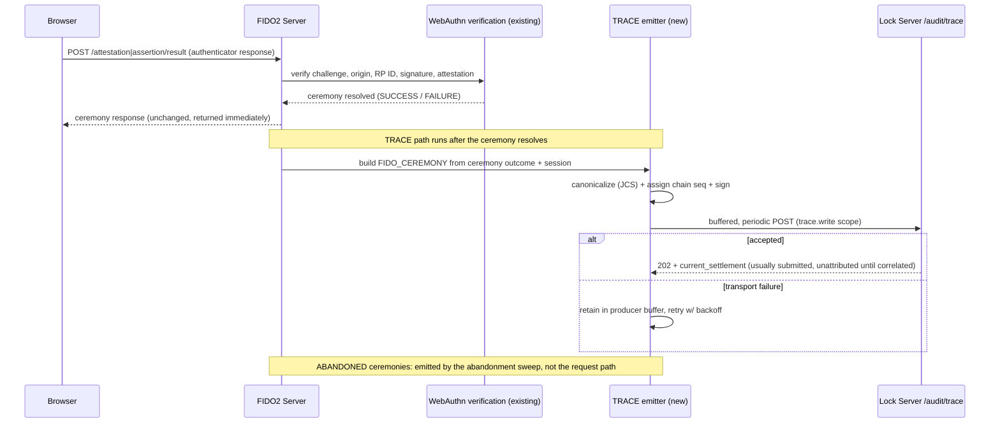

# Jans FIDO Server TRACE Support Design

## Purpose

This document specifies how the **Janssen FIDO2 Server** participates as a **TRACE producer** for the Lock Server TRACE evidence system defined in the Lock Server TRACE design (`design.md`). It is the companion to `cedarling-trace-design.md` and follows the same structure: what the component produces today, where that falls short of a signed TRACE record, the additions required, and a phased adoption path.

In the TRACE architecture, the FIDO Server is one of the two **Human Authentication Producers** (alongside the Jans Auth Server). The target design states plainly: "Auth Server and FIDO Server record authentication events." The FIDO Server's specific contribution is the **`FIDO_CEREMONY`** record — signed evidence that a WebAuthn registration or assertion ceremony resolved, and how. This is distinct from the Auth Server's `AUTHENTICATION_EVENT`: a FIDO ceremony is a lower-level, cryptographic event (an authenticator produced or verified an assertion) that a higher-level authentication flow may build on.

Scope of this document:

- What the FIDO2 Server produces today (ceremony outcomes, passkey telemetry, trust diagnostics) and why none of it is a TRACE `FIDO_CEREMONY` record.
- The producer responsibilities the FIDO Server must add: signing with a registered producer key, producer-chain sequencing, session correlation, and the ceremony-specific event payload.
- A phased path that leaves the WebAuthn ceremony hot path untouched and adds TRACE emission as an additive, opt-in step.

Non-goals: this document does not redefine the TRACE record model, the Lock ingestion/verification/settlement pipeline, or the evidence graph — those are owned by `design.md`. It maps the FIDO Server onto that model, exactly as the Cedarling document maps the PDP.

## Background: what the FIDO Server is, in TRACE terms

The Jans FIDO2 Server (see `research/fido-docs.txt`) hosts the WebAuthn **attestation** (registration) and **assertion** (authentication) endpoints. It verifies FIDO credentials against trust roots, caches FIDO Metadata Service (MDS) data, and resolves each ceremony to a terminal outcome. Its persistence keeps `fido2_register` (attestation) and `fido2_auth` (assertion) branches, and it already emits two kinds of observational data:

- **Passkey telemetry / metrics** (see `passkey-telemetry.md`): one raw entry per event with `metricType` (e.g. `fido2_registration_success`), outcome (`ATTEMPT` / `SUCCESS` / `FAILURE` / `ABANDONED`), duration, authenticator type, `sessionId`, `ipAddress`, `userAgent`, `deviceInfo`, and `nodeId`. This is aggregated and served through a read-only metrics API.
- **Trust diagnostics** (see `trust-diagnostics.md`): read-only endpoints exposing attestation configuration, MDS health, and per-registration attestation-rejection reason codes (`JFS_AAGUID_NOT_IN_MDS`, `JFS_ROOT_CERT_NOT_TRUSTED`, etc.).

Both are **operational data about ceremonies** — designed for adoption dashboards, latency alerting, and trust troubleshooting. Neither is a signed, sequenced, correlatable evidence record. The metrics entry is explicitly internal telemetry (its own docs note the metrics API "does not enforce authentication on its own" and can contain PII); the trust diagnostic codes are explicitly "internal … never included in" the client response. A TRACE `FIDO_CEREMONY` record is a different artifact with a different purpose: attributable, tamper-evident proof, verifiable by someone outside the FIDO Server's trust boundary, that a specific ceremony resolved a specific way within a specific human session.

The FIDO Server already terminates HTTPS and lives inside the Jans deployment next to the Auth Server; the target design adds it "as new, first-class audit/TRACE producers alongside Cedarling, using the same OAuth client-credential pattern that Cedarling clients already use against Lock Server's `lock.write`-style scopes."

## Gap analysis: metrics entry / ceremony result vs. TRACE `FIDO_CEREMONY`

The FIDO Server's existing per-event metrics entry and a TRACE `FIDO_CEREMONY` record describe the same ceremonies but serve opposite purposes. The metrics entry answers "how is passkey rollout going?"; the TRACE record answers "can an auditor prove this ceremony happened, attributably and untampered, as part of this session's evidence?"

| Concern | FIDO metrics entry today | TRACE `FIDO_CEREMONY` requires |
|---|---|---|
| **Signature** | None. Rows are written to persistence and served as JSON. | A producer signature over RFC 8785 (JCS) canonical bytes of the whole assertion, using the FIDO Server's **registered producer key**. |
| **Record identity** | A metrics row id, local to the metrics store. | `record_id` plus `producer_id`; `(evidence_domain_id, producer_id, record_id)` is the storage primary key. |
| **Producer chain** | None. Entries are independent. | `producer_chain` with `producer_chain_id`, monotonic `sequence_number`, `prev_record_hash` — so Lock detects gaps/equivocation across the FIDO Server's own record stream. |
| **Session correlation** | `sessionId` (best-effort, from the `session_id` cookie or servlet session; may be empty). | `trace.session_id` is **required, non-null** for `FIDO_CEREMONY` — the schema mandates it. Plus optional `session_issuer` and later `trace_execution_id` correlation. |
| **Ceremony outcome** | `SUCCESS` / `FAILURE` / `ABANDONED` metric status. | `ceremony_type` (`REGISTRATION`/`ASSERTION`) and `ceremony_outcome` (`SUCCESS`/`FAILURE`/`ABANDONED`) — a first-class three-state field, not a binary `outcome`. |
| **Authenticator detail** | `deviceInfo`, authenticator type. | `authenticator_attachment` (`platform`/`cross-platform`), `credential_id_hash` (a hash, since raw credential IDs may be sensitive). |
| **Immutability** | Rows are swept after `fido2MetricsRetentionDays` (default 90). | The signed `assertion` is byte-immutable; Lock never rewrites it, and retention is governed by the TRACE store's checkpoint-bounded pruning, not a metrics sweep. |
| **Event kind** | Implicit in `metricType`. | Explicit `trace.event_kind: "FIDO_CEREMONY"` acting as the schema discriminator. |
| **Not-applicable fields** | N/A. | No `decision`/`decisions[]` or `invocation`/`invocations[]`, and no `trace.policy`, MUST be populated — a ceremony authorizes no capability and evaluates no policy; and no `capability_id` is ever producer-signed (it is Lock-derived). |

Two FIDO-specific subtleties matter for TRACE fidelity, both drawn from `passkey-telemetry.md`:

- **`ABANDONED` is real and must be representable.** A FIDO ceremony has a genuine third terminal state — the user closed the browser or walked away mid-ceremony. The generic binary `outcome` used by other event kinds cannot express it, which is exactly why `FIDO_CEREMONY` carries a dedicated `ceremony_outcome` with three values. The FIDO Server already distinguishes this state (its `abandoned` `jansStatus`, detected by the abandonment sweep), so it can populate it faithfully.
- **A failed biometric is not a `FAILURE`.** With platform authenticators, user verification happens inside the authenticator; a wrong fingerprint never reaches the server. The docs are explicit: a `FAILURE` means "the server rejected an assertion it received" (bad signature, stale challenge, unknown credential, RP ID mismatch), and a user who gives up on Touch ID is indistinguishable from a cancel — both surface as `ABANDONED`. The TRACE record must preserve this honesty: `ceremony_outcome: "FAILURE"` means server-side rejection, never "the user failed to verify." This is the same "honest about what was and was not observed" discipline the TRACE design applies everywhere.

## Where TRACE emission fits in the FIDO ceremony flow

TRACE emission is a **post-ceremony, off-hot-path** step. The WebAuthn attestation/assertion verification and the response returned to the relying party (the login page / interception script) are unchanged; the TRACE record is assembled from the resolved ceremony and handed to an async emitter — the same shape the FIDO Server already uses to write a metrics entry after each ceremony.

The `ABANDONED` case is special: no result is ever posted back, so there is no request to hang emission off. The FIDO Server already detects abandonment asynchronously — a sweep every `abandonedRequestSweepInterval` seconds relabels named-user ceremonies still `pending` past `unfinishedRequestExpiration`. A `FIDO_CEREMONY` record with `ceremony_outcome: "ABANDONED"` is emitted from that same sweep, not from a request thread. Usernameless (conditional-UI) ceremonies that are never engaged are **not** swept (the server cannot tell an untouched autofill prompt from a genuine drop-off), so — consistent with the metrics behavior — they yield no `ABANDONED` TRACE record either.

## Field-by-field: building the record from a ceremony

This maps each part of the TRACE `FIDO_CEREMONY` envelope (as defined in `design.md`) to the FIDO Server data that populates it.

### Envelope identity

- **`producer`** / **`producer_chain.producer_id`** — a **stable logical identifier** for this FIDO Server (or FIDO Server node), e.g. `jans-fido2` — not a `name/semver` string. Per the design's producer-identity rule, software version/build/runtime travel as **separate signed metadata** (e.g. `producer_version`), never folded into `producer_id`, so a FIDO Server upgrade does not force a new producer identity, key, or chain. The target design registers "one for the Jans FIDO Server" in the Producer Key Registry, and notes a deployment may register multiple keys per producer type (e.g. one per node). This is the identity whose key Lock must hold.
- **`record_id`** — a fresh UUID per emitted ceremony record.
- **`producer_chain.producer_instance_id`** — the FIDO node identity. The metrics entry already records a `nodeId` per served request; that same node identity is the producer instance.
- **`event_kind`** — `FIDO_CEREMONY` (the schema discriminator).

### Producer chain (new state the FIDO Server must keep)

Like Cedarling, the FIDO Server must maintain, per node, an append-only **producer chain**: a `producer_chain_id`, a monotonic `sequence_number` advanced for every emitted TRACE record, and a `prev_record_hash` linking to the predecessor. This lets Lock's predecessor-linkage settlement check pass and makes any gap or equivocation detectable.

A subtlety specific to the FIDO Server: it is a **multi-node, clustered** service (the docs describe distributed-lock aggregation and per-node `nodeId`). Two nodes cannot share one monotonic counter without coordination. The clean model — matching the target design's "no single global event order across independent producers" principle — is **one producer chain per node** (`producer_chain_id` scoped to `nodeId`), each advancing its own `sequence_number` independently. Lock correlates the per-node chains by `session_id`/`trace_execution_id`, never by assuming a cross-node sequence. This mirrors how the design already treats "multiple concurrent Cedarling instances" as independent chains.

Chain persistence across restarts is the same out-of-scope producer-durability concern noted in the Cedarling document (the TRACE spec defers "Durable producer outboxes"); a restarted node that cannot resume its chain starts a new `producer_chain_id`, and the boundary surfaces to Lock as an ordinary coverage gap.

### Genesis and history-completeness

The TRACE `history_complete: true` claim requires a `pre_registered_genesis` (or a `linked_restart_genesis` rooted in one). A FIDO node that begins emitting without a pre-registered chain genesis is treated as `first_observed` — Lock anchors what it saw but cannot assert the chain is complete from its true origin. Deployments needing full lineage assurance for FIDO evidence pre-register each node's chain genesis with Lock before its first record. This is a registration step, not a hot-path change.

### Correlation

- **`trace.session_id`** — **required, non-null** for `FIDO_CEREMONY`. This is the sharpest difference from the Cedarling case, where `trace_execution_id` is the primary key and `session_id` is optional. The FIDO Server already captures `sessionId` for its metrics entries (from the `session_id` cookie set by the Auth Server, falling back to the servlet session). For TRACE, that value must be present and non-empty; a ceremony the FIDO Server genuinely cannot associate with a session cannot be emitted as a well-formed `FIDO_CEREMONY` (this is a real constraint to design around — see Open Questions).
- **`trace.session_issuer`** — the issuer of that session (the Auth Server that owns the `session_id`), so Lock can disambiguate `(evidence_domain_id, session_issuer, session_id)` per the sessions retrieval endpoint.
- **`trace_execution_id`** — the FIDO Server does not mint this. A FIDO ceremony typically occurs *before* any governed execution context exists (the target design explicitly cites "an early-stage authentication or FIDO ceremony event that occurs before any execution context has been established" as the canonical **unattributed evidence** case). So the FIDO Server emits the record **without** `trace_execution_id` when none is available; Lock stores it as unattributed evidence and correlates it later — via a producer `CORRELATION_ASSERTED` backfill or an operator action — once the execution that consumed the authentication becomes known. The FIDO Server must not fabricate an execution id.
- **`subject.human_sponsor`** — the authenticating human, when known, so the ceremony attaches to the right session/subject.

### Event payload (`trace.event`)

- **`ceremony_type`** — `REGISTRATION` for an attestation ceremony (`fido2_register` path), `ASSERTION` for an authentication ceremony (`fido2_auth` path). The FIDO Server already distinguishes these endpoints.
- **`ceremony_outcome`** — `SUCCESS` / `FAILURE` / `ABANDONED`, mapped directly from the ceremony's terminal state (the same `jansStatus` / metric status the server already assigns: `authenticated`→`SUCCESS`, `failed`→`FAILURE`, `abandoned`→`ABANDONED`). Preserve the honesty rules above: `FAILURE` is server-side rejection only.
- **`authenticator_attachment`** — `platform` or `cross-platform`, from the credential response's `authenticatorAttachment` when reported (the docs already use this signal to distinguish built-in vs. security-key authenticators).
- **`credential_id_hash`** — a hash of the WebAuthn credential ID, optional and hashed because raw credential IDs may be sensitive (the same reason the `allowList` cookie and metrics avoid storing PII).
- **capability-decision/invocation fields and `trace.policy`** — the `decision`/`decisions[]` and `invocation`/`invocations[]` payloads and `trace.policy` MUST NOT be populated for this event kind (and no `capability_id` is producer-signed anywhere — it is Lock-derived; see `design.md`: Capability Resolution).

### Optional attestation/trust context

The FIDO Server holds attestation and MDS-trust facts that are valuable evidence but are **not** in the base `FIDO_CEREMONY` schema (which keeps the required set deliberately small). Where a deployment wants to carry them, the natural home is producer-signed detail within `trace.event` (e.g. the achieved attestation result, the AAGUID, the `attestationMode` in force, or an attestation-rejection reason code such as `JFS_AAGUID_NOT_IN_MDS`). This is additive producer-signed data, consistent with how the design lets producers include optional signed detail; it does not change the required shape. Because attestation trust classification is the FIDO Server's own assessment, it belongs in the signed body — distinct from the `trust_tier` Lock assigns, which is always Lock-derived and never producer-supplied.

### Signature

Identical mechanics to the Cedarling case: assemble the record minus `signature`, canonicalize with RFC 8785 (JCS) so Lock re-derives identical bytes, and sign with the FIDO node's registered Ed25519 producer key. The producer key is distinct from Lock's settlement/ledger keys; the FIDO Server holds only its own producer key. The key is **administratively provisioned** (Lock configuration or the `trace.producers.manage` path — never implicitly from a submitted record) and scoped `authorized_event_kinds: ["FIDO_CEREMONY"]`; its authority is expressed as the design's administratively-signed **Producer-Key Authorization Statement**, which binds the key by `public_key_thumbprint` (not the non-unique `kid`), names the `producer_id`, domain, permitted event kinds, validity interval, and revocation status, and is the artifact an Evidence Packet carries so an offline verifier can confirm the FIDO key's authority — not merely that *a* key signed — without reaching Lock.

## Trust tier: why a signed FIDO ceremony record earns high assurance

The TRACE spec assigns `trust_tier` from the producer key class and collection path — Lock-assigned, never self-declared, and (per the design) a **lossy filtering convenience over an authoritative per-dimension verification vector**, never a substitute for the underlying results (signature, producer authorization, and — where an authenticator/platform attestation is present — instance binding). A `FIDO_CEREMONY` record signed by a genuine FIDO Server producer key, declaring `evidence_origin: "directly_observed"` (the FIDO Server observed the ceremony resolve, cryptographically, at the point it verified the authenticator response), is exactly the case that earns a high tier. The FIDO Server is a legitimate first-party observer of the ceremonies it verifies — it holds the challenge, checks the signature against the registered public key, and validates origin/RP ID. That is materially stronger than a client-side claim "I authenticated," which no relying party can independently verify. As with Cedarling, the assurance comes not from the fact that a ceremony happened but from the ceremony being **signed and sequenced** by the server that verified it. Consistent with the design's normative per-record claim boundaries, a `FIDO_CEREMONY` establishes only that the FIDO Server resolved this ceremony with the stated `ceremony_outcome` — it does **not** establish that any later governed action was taken by the authenticated subject (that is a separate, separately-evidenced question). A high `trust_tier` raises the weight of the ceremony claim; it never widens what the record claims.

## FIDO Server changes summary

| Area | Change | Hot path? |
|---|---|---|
| Producer key | Provision/register an Ed25519 producer key per node (or server), distinct from any Lock key, **through Lock's administrative path** (configuration or the `trace.producers.manage` admin API — never implicitly from a submitted record). The key is registered with `authorized_event_kinds: ["FIDO_CEREMONY"]`, so a FIDO key may sign only ceremony records; a record of any other `event_kind` under this key is rejected (`producer_authorized_for_claim`). | No (startup) |
| Chain state | Maintain per-node `producer_chain_id`, monotonic `sequence_number`, `prev_record_hash`; advance atomically with signing. | Emitter only |
| Genesis registration | Optional pre-registration of each node's chain genesis with Lock for `history_complete` assurance. | No (deploy) |
| Record assembly | Build the `FIDO_CEREMONY` envelope from the resolved ceremony (type, outcome, attachment, credential hash, session). | Off hot path |
| Canonicalize + sign | RFC 8785 JCS + Ed25519 over the assertion. | Off hot path |
| Abandonment emission | Emit `ABANDONED` records from the existing abandonment sweep, not a request thread; skip usernameless-unengaged ceremonies. | Sweep (async) |
| Transport | Reuse the SSA→DCR audit channel (buffered, periodic, retry with backoff) with the TRACE ingestion scope `trace.write` (not `log.write`, per Lock MVP §11); POST TRACE records. | Off hot path |
| Session capture | Ensure `session_id`/`session_issuer` are captured and non-empty for emittable ceremonies. | Read at ceremony |

WebAuthn verification, the ceremony response returned to the browser/RP, and the existing metrics/telemetry pipeline are unchanged. TRACE emission runs alongside metrics, not instead of it.

## Bootstrap properties (proposed)

Following the FIDO Server's existing `fido2*` dynamic-configuration convention, TRACE emission is gated by new opt-in properties, disabled by default so existing deployments are unaffected:

| Property | Meaning | Default |
|---|---|---|
| `fido2TraceEnabled` | Master switch for `FIDO_CEREMONY` TRACE emission. | `false` |
| `fido2TraceProducerId` | The `producer` / `producer_id` string for this FIDO Server (fleet or per-node). | derived from server id + version |
| `fido2TraceSigningKey` | Reference to the Ed25519 producer signing key (key store handle; never inline). | — |
| `fido2TraceChainGenesis` | `pre_registered` / `first_observed` — whether each node's chain genesis is pre-registered with Lock. | `first_observed` |
| `fido2TraceIncludeCredentialIdHash` | Whether to include `credential_id_hash`. | `true` |
| `fido2TraceIncludeAttestationDetail` | Whether to include optional signed attestation/MDS-trust detail in `trace.event`. | `false` |
| `fido2TraceEndpoint` | Lock TRACE ingestion endpoint (`/api/v1/audit/trace`); may default to the discovered Lock audit endpoint. | discovered |

TRACE transport reuses the same Lock integration machinery the design assigns to all producers: the SSA→DCR client-credentials flow, a buffered channel, and retry with backoff. It differs in scope — the TRACE ingestion endpoint requires `https://jans.io/oauth/lock/trace.write` (Lock MVP §11), so the FIDO Server requests `trace.write` at DCR, not `log.write`. The FIDO Server needs a new scope, payload, and emission path, not a new transport. These are separate from the `fido2Metrics*` telemetry properties — TRACE and metrics coexist.

## Phased adoption

1. **Phase 0 — today.** The FIDO Server resolves ceremonies and writes metrics entries / trust diagnostics. No TRACE records, no signing, no chain.
2. **Phase 1 — signed, sequenced ceremonies.** Add the producer key, per-node chain state, record assembly, JCS canonicalization, and signing. Emit `FIDO_CEREMONY` records (`REGISTRATION`/`ASSERTION`, `SUCCESS`/`FAILURE`) with `first_observed` genesis over the audit channel, plus `ABANDONED` from the sweep. This alone gives attributable, tamper-evident, session-correlated ceremony evidence.
3. **Phase 2 — richer ceremony context.** Populate `authenticator_attachment`, `credential_id_hash`, and optional signed attestation/MDS-trust detail, so the record carries the authenticator and trust context the server already computes.
4. **Phase 3 — high assurance.** Pre-register each node's chain genesis (`history_complete`-capable lineage) and integrate with lineage checkpoints, so FIDO evidence can contribute to collusion-resistant assurance for the authentication segment of an execution.

Each phase is additive over the same signed-record foundation and none changes WebAuthn verification — matching the TRACE design's incremental philosophy and the Cedarling document's structure.

## Open questions

- **Mandatory `session_id` for a session-less ceremony.** `FIDO_CEREMONY` requires a non-null `trace.session_id`, but a usernameless/conditional-UI assertion starts before the user is known and may resolve without a server-side session (the metrics `sessionId` is explicitly "empty for requests that carry neither"). Options: (a) emit no `FIDO_CEREMONY` for a genuinely session-less ceremony and rely on the later named ceremony that the user completes; (b) propose a schema relaxation allowing an unattributed FIDO ceremony (parallel to how `trace_execution_id` is allowed to be absent). This document assumes (a) as the default and flags (b) as a possible `design.md` change to raise.
- **Registration attribution.** A registration (attestation) ceremony may occur during account setup outside any authentication session; binding it to a `session_id` may be awkward. Whether registration ceremonies are in scope for Phase 1, or deferred until the session-binding question is resolved, is open.
- **Per-node chain vs. logical FIDO producer.** This document proposes one chain per node. If a deployment prefers a single logical FIDO producer identity, it needs a coordination mechanism for `sequence_number` across nodes — at odds with the "no global order" principle. The per-node model is recommended.
- **Attestation detail placement.** Whether attestation result / AAGUID / rejection codes should remain optional signed `trace.event` detail (as proposed here) or motivate a first-class extension to the `FIDO_CEREMONY` schema is a `design.md` decision, not a FIDO-side one.
- **Biometric-failure invisibility.** Because failed platform-authenticator verification never reaches the server, TRACE evidence inherits the same blind spot as the metrics: the record set can never attest "the user failed biometric verification," only "the server rejected an assertion" or "the ceremony was abandoned." This is a truthful limitation to document, not a defect to fix.

## References

- Target spec: `design.md` (TRACE record model, `FIDO_CEREMONY` and `AUTHENTICATION_EVENT` schemas, Human Authentication Producers, unattributed evidence, settlement).
- Companion: `cedarling-trace-design.md` (the Cedarling `AUTHORIZATION_DECISION` producer design this document parallels).
- `research/fido-docs.txt` — FIDO2 server architecture, ceremony outcomes (incl. `ABANDONED`), passkey telemetry entry fields (`sessionId`, `deviceInfo`, `nodeId`), trust diagnostics, attestation modes, MDS.
- `research/jans-fido-code.txt` — FIDO2 server packaging: attestation/assertion persistence branches (`fido2_register`, `fido2_auth`), config/secret backends, node/cluster deployment.
- `research/lock-docs.txt` — Lock Server audit endpoints, OAuth scopes.
- `research/trace-spec.txt` — the TRACE standard (tracked at **v0.2**): Trust Record schema, registry/anchor format (`registry-anchor-v1`), RFC 8785/Ed25519 signing, SCITT anchoring, RATS appraisal. Lock emits a distinct Jans profile that extends v0.2 — see `design.md`: Alignment with TRACE v0.2.
